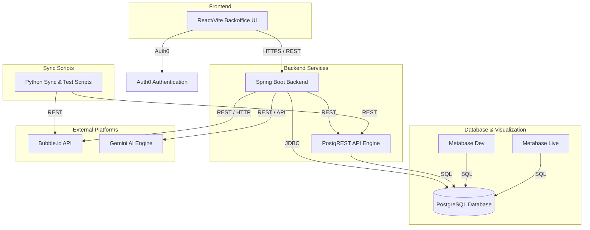

# Project Context & Knowledge Base: ComfortHub Backoffice Scheduling System

This document serves as the central knowledge base for the ComfortHub Backoffice Scheduling System. It provides an overview of the system architecture, database schema, component directories, integration details, and developer workflows.

---

## 🏗️ System Architecture

The system consists of the following components working together to sync data from the ComfortHub primary platform (Bubble.io), run deterministic validations, orchestrate shift scheduling using Gemini, and visualize schedule data.



---

## 📂 Codebase Structure

The workspace is divided into two primary subdirectories and a set of utility scripts in the workspace root:

*   **`comforthub-backoffice-ui/`**: A modern React web application built with TypeScript, Vite, and Tailwind CSS.
    *   Auth0 for authentication.
    *   TanStack React Query for data fetching and state management.
    *   TanStack React Table for rich tabular representations.
*   **`comforthub-backoffice-backend/`**: A Spring Boot application written in Java.
    *   Connects to a PostgreSQL database.
    *   Exposes APIs for shift management, data synchronization, and schedule generation.
    *   Integrates with Gemini for smart shift scheduling suggestions.
*   **Root Scripts (`*.py` / `*.java`)**:
    *   `sync.py` & `sync_all.py`: Orchestrate data synchronization between Bubble.io and the Postgres database.
    *   `recreate_render_services.py`: Utility script to manage Render cloud deployments.
    *   `setup_metabase_dev.py`: Python automation script to initialize dev Metabase metadata settings and connection scopes.
    *   Various testing and payload generation scripts (`test_remote_generate.py`, `test_generate_month.py`, etc.).

---

## 🗄️ Database Schema (Flyway Migrations V1-V5)

The database schema is managed via Flyway migrations (`comforthub-backoffice-backend/src/main/resources/db/migration/`). The initial `bubble_*` tables have been promoted to structured entities with UUID surrogate keys, and catalog/order/booking/company tables have been added:

### Core Tables

#### 1. `users` (Promoted from `bubble_users`)
*   `id` UUID PRIMARY KEY (gen_random_uuid)
*   `bubble_id` TEXT UNIQUE (Matches original Bubble ID)
*   `full_name` TEXT
*   `role` TEXT
*   `max_hours` NUMERIC(5,2)
*   `is_active` BOOLEAN
*   `auth0_user_id` TEXT UNIQUE (Scoping key mapping JWT `sub`)
*   `company_id` TEXT (Scoping ID from Bubble's company field)
*   `email` TEXT
*   `wage_rate` NUMERIC(10,2)
*   `created_at` TIMESTAMPTZ

#### 2. `stores` (Promoted from `bubble_stores`)
*   `id` UUID PRIMARY KEY
*   `bubble_id` TEXT UNIQUE
*   `name` TEXT
*   `company` TEXT (Bubble company ID - scoping key)
*   `availability_id` TEXT
*   `is_deleted` BOOLEAN (Default: false)
*   `created_at` TIMESTAMPTZ

#### 3. `availability` (Promoted from `bubble_availability`)
*   `id` UUID PRIMARY KEY
*   `bubble_id` TEXT UNIQUE
*   `thing_type` TEXT
*   `thing_id` TEXT
*   `available_days` TEXT[]
*   `workday_start_hour` INTEGER
*   `workday_end_hour` INTEGER
*   `weekend_start_hour` INTEGER
*   `weekend_end_hour` INTEGER

#### 4. `wage_rates` (Promoted from `bubble_wage_rates`)
*   `id` UUID PRIMARY KEY
*   `bubble_id` TEXT UNIQUE
*   `company` TEXT
*   `rate` DOUBLE PRECISION
*   `user_id` TEXT (Bubble worker ID)

#### 5. `shifts` (Promoted from `bubble_shifts`)
*   `id` UUID PRIMARY KEY
*   `bubble_id` TEXT UNIQUE
*   `assigned_user` TEXT
*   `start_time` TIMESTAMP WITH TIME ZONE
*   `end_time` TIMESTAMP WITH TIME ZONE
*   `notes` TEXT
*   `assigned_company` TEXT (Scoping key)
*   `type` TEXT
*   `status` TEXT
*   `assigned_store` TEXT

### Catalog & Operations Tables (V3/V4)

#### 6. `categories`
*   `id` UUID PRIMARY KEY
*   `bubble_id` TEXT UNIQUE
*   `company_id` TEXT (Scoping key)
*   `name` TEXT
*   `parent_id` UUID REFERENCES `categories(id)`
*   `sort_order` INT
*   `created_at` TIMESTAMPTZ

#### 7. `offerings`
*   `id` UUID PRIMARY KEY
*   `bubble_id` TEXT UNIQUE
*   `company_id` TEXT (Scoping key)
*   `name` TEXT
*   `type` TEXT
*   `status` TEXT ('Active', 'Inactive')
*   `limited_visibility` BOOLEAN
*   `unlimited_quantity` BOOLEAN
*   `quantity_required` BOOLEAN
*   `delivery_type` TEXT
*   `pay_options` TEXT[]
*   `price_source` TEXT
*   `default_type` TEXT
*   `created_at` TIMESTAMPTZ

#### 8. `inventory` & `inventory_offerings`
*   `inventory`: `id` UUID, `bubble_id` TEXT, `company_id` TEXT, `name` TEXT, `type` TEXT, `main_product_id` UUID, `category_id` UUID, `is_deleted` BOOLEAN.
*   `inventory_offerings` (Link table): `inventory_id` UUID REFERENCES `inventory(id)`, `offering_id` UUID REFERENCES `offerings(id)`

#### 9. `stock`
*   `id` UUID PRIMARY KEY, `company_id` TEXT, `store_id` UUID, `inventory_id` UUID, `quantity` INT, `updated_at` TIMESTAMPTZ.

#### 10. `orders` (Analytics-Only in Postgres)
*   `id` UUID PRIMARY KEY, `bubble_id` TEXT, `company_id` TEXT, `store_id` UUID, `order_nr` TEXT, `customer_name` TEXT, `customer_id` UUID, `type` TEXT, `amount` NUMERIC, `payment_status` TEXT, `status` TEXT (`not_started`, `planned`, `preparation_in_progress`, `ready_for_pickup`, `courier_assigned`, `completed`), `assigned_to` UUID, `ready_by` TIMESTAMPTZ, `notes` TEXT.
*   *Note: This table is no longer managed via JPA or directly written to by the backend application. It is strictly used for analytics/reporting queries (populated periodically by hourly ETL sync scripts). Active operations use direct Bubble.io API proxying.*

#### 11. `bookings`
*   `id` UUID PRIMARY KEY, `bubble_id` TEXT, `company_id` TEXT, `store_id` UUID, `worker_id` UUID, `customer_email` TEXT, `customer_name` TEXT, `title` TEXT, `start_time` TIMESTAMPTZ, `end_time` TIMESTAMPTZ.

#### 12. `companies` (V4/V5/V6 Sync)
*   `id` TEXT PRIMARY KEY (Bubble ID)
*   `name` TEXT
*   `owners` TEXT[] (Matches `users.bubble_id`)
*   `workers` TEXT[] (Matches `users.bubble_id`)
*   `reg_code` TEXT (Company registration code, added in V5)
*   `products` TEXT[] (List of main products the company operates in)
*   `is_deleted` BOOLEAN (Soft delete flag, added in V6)

---

## 🔌 API Endpoints & Interfaces

### Backend Controllers

1.  **`ScheduleController`** (`/api/schedule`)
    *   `GET /dashboard-url`: Retrieves the embedding URL for Metabase reports.
    *   `POST /sync`: Triggers manual synchronization of all assets from Bubble.io (unauthenticated / permitAll access allowed).
    *   `POST /generate`: Generates shift allocations using AI based on constraint parameters.
    *   `POST /commit`: Commits the draft schedule shifts.
2.  **`ShiftController`** (`/api/shifts`)
    *   `POST /`: Creates a shift.
    *   `PUT /{id}`: Updates a shift.
    *   `DELETE /{id}`: Deletes a shift.
3.  **`BookingController`** (`/api/bookings`)
    *   `GET /`: Lists all bookings for the scoped company.
    *   `POST /`: Creates a new booking.
    *   `PUT /{id}`: Updates a booking.
    *   `DELETE /{id}`: Deletes a booking.
4.  **`CategoryController`** (`/api/categories`)
    *   `GET /`: Lists all categories.
    *   `POST /`: Creates a new category.
    *   `PUT /{id}`: Updates a category.
    *   `DELETE /{id}`: Deletes a category.
5.  **`InventoryController`** (`/api/inventory`)
    *   `GET /`: Lists inventory items.
    *   `GET /{id}/offerings`: Lists offerings linked to a specific inventory item.
    *   `POST /`: Creates an inventory item.
    *   `PUT /{id}`: Updates an inventory item.
    *   `DELETE /{id}`: Deletes an inventory item.
6.  **`OfferingController`** (`/api/offerings`)
    *   `GET /`: Lists all offerings.
    *   `POST /`: Creates a new offering.
    *   `PUT /{id}`: Updates an offering.
    *   `POST /{id}/assign`: Links an offering to an inventory item.
    *   `DELETE /{id}/assign`: Unlinks an offering from an inventory item.
    *   `DELETE /{id}`: Deletes an offering.
7.  **`OrderController`** (`/api/orders`)
    *   *(Note: This controller proxies calls directly to Bubble.io, bypassing local database storage)*
    *   `GET /`: Lists all orders for the scoped company.
    *   `POST /`: Creates a new order.
    *   `PUT /{id}`: Updates an order.
    *   `PATCH /{id}/status`: Updates the status of an order (planned, ready_for_pickup, completed, etc.).
8.  **`StockController`** (`/api/stock`)
    *   `GET /`: Lists stock levels per store.
    *   `PUT /{storeId}/{inventoryId}`: Sets or updates stock quantity for an inventory item in a store.
9.  **`CompanyController`** (`/api/companies`)
    *   `GET /`: Retrieves company scoping and configurations.
    *   `PUT /{id}`: Updates company configurations (requires `OWNER` authorization checks).
    *   `DELETE /{id}`: Deletes a company (requires `OWNER` authorization checks).
10. **`MeController`** (`/api`)
    *   `GET /me`: Returns active company and computed role of the authenticated user.
    *   `GET /me/companies`: Lists all companies the authenticated user belongs to (as owner or worker).
    *   `POST /me/company`: Switches the caller's active company context (updating user scoping metadata).
11. **`DataController`** (`/api`)
    *   Endpoints like `/shifts`, `/users`, `/stores` for checking synced records.

### Frontend Pages

The UI routes manage the backoffice views:
*   `/workers`: Lists employees, roles, and wage configurations.
*   `/stores`: Lists locations, operating hours, and availability.
*   `/shifts`: Calendar/schedule representation.
*   `/shifts/generate`: Setting goals and parameters for the AI shift generator.
*   `/inventory`, `/categories`, `/offerings`: Product catalog management.
*   `/stock`: Managing quantities of inventory items per store.
*   `/orders`, `/orders/manage`: Kanban-style order board and workflow state tracking.
*   `/calendar`: Visual representation of bookings.
*   `/analytics`: Secure Workforce Scheduling Analytics dashboard embedded securely from Metabase using JWT authentication and real-time theme (light/dark) synchronization.

---

## 📊 Metabase Dashboard Passwordless Integration (JWT)

Metabase dashboards are embedded securely into the React portal UI without requiring users to log in or enter passwords.

### Integration Flow
1. **Frontend Request**: The React UI requests a signed embed URL from the Spring Boot backend (`GET /api/schedule/dashboard-url?dashboardId=2`).
2. **Backend JWT Signing**: The backend reads the `METABASE_EMBED_SECRET` from `.env`, creates a JSON Web Token (JWT) containing the target dashboard ID, and signs the JWT using the HMAC-SHA256 algorithm.
3. **Secure Iframe Render**: The backend returns the signed Metabase embed URL. The React frontend mounts an `<iframe>` referencing this URL.
4. **Dynamic Theme Tracking**: A `MutationObserver` on the HTML root element class list detects theme toggles. It dynamically rewrites the URL hash (`#theme=dark` or `#theme=light`) inside the iframe src, causing Metabase to switch themes in real-time.

### Setup, Synchronization & Deployment
- **Initialization**: The initialization of Metabase Dev settings, database connection mapping to `postgres_dev`, and analytics questions/dashboard generation is automated via [`setup_metabase_dev.py`](file:///Users/kimsmirnov/.gemini/antigravity/scratch/comforthub-backoffice-backend/setup_metabase_dev.py).
- **Promotion & Synchronization**: To migrate dashboards and analytics definitions to the production environment, [`sync_metabase_live.py`](file:///Users/kimsmirnov/.gemini/antigravity/scratch/comforthub-backoffice-backend/sync_metabase_live.py) executes post-deployment. It copies dashboards from Dev (`localhost:3000`) to Live (`localhost:3002`), dynamically updates database references from `postgres_dev` to `postgres_live`, maps card layouts, and enables Metabase embedding parameters.
- **Hourly Data & Schema Sync**: An hourly cron job on the VPS runs [`sync_all.py`](file:///Users/kimsmirnov/.gemini/antigravity/scratch/comforthub-backoffice-backend/sync_all.py) which fetches data from Bubble.io and dynamically modifies table definitions in PostgreSQL. If any schema changes (new tables or columns) are made, it sends a drift warning to the Discord/Slack webhook automatically.

---

## 🛠️ Operations & Local Development

### 1. Database & Infrastructure Setup
Run the Docker stack (Postgres + PostgREST + Metabase + Backend):
```bash
docker compose up -d
```

### 2. Spring Boot Backend Setup
Compile and run the Spring Boot application locally:
```bash
mvn spring-boot:run
```

### 3. Frontend Web App Setup
Navigate to the UI folder, install dependencies, and run the development server:
```bash
cd comforthub-backoffice-ui
npm install
npm run dev
```

### 4. Running UI Tests
Run the Vitest test suite inside the UI repository:
```bash
cd comforthub-backoffice-ui
npm run test
```

### 5. CI/CD Operations (Backups, Rollbacks, and Alerts)
The backend pipeline in [deploy.yml](file:///Users/kimsmirnov/.gemini/antigravity/scratch/comforthub-backoffice-backend/.github/workflows/deploy.yml) automates deployment safety:
- **Pre-Deployment Backup**: Creates a code directory backup (`/app/scheduling-agent-backend_backup`) and exports a PostgreSQL dump inside `/app/scheduling-agent-backend/backups/` (retaining the 5 most recent snapshots).
- **Health Check & Auto-Rollback**: After restart, the workflow runs a curl smoke test on the backend's endpoints. If the verification fails, the pipeline restores the backup files and database state automatically.
- **Alert Webhooks & Uptime Monitoring**: Successful/failed pipeline statuses are pushed to a Slack/Discord webhook. Additionally:
  - **Docker Container Uptime**: A 5-minute cron job on the VPS runs [`monitor_containers.sh`](file:///Users/kimsmirnov/.gemini/antigravity/scratch/comforthub-backoffice-backend/monitor_containers.sh) to check running/healthy states of all `scheduling-*` containers and fire error webhooks on failures.
  - **SSL Certificate Expiry**: A weekly cron job runs [`monitor_ssl.sh`](file:///Users/kimsmirnov/.gemini/antigravity/scratch/comforthub-backoffice-backend/monitor_ssl.sh) to warn if the portal's SSL certificate is expiring in less than 14 days.

### 6. Developer Automation Tools
To simplify development tasks for developers and AI agents, local scripts are configured:
- **Local Seeding (`npm run seed` / `python3 seed_dev.py`)**: Authoritative database builder and populator located at [`seed_dev.py`](file:///Users/kimsmirnov/.gemini/antigravity/scratch/comforthub-backoffice-backend/seed_dev.py). It connects to PostgreSQL, creates the target database if missing, automatically runs schema migrations, and populates tables with consistent, relative date mock datasets.
- **Performance Auditing (`python3 audit_db_performance.py`)**: Located at [`audit_db_performance.py`](file:///Users/kimsmirnov/.gemini/antigravity/scratch/comforthub-backoffice-backend/audit_db_performance.py). It connects to PostgreSQL, evaluates cache hit ratio, audits table scan patterns, and locates unindexed foreign keys (providing recommended index commands).
- **Auto Submission (`npm run submit` / `bash submit_work.sh`)**: Located at [`submit_work.sh`](file:///Users/kimsmirnov/.gemini/antigravity/scratch/submit_work.sh) in the workspace root. It verifies UI tests, detects which repository has changes, creates structured task branches, commits, pushes, and spawns GitHub Pull Requests automatically via `gh pr create`.ally via `gh pr create`.

---

## 🧪 Testing Suite

The `comforthub-backoffice-ui` includes a comprehensive unit testing suite using Vitest, React Testing Library, and JSDOM, covering all core pages and components (15 test files, 55 passing tests):

### Layout & Routing Components
*   [RequireOwner.test.tsx](file:///Users/kimsmirnov/.gemini/antigravity/scratch/comforthub-backoffice-ui/src/components/RequireOwner.test.tsx): Role-based routing protections.
*   [Sidebar.test.tsx](file:///Users/kimsmirnov/.gemini/antigravity/scratch/comforthub-backoffice-ui/src/components/layout/Sidebar.test.tsx): Sidebar rendering and privilege-based item display gating.

### Dashboard & Operational Pages
*   [AnalyticsPage.test.tsx](file:///Users/kimsmirnov/.gemini/antigravity/scratch/comforthub-backoffice-ui/src/pages/__tests__/AnalyticsPage.test.tsx): Embedded dashboards loading state, JWT token request handlers, and theme synchronization checks.
*   [CalendarPage.test.tsx](file:///Users/kimsmirnov/.gemini/antigravity/scratch/comforthub-backoffice-ui/src/pages/__tests__/CalendarPage.test.tsx): Listing, creating, updating, and deleting calendar bookings.
*   [CategoriesPage.test.tsx](file:///Users/kimsmirnov/.gemini/antigravity/scratch/comforthub-backoffice-ui/src/pages/__tests__/CategoriesPage.test.tsx): Product catalog hierarchical category tree CRUD.
*   [CompanyPage.test.tsx](file:///Users/kimsmirnov/.gemini/antigravity/scratch/comforthub-backoffice-ui/src/pages/__tests__/CompanyPage.test.tsx): Company profile details and worker list administration.
*   [GenerateShiftsPage.test.tsx](file:///Users/kimsmirnov/.gemini/antigravity/scratch/comforthub-backoffice-ui/src/pages/__tests__/GenerateShiftsPage.test.tsx): AI scheduling draft generation and commit sequence.
*   [InventoryPage.test.tsx](file:///Users/kimsmirnov/.gemini/antigravity/scratch/comforthub-backoffice-ui/src/pages/__tests__/InventoryPage.test.tsx): Core inventory items catalog management and size variant mappings.
*   [ManageOrdersPage.test.tsx](file:///Users/kimsmirnov/.gemini/antigravity/scratch/comforthub-backoffice-ui/src/pages/__tests__/ManageOrdersPage.test.tsx): Kanban workflow order progress board column rendering and status patching.
*   [OfferingsPage.test.tsx](file:///Users/kimsmirnov/.gemini/antigravity/scratch/comforthub-backoffice-ui/src/pages/__tests__/OfferingsPage.test.tsx): Booking and size variant specification catalog CRUD.
*   [OrdersPage.test.tsx](file:///Users/kimsmirnov/.gemini/antigravity/scratch/comforthub-backoffice-ui/src/pages/__tests__/OrdersPage.test.tsx): Tabular customer orders registry, invoice generation, and detail updating.
*   [ShiftsPage.test.tsx](file:///Users/kimsmirnov/.gemini/antigravity/scratch/comforthub-backoffice-ui/src/pages/__tests__/ShiftsPage.test.tsx): Timeline shift allocations viewer and type/status indicators.
*   [StockPage.test.tsx](file:///Users/kimsmirnov/.gemini/antigravity/scratch/comforthub-backoffice-ui/src/pages/__tests__/StockPage.test.tsx): In-cell physical stock level modification grid matrix.
*   [StoresPage.test.tsx](file:///Users/kimsmirnov/.gemini/antigravity/scratch/comforthub-backoffice-ui/src/pages/__tests__/StoresPage.test.tsx): Retail outlets registry cards and availability clipboard actions.
*   [WorkersPage.test.tsx](file:///Users/kimsmirnov/.gemini/antigravity/scratch/comforthub-backoffice-ui/src/pages/__tests__/WorkersPage.test.tsx): Employees roster, maximum hours, and active/inactive metrics.
*   [AnalyticsPage.test.tsx](file:///Users/kimsmirnov/.gemini/antigravity/scratch/comforthub-backoffice-ui/src/pages/__tests__/AnalyticsPage.test.tsx): Secure JWT-embedded Metabase analytics dashboard integration.

---

## 🔄 Dynamic Context Tracking

### Merged Branches & Milestones
*   **Active Development Branch**: `main` (fully synchronized with upstream changes).
*   **Orders Direct Proxying (Phase 5)**: Bypassed database storage for orders by deleting `OrderEntity` and `OrderRepository` from PostgreSQL. Refactored `OrderController` to proxy search, pagination, creation, and status updates directly to Bubble.io API via `BubbleClient`, mapping data dynamically with `OrderDto` and `OrderBubbleMapper`.
*   **Embedded Analytics Page**: Added `/analytics` route and [AnalyticsPage.tsx](file:///Users/kimsmirnov/.gemini/antigravity/scratch/comforthub-backoffice-ui/src/pages/AnalyticsPage.tsx) page with secure Metabase JWT token generation, embedding, and automatic light/dark theme tracking parameters.
*   **Metabase Auto-Initialization**: Authored [setup_metabase_dev.py](file:///Users/kimsmirnov/.gemini/antigravity/scratch/setup_metabase_dev.py) script to automatically program Metabase Dev metadata and Postgres dev connections during startup.
*   **Company Switching & Multi-Company Support**: Implemented `GET /api/me/companies` and `POST /api/me/company` endpoints (with unit tests in `MeControllerTest`) to allow workers and merchants to view and switch between their active company contexts. Implemented the corresponding UI dropdown selector in the sidebar panel.
*   **PostgreSQL Query Casting Fixes**: Resolved HTTP 500 errors on `/api/orders` and `/api/inventory` endpoints by introducing explicit string casts (`CAST(param AS string)`) in `OrderRepository` and `InventoryRepository` JPQL queries, preventing PostgreSQL type inference failures where null parameters were treated as `bytea`.
*   **Dynamic Role Mapping & Bubble Sync Fixes**: Enhanced `CurrentUserService` to dynamically resolve user roles (`OWNER` vs `WORKER`) from the PostgreSQL database (mapped from Bubble's `Primary Login Role` metadata), removing the hardcoded list. Added the corresponding company display layout to the header next to the user profile. Resolved store sync deserialization problems by correctly mapping properties using `@JsonAlias` in `BubbleStore.java`.
*   **Automated Deployment Pipelines (CI/CD)**: Configured automated build, test, and deploy pipelines for both the backend (GitHub Actions targeting Hetzner VPS via SCP and SSH Docker rebuilds) and UI (GitHub Actions targeting Hetzner VPS static files and Nginx provision). Added repository secrets and fixed Mockito unit tests in `CurrentUserServiceTest` to resolve strict Mockito stubbing failures under Surefire. Integrated an automated pre-deployment database backup and rotation step into the backend pipeline (retaining the 5 most recent snapshots). Configured an automated hourly cron job on the Hetzner VPS executing `sync_all.py` to dynamically apply schema updates and synchronize all 42 Bubble tables to PostgreSQL for Metabase analytics. Added post-deployment health check smoke tests to the backend pipeline with automated rollback logic (restoring previous code and DB state on failure). Implemented automated Metabase dashboard migration/sync from Dev to Live instances and configured Slack/Discord deployment status webhooks. *Note: Backend tests are currently bypassed in the pipeline until they are qualified.*
*   **UI & Backend Testing Improvements**: Added frontend component tests for the Orders page ([OrdersPage.test.tsx](file:///Users/kimsmirnov/.gemini/antigravity/scratch/comforthub-backoffice-ui/src/pages/__tests__/OrdersPage.test.tsx)) to verify order lists, status transitions, and actions. Simplified and corrected role resolution validations in backend [CurrentUserServiceTest.java](file:///Users/kimsmirnov/.gemini/antigravity/scratch/comforthub-backoffice-backend/src/test/java/com/comforthub/backoffice/service/CurrentUserServiceTest.java).
*   **Company CRUD Operations & UI Tests**: Implemented backend company update and delete APIs with OWNER authorization checks, restored Edit Modal and Delete Company actions with premium styling in the UI, and configured Vitest testing framework with RTL component tests.
*   **Auth0 Token Race Condition & Pagination Fixes**: Resolved a critical race condition (401 Unauthorized errors) by introducing an `apiReady` guard in `App.tsx` and resolved list rendering bugs by extracting nested `.content` lists for paginated Spring Data endpoints.
*   **Sandbox Subdomain & CORS Migration**: Migrated the sandbox deployment to `backoffice-dev.comforthub.ee`, updating backend CORS origins and frontend Nginx settings.
*   **Scoping Conversion**: Completed frontend conversion from company-scoping to user-scoping (JWT `sub` identification mapped to user metadata).
*   **Company Switching Feature**: Implemented backend endpoints (`GET /api/me/companies`, `POST /api/me/company`) and UI selectors (Shell header dropdown and Company page sidebar) to allow users to switch the company they represent. The backend dynamically updates the user's representing company and role based on company ownership or worker arrays. Updated to filter out soft-deleted companies (`is_deleted = true`), exclude invalid companies with empty/null names, and display the user's role (`Owner` vs `Staff`) in the selectors.
*   **Observability Integration**: Integrated Sentry (SDKs on both backend and frontend) for error tracking and performance profiling, and added Grafana/Prometheus services in `docker-compose.yml` alongside Prometheus config scraping rules to monitor JVM and application health. Provisioned a default Prometheus datasource and JVM metric dashboard in Grafana, configured custom Prometheus alerting rules for instance health, slow requests, and error rate spikes, and enabled passwordless anonymous access for Grafana.
*   **Phase 5 Field Reconciliation**: Reconciled `Offerings`, `Inventory`, and `Bookings` (events) field keys inside the Bubble.io API mapping components (`OfferingBubbleMapper.java`, `InventoryBubbleMapper.java`, and `BookingBubbleMapper.java`) with the live Bubble.io database schema (e.g. mapping `Offering name`, `Offering Activity Status`, `Category_Type`, and event bounds).
*   **Metabase Ready Checks**: Enhanced `sync_metabase_live.py` to wait for both the local development and remote live Metabase HTTP services to be fully initialized before executing analytics dashboard promotion.
*   **CI/CD Webhook Execution Fixes**: Resolved shell command execution syntax errors (due to backticks and parentheses in commit messages) inside the backend's deployment workflow ([deploy.yml](file:///Users/kimsmirnov/.gemini/antigravity/scratch/comforthub-backoffice-backend/.github/workflows/deploy.yml)) by migrating webhook payloads from direct bash string interpolation to secure environment variables and parameterized `jq` serialization.
*   **SSL Certificate Mismatch & Multi-Domain Support**: Resolved SSL handshake warning (`net::ERR_CERT_COMMON_NAME_INVALID`) on `backoffice.comforthub.ee` by updating the Nginx configuration on the Hetzner VPS to host both production `backoffice.comforthub.ee` and development `backoffice-dev.comforthub.ee` domains concurrently, mapping each to its respective Let's Encrypt certificate path. Updated the UI repository deploy pipeline ([deploy.yml](file:///Users/kimsmirnov/.gemini/antigravity/scratch/comforthub-backoffice-ui/.github/workflows/deploy.yml)) and local Nginx templates ([backoffice.conf](file:///Users/kimsmirnov/.gemini/antigravity/scratch/comforthub-backoffice-ui/nginx/backoffice.conf), [backoffice-bootstrap.conf](file:///Users/kimsmirnov/.gemini/antigravity/scratch/comforthub-backoffice-ui/nginx/backoffice-bootstrap.conf)) to support multi-domain provisioning. Modified [monitor_ssl.sh](file:///Users/kimsmirnov/.gemini/antigravity/scratch/comforthub-backoffice-backend/monitor_ssl.sh) and [dns_poll_and_ssl.sh](file:///Users/kimsmirnov/.gemini/antigravity/scratch/dns_poll_and_ssl.sh) to check and renew certificates for both domains.
*   **Centralized Secrets Management (Phase 6)**: Transitioned secrets injection to GitHub Actions Environments (`production`). Dynamically generate `.env` on the Hetzner VPS from encrypted GitHub secrets during deployment, and enforce strict filesystem security (`chmod 600`) for the secrets file on the VPS.
*   **Modular & Flexible Backoffice UI Architecture (Phase 7 Rework - Workspaces Monorepo)**: Migrated the front-end codebase to an `npm workspaces` monorepo structure. Refactored feature modules into packages under `packages/` (`@comforthub/contracts`, `@comforthub/workers`, `@comforthub/shifts`, `@comforthub/orders`), resolved via tsconfig/vite path aliases. Established a central design system package `@comforthub/design-system` as the single source of truth for color tokens, UI classes, buttons, badges, and KPI card elements. Implemented slot-level responsiveness via `useContainerWidth` queries and simplified the dashboard canvas (`WidgetCanvas`) to render a clean, fixed responsive layout grid (no dynamic user drag-and-drop or reordering), mounted at `/dashboard`.

### Infrastructure & Deploy Runbook
*   **Leaked Secret Rotation**: Active instructions to rotate `POSTGRES_PASSWORD`, `BUBBLE_API_TOKEN`, `METABASE_EMBED_SECRET`, `PGRST_JWT_SECRET`, and `APP_API_KEY` are documented in the [DEPLOY_RUNBOOK.md](file:///Users/kimsmirnov/.gemini/antigravity/scratch/comforthub-backoffice-backend/docs/DEPLOY_RUNBOOK.md).
*   `Database Backfills`: SQL scripts to populate `auth0_user_id` and `company_id` are located under the backend docs (`comforthub-backoffice-backend/docs/backfills/`).
*   `Flyway Status`: Schema is updated to Version `6` (`V6__add_company_is_deleted.sql`).
*   `Integration status`:
    *   PostgreSQL running on local port `5432` (hosting `postgres_dev` and `postgres_live` databases).
    *   PostgREST exposing schema on local port `3001` (connecting to `postgres_dev` with the anonymous role `anon` and PGRST JWT security).
    *   Spring Boot backend exposing API on port `8080` (connecting to `postgres_dev`).
    *   Metabase Dev running on port `3000` (internal configuration DB: `metabase_dev`). Includes the `Workforce Scheduling Analytics` dashboard (ID: `2`, public URL: `http://178.105.76.235:3000/dashboard/2`).
    *   Metabase Live running on port `3002` (internal configuration DB: `metabase_live`).
    *   Prometheus scraping application health and JVM metrics on port `9090`.
    *   Grafana visual dashboard panel on port `3003` (pre-provisioned with Spring Boot JVM dashboards, configured for passwordless anonymous Viewer access).
    *   Sentry error tracking and diagnostics active on both backend and UI.

---

## 🔐 Secrets Management & Security

### 1. Centralized Secrets Architecture
Secrets for local and remote environments are managed as follows:
*   **Local Development**: Stored in a gitignored `.env` file inside the backend root directory ([comforthub-backoffice-backend](file:///Users/kimsmirnov/.gemini/antigravity/scratch/comforthub-backoffice-backend/)).
*   **Production Deployment (VPS)**: Automatically generated and provisioned during CI/CD execution using encrypted values stored in the GitHub Actions **production** Environment.
*   **CI/CD Pipeline**: Configured using GitHub Actions secrets associated with targeted environments to ensure restricted access.

### 2. GitHub Actions Environment Security
Using GitHub Actions Environments for secrets management provides robust security:
*   **Encryption**: Secrets are encrypted at rest using `libsodium` sealed boxes.
*   **Write-Only Access**: Secrets cannot be read back by users or administrators after creation.
*   **Log Masking**: Output is automatically intercepted and redacted (`***`) in execution logs.
*   **Environment Gates**: Workflows must be explicitly approved before deploying to production and accessing associated environment secrets.

### 3. Server-Side Security & Best Practices
*   **File Permissions**: The generated `.env` file on the VPS is secured using strict permission flags:
    ```bash
    chmod 600 .env
    ```
    This prevents non-root/non-docker users on the host from reading the credentials.
*   **Least Privilege**: The GitHub Token permissions are locked down to `read-all` within workflows, minimizing exposure risks from third-party actions.

### 4. Secrets Registry & Purpose Reference
The following table catalogs the required environment secrets for the system:

| Secret / Env Variable | Scope | Primary Purpose | Source/Rotation Method |
| :--- | :--- | :--- | :--- |
| `POSTGRES_PASSWORD` | Shared | Database authentication password (reused by `db`, `postgrest`, `backend`, `metabase`). | Run `ALTER USER postgres WITH PASSWORD '...';` on the PostgreSQL DB. |
| `PGRST_JWT_SECRET` | PostgREST | JWT signing/verification key for authenticating PostgREST analytics queries. | Generate using `openssl rand -base64 48`. |
| `APP_API_KEY` | Backend | Internal API Key for authenticating backend service-to-service requests. | Generate using `openssl rand -hex 24`. |
| `BUBBLE_API_TOKEN` | Backend | API Authorization token used to authenticate calls proxying to Bubble.io. | Regenerate under Bubble.io Dashboard $\rightarrow$ Settings $\rightarrow$ API. |
| `GEMINI_API_KEY` | Backend | API Key for accessing Gemini LLM model services for AI shift generation. | Generate/Rotate in Google AI Studio or GCP KMS. |
| `METABASE_EMBED_SECRET` | Backend | Signing key used to generate JWT tokens for secure Metabase dashboard embedding. | Regenerate under Metabase Admin Settings $\rightarrow$ Embedding. |
| `DEPLOY_WEBHOOK_URL` | CI/CD | Slack/Discord Webhook URL for posting real-time deploy status notifications. | Re-generate under Discord / Slack Channel Integration Settings. |
| `VPS_HOST` | GitHub | Remote IP address of the deployment host Hetzner VPS. | Mapped to the VPS public IP. |
| `VPS_USER` | GitHub | Username used to establish SSH authentication for deployment tasks. | Set to deployment user (e.g., `root`). |
| `VPS_SSH_KEY` | GitHub | Private SSH Key matched to VPS host to authenticate appleboy SSH/SCP commands. | Generate using `ssh-keygen -t ed25519`. |


## 🌐 Bubble.io Frontend Application Architecture & Elements

This section contains a structured architectural documentation of the primary ComfortHub Bubble.io application, automatically extracted from the live application structure JSON definition.

### 📄 Pages Index

| Page Name | Key | Type | Layout Model |
| :--- | :--- | :--- | :--- |
| [404](#page-404) | `AAX` | Page | relative |
| [account](#page-account) | `bTJaE0` | Page | relative |
| [app](#page-app) | `bTTYc1` | Page | column |
| [deleteaccount](#page-deleteaccount) | `bTXEx0` | Page | column |
| [index](#page-index) | `bTGbC` | Page | column |
| [merchant](#page-merchant) | `bThMs` | Page | relative |
| [onboarding](#page-onboarding) | `bTOVv0` | Page | column |
| [privacy](#page-privacy) | `bTJol` | Page | column |
| [reset_pw](#page-reset_pw) | `AAW` | Page | column |
| [terms](#page-terms) | `bTRqK` | Page | column |


### 📦 Reusable Components Index

| Component Name | Key | Layout Model | Child Elements |
| :--- | :--- | :--- | :--- |
| [ArrowToggle](#reusable-arrowtoggle) | `bTiPJ0` | relative | 2 |
| [Inventory_list](#reusable-inventory_list) | `bUABW` | row | 2 |
| [ViewSwitcher](#reusable-viewswitcher) | `bThBW` | column | 1 |
| [Warning](#reusable-warning) | `bTgHl` | row | 1 |
| [add_offering](#reusable-add_offering) | `bUDcp` | relative | 2 |
| [add_to_cart_button](#reusable-add_to_cart_button) | `bTqoV` | relative | 2 |
| [address_card](#reusable-address_card) | `bTjHl` | row | 1 |
| [address_list](#reusable-address_list) | `bTjFy` | column | 2 |
| [assign_addons](#reusable-assign_addons) | `bTsMo` | relative | 2 |
| [assign_offering](#reusable-assign_offering) | `bTsEH` | relative | 2 |
| [availability_view](#reusable-availability_view) | `bTntO` | relative | 1 |
| [campaign_card](#reusable-campaign_card) | `bTvCu` | row | 2 |
| [cart_item_item](#reusable-cart_item_item) | `bTzqx` | column | 1 |
| [cart_items_card](#reusable-cart_items_card) | `bTgKe` | relative | 2 |
| [cart_view](#reusable-cart_view) | `bTtZJ0` | column | 1 |
| [courier_order_status](#reusable-courier_order_status) | `bTpjU` | row | 1 |
| [courier_order_view](#reusable-courier_order_view) | `bTkbx` | column | 3 |
| [courier_order_view](#reusable-courier_order_view) | `bTkdq` | column | 2 |
| [courier_order_view_v2](#reusable-courier_order_view_v2) | `bUAoX` | column | 2 |
| [create_change_shift_view](#reusable-create_change_shift_view) | `bUEfs` | relative | 2 |
| [create_event_view](#reusable-create_event_view) | `bUBIQ` | relative | 4 |
| [create_inventory_view](#reusable-create_inventory_view) | `bTqtN` | relative | 5 |
| [create_offering_view](#reusable-create_offering_view) | `bTrBX` | relative | 2 |
| [create_order_view](#reusable-create_order_view) | `bUBxy` | relative | 4 |
| [create_plan_config_view](#reusable-create_plan_config_view) | `bTyZO` | relative | 2 |
| [create_time_range](#reusable-create_time_range) | `bTpzS` | column | 2 |
| [date_range_card](#reusable-date_range_card) | `bTwGS` | row | 3 |
| [delivery_carousel](#reusable-delivery_carousel) | `bTpkp` | column | 1 |
| [delivery_time_selection_cart_items](#reusable-delivery_time_selection_cart_items) | `bTwBQ` | column | 2 |
| [delivery_time_selection_default](#reusable-delivery_time_selection_default) | `bUCGH` | column | 2 |
| [event_card_bo](#reusable-event_card_bo) | `bTuPy` | relative | 3 |
| [event_card_view](#reusable-event_card_view) | `bTnZE` | column | 2 |
| [event_processing](#reusable-event_processing) | `bTopM` | relative | 4 |
| [float_main](#reusable-float_main) | `bTrrR` | column | 1 |
| [global_variables](#reusable-global_variables) | `bTpRn` | column | 0 |
| [info](#reusable-info) | `bTpIP0` | column | 2 |
| [info_popup_group](#reusable-info_popup_group) | `bTpNU0` | column | 2 |
| [inventory_card](#reusable-inventory_card) | `bTqGk` | relative | 2 |
| [inventory_extension_card](#reusable-inventory_extension_card) | `bTzJT` | column | 1 |
| [link_card](#reusable-link_card) | `bTzCM` | relative | 2 |
| [loader](#reusable-loader) | `bTgXm` | row | 1 |
| [login_button](#reusable-login_button) | `bTvKI` | column | 1 |
| [logo](#reusable-logo) | `bTKkq` | relative | 1 |
| [manage_inventory](#reusable-manage_inventory) | `bTraH` | relative | 5 |
| [manage_links](#reusable-manage_links) | `bTzEz` | column | 2 |
| [manage_orders](#reusable-manage_orders) | `bTpUy` | column | 2 |
| [manage_orders_table](#reusable-manage_orders_table) | `bUEIO` | relative | 3 |
| [manage_stock](#reusable-manage_stock) | `bTsfU` | column | 1 |
| [new_address](#reusable-new_address) | `bTfvZ` | column | 2 |
| [offering_bookable_event_view](#reusable-offering_bookable_event_view) | `bTzZJ` | column | 6 |
| [offering_card](#reusable-offering_card) | `bTqRv` | relative | 2 |
| [offering_card_bo](#reusable-offering_card_bo) | `bTtDB` | relative | 2 |
| [offline_banner](#reusable-offline_banner) | `bTfaN` | row | 2 |
| [offline_banner](#reusable-offline_banner) | `bTfbE` | row | 2 |
| [order_card_for merchant](#reusable-order_card_for merchant) | `bUERy` | column | 2 |
| [order_cost](#reusable-order_cost) | `bUCSs` | column | 1 |
| [order_delivery_time](#reusable-order_delivery_time) | `bTvvI` | column | 3 |
| [order_summary_view](#reusable-order_summary_view) | `bTbeq1` | column | 2 |
| [orders_card_view](#reusable-orders_card_view) | `bTlrF` | column | 4 |
| [orders_list](#reusable-orders_list) | `bTcTY1` | column | 1 |
| [orders_monthly_summary](#reusable-orders_monthly_summary) | `bTmVR0` | column | 1 |
| [payment_button](#reusable-payment_button) | `bTfhP` | relative | 2 |
| [payment_card_view](#reusable-payment_card_view) | `bTmif` | column | 1 |
| [plan_card](#reusable-plan_card) | `bTjah` | column | 1 |
| [plan_card_v2](#reusable-plan_card_v2) | `bUAZG` | column | 2 |
| [plan_config_bo](#reusable-plan_config_bo) | `bTypt` | relative | 2 |
| [plan_cost](#reusable-plan_cost) | `bTkCv` | column | 2 |
| [plan_overview](#reusable-plan_overview) | `bTifk` | column | 2 |
| [popup_add_picture](#reusable-popup_add_picture) | `bTvlg` | column | 1 |
| [popup_addon](#reusable-popup_addon) | `bTrXq` | relative | 2 |
| [popup_inventory](#reusable-popup_inventory) | `bTqjF` | column | 1 |
| [popup_inventory_extension_input](#reusable-popup_inventory_extension_input) | `bTzMa` | column | 1 |
| [popup_link](#reusable-popup_link) | `bTzCK` | column | 1 |
| [popup_order_view](#reusable-popup_order_view) | `bTmZM0` | column | 1 |
| [popup_verifications_user](#reusable-popup_verifications_user) | `bTxAc` | relative | 2 |
| [popup_worker](#reusable-popup_worker) | `bTxfv` | column | 1 |
| [proceed_to_payment](#reusable-proceed_to_payment) | `bUDBq` | column | 1 |
| [slots](#reusable-slots) | `bTmvy0` | row | 2 |
| [stock_management_view](#reusable-stock_management_view) | `bUDuF` | column | 3 |
| [store_card_bo](#reusable-store_card_bo) | `bTtVT` | relative | 3 |
| [subscription_cost_data](#reusable-subscription_cost_data) | `bTiBk` | column | 10 |
| [time_picker](#reusable-time_picker) | `bUBTI` | column | 0 |
| [user data ADDRESS](#reusable-user data address) | `bTyLJ` | column | 2 |
| [user data PHONE](#reusable-user data phone) | `bTyLg` | relative | 2 |
| [user_card_view](#reusable-user_card_view) | `bTpHx0` | row | 1 |
| [user_data](#reusable-user_data) | `bTjJp` | column | 1 |
| [verification_buttons](#reusable-verification_buttons) | `bTyJp` | column | 1 |
| [verification_list](#reusable-verification_list) | `bTyNa` | column | 4 |
| [verification_notification_list](#reusable-verification_notification_list) | `bUAMh` | column | 1 |
| [view_file_list](#reusable-view_file_list) | `bTvjm` | column | 1 |
| [worker_calendar](#reusable-worker_calendar) | `bToGb` | relative | 1 |
| [worker_card_bo](#reusable-worker_card_bo) | `bTtTV0` | relative | 2 |
| [worker_card_view](#reusable-worker_card_view) | `bTnbs0` | row | 2 |
| [yes_no](#reusable-yes_no) | `bTuIU0` | column | 3 |


--- 

## 📝 Detailed Pages Directory

### <a name='page-404'></a> Page: `404`

- **Key**: `AAX`
- **Title**: `{'entries': {'0': '404'}, 'type': 'TextExpression'}`
- **Layout**: relative (1080px × 1017px)

#### Custom States
*No custom states defined at the page level.*

#### Element Hierarchy
- **Image A** (`Image`, Visible, Layout: Not Specified)

#### Element Conditionals (Visibility & Style triggers)
*No element conditionals defined on this page.*

#### Frontend-Only Workflows (excluding Backend logic)
*No workflows defined on this page.*

------------------------------

### <a name='page-account'></a> Page: `account`

- **Key**: `bTJaE0`
- **Title**: `{'entries': {'0': 'Account'}, 'type': 'TextExpression'}`
- **Layout**: relative (1080px × 1017px)

#### Custom States
*No custom states defined at the page level.*

#### Element Hierarchy
- **Text A** (`Text`, Visible, Layout: Not Specified)
- **Group Expected Delivery Time** (`Group`, Visible, Layout: column)
  - **Text B** (`Text`, Visible, Layout: Not Specified)
  - **AirDate/TimePicker Order Expected Delivery Date Time** (`1495642567089x595986733356023800-ACX`, Hidden, Layout: Not Specified)
  - **Date/TimePicker A** (`DateInput`, Visible, Layout: Not Specified)
  - **HTML A** (`HTML`, Visible, Layout: Not Specified)

#### Element Conditionals (Visibility & Style triggers)
*No element conditionals defined on this page.*

#### Frontend-Only Workflows (excluding Backend logic)
*No workflows defined on this page.*

------------------------------

### <a name='page-app'></a> Page: `app`

- **Key**: `bTTYc1`
- **Title**: `{'entries': {'0': '', '1': {'next': {'type': 'Message', 'name': 'custom.setting_app_name_'}, 'properties': {'element_id': 'bTRvb1'}, 'type': 'GetElement'}, '2': ''}, 'type': 'TextExpression'}`
- **Layout**: column (1080px × 1397px)

#### Custom States
| State Name | Data Type | Default Value |
| :--- | :--- | :--- |
| `view_page_map_geo` | `text` | `None` |
| `geo` | `geographic_address` | `None` |
| `view` | `number` | `None` |
| `error_queue` | `list.custom.errors` | `None` |
| `thing` | `option.things` | `None` |
| `error` | `list.custom.errors` | `None` |
| `view_signup` | `boolean` | `None` |
| `campaign` | `custom.campaign` | `None` |
| `view_page_map_location` | `geographic_address` | `None` |
| `thing_id` | `text` | `None` |
| `cart_spinner` | `boolean` | `False` |
| `Categories` | `list.custom.cartitems` | `None` |
| `menu_height` | `number` | `None` |
| `main_product` | `list.custom.___category` | `None` |
| `⚡ Country` | `option.country` | `cmWAR` |
| `Colour Scheme` | `custom.colour_scheme` | `None` |
| `error_in_progress` | `custom.errors` | `None` |
| `header_height` | `number` | `None` |
| `display_height` | `number` | `None` |
| `error_counter` | `number` | `None` |
| `setting_app_name` | `text` | `None` |
| `error_for_elements` | `list.custom.errors` | `None` |
| `⚡ Verification Code` | `number` | `None` |

#### Element Hierarchy
- **popup_privacy terms** (`Popup`, Visible, Layout: column)
  - **home_text privacy** (`Text`, Visible, Layout: Not Specified)
  - **Group Privacy** (`Group`, Visible, Layout: row)
    - **popup_popup_close** (`Group`, Visible, Layout: column)
      - **FeatherIcon W** (`1553889862898x186125300131692540-AAC`, Visible, Layout: Not Specified)
    - **Text H** (`Text`, Visible, Layout: Not Specified)
  - **Group Purchase terms** (`Group`, Visible, Layout: row)
    - **Text JZZZZZZ** (`Text`, Visible, Layout: Not Specified)
  - **home_text privacy copy** (`Text`, Visible, Layout: Not Specified)
- **PLUGINS** (`FloatingGroup`, Visible, Layout: relative)
  - **Free plugins** (`Group`, Visible, Layout: row)
    - **CSSTools A** (`1504424270272x619283445634039800-AAD`, Visible, Layout: Not Specified)
    - **PlatformDetection A** (`1593944068480x773811449950634000-AAD`, Visible, Layout: Not Specified)
    - **AutoRefresh A** (`1529049256732x320729526682517500-AAC`, Visible, Layout: Not Specified)
    - **FindIndex A** (`1582937160157x536549292969033700-AAG`, Visible, Layout: Not Specified)
    - **FindIndex B** (`1582937160157x536549292969033700-AAG`, Visible, Layout: Not Specified)
    - **Globalvariablecreator APP** (`1676897513642x615755793196908500-AAC`, Visible, Layout: Not Specified)
    - **WebStorage A** (`1595802091290x979114302458036200-AAC`, Visible, Layout: Not Specified)
    - **js_campaign_id** (`1488796042609x768734193128308700-AAP`, Visible, Layout: Not Specified)
    - **BN-appinfo A** (`1552401463205x225714219237769200-AAM`, Visible, Layout: Not Specified)
    - **DeviceInfo A** (`1645192423070x296607087026765800-AAC`, Visible, Layout: Not Specified)
  - **Paid plugins** (`Group`, Visible, Layout: row)
    - **RGtoSnap A** (`1596324636422x141512731855945730-AAC`, Visible, Layout: Not Specified)
- **popup_reset_password** (`FloatingGroup`, Hidden, Layout: column)
  - **container** (`Group`, Visible, Layout: column)
    - **signin_name** (`Group`, Visible, Layout: row)
      - **Input App Text (input_reset)** (`Input`, Visible, Layout: Not Specified)
      - **FeatherIcon CZ** (`1553889862898x186125300131692540-AAC`, Visible, Layout: Not Specified)
  - **popup_signin_close** (`Group`, Visible, Layout: column)
    - **FeatherIcon CZ** (`1553889862898x186125300131692540-AAC`, Visible, Layout: Not Specified)
  - **Text S** (`Text`, Visible, Layout: Not Specified)
  - **Button Reset password** (`Button`, Visible, Layout: Not Specified)
  - **screen_home_text** (`Text`, Visible, Layout: Not Specified)
- **popup_login** (`FloatingGroup`, Hidden, Layout: column)
  - **container** (`Group`, Visible, Layout: column)
    - **signin_name** (`Group`, Visible, Layout: row)
      - **input login email** (`Input`, Visible, Layout: Not Specified)
      - **FeatherIcon PZZ** (`1553889862898x186125300131692540-AAC`, Visible, Layout: Not Specified)
    - **singin_email** (`Group`, Visible, Layout: row)
      - **FeatherIcon PZZ** (`1553889862898x186125300131692540-AAC`, Visible, Layout: Not Specified)
      - **input login password** (`Input`, Visible, Layout: Not Specified)
  - **Button Login** (`Button`, Visible, Layout: Not Specified)
  - **Group Header** (`Group`, Visible, Layout: row)
    - **Group Close** (`Group`, Visible, Layout: column)
      - **FeatherIcon PZZ** (`1553889862898x186125300131692540-AAC`, Visible, Layout: Not Specified)
  - **Group QZ** (`Group`, Visible, Layout: row)
    - **screen_home_text** (`Text`, Visible, Layout: Not Specified)
  - **Group UZ** (`Group`, Visible, Layout: row)
    - **Text Q** (`Text`, Visible, Layout: Not Specified)
- **VIEWS** (`Group`, Hidden, Layout: column)
  - **view_cart** (`Group`, Hidden, Layout: column)
    - **loader CART** (`CustomElement`, Hidden, Layout: Not Specified)
    - **cart_view** (`CustomElement`, Hidden, Layout: Not Specified)
  - **BACK OFFICE** (`Group`, Hidden, Layout: column)
    - **view_bo_manage_inventory** (`Group`, Hidden, Layout: column)
      - **inventory_management_view** (`CustomElement`, Visible, Layout: Not Specified)
    - **view_bo_create_inventory** (`Group`, Hidden, Layout: column)
      - **create_inventory_view CREATE INVENTORY** (`CustomElement`, Visible, Layout: Not Specified)
    - **view_bo_merchant_menu** (`Group`, Hidden, Layout: column)
      - **RepeatingGroup A** (`RepeatingGroup`, Visible, Layout: row)
        - **Group RG Non-Client Menu Setup Card** (`Group`, Visible, Layout: column)
          - **Data BACK OFFICE MENU CATEGORY** (`Text`, Visible, Layout: Not Specified)
          - **RepeatingGroup B** (`RepeatingGroup`, Visible, Layout: column)
            - **Group Q** (`Group`, Visible, Layout: column)
              - **Group RG Things Card** (`Group`, Visible, Layout: column)
                - **FeatherIcon THINGS ICON** (`1553889862898x186125300131692540-AAC`, Visible, Layout: Not Specified)
                - **Text MAIN MENU OPTION** (`Text`, Visible, Layout: Not Specified)
              - **Button CREATE THING** (`Button`, Hidden, Layout: Not Specified)
    - **view_bo_invoice** (`Group`, Hidden, Layout: column)
      - **Group Invoice** (`Group`, Visible, Layout: column)
        - **Group Current Month Warning** (`Group`, Hidden, Layout: column)
          - **Text WZZZZZ** (`Text`, Visible, Layout: Not Specified)
        - **Group Orders** (`Group`, Visible, Layout: column)
          - **Group Order** (`Group`, Visible, Layout: column)
            - **order_summary_view IN INVOICE** (`CustomElement`, Visible, Layout: Not Specified)
          - **Group Header** (`Group`, Visible, Layout: column)
            - **Text INVOICED ORDERS** (`Text`, Visible, Layout: Not Specified)
        - **Group Invoice Header** (`Group`, Visible, Layout: row)
          - **Group Header** (`Group`, Visible, Layout: column)
            - **Data INVOICE NUMBER** (`Text`, Visible, Layout: Not Specified)
            - **Text INVOICE** (`Text`, Visible, Layout: Not Specified)
          - **button_view_invoice_back** (`Group`, Visible, Layout: column)
            - **FeatherIcon AZZ** (`1553889862898x186125300131692540-AAC`, Visible, Layout: Not Specified)
        - **Group Order Client General Data** (`Group`, Visible, Layout: column)
          - **Group Merchant General Data** (`Group`, Visible, Layout: column)
            - **Data MERCHANT VAT CODE** (`Text`, Visible, Layout: Not Specified)
            - **Data MERCHANT REG CODE** (`Text`, Visible, Layout: Not Specified)
            - **Data MERCHANT ADDRESS** (`Text`, Visible, Layout: Not Specified)
            - **Data MERCHANT NAME** (`Text`, Visible, Layout: Not Specified)
          - **Text MERCHANT DETAILS** (`Text`, Visible, Layout: Not Specified)
        - **Group Order Merchant General Data** (`Group`, Visible, Layout: column)
          - **Group Order Merchant Contacts** (`Group`, Visible, Layout: column)
            - **Group MZZZZZZZZZZ** (`Group`, Visible, Layout: row)
              - **Group email** (`Group`, Visible, Layout: row)
                - **Data MERCHANT EMAIL** (`Text`, Visible, Layout: Not Specified)
                - **Icon O** (`Icon`, Visible, Layout: Not Specified)
              - **Group mobile** (`Group`, Visible, Layout: row)
                - **Data MERCHANT PHONE** (`Text`, Visible, Layout: Not Specified)
                - **Icon O** (`Icon`, Visible, Layout: Not Specified)
            - **Text MERCHANT CONTACTS** (`Text`, Visible, Layout: Not Specified)
          - **Group Merchant General Data** (`Group`, Visible, Layout: column)
            - **Data MERCHANT VAT CODE** (`Text`, Visible, Layout: Not Specified)
            - **Data MERCHANT REG CODE** (`Text`, Visible, Layout: Not Specified)
            - **Data MERCHANT ADDRESS** (`Text`, Visible, Layout: Not Specified)
            - **Data MERCHANT NAME** (`Text`, Visible, Layout: Not Specified)
          - **Text MERCHANT DETAILS** (`Text`, Visible, Layout: Not Specified)
    - **view_bo_worker_avaialbilty** (`Group`, Hidden, Layout: column)
      - **worker_availability_view A** (`CustomElement`, Visible, Layout: Not Specified)
    - **view_bo_worker_calendar** (`Group`, Hidden, Layout: column)
      - **Group Reporting Month** (`Group`, Visible, Layout: row)
        - **Group Month** (`Group`, Visible, Layout: row)
          - **Text TAP TO SELECT STATUS** (`Text`, Visible, Layout: Not Specified)
        - **AirDate/TimePicker EVENT SEARCH START DATE** (`1495642567089x595986733356023800-ACX`, Visible, Layout: Not Specified)
      - **worker_calendar A** (`CustomElement`, Visible, Layout: Not Specified)
    - **view_bo_custom_ops** (`Group`, Hidden, Layout: column)
      - **Group Header** (`Group`, Visible, Layout: row)
        - **button_view_admin_back** (`Group`, Visible, Layout: column)
          - **FeatherIcon UZ** (`1553889862898x186125300131692540-AAC`, Visible, Layout: Not Specified)
        - **Group Header** (`Group`, Visible, Layout: column)
          - **Text ORDERS** (`Text`, Visible, Layout: Not Specified)
      - **RepeatingGroup Custom Operations** (`RepeatingGroup`, Visible, Layout: column)
        - **Button CUSTOM OPERATIONS** (`Button`, Visible, Layout: Not Specified)
    - **view_bo_courier_order_list** (`Group`, Hidden, Layout: column)
      - **RepeatingGroup Orders Cabinet** (`RepeatingGroup`, Visible, Layout: column)
        - **Group Order in Order List** (`Group`, Visible, Layout: row)
          - **Group Order Name Dash** (`Group`, Visible, Layout: column)
            - **Text ORDER STORE NAME** (`Text`, Visible, Layout: Not Specified)
            - **Text ITEMS CATEGORY** (`Text`, Visible, Layout: Not Specified)
          - **Group Order Progress Icon** (`Group`, Visible, Layout: column)
            - **Icon ORDER PROGRESS STATUS IN CABINET** (`Icon`, Visible, Layout: Not Specified)
          - **Group Order Date** (`Group`, Visible, Layout: column)
            - **Text ORDER DATE** (`Text`, Visible, Layout: Not Specified)
            - **Text ORDER TOTAL AMOUNT** (`Text`, Visible, Layout: Not Specified)
      - **Group Header** (`Group`, Visible, Layout: row)
        - **button_view_courier_order_list_back** (`Group`, Visible, Layout: column)
          - **FeatherIcon IZZ** (`1553889862898x186125300131692540-AAC`, Visible, Layout: Not Specified)
        - **Group Header** (`Group`, Visible, Layout: column)
          - **Text ORDERS** (`Text`, Visible, Layout: Not Specified)
    - **view_bo_create_order_merchant** (`Group`, Hidden, Layout: column)
      - **Group Create Order in Merchant** (`Group`, Visible, Layout: column)
        - **Group Delivery Step** (`Group`, Hidden, Layout: column)
          - **Group Delivered** (`Group`, Visible, Layout: row)
            - **Dropdown U** (`Dropdown`, Visible, Layout: Not Specified)
            - **Text CZZZZZZ** (`Text`, Visible, Layout: Not Specified)
        - **Group Order Step** (`Group`, Hidden, Layout: column)
          - **Group Pay Options in Create Order** (`Group`, Visible, Layout: column)
            - **Dropdown PAY TYPE** (`Dropdown`, Visible, Layout: Not Specified)
          - **Group Comment** (`Group`, Visible, Layout: column)
            - **Input ORDER COMMENT CREATE ORDER** (`Input`, Visible, Layout: Not Specified)
        - **order_summary_view CREATE ORDER MERCHANT** (`CustomElement`, Visible, Layout: Not Specified)
        - **Group Cart Items Step** (`Group`, Hidden, Layout: column)
          - **Dropdown CREATE ORDER CHOOSE USER** (`Dropdown`, Visible, Layout: Not Specified)
          - **Dropdown CREATE ORDER CHOOSE COMPANY** (`Dropdown`, Visible, Layout: Not Specified)
          - **Dropdown CHOOSE ACCOUNTING MONTH CREATE ORDER** (`Dropdown`, Visible, Layout: Not Specified)
          - **Group Inventory** (`Group`, Visible, Layout: column)
            - **Text VZZZZZ** (`Text`, Visible, Layout: Not Specified)
            - **Button NEW CART ITEM IN CREATE ORDER** (`Button`, Visible, Layout: Not Specified)
            - **RepeatingGroup Cart Items in Create Order** (`RepeatingGroup`, Visible, Layout: column)
              - **Group I** (`Group`, Visible, Layout: column)
                - **Group FZZZZZZZZZZZZZ** (`Group`, Visible, Layout: row)
                  - **Button DELETED CART ITEM CREATE ORDER** (`Button`, Visible, Layout: Not Specified)
                  - **Dropdown CREATE ORDER INVENTORY** (`Dropdown`, Visible, Layout: Not Specified)
                  - **Dropdown QNTY** (`Dropdown`, Visible, Layout: Not Specified)
                - **Group Addon** (`Group`, Hidden, Layout: row)
                  - **Multidropdown ADDON CREATE ORDER** (`select2-MultiDropdown`, Visible, Layout: Not Specified)
        - **Group Button Forward** (`Group`, Visible, Layout: column)
          - **Button CREATE ORDER FORWARD** (`Button`, Visible, Layout: Not Specified)
      - **Group Progress Line Create Order** (`Group`, Visible, Layout: column)
        - **RepeatingGroup Create Order Step Configuration** (`RepeatingGroup`, Visible, Layout: column)
          - **Text RZZZZZ** (`Text`, Visible, Layout: Not Specified)
          - **Group Order Step Configuration** (`Group`, Visible, Layout: row)
      - **Group Header** (`Group`, Visible, Layout: row)
        - **Group Header** (`Group`, Visible, Layout: column)
          - **Text ORDERS** (`Text`, Visible, Layout: Not Specified)
        - **button_view_create_order_back** (`Group`, Visible, Layout: column)
          - **FeatherIcon N** (`1553889862898x186125300131692540-AAC`, Visible, Layout: Not Specified)
    - **view_bo_courier_summary** (`Group`, Hidden, Layout: column)
      - **Group Header** (`Group`, Visible, Layout: row)
        - **button_view_courier_order_list_back** (`Group`, Visible, Layout: column)
          - **FeatherIcon JZZ** (`1553889862898x186125300131692540-AAC`, Visible, Layout: Not Specified)
        - **Group Header** (`Group`, Visible, Layout: column)
          - **Text TZZZZ** (`Text`, Visible, Layout: Not Specified)
      - **Group Summary** (`Group`, Visible, Layout: row)
        - **Group Earned** (`Group`, Visible, Layout: column)
          - **Group I I** (`Group`, Visible, Layout: column)
            - **Data DELIVERY COST** (`Text`, Visible, Layout: Not Specified)
          - **Group I II** (`Group`, Visible, Layout: column)
            - **Text Earned** (`Text`, Visible, Layout: Not Specified)
        - **Group Distance** (`Group`, Visible, Layout: column)
          - **Group I I** (`Group`, Visible, Layout: column)
            - **Data DELIVERY DISTANCE** (`Text`, Visible, Layout: Not Specified)
          - **Group I II** (`Group`, Visible, Layout: column)
            - **Text DISTANCE** (`Text`, Visible, Layout: Not Specified)
        - **Group Orders** (`Group`, Visible, Layout: column)
          - **Group I I** (`Group`, Visible, Layout: column)
            - **Data ORDERS COUNT** (`Text`, Visible, Layout: Not Specified)
          - **Group I II** (`Group`, Visible, Layout: column)
            - **Text ORDERS** (`Text`, Visible, Layout: Not Specified)
      - **Group Lists by Period** (`Group`, Visible, Layout: column)
        - **RepeatingGroup I** (`RepeatingGroup`, Visible, Layout: row)
          - **Button COURIER LIST BY PERIOD** (`Button`, Visible, Layout: Not Specified)
      - **Group Result** (`Group`, Visible, Layout: column)
        - **RepeatingGroup Courier Order Day Summary** (`RepeatingGroup`, Visible, Layout: column)
          - **RepeatingGroup Courier Order Day List** (`RepeatingGroup`, Visible, Layout: column)
            - **Group Row** (`Group`, Visible, Layout: row)
              - **Group IV** (`Group`, Visible, Layout: row)
                - **Data AMOUNT EARNED** (`Text`, Visible, Layout: Not Specified)
              - **Group III** (`Group`, Visible, Layout: row)
                - **Data DISTANCE** (`Text`, Visible, Layout: Not Specified)
              - **Group II** (`Group`, Visible, Layout: row)
                - **Data DELIVERY ADDRESS** (`Text`, Visible, Layout: Not Specified)
              - **Group I (hidden)** (`Group`, Hidden, Layout: row)
                - **Text INDEX** (`Text`, Visible, Layout: Not Specified)
          - **Data DELIVERED ON** (`Text`, Visible, Layout: Not Specified)
      - **Group Day Selection** (`Group`, Hidden, Layout: column)
        - **Date/TimePicker COURIER SUMMARY ROUTES** (`DateInput`, Visible, Layout: Not Specified)
      - **Group Month Selection** (`Group`, Hidden, Layout: column)
        - **Dropdown MONTH SELECTOR IN COURIER SUMMARY** (`Dropdown`, Visible, Layout: Not Specified)
    - **view_bo_manage_courier_order** (`Group`, Hidden, Layout: column)
      - **Group Courier** (`Group`, Visible, Layout: column)
        - **Group Orders Courier** (`Group`, Visible, Layout: column)
          - **Group Order Dates** (`Group`, Visible, Layout: column)
            - **Group Order Actual Delivery** (`Group`, Visible, Layout: column)
              - **Data ORDER ADD** (`Text`, Visible, Layout: Not Specified)
            - **Group Order Created Date** (`Group`, Visible, Layout: column)
              - **Data ORDER CREATION DATE** (`Text`, Visible, Layout: Not Specified)
          - **Group Order Place** (`Group`, Visible, Layout: column)
            - **Group Pick Up Point** (`Group`, Visible, Layout: column)
              - **Data PICK UP POINT** (`Text`, Visible, Layout: Not Specified)
              - **Text DZZZZ** (`Text`, Visible, Layout: Not Specified)
              - **Data PICK UP STORE NAME** (`Text`, Visible, Layout: Not Specified)
            - **Group Delivery Point** (`Group`, Visible, Layout: column)
              - **Data DELIVERY POINT** (`Text`, Visible, Layout: Not Specified)
              - **Text Delivery Point** (`Text`, Visible, Layout: Not Specified)
          - **Group Pick or Reject** (`Group`, Visible, Layout: row)
            - **Group I** (`Group`, Visible, Layout: row)
              - **Group I** (`Group`, Visible, Layout: row)
                - **Button PICK COURIER** (`Button`, Visible, Layout: Not Specified)
            - **Group II** (`Group`, Visible, Layout: row)
              - **Group I** (`Group`, Visible, Layout: row)
                - **Button REJECT COURIER** (`Button`, Visible, Layout: Not Specified)
          - **Group Order Main Details** (`Group`, Visible, Layout: column)
            - **Group Client Phone** (`Group`, Visible, Layout: row)
              - **Text ORDER CUSTOMER PREFIX PHONE** (`Text`, Visible, Layout: Not Specified)
              - **Text ORDER CUSTOMER PHONE** (`Text`, Visible, Layout: Not Specified)
            - **Group Cell and Name** (`Group`, Visible, Layout: row)
              - **Group Client Name** (`Group`, Visible, Layout: column)
                - **Text ORDER CUSTOMER NAME** (`Text`, Visible, Layout: Not Specified)
          - **Group Order Delivery Time Details** (`Group`, Visible, Layout: column)
            - **Group Client Requires Courier** (`Group`, Visible, Layout: column)
              - **Group Delivery Type** (`Group`, Visible, Layout: column)
                - **Data Delivery Type** (`Text`, Visible, Layout: Not Specified)
            - **Group I** (`Group`, Visible, Layout: row)
              - **Group Courier Pick** (`Group`, Visible, Layout: column)
                - **Group Header** (`Group`, Visible, Layout: column)
                  - **Text HEADER** (`Text`, Visible, Layout: Not Specified)
                - **Group Courier Pick Up Time in Courier** (`Group`, Visible, Layout: column)
                  - **Data COURIER PICKUP TIME** (`Text`, Visible, Layout: Not Specified)
              - **Group Delivery** (`Group`, Visible, Layout: column)
                - **Group Header** (`Group`, Visible, Layout: column)
                  - **Text HEADER** (`Text`, Visible, Layout: Not Specified)
                - **Group Provided Delivery Date in Courier** (`Group`, Visible, Layout: column)
                  - **Data PROVIDED DELIVERY DATE** (`Text`, Visible, Layout: Not Specified)
          - **Group Order Cart Items** (`Group`, Visible, Layout: column)
            - **RepeatingGroup Cart Item** (`RepeatingGroup`, Visible, Layout: row)
              - **Group QNTY** (`Group`, Visible, Layout: row)
                - **Text QUANTITY** (`Text`, Visible, Layout: Not Specified)
              - **Group Name and Attribute** (`Group`, Visible, Layout: column)
                - **Group Attribute** (`Group`, Visible, Layout: column)
                  - **Text ATTRIBUTE NAME** (`Text`, Visible, Layout: Not Specified)
                - **Group Name** (`Group`, Visible, Layout: row)
                  - **Text INVENTORY NAME** (`Text`, Visible, Layout: Not Specified)
          - **Group Order Comment** (`Group`, Hidden, Layout: column)
            - **Text COMMENT** (`Text`, Visible, Layout: Not Specified)
        - **Group Courier Order Header** (`Group`, Visible, Layout: row)
          - **button_view_order_back** (`Group`, Visible, Layout: column)
            - **FeatherIcon XZ** (`1553889862898x186125300131692540-AAC`, Visible, Layout: Not Specified)
          - **Group Header** (`Group`, Visible, Layout: column)
            - **Text COURIER ORDER** (`Text`, Visible, Layout: Not Specified)
            - **Data ORDER NUMBER** (`Text`, Visible, Layout: Not Specified)
    - **view_bo_courier_orders_merchant** (`Group`, Hidden, Layout: column)
      - **Group All Courier Orders** (`Group`, Visible, Layout: column)
        - **Group Courier Orders Selection** (`Group`, Visible, Layout: column)
          - **RepeatingGroup Orders Courier** (`RepeatingGroup`, Visible, Layout: column)
            - **Group Orders Courier** (`Group`, Visible, Layout: column)
              - **Group Order Dates** (`Group`, Hidden, Layout: column)
                - **Group Order Actual Delivery** (`Group`, Visible, Layout: column)
                  - **Data ORDER ADD** (`Text`, Visible, Layout: Not Specified)
                - **Group Order Created Date** (`Group`, Visible, Layout: column)
                  - **Data ORDER CREATION DATE** (`Text`, Visible, Layout: Not Specified)
              - **Group Order Place** (`Group`, Visible, Layout: column)
                - **Group Pick Up Point** (`Group`, Visible, Layout: column)
                  - **Data PICK UP POINT** (`Text`, Visible, Layout: Not Specified)
                  - **Text OZZZZZZZZ** (`Text`, Visible, Layout: Not Specified)
                  - **Data PICK UP STORE NAME** (`Text`, Visible, Layout: Not Specified)
                - **Group Delivery Point** (`Group`, Visible, Layout: column)
                  - **Data DELIVERY POINT** (`Text`, Visible, Layout: Not Specified)
                  - **Text Delivery Point** (`Text`, Visible, Layout: Not Specified)
              - **Group Pick or Reject** (`Group`, Visible, Layout: row)
                - **Group I** (`Group`, Visible, Layout: row)
                  - **Group I** (`Group`, Visible, Layout: row)
                    - **Button PICK COURIER** (`Button`, Visible, Layout: Not Specified)
                - **Group II** (`Group`, Visible, Layout: row)
                  - **Group I** (`Group`, Visible, Layout: row)
                    - **Button REJECT COURIER** (`Button`, Visible, Layout: Not Specified)
              - **Group Order Main Details** (`Group`, Visible, Layout: column)
                - **Group Client Phone** (`Group`, Visible, Layout: row)
                  - **Text ORDER CUSTOMER PREFIX PHONE** (`Text`, Visible, Layout: Not Specified)
                  - **Text ORDER CUSTOMER PHONE** (`Text`, Visible, Layout: Not Specified)
                - **Group Cell and Name** (`Group`, Visible, Layout: row)
                  - **Group Cell Number** (`Group`, Visible, Layout: column)
                    - **Text CELL INDEX** (`Text`, Visible, Layout: Not Specified)
                  - **Group Client Name** (`Group`, Visible, Layout: column)
                    - **Text ORDER CUSTOMER NAME** (`Text`, Visible, Layout: Not Specified)
              - **Group Order Delivery Time Details** (`Group`, Visible, Layout: column)
                - **Group Client Requires Courier** (`Group`, Visible, Layout: column)
                  - **Group Delivery Type** (`Group`, Visible, Layout: column)
                    - **Data Delivery Type** (`Text`, Visible, Layout: Not Specified)
                - **Group I** (`Group`, Visible, Layout: column)
                  - **Group CPU** (`Group`, Hidden, Layout: column)
                    - **Date/TimePicker CPU IN MERCHANT ORDERS** (`DateInput`, Visible, Layout: Not Specified)
                    - **Text PZZZZ** (`Text`, Visible, Layout: Not Specified)
                  - **Group PDT** (`Group`, Visible, Layout: column)
                    - **Date/TimePicker PDT IN MERCHANT ORDERS copy** (`DateInput`, Visible, Layout: Not Specified)
                    - **Text LZZZZZ** (`Text`, Visible, Layout: Not Specified)
              - **Group Order Cart Items** (`Group`, Visible, Layout: column)
                - **RepeatingGroup FZZ** (`RepeatingGroup`, Visible, Layout: row)
                  - **Group QNTY** (`Group`, Visible, Layout: row)
                    - **Text QUANTITY** (`Text`, Visible, Layout: Not Specified)
                  - **Group Name and Attribute** (`Group`, Visible, Layout: column)
                    - **Group Attribute** (`Group`, Visible, Layout: column)
                      - **Text ATTRIBUTE NAME** (`Text`, Visible, Layout: Not Specified)
                    - **Group Name** (`Group`, Visible, Layout: row)
                      - **Text INVENTORY NAME** (`Text`, Visible, Layout: Not Specified)
              - **Group Order Comment** (`Group`, Hidden, Layout: column)
                - **Text COMMENT** (`Text`, Visible, Layout: Not Specified)
              - **Group Courier Order Buttons** (`Group`, Visible, Layout: row)
                - **Button Courier Order in Progress** (`Button`, Visible, Layout: Not Specified)
                - **Button Order Completed** (`Button`, Visible, Layout: Not Specified)
                - **Button View Order** (`Button`, Visible, Layout: Not Specified)
                - **Button Order Cancel (hidden)** (`Button`, Hidden, Layout: Not Specified)
          - **RepeatingGroup Quick Selection Courier Order Progress Status** (`RepeatingGroup`, Visible, Layout: row)
            - **Group Courier Order Progress Status** (`Group`, Visible, Layout: column)
              - **Button ORDER PROGRESS STATUS COURIER** (`Button`, Visible, Layout: Not Specified)
              - **Data COURIER ORDER COUNTS** (`Text`, Visible, Layout: Not Specified)
          - **RepeatingGroupSlider B** (`1654446189329x654958326752215000-AAC`, Visible, Layout: Not Specified)
          - **Group No Orders** (`Group`, Hidden, Layout: column)
            - **Icon fa fa-th-large project** (`Icon`, Visible, Layout: Not Specified)
            - **Text CZZZZZZZZ** (`Text`, Visible, Layout: Not Specified)
            - **Button Add New Inventory** (`Button`, Hidden, Layout: Not Specified)
        - **Group Courier Orders header** (`Group`, Visible, Layout: row)
      - **Group Header** (`Group`, Visible, Layout: row)
        - **button_view_courier_orders_merchant_back** (`Group`, Visible, Layout: column)
          - **FeatherIcon FZZ** (`1553889862898x186125300131692540-AAC`, Visible, Layout: Not Specified)
        - **Group Header** (`Group`, Visible, Layout: column)
          - **Text INVOICE** (`Text`, Visible, Layout: Not Specified)
          - **Data INVOICE NUMBER** (`Text`, Visible, Layout: Not Specified)
    - **view_bo_invoice_generation_merchant** (`Group`, Hidden, Layout: column)
      - **Group Header** (`Group`, Visible, Layout: row)
        - **button_view_invoice_generation_back** (`Group`, Visible, Layout: column)
          - **FeatherIcon BZZ** (`1553889862898x186125300131692540-AAC`, Visible, Layout: Not Specified)
        - **Group Header** (`Group`, Visible, Layout: column)
          - **Text INVOICE** (`Text`, Visible, Layout: Not Specified)
      - **Group Merchant Selection** (`Group`, Visible, Layout: column)
        - **Dropdown MERCHANT SELECTOR for INVOICE** (`Dropdown`, Visible, Layout: Not Specified)
      - **Group Company Selection** (`Group`, Visible, Layout: column)
        - **Dropdown COMPANY SELECTOR for INVOICE** (`Dropdown`, Visible, Layout: Not Specified)
      - **Group Month Selection** (`Group`, Visible, Layout: column)
        - **RepeatingGroup Month Order** (`RepeatingGroup`, Visible, Layout: column)
          - **Button MONTH INVOICE IN INVOICE MERCHANT** (`Button`, Visible, Layout: Not Specified)
    - **view_bo_manage_orders** (`Group`, Hidden, Layout: column)
      - **manage_orders** (`CustomElement`, Visible, Layout: Not Specified)
    - **view_bo_create_offering** (`Group`, Hidden, Layout: column)
      - **create_offering_view A** (`CustomElement`, Visible, Layout: Not Specified)
    - **view_bo_assign_offering** (`Group`, Hidden, Layout: column)
      - **assign_offering B** (`CustomElement`, Visible, Layout: Not Specified)
    - **view_bo_manage_offerings** (`Group`, Hidden, Layout: column)
      - **RepeatingGroup Offerings Management Status** (`RepeatingGroup`, Visible, Layout: column)
        - **Group RG Status Card** (`Group`, Visible, Layout: column)
          - **Group Header** (`Group`, Visible, Layout: row)
            - **Data OFFER ACTIVITY STATUS** (`Text`, Visible, Layout: Not Specified)
          - **RepeatingGroup Offerings Management Offers** (`RepeatingGroup`, Visible, Layout: column)
            - **offering_card_bo B** (`CustomElement`, Visible, Layout: Not Specified)
    - **view_bo_manage_stores** (`Group`, Hidden, Layout: column)
      - **RepeatingGroup Store Management** (`RepeatingGroup`, Visible, Layout: column)
        - **store_card_bo A** (`CustomElement`, Visible, Layout: Not Specified)
    - **view_bo_create_plan** (`Group`, Hidden, Layout: column)
      - **create_plan_view A** (`CustomElement`, Visible, Layout: Not Specified)
    - **view_bo_manage_plan_configs** (`Group`, Hidden, Layout: column)
      - **RepeatingGroup Plan Config Status** (`RepeatingGroup`, Visible, Layout: column)
        - **Group RG Plan Config Status Card** (`Group`, Visible, Layout: column)
          - **Group Header** (`Group`, Visible, Layout: row)
            - **Data PLAN CONFIG STATUS** (`Text`, Visible, Layout: Not Specified)
          - **RepeatingGroup Plan Config Status Plan Config** (`RepeatingGroup`, Visible, Layout: column)
            - **plan_config_bo A** (`CustomElement`, Visible, Layout: Not Specified)
    - **view_bo_manage_plans** (`Group`, Hidden, Layout: column)
      - **RepeatingGroup Plan Management Status Main** (`RepeatingGroup`, Visible, Layout: column)
        - **Group RG Status Card** (`Group`, Visible, Layout: column)
          - **Group Header** (`Group`, Visible, Layout: row)
            - **Data OFFER ACTIVITY STATUS** (`Text`, Visible, Layout: Not Specified)
            - **Group Plan Progress Status Button** (`Group`, Visible, Layout: row)
              - **FeatherIcon CLOSE PLAN STATUS SECTION** (`1553889862898x186125300131692540-AAC`, Visible, Layout: Not Specified)
          - **Group Grouping Plan Section** (`Group`, Hidden, Layout: row)
            - **RepeatingGroup Plan Management Status Secondary** (`RepeatingGroup`, Visible, Layout: column)
              - **plan_card A** (`CustomElement`, Visible, Layout: Not Specified)
    - **view_bo_create_event** (`Group`, Hidden, Layout: column)
      - **create_event_view A** (`CustomElement`, Visible, Layout: Not Specified)
    - **view_bo_create_order** (`Group`, Hidden, Layout: column)
      - **create_order_view A** (`CustomElement`, Visible, Layout: Not Specified)
    - **view_bo_manage_workers** (`Group`, Hidden, Layout: column)
      - **RepeatingGroup Worker Management** (`RepeatingGroup`, Visible, Layout: column)
        - **worker_card_bo A** (`CustomElement`, Visible, Layout: Not Specified)
  - **HEADER** (`Group`, Hidden, Layout: column)
    - **Group Header** (`Group`, Visible, Layout: row)
      - **Group Header App View Text** (`Group`, Hidden, Layout: row)
        - **Data HEADER APP VIEW TEXT** (`Text`, Visible, Layout: Not Specified)
      - **Group Logs (opacity and not clickable)** (`Group`, Hidden, Layout: column)
        - **FeatherIcon NOTIFICATIONS** (`Icon`, Visible, Layout: Not Specified)
      - **Group Header Text Toggle Custom** (`Group`, Hidden, Layout: row)
        - **Group Toggle Custom Products** (`Group`, Visible, Layout: relative)
          - **Group Viewed TOGGLE CUSTOM PRODUCTS** (`Group`, Visible, Layout: relative)
          - **Group DZZZZZ** (`Group`, Visible, Layout: row)
            - **Text Custom** (`Text`, Visible, Layout: Not Specified)
            - **Text All Offers** (`Text`, Visible, Layout: Not Specified)
          - **Group Toggle Element** (`Group`, Visible, Layout: relative)
            - **BeautifulToggle CUSTOM PRODUCTS** (`1592859247043x537131931860729860-AAC`, Visible, Layout: Not Specified)
      - **Group Logo** (`Group`, Hidden, Layout: row)
        - **Image C** (`Image`, Visible, Layout: Not Specified)
      - **login_button A** (`CustomElement`, Hidden, Layout: Not Specified)
    - **Group Header Category** (`Group`, Hidden, Layout: column)
      - **RepeatingGroup Category** (`RepeatingGroup`, Hidden, Layout: column)
        - **RG Group Category Card** (`Group`, Visible, Layout: column)
          - **Data Category Name** (`Text`, Visible, Layout: Not Specified)
      - **loader REPEATINGGROUP CATEGORY** (`CustomElement`, Hidden, Layout: Not Specified)
    - **Group Header Search** (`Group`, Hidden, Layout: relative)
      - **SearchBox INVENTORY SEARCH** (`AutocompleteDropdown`, Visible, Layout: Not Specified)
      - **Group IZZ** (`Group`, Visible, Layout: row)
        - **FeatherIcon SEARCHBOX SEARCH** (`1553889862898x186125300131692540-AAC`, Visible, Layout: Not Specified)
      - **Group Reset Searchbox Inventory** (`Group`, Hidden, Layout: row)
        - **FeatherIcon RESET SEARCHBOX** (`1553889862898x186125300131692540-AAC`, Visible, Layout: Not Specified)
    - **Group View Element Name** (`Group`, Hidden, Layout: row)
      - **Text SZ** (`Text`, Visible, Layout: Not Specified)
    - **Group  Header Main Product** (`Group`, Hidden, Layout: row)
      - **RepeatingGroup Main Product** (`RepeatingGroup`, Visible, Layout: row)
        - **RG Main Product Card** (`Group`, Visible, Layout: column)
          - **Group RG Plan Count Card** (`Group`, Hidden, Layout: column)
            - **Data Plan Count** (`Text`, Visible, Layout: Not Specified)
          - **Group Main Product Image Header** (`Group`, Visible, Layout: column)
            - **main product image** (`Image`, Visible, Layout: Not Specified)
          - **description** (`Group`, Visible, Layout: row)
            - **description** (`Text`, Visible, Layout: Not Specified)
  - **view_orders** (`Group`, Hidden, Layout: column)
    - **Group Orders Order Cards List** (`Group`, Visible, Layout: column)
      - **RepeatingGroup Orders Orders List** (`RepeatingGroup`, Visible, Layout: column)
        - **orders_monthly_summary A** (`CustomElement`, Visible, Layout: Not Specified)
    - **Group Header** (`Group`, Visible, Layout: row)
      - **Group Toggle Custom Offers** (`Group`, Visible, Layout: row)
        - **RepeatingGroup View Orders** (`RepeatingGroup`, Visible, Layout: row)
          - **Button VIEW ORDERS BUTTON** (`Button`, Visible, Layout: Not Specified)
  - **view_payment_slip** (`Group`, Hidden, Layout: column)
    - **Group Whats Next** (`Group`, Visible, Layout: column)
      - **Group Event Bookable** (`Group`, Hidden, Layout: row)
        - **Text Event** (`Text`, Visible, Layout: Not Specified)
    - **Group Header** (`Group`, Visible, Layout: row)
      - **button_view_payment_completion_back** (`Group`, Visible, Layout: column)
        - **FeatherIcon C** (`1553889862898x186125300131692540-AAC`, Visible, Layout: Not Specified)
      - **Group Header** (`Group`, Visible, Layout: column)
        - **Text ORDERS** (`Text`, Visible, Layout: Not Specified)
    - **Group Payment** (`Group`, Visible, Layout: column)
      - **Group Icon** (`Group`, Visible, Layout: column)
      - **Group Payment Status** (`Group`, Visible, Layout: column)
        - **Data Payment Status** (`Text`, Visible, Layout: Not Specified)
      - **Group PZZ** (`Group`, Visible, Layout: row)
        - **Group Payment Method ** (`Group`, Visible, Layout: column)
          - **Data Payment Status** (`Text`, Visible, Layout: Not Specified)
        - **Group Payment Amount ** (`Group`, Visible, Layout: column)
          - **Data Payment Status** (`Text`, Visible, Layout: Not Specified)
  - **view_generate_playerID** (`Group`, Hidden, Layout: column)
    - **Group Header** (`Group`, Visible, Layout: row)
      - **button_view_generate_palyerID_back** (`Group`, Visible, Layout: column)
        - **FeatherIcon YZ** (`1553889862898x186125300131692540-AAC`, Visible, Layout: Not Specified)
      - **Group Header** (`Group`, Visible, Layout: column)
        - **Text Generate PlayerID** (`Text`, Visible, Layout: Not Specified)
    - **Button GENERATE playerID** (`Button`, Visible, Layout: Not Specified)
    - **Group Store Selection** (`Group`, Visible, Layout: column)
      - **Dropdown STORE SELECTOR in PLAYERID** (`Dropdown`, Visible, Layout: Not Specified)
    - **Text YZZZZZZZZ** (`Text`, Visible, Layout: Not Specified)
  - **view_profile** (`Group`, Hidden, Layout: column)
    - **header** (`Group`, Visible, Layout: column)
      - **Group NZZ** (`Group`, Visible, Layout: row)
        - **Data USER NAME** (`Text`, Visible, Layout: Not Specified)
    - **Group CZZ** (`Group`, Visible, Layout: row)
      - **Button A** (`Button`, Visible, Layout: Not Specified)
    - **Group MZZ** (`Group`, Visible, Layout: row)
      - **RepeatingGroup F** (`RepeatingGroup`, Visible, Layout: column)
        - **Group RG Profile View CARD** (`Group`, Visible, Layout: row)
          - **Group KZZ** (`Group`, Visible, Layout: row)
            - **Data PROFILE VIEW DISPLAY** (`Text`, Visible, Layout: Not Specified)
          - **Group LZZ** (`Group`, Visible, Layout: row)
            - **FeatherIcon PROFILE VIEW** (`1553889862898x186125300131692540-AAC`, Visible, Layout: Not Specified)
    - **Group Role Selection Profile** (`Group`, Hidden, Layout: column)
      - **RepeatingGroup EZZ** (`RepeatingGroup`, Visible, Layout: column)
        - **Group RG User Role Card** (`Group`, Visible, Layout: column)
          - **loader  ROLE SELECTOR IN PROFILE** (`CustomElement`, Hidden, Layout: Not Specified)
          - **Button ROLE SELECTOR IN PROFILE** (`Button`, Visible, Layout: Not Specified)
  - **view_profile_your_account** (`Group`, Hidden, Layout: column)
    - **header** (`Group`, Visible, Layout: row)
      - **Group TZZ** (`Group`, Visible, Layout: row)
        - **FeatherIcon BACK TO PROFILE** (`1553889862898x186125300131692540-AAC`, Visible, Layout: Not Specified)
      - **Group TZZ** (`Group`, Visible, Layout: row)
        - **Text BACK TO PROFILE** (`Text`, Visible, Layout: Not Specified)
    - **Group SZZZZ** (`Group`, Visible, Layout: column)
      - **Group UZZ** (`Group`, Visible, Layout: row)
        - **User data A** (`CustomElement`, Visible, Layout: Not Specified)
      - **address_list YOUR ACCOUNT** (`CustomElement`, Visible, Layout: Not Specified)
      - **Group Company** (`Group`, Visible, Layout: column)
        - **Group KZZZ** (`Group`, Visible, Layout: row)
          - **Group EZZZ** (`Group`, Visible, Layout: row)
            - **FeatherIcon COMPANY** (`1553889862898x186125300131692540-AAC`, Visible, Layout: Not Specified)
          - **Group FZZZ** (`Group`, Visible, Layout: row)
            - **Input USER COMPANY** (`Dropdown`, Visible, Layout: Not Specified)
        - **Group KZZZ** (`Group`, Visible, Layout: row)
          - **Text Company** (`Text`, Visible, Layout: Not Specified)
      - **Group Delete** (`Group`, Visible, Layout: column)
        - **Group S** (`Group`, Visible, Layout: row)
          - **Text WZ** (`Text`, Visible, Layout: Not Specified)
        - **Group YZZ** (`Group`, Visible, Layout: row)
          - **Button DELETE USER** (`Button`, Visible, Layout: Not Specified)
      - **new_address A** (`CustomElement`, Visible, Layout: Not Specified)
  - **view_role_selection** (`Group`, Hidden, Layout: column)
    - **Group Header** (`Group`, Visible, Layout: row)
      - **button_view_role_selector_back (hidden)** (`Group`, Hidden, Layout: column)
        - **FeatherIcon WZ** (`1553889862898x186125300131692540-AAC`, Visible, Layout: Not Specified)
      - **Group Header Text** (`Group`, Visible, Layout: column)
        - **Text ROLE SELECTION** (`Text`, Visible, Layout: Not Specified)
    - **Group User Roles** (`Group`, Visible, Layout: column)
      - **RepeatingGroup V** (`RepeatingGroup`, Visible, Layout: column)
        - **Group Role Selector** (`Group`, Visible, Layout: column)
          - **Text USER ROLES** (`Text`, Visible, Layout: Not Specified)
  - **view_stores** (`Group`, Hidden, Layout: column)
    - **Group Inventory** (`Group`, Visible, Layout: column)
      - **Inventory_list VIEW STORES** (`CustomElement`, Visible, Layout: Not Specified)
    - **Group No Inventories (hidden)** (`Group`, Hidden, Layout: row)
      - **Text M** (`Text`, Visible, Layout: Not Specified)
  - **view_signin** (`Group`, Hidden, Layout: column)
    - **header** (`Group`, Visible, Layout: column)
      - **popup_signup/login_close** (`Group`, Visible, Layout: column)
        - **FeatherIcon JZ** (`1553889862898x186125300131692540-AAC`, Visible, Layout: Not Specified)
    - **social login** (`Group`, Visible, Layout: column)
      - **buttons** (`Group`, Visible, Layout: row)
        - **signin google** (`Group`, Visible, Layout: relative)
          - **Icon B** (`Icon`, Visible, Layout: Not Specified)
      - **title** (`Group`, Visible, Layout: row)
        - **home_text copy 2** (`Text`, Visible, Layout: Not Specified)
        - **Shape D** (`Shape`, Visible, Layout: Not Specified)
        - **Shape J** (`Shape`, Visible, Layout: Not Specified)
    - **primary login** (`Group`, Visible, Layout: column)
      - **buttons** (`Group`, Visible, Layout: column)
        - **Button Login - TOU** (`Button`, Visible, Layout: Not Specified)
        - **Button SIgn in - TOU** (`Button`, Visible, Layout: Not Specified)
      - **logo** (`Group`, Visible, Layout: column)
        - **Group Text** (`Group`, Visible, Layout: column)
          - **Text Thinking of You** (`Text`, Visible, Layout: Not Specified)
        - **Group Logo** (`Group`, Visible, Layout: column)
          - **logo C** (`CustomElement`, Visible, Layout: Not Specified)
  - **view_plan_list** (`Group`, Hidden, Layout: column)
    - **RepeatingGroup Plan List** (`RepeatingGroup`, Visible, Layout: column)
      - **plan_card_v2 A** (`CustomElement`, Visible, Layout: Not Specified)
- **MENU** (`FloatingGroup`, Hidden, Layout: row)
  - **RepeatingGroup XZ** (`RepeatingGroup`, Hidden, Layout: row)
    - **Group Menu Item** (`Group`, Visible, Layout: row)
      - **Group Border** (`Group`, Hidden, Layout: column)
      - **Group K** (`Group`, Visible, Layout: relative)
        - **Group II** (`Group`, Visible, Layout: column)
          - **Group I** (`Group`, Visible, Layout: row)
            - **Image E** (`Image`, Visible, Layout: Not Specified)
          - **Group II** (`Group`, Visible, Layout: row)
            - **Data MENU LABEL NAME** (`Text`, Visible, Layout: Not Specified)
        - **HTML C** (`HTML`, Hidden, Layout: Not Specified)
- **popup_purchase terms** (`Popup`, Visible, Layout: column)
  - **home_text copy** (`Text`, Visible, Layout: Not Specified)
  - **Group TZZZZZZZ** (`Group`, Visible, Layout: row)
    - **popup_popup_close** (`Group`, Visible, Layout: column)
      - **FeatherIcon P** (`1553889862898x186125300131692540-AAC`, Visible, Layout: Not Specified)
    - **Text JZ** (`Text`, Visible, Layout: Not Specified)
- **GroupFocus Country** (`GroupFocus`, Visible, Layout: column)
  - **RepeatingGroup GZ** (`RepeatingGroup`, Visible, Layout: column)
    - **Group Country prefix** (`Group`, Visible, Layout: row)
      - **Image EZ** (`Image`, Visible, Layout: Not Specified)
      - **Input Phone prefix sign up** (`Input`, Hidden, Layout: Not Specified)
      - **Text AZZZZZ** (`Text`, Visible, Layout: Not Specified)
- **popup_logs** (`Popup`, Visible, Layout: column)
  - **Group Logs** (`Group`, Hidden, Layout: column)
    - **Group Logs** (`Group`, Visible, Layout: row)
      - **RepeatingGroup J** (`RepeatingGroup`, Visible, Layout: column)
        - **Group RG Logs Card** (`Group`, Visible, Layout: column)
          - **Group Order Payment Status Change** (`Group`, Hidden, Layout: row)
            - **Group Logs Icon Forward** (`Group`, Visible, Layout: row)
              - **FeatherIcon LOG ICON** (`1553889862898x186125300131692540-AAC`, Visible, Layout: Not Specified)
            - **Group Order Old Payment Status** (`Group`, Visible, Layout: row)
              - **Data ORDER STATUS** (`Text`, Visible, Layout: Not Specified)
            - **Group Order New Payment Status** (`Group`, Visible, Layout: row)
              - **Data ORDER STATUS** (`Text`, Visible, Layout: Not Specified)
          - **Group Logs 1 Row** (`Group`, Visible, Layout: column)
            - **Group Logs 1.1 Row** (`Group`, Visible, Layout: row)
              - **Group Logs Icon** (`Group`, Visible, Layout: row)
                - **FeatherIcon LOG ICON** (`1553889862898x186125300131692540-AAC`, Visible, Layout: Not Specified)
              - **Group Logs Action Type** (`Group`, Visible, Layout: row)
                - **Data ACTION TYPE** (`Text`, Visible, Layout: Not Specified)
            - **Group Logs 1.2 Row** (`Group`, Visible, Layout: row)
              - **Group Logs Created Date** (`Group`, Visible, Layout: row)
                - **Data CREATED DATE** (`Text`, Visible, Layout: Not Specified)
              - **Group Logs Payment Amount** (`Group`, Hidden, Layout: row)
                - **Data PAYMENT AMOUNT** (`Text`, Visible, Layout: Not Specified)
              - **Group Order Progress Status Change** (`Group`, Hidden, Layout: row)
                - **Group Order Old Status (hidden)** (`Group`, Hidden, Layout: row)
                  - **Data ORDER STATUS** (`Text`, Visible, Layout: Not Specified)
                - **Group Logs Icon Forward (hidden)** (`Group`, Hidden, Layout: row)
                  - **FeatherIcon LOG ICON** (`1553889862898x186125300131692540-AAC`, Visible, Layout: Not Specified)
                - **Group Order New Status** (`Group`, Visible, Layout: row)
                  - **Data ORDER STATUS** (`Text`, Visible, Layout: Not Specified)
            - **Group Logs 1.3 Row** (`Group`, Visible, Layout: row)
              - **RepeatingGroup Order IDs** (`RepeatingGroup`, Visible, Layout: column)
                - **Group RG Log Order Card** (`Group`, Visible, Layout: row)
                  - **Group VZZZ** (`Group`, Visible, Layout: row)
                    - **Data ORDER LAST 6** (`Text`, Visible, Layout: Not Specified)
                  - **Group CZZZZZ** (`Group`, Visible, Layout: row)
                    - **FeatherIcon LOG ORDER TAP** (`1553889862898x186125300131692540-AAC`, Visible, Layout: Not Specified)
    - **Group Header** (`Group`, Visible, Layout: row)
      - **Group Logs Close** (`Group`, Visible, Layout: row)
        - **FeatherIcon CLOSE POPUP LOGS** (`1553889862898x186125300131692540-AAC`, Visible, Layout: Not Specified)
  - **loader POPUP LOGS** (`CustomElement`, Hidden, Layout: Not Specified)
- **popup_item** (`FloatingGroup`, Hidden, Layout: relative)
  - **Group Inventory Popup Item** (`Group`, Visible, Layout: column)
    - **Group Padding** (`Group`, Visible, Layout: column)
      - **Group Inventory Name** (`Group`, Visible, Layout: row)
        - **Data INVENTORY NAME** (`Text`, Visible, Layout: Not Specified)
      - **Group Inventory Offerings** (`Group`, Visible, Layout: row)
        - **RepeatingGroup INVENTORY OFFERINGS** (`RepeatingGroup`, Visible, Layout: column)
          - **Group RG Inventory Offerings Card** (`Group`, Visible, Layout: column)
            - **offering_card** (`CustomElement`, Visible, Layout: Not Specified)
      - **Group Inventory Description** (`Group`, Visible, Layout: row)
        - **Data INVENTORY NAME** (`Text`, Visible, Layout: Not Specified)
      - **Group Company** (`Group`, Visible, Layout: row)
        - **Data INVENTORY COMPANY** (`Text`, Visible, Layout: Not Specified)
        - **Image INVENTORY COMPANY LOGO** (`Image`, Visible, Layout: Not Specified)
      - **Group Inventory Extensions** (`Group`, Hidden, Layout: row)
        - **RepeatingGroup T** (`RepeatingGroup`, Visible, Layout: row)
          - **inventory_extension_card A** (`CustomElement`, Visible, Layout: Not Specified)
    - **Group Inventory Image** (`Group`, Visible, Layout: relative)
      - **WonderfulImageSliderV2 ITEM IMAGE SLIDER** (`1599995578736x177952455708377100-aHFyv`, Visible, Layout: Not Specified)
      - **JavascripttoBubble modalItemHasDismissed** (`1488796042609x768734193128308700-AAP`, Visible, Layout: Not Specified)
      - **HTML DRAGGER** (`HTML`, Visible, Layout: Not Specified)
      - **Icon A** (`Icon`, Visible, Layout: Not Specified)
- **popup_info** (`FloatingGroup`, Hidden, Layout: relative)
  - **Group Subscription Exemplary Calc** (`Group`, Hidden, Layout: row)
    - **subscription_cost_data EXEMPLARY CALCULATION** (`CustomElement`, Visible, Layout: Not Specified)
  - **Group Dragger** (`Group`, Visible, Layout: column)
    - **JavascripttoBubble B** (`1488796042609x768734193128308700-AAP`, Visible, Layout: Not Specified)
    - **HTML DRAGGER** (`HTML`, Visible, Layout: Not Specified)
  - **Group States** (`Group`, Visible, Layout: column)
- **popup_complete_profile** (`Popup`, Visible, Layout: column)
  - **Group Header** (`Group`, Visible, Layout: column)
    - **Text COMPLETE PROFILE** (`Text`, Visible, Layout: Not Specified)
  - **RepeatingGroup C** (`RepeatingGroup`, Visible, Layout: column)
    - **Group RG Verifications Card** (`Group`, Visible, Layout: row)
      - **Group KZ** (`Group`, Visible, Layout: relative)
        - **Group JZ** (`Group`, Visible, Layout: column)
        - **Group Y** (`Group`, Visible, Layout: row)
          - **FeatherIcon A** (`1553889862898x186125300131692540-AAC`, Visible, Layout: Not Specified)
  - **Group RZ** (`Group`, Hidden, Layout: row)
    - **Group QZZ** (`Group`, Visible, Layout: column)
      - **Group LZ** (`Group`, Visible, Layout: row)
        - **Data VERIFICATION STAGE NAME** (`Text`, Visible, Layout: Not Specified)
      - **Group RZ** (`Group`, Visible, Layout: row)
        - **Data VERIFICATION STATUS** (`Text`, Visible, Layout: Not Specified)
    - **Group RZ** (`Group`, Visible, Layout: relative)
      - **Group RZ** (`Group`, Visible, Layout: column)
      - **Group RZ** (`Group`, Visible, Layout: row)
        - **FeatherIcon B** (`1553889862898x186125300131692540-AAC`, Visible, Layout: Not Specified)
  - **Group Verifications Data** (`Group`, Visible, Layout: column)
    - **User data COMPLETE PROFILE** (`CustomElement`, Hidden, Layout: Not Specified)
    - **Group User Phone** (`Group`, Hidden, Layout: column)
      - **Group Phone** (`Group`, Visible, Layout: column)
        - **Group I** (`Group`, Visible, Layout: row)
          - **Group Phone Number Enter** (`Group`, Visible, Layout: row)
            - **Input PHONE COMPLETE PROFILE** (`Input`, Visible, Layout: Not Specified)
          - **Group Country prefix** (`Group`, Visible, Layout: row)
            - **Input PHONE PREFIX** (`Dropdown`, Visible, Layout: Not Specified)
      - **Group Verify Complete Profile** (`Group`, Visible, Layout: row)
        - **Button TWILIO VERIFY** (`Button`, Visible, Layout: Not Specified)
      - **Group Verification Code** (`Group`, Hidden, Layout: row)
        - **Input Verification code sign up** (`Input`, Visible, Layout: Not Specified)
    - **Group User Address** (`Group`, Hidden, Layout: column)
      - **new_address B** (`CustomElement`, Visible, Layout: Not Specified)
      - **address_list B** (`CustomElement`, Visible, Layout: Not Specified)
    - **Group Temporary Email** (`Group`, Hidden, Layout: column)
      - **Group Verify Complete Profile** (`Group`, Hidden, Layout: row)
        - **Button ADD EMAIL TEMPORARY** (`Button`, Visible, Layout: Not Specified)
        - **Input EMAIL TEMPORARY** (`Input`, Visible, Layout: Not Specified)
- **popup_create_account** (`FloatingGroup`, Hidden, Layout: column)
  - **Text OZZZZZZ** (`Text`, Hidden, Layout: Not Specified)
  - **Group Header** (`Group`, Visible, Layout: row)
    - **RandomNumber A** (`1525910453237x225785252064264200-AAC`, Visible, Layout: Not Specified)
    - **popup_create_account_close** (`Group`, Visible, Layout: column)
      - **FeatherIcon BZ** (`1553889862898x186125300131692540-AAC`, Visible, Layout: Not Specified)
  - **Group Sign Up 2** (`Group`, Hidden, Layout: column)
    - **create_account_country** (`Group`, Visible, Layout: row)
      - **Image V** (`Image`, Visible, Layout: Not Specified)
      - **Dropdown Country sign up** (`Dropdown`, Visible, Layout: Not Specified)
    - **create_account_lastName** (`Group`, Visible, Layout: row)
      - **Input Last name sign up** (`Input`, Visible, Layout: Not Specified)
      - **FeatherIcon IZZZ** (`1553889862898x186125300131692540-AAC`, Visible, Layout: Not Specified)
    - **create_account_firstName** (`Group`, Visible, Layout: row)
      - **Input First name sign up** (`Input`, Visible, Layout: Not Specified)
      - **FeatherIcon IZZZ** (`1553889862898x186125300131692540-AAC`, Visible, Layout: Not Specified)
  - **Group Verification Code** (`Group`, Hidden, Layout: column)
    - **verification_code** (`Group`, Visible, Layout: row)
      - **Input Verification code sign up** (`Input`, Visible, Layout: Not Specified)
  - **Button K** (`Button`, Hidden, Layout: Not Specified)
  - **Group Terms Conditions** (`Group`, Hidden, Layout: row)
    - **IonicCheckbox A** (`ionic-IonicCheckbox`, Visible, Layout: Not Specified)
    - **screen_home_text** (`Text`, Visible, Layout: Not Specified)
  - **Text B** (`Text`, Visible, Layout: Not Specified)
  - **Button Sign up - Steps** (`Button`, Visible, Layout: Not Specified)
  - **Group Sign Up 1** (`Group`, Visible, Layout: column)
    - **create_phoneNumber** (`Group`, Visible, Layout: row)
      - **Group Country prefix** (`Group`, Visible, Layout: row)
        - **Icon AZ** (`Icon`, Visible, Layout: Not Specified)
        - **Image DZ** (`Image`, Visible, Layout: Not Specified)
      - **Input USER PHONE** (`Input`, Visible, Layout: Not Specified)
      - **FeatherIcon HZZZ** (`1553889862898x186125300131692540-AAC`, Visible, Layout: Not Specified)
    - **create_account_password1** (`Group`, Visible, Layout: row)
      - **Input PASSWORD** (`Input`, Visible, Layout: Not Specified)
      - **FeatherIcon Z** (`1553889862898x186125300131692540-AAC`, Visible, Layout: Not Specified)
    - **create_account_email** (`Group`, Visible, Layout: row)
      - **Input Email sign up** (`Input`, Visible, Layout: Not Specified)
      - **FeatherIcon X** (`1553889862898x186125300131692540-AAC`, Visible, Layout: Not Specified)
    - **create_match** (`Group`, Visible, Layout: row)
      - **Input MATCH** (`Input`, Visible, Layout: Not Specified)
      - **FeatherIcon X** (`1553889862898x186125300131692540-AAC`, Visible, Layout: Not Specified)
- **popup_top_notification** (`FloatingGroup`, Hidden, Layout: relative)
  - **Group Main** (`Group`, Visible, Layout: column)
    - **Group Cart Item Notification** (`Group`, Visible, Layout: column)
      - **Group GZZ** (`Group`, Visible, Layout: row)
        - **cart_items_card POPUP NOTIFICATION** (`CustomElement`, Visible, Layout: Not Specified)
      - **Group Actions** (`Group`, Visible, Layout: row)
        - **Group Button Close Popup Notification** (`Group`, Visible, Layout: column)
          - **Text Z** (`Text`, Visible, Layout: Not Specified)
        - **Group Button CheckOut** (`Group`, Visible, Layout: column)
          - **Text CZ** (`Text`, Visible, Layout: Not Specified)
    - **Group Install App** (`Group`, Visible, Layout: row)
      - **Group Links to Store** (`Group`, Visible, Layout: column)
        - **Image APP STORE** (`Image`, Hidden, Layout: Not Specified)
        - **Image PLAY STORE** (`Image`, Hidden, Layout: Not Specified)
      - **Group Gran Our App** (`Group`, Visible, Layout: row)
        - **Text UPGRADE EXPERIENCE** (`Text`, Visible, Layout: Not Specified)
  - **JavascripttoBubble setNotificationVisibleFalse** (`1488796042609x768734193128308700-AAP`, Visible, Layout: Not Specified)
- **popup_bottom_notification** (`FloatingGroup`, Visible, Layout: column)
  - **Group Header** (`Group`, Visible, Layout: relative)
    - **Group Close** (`Group`, Visible, Layout: row)
      - **FeatherIcon K** (`1553889862898x186125300131692540-AAC`, Visible, Layout: Not Specified)
    - **Group Dragger** (`Group`, Visible, Layout: relative)
      - **HTML DRAGGER** (`HTML`, Visible, Layout: Not Specified)
      - **JavascripttoBubble E** (`1488796042609x768734193128308700-AAP`, Visible, Layout: Not Specified)
      - **Globalvariablecreator B** (`1676897513642x615755793196908500-AAC`, Visible, Layout: Not Specified)
  - **float_main** (`CustomElement`, Visible, Layout: Not Specified)
- **BN-Authenticator A** (`1552401463205x225714219237769200-AGM`, Visible, Layout: Not Specified)
- **popup_order_view A** (`CustomElement`, Visible, Layout: Not Specified)

#### Element Conditionals (Visibility & Style triggers)
| Target Element | Element Type | Condition / Trigger | Applied Property Changes |
| :--- | :--- | :--- | :--- |
| **popup_privacy terms** | `Popup` | Only when `[element_id: bTRvb1] ➔ greater_than (1024)` | `max_width_css = 540px` |
| **FeatherIcon W** | `1553889862898x186125300131692540-AAC` | Only when `[element_id: bTRxG1] ➔ is_hovered ➔ or_ ([element_id: bTRxG1] ➔ is_pressed)` | `AAT = 2` |
| **popup_reset_password** | `FloatingGroup` | Only when `[element_id: bTRvb1] ➔ greater_than (1024)` | `max_width_css = 540px` |
| **FeatherIcon CZ** | `1553889862898x186125300131692540-AAC` | Only when `[element_id: bTSJH1] ➔ is_hovered ➔ or_ ([element_id: bTSJH1] ➔ is_pressed)` | `AAT = 2` |
| **popup_login** | `FloatingGroup` | Only when `[element_id: bTRvb1] ➔ greater_than (1024)` | `max_width_css = 540px` |
| **Button Login** | `Button` | Only when `[element_id: bTSKD1] ➔ get_data ➔ is_empty ➔ or_ ([element_id: bTSKK1] ➔ get_data ➔ is_empty)` | `bgcolor = [element_id: bTRvb1] ➔ custom.colour_scheme_ ➔ dark_primary_text, button_disabled = True` |
| **FeatherIcon PZZ** | `1553889862898x186125300131692540-AAC` | Only when `[element_id: bTSKO1] ➔ is_hovered ➔ or_ ([element_id: bTSKO1] ➔ is_pressed)` | `AAT = 2` |
| **VIEWS** | `Group` | Only when `[element_id: bTRvb1] ➔ custom.page_ ➔ is_not_empty` | `is_visible = True` |
| **view_cart** | `Group` | Only when `[element_id: bTRvb1] ➔ custom.page_ ➔ equals ([set: option.app_view_configuration, value: cart_6] ➔ view_number)` | `is_visible = True` |
| **loader CART** | `CustomElement` | Only when `[constraints: , type_to_find: custom.___cart_item] ➔ count ➔ equals (0)` | `is_visible = True, min_width_css = 90px, min_height_css = 90px` |
| **cart_view** | `CustomElement` | Only when `[constraints: , type_to_find: custom.___cart_item] ➔ count ➔ greater_than (0)` | `is_visible = True` |
| **BACK OFFICE** | `Group` | Only when `[set: option.app_view_configuration, value: all values] ➔ filtered [constraints: ] ➔ view_number ➔ contains ([element_id: bTRvb1] ➔ custom.page_)` | `is_visible = True` |
| **view_bo_manage_inventory** | `Group` | Only when `[element_id: bTRvb1] ➔ custom.page_ ➔ equals ([set: option.app_view_configuration, value: 67_inventory_management] ➔ view_number)` | `is_visible = True` |
| **view_bo_create_inventory** | `Group` | Only when `[element_id: bTRvb1] ➔ custom.page_ ➔ equals ([set: option.app_view_configuration, value: 66_create_inventory] ➔ view_number)` | `is_visible = True` |
| **view_bo_merchant_menu** | `Group` | Only when `[element_id: bTRvb1] ➔ custom.page_ ➔ equals ([set: option.app_view_configuration, value: view_merchant_menu_57] ➔ view_number)` | `is_visible = True` |
| **Button CREATE THING** | `Button` | Only when `➔ create_view_number0 ➔ is_not_empty` | `is_visible = True` |
| **view_bo_invoice** | `Group` | Only when `[element_id: bTRvb1] ➔ greater_than (1024)` | `max_width_css = 540px` |
| **Group Current Month Warning** | `Group` | Only when `[element_id: bTYyW] ➔ custom.orders_ ➔ accounting_period__text_format__text ➔ first_element ➔ equals (➔ format_date [formatting_type: custom, custom_format: mm.yyyy])` | `is_visible = True` |
| **FeatherIcon AZZ** | `1553889862898x186125300131692540-AAC` | Only when `[element_id: bTYyq] ➔ is_hovered ➔ or_ ([element_id: bTYyq] ➔ is_pressed)` | `AAT = 2` |
| **view_bo_worker_avaialbilty** | `Group` | Only when `[element_id: bTRvb1] ➔ custom.page_ ➔ equals ([set: option.app_view_configuration, value: 64_worker_avaialbilty] ➔ view_number)` | `is_visible = True` |
| **view_bo_worker_calendar** | `Group` | Only when `[element_id: bTRvb1] ➔ custom.page_ ➔ equals ([set: option.app_view_configuration, value: 65_worker_calendar] ➔ view_number)` | `is_visible = True` |
| **view_bo_custom_ops** | `Group` | Only when `[element_id: bTRvb1] ➔ custom.page_ ➔ equals ([set: option.app_view_configuration, value: 70_admin] ➔ view_number)` | `is_visible = True` |
| **FeatherIcon UZ** | `1553889862898x186125300131692540-AAC` | Only when `[element_id: bTdLn1] ➔ is_hovered ➔ or_ ([element_id: bTdLn1] ➔ is_pressed)` | `AAT = 2` |
| **view_bo_courier_order_list** | `Group` | Only when `[element_id: bTRvb1] ➔ custom.page_ ➔ equals ([set: option.app_view_configuration, value: 62_courier_order_list] ➔ view_number)` | `is_visible = True` |
| **Icon ORDER PROGRESS STATUS IN CABINET** | `Icon` | Only when `➔ order_progress_status_option_order_progress_status ➔ equals ([set: option.order_progress_status, value: not_started])` | `icon = material outlined fiber_new` |
| **Icon ORDER PROGRESS STATUS IN CABINET** | `Icon` | Only when `➔ order_progress_status_option_order_progress_status ➔ equals ([set: option.order_progress_status, value: scheduled])` | `icon = bootstrap calendar3` |
| **Icon ORDER PROGRESS STATUS IN CABINET** | `Icon` | Only when `➔ order_progress_status_option_order_progress_status ➔ equals ([set: option.order_progress_status, value: ready_for_pickup])` | `icon = bootstrap cart-check-fill` |
| **Icon ORDER PROGRESS STATUS IN CABINET** | `Icon` | Only when `➔ order_progress_status_option_order_progress_status ➔ equals ([set: option.order_progress_status, value: courier_assigned])` | `icon = bootstrap person-fill-check` |
| **Icon ORDER PROGRESS STATUS IN CABINET** | `Icon` | Only when `➔ order_progress_status_option_order_progress_status ➔ equals ([set: option.order_progress_status, value: in_progress])` | `icon = bootstrap play-circle, spin_icon = ` |
| **Icon ORDER PROGRESS STATUS IN CABINET** | `Icon` | Only when `➔ order_progress_status_option_order_progress_status ➔ equals ([set: option.order_progress_status, value: completed])` | `icon = bootstrap check-circle-fill` |
| **FeatherIcon IZZ** | `1553889862898x186125300131692540-AAC` | Only when `[element_id: bTdZU0] ➔ is_hovered ➔ or_ ([element_id: bTdZU0] ➔ is_pressed)` | `AAT = 2` |
| **view_bo_create_order_merchant** | `Group` | Only when `[element_id: bTRvb1] ➔ custom.page_ ➔ equals ([set: option.app_view_configuration, value: 50_create_order] ➔ view_number)` | `is_visible = True` |
| **Group Delivery Step** | `Group` | Only when `[element_id: bTeRu] ➔ custom.current_create_order_step_ ➔ equals ([set: option.cart_step_configuration1, value: delivery_details])` | `is_visible = True` |
| **Group Order Step** | `Group` | Only when `[element_id: bTeRu] ➔ custom.current_create_order_step_ ➔ equals ([set: option.cart_step_configuration1, value: bTbOM0])` | `is_visible = True` |
| **Dropdown PAY TYPE** | `Dropdown` | Only when `➔ order_progress_status_option_order_progress_status ➔ equals ([set: option.order_progress_status, value: completed])` | `data_source = [set: option.pay_option] ➔ filtered [constraints: ]` |
| **Group Cart Items Step** | `Group` | Only when `[element_id: bTeRu] ➔ custom.current_create_order_step_ ➔ equals ([set: option.cart_step_configuration1, value: bTbNa0])` | `is_visible = True` |
| **Group Addon** | `Group` | Only when `➔ attributes_list_list_custom_inventory_configuration ➔ count ➔ greater_than (0)` | `is_visible = True` |
| **Multidropdown ADDON CREATE ORDER** | `select2-MultiDropdown` | Only when `➔ is_focused` | `border_color = #52A8EC, boxshadow_horizontal = , boxshadow_style = outset, boxshadow_vertical = , boxshadow_blur = 6, boxshadow_color = #52A8EC` |
| **Group Order Step Configuration** | `Group` | Only when `[element_id: bTeRu] ➔ custom.current_create_order_step_ ➔ equals ()` | `background_style = bgcolor, bgcolor = var(--color_primary_contrast_default)` |
| **Group Order Step Configuration** | `Group` | Only when `[element_id: bTeRw] ➔ custom.cart_step_passed_ ➔ contains ()` | `bgcolor = var(--color_success_default), button_disabled = ` |
| **Group Order Step Configuration** | `Group` | Only when `➔ is_pressed` | `min_width_css = 20px, min_height_css = 20px` |
| **FeatherIcon N** | `1553889862898x186125300131692540-AAC` | Only when `[element_id: bTaWs] ➔ is_hovered ➔ or_ ([element_id: bTaWs] ➔ is_pressed)` | `AAT = 2` |
| **view_bo_courier_summary** | `Group` | Only when `[element_id: bTRvb1] ➔ custom.page_ ➔ equals ([set: option.app_view_configuration, value: 63_courier_summary] ➔ view_number)` | `is_visible = True` |
| **FeatherIcon JZZ** | `1553889862898x186125300131692540-AAC` | Only when `[element_id: bTdbG] ➔ is_hovered ➔ or_ ([element_id: bTdbG] ➔ is_pressed)` | `AAT = 2` |
| **Data DELIVERY COST** | `Text` | Only when `➔ is_true ➔ and_ ([element_id: bTddm] ➔ custom.button_ ➔ equals (1)) ➔ and_ ([element_id: bTdjm0] ➔ get_data ➔ equals_rounded_down () [component_to_extract: date])` | `text = [element_id: bTdeE] ➔ get_list_data ➔ agg0` |
| **Data DELIVERY DISTANCE** | `Text` | Only when `➔ is_true ➔ and_ ([element_id: bTddm] ➔ custom.button_ ➔ equals (1)) ➔ and_ ([element_id: bTdjm0] ➔ get_data ➔ equals_rounded_down () [component_to_extract: date])` | `text = [element_id: bTdeE] ➔ get_list_data ➔ agg1 ➔ sum` |
| **Data ORDERS COUNT** | `Text` | Only when `➔ is_true ➔ and_ ([element_id: bTddm] ➔ custom.button_ ➔ equals (1)) ➔ and_ ([element_id: bTdjm0] ➔ get_data ➔ equals_rounded_down () [component_to_extract: date])` | `text = [element_id: bTdeE] ➔ get_list_data ➔ count` |
| **Button COURIER LIST BY PERIOD** | `Button` | Only when `[element_id: bTddm] ➔ custom.button_ ➔ equals ()` | `bgcolor = var(--color_primary_default)` |
| **RepeatingGroup Courier Order Day List** | `RepeatingGroup` | Only when `➔ is_true ➔ and_ ([element_id: bTddm] ➔ custom.button_ ➔ equals (1))` | `data_source = [constraints: , type_to_find: custom.courier_orders]` |
| **Data DELIVERED ON** | `Text` | Only when `[element_id: bTddm] ➔ custom.button_ ➔ equals (1)` | `is_visible = ` |
| **Group Day Selection** | `Group` | Only when `[element_id: bTddm] ➔ custom.button_ ➔ equals (1)` | `is_visible = True` |
| **Date/TimePicker COURIER SUMMARY ROUTES** | `DateInput` | Only when `➔ is_focused` | `border_color = #52A8EC, boxshadow_horizontal = , boxshadow_style = outset, boxshadow_vertical = , boxshadow_blur = 6, boxshadow_color = #52A8EC` |
| **Date/TimePicker COURIER SUMMARY ROUTES** | `DateInput` | Only when `➔ isnt_valid` | `border_color = #FF0000, boxshadow_horizontal = , boxshadow_style = outset, boxshadow_vertical = , boxshadow_blur = 6, boxshadow_color = #FF0000` |
| **Group Month Selection** | `Group` | Only when `[element_id: bTddm] ➔ custom.button_ ➔ equals (3)` | `is_visible = True` |
| **view_bo_manage_courier_order** | `Group` | Only when `[element_id: bTRvb1] ➔ custom.page_ ➔ equals (54)` | `is_visible = True` |
| **Group Orders Courier** | `Group` | Only when `➔ is_hovered` | `bgcolor = rgba(251,251,251,1)` |
| **Group I** | `Group` | Only when `➔ rejected_by_list_user ➔ contains ()` | `is_visible = ` |
| **Button PICK COURIER** | `Button` | Only when `➔ custom.pushed_ ➔ is_true` | `icon = bootstrap check-circle-fill, icon_color = var(--color_success_default)` |
| **Button PICK COURIER** | `Button` | Only when `➔ courier_user ➔ equals ()` | `icon = bootstrap check-circle-fill, icon_color = var(--color_success_default)` |
| **Button REJECT COURIER** | `Button` | Only when `➔ custom.pushed_ ➔ is_true` | `icon = bootstrap x-octagon, icon_color = var(--color_destructive_default)` |
| **Button REJECT COURIER** | `Button` | Only when `➔ custom.freezed_ ➔ is_true` | `button_disabled = True` |
| **Button REJECT COURIER** | `Button` | Only when `➔ rejected_by_list_user ➔ contains ()` | `icon = bootstrap x-octagon-fill, icon_color = var(--color_destructive_default)` |
| **Group Order Comment** | `Group` | Only when `➔ comment_text ➔ is_not_empty` | `is_visible = True` |
| **FeatherIcon XZ** | `1553889862898x186125300131692540-AAC` | Only when `[element_id: bTYTI0] ➔ is_hovered ➔ or_ ([element_id: bTYTI0] ➔ is_pressed)` | `AAT = 2` |
| **view_bo_courier_orders_merchant** | `Group` | Only when `[element_id: bTRvb1] ➔ custom.page_ ➔ equals (55)` | `is_visible = True` |
| **RepeatingGroup Orders Courier** | `RepeatingGroup` | Only when `➔ custom.order_progress_status_ ➔ equals ([set: option.order_progress_status, value: ready_for_pickup])` | `data_source = [type_to_find: custom.courier_orders] ➔ filtered [constraints: ]` |
| **RepeatingGroup Orders Courier** | `RepeatingGroup` | Only when `➔ custom.order_progress_status_ ➔ equals ([set: option.order_progress_status, value: courier_assigned]) ➔ or_ (➔ custom.order_progress_status_ ➔ equals ([set: option.order_progress_status, value: in_progress]))` | `data_source = [constraints: , type_to_find: custom.courier_orders] ➔ filtered [constraints: ]` |
| **RepeatingGroup Orders Courier** | `RepeatingGroup` | Only when `➔ custom.order_progress_status_ ➔ equals ([set: option.order_progress_status, value: completed])` | `data_source = [constraints: , type_to_find: custom.courier_orders] ➔ filtered [constraints: ]` |
| **Group Orders Courier** | `Group` | Only when `➔ is_hovered` | `bgcolor = rgba(251,251,251,1)` |
| **Group I** | `Group` | Only when `➔ rejected_by_list_user ➔ contains ()` | `is_visible = ` |
| **Button PICK COURIER** | `Button` | Only when `➔ custom.pushed_ ➔ is_true` | `icon = bootstrap check-circle-fill, icon_color = var(--color_success_default)` |
| **Button PICK COURIER** | `Button` | Only when `➔ courier_user ➔ equals ()` | `icon = bootstrap check-circle-fill, icon_color = var(--color_success_default)` |
| **Button REJECT COURIER** | `Button` | Only when `➔ custom.pushed_ ➔ is_true` | `icon = bootstrap x-octagon, icon_color = var(--color_destructive_default)` |
| **Button REJECT COURIER** | `Button` | Only when `➔ custom.freezed_ ➔ is_true` | `button_disabled = True` |
| **Button REJECT COURIER** | `Button` | Only when `➔ rejected_by_list_user ➔ contains ()` | `icon = bootstrap x-octagon-fill, icon_color = var(--color_destructive_default)` |
| **Group CPU** | `Group` | Only when `➔ merchant_delivery_boolean ➔ is_false` | `is_visible = True` |
| **Date/TimePicker CPU IN MERCHANT ORDERS** | `DateInput` | Only when `➔ custom.visible_ ➔ is_true` | `is_visible = True` |
| **Date/TimePicker PDT IN MERCHANT ORDERS copy** | `DateInput` | Only when `➔ custom.visible_ ➔ is_true` | `is_visible = True` |
| **Group Order Comment** | `Group` | Only when `➔ comment_text ➔ is_not_empty` | `is_visible = True` |
| **Button ORDER PROGRESS STATUS COURIER** | `Button` | Only when `[element_id: bTZeD] ➔ custom.__progress_status_ ➔ equals ()` | `border_color = var(--color_text_default), border_style = solid, min_height_css = 80px` |
| **Button ORDER PROGRESS STATUS COURIER** | `Button` | Only when `➔ equals ([set: option.order_progress_status, value: not_started])` | `icon = bootstrap star` |
| **Button ORDER PROGRESS STATUS COURIER** | `Button` | Only when `➔ equals ([set: option.order_progress_status, value: scheduled])` | `icon = bootstrap calendar3` |
| **Button ORDER PROGRESS STATUS COURIER** | `Button` | Only when `➔ equals ([set: option.order_progress_status, value: ready_for_pickup])` | `icon = bootstrap car-front` |
| **Button ORDER PROGRESS STATUS COURIER** | `Button` | Only when `➔ equals ([set: option.order_progress_status, value: courier_assigned])` | `icon = bootstrap person-fill-check` |
| **Button ORDER PROGRESS STATUS COURIER** | `Button` | Only when `➔ equals ([set: option.order_progress_status, value: in_progress])` | `icon = bootstrap arrow-return-right` |
| **Button ORDER PROGRESS STATUS COURIER** | `Button` | Only when `➔ equals ([set: option.order_progress_status, value: completed])` | `icon = bootstrap check-circle-fill` |
| **Data COURIER ORDER COUNTS** | `Text` | Only when `➔ equals ([set: option.order_progress_status, value: ready_for_pickup])` | `text = [type_to_find: custom.courier_orders] ➔ filtered [constraints: ] ➔ count` |
| **Data COURIER ORDER COUNTS** | `Text` | Only when `➔ equals ([set: option.order_progress_status, value: courier_assigned]) ➔ or_ (➔ equals ([set: option.order_progress_status, value: in_progress]))` | `text = [constraints: , type_to_find: custom.courier_orders] ➔ filtered [constraints: ] ➔ count` |
| **Data COURIER ORDER COUNTS** | `Text` | Only when `➔ equals ([set: option.order_progress_status, value: completed])` | `text = [constraints: , type_to_find: custom.courier_orders] ➔ filtered [constraints: ] ➔ count` |
| **Group No Orders** | `Group` | Only when `[element_id: bTZeV] ➔ get_list_data ➔ count ➔ equals (0)` | `is_visible = True` |
| **FeatherIcon FZZ** | `1553889862898x186125300131692540-AAC` | Only when `[element_id: bTZcX] ➔ is_hovered ➔ or_ ([element_id: bTZcX] ➔ is_pressed)` | `AAT = 2` |
| **view_bo_invoice_generation_merchant** | `Group` | Only when `[element_id: bTRvb1] ➔ greater_than (1024)` | `max_width_css = 540px` |
| **view_bo_invoice_generation_merchant** | `Group` | Only when `[element_id: bTRvb1] ➔ custom.page_ ➔ equals (56)` | `is_visible = True` |
| **FeatherIcon BZZ** | `1553889862898x186125300131692540-AAC` | Only when `[element_id: bTZFy] ➔ is_hovered ➔ or_ ([element_id: bTZFy] ➔ is_pressed)` | `AAT = 2` |
| **view_bo_manage_orders** | `Group` | Only when `[element_id: bTRvb1] ➔ custom.page_ ➔ equals (53)` | `is_visible = True` |
| **view_bo_create_offering** | `Group` | Only when `[element_id: bTRvb1] ➔ custom.page_ ➔ equals ([set: option.app_view_configuration, value: 69_create_offering] ➔ view_number)` | `is_visible = True` |
| **view_bo_assign_offering** | `Group` | Only when `[element_id: bTRvb1] ➔ custom.page_ ➔ equals ([set: option.app_view_configuration, value: 71_assign_offering] ➔ view_number)` | `is_visible = True` |
| **view_bo_manage_offerings** | `Group` | Only when `[element_id: bTRvb1] ➔ custom.page_ ➔ equals ([set: option.app_view_configuration, value: 68_create_inventory] ➔ view_number)` | `is_visible = True` |
| **view_bo_manage_stores** | `Group` | Only when `[element_id: bTRvb1] ➔ custom.page_ ➔ equals ([set: option.app_view_configuration, value: 74_store_management] ➔ view_number)` | `is_visible = True` |
| **view_bo_create_plan** | `Group` | Only when `[element_id: bTRvb1] ➔ custom.page_ ➔ equals ([set: option.app_view_configuration, value: 75_create_plan] ➔ view_number)` | `is_visible = True` |
| **view_bo_manage_plan_configs** | `Group` | Only when `[element_id: bTRvb1] ➔ custom.page_ ➔ equals ([set: option.app_view_configuration, value: 76_plan_config_management] ➔ view_number)` | `is_visible = True` |
| **view_bo_manage_plans** | `Group` | Only when `[element_id: bTRvb1] ➔ custom.page_ ➔ equals ([set: option.app_view_configuration, value: 77_plan_manage] ➔ view_number)` | `is_visible = True` |
| **FeatherIcon CLOSE PLAN STATUS SECTION** | `1553889862898x186125300131692540-AAC` | Only when `[element_id: bUBFb] ➔ custom.visible_ ➔ is_true` | `AAD = arrow-up` |
| **Group Grouping Plan Section** | `Group` | Only when `➔ custom.visible_ ➔ is_true` | `is_visible = True` |
| **view_bo_create_event** | `Group` | Only when `[element_id: bTRvb1] ➔ custom.page_ ➔ equals ([set: option.app_view_configuration, value: 78_create_event] ➔ view_number)` | `is_visible = True` |
| **view_bo_create_order** | `Group` | Only when `[element_id: bTRvb1] ➔ custom.page_ ➔ equals ([set: option.app_view_configuration, value: 79_create_order] ➔ view_number)` | `is_visible = True` |
| **view_bo_manage_workers** | `Group` | Only when `[element_id: bTRvb1] ➔ custom.page_ ➔ equals ([set: option.app_view_configuration, value: 73_worker_management] ➔ view_number)` | `is_visible = True` |
| **HEADER** | `Group` | Only when `[set: option.app_view_configuration, value: all values] ➔ filtered [constraints: ] ➔ first_element ➔ header_visible ➔ is_true` | `is_visible = True` |
| **Group Header App View Text** | `Group` | Only when `[set: option.app_view_configuration, value: all values] ➔ filtered [constraints: ] ➔ first_element ➔ header_text_visible ➔ is_true` | `is_visible = True` |
| **Data HEADER APP VIEW TEXT** | `Text` | Only when `[element_id: bTRvb1] ➔ greater_than (768)` | `font_size = 24` |
| **Group Logs (opacity and not clickable)** | `Group` | Only when `[set: option.app_view_configuration, value: all values] ➔ filtered [constraints: ] ➔ first_element ➔ notifications_bell_visible ➔ is_true ➔ and_ (➔ logged_in)` | `is_visible = True` |
| **Group Header Text Toggle Custom** | `Group` | Only when `[set: option.app_view_configuration, value: all values] ➔ filtered [constraints: ] ➔ first_element ➔ custom_offers_toggle_button ➔ is_true ➔ and_ (➔ logged_in)` | `is_visible = True` |
| **Group Logo** | `Group` | Only when `[set: option.app_view_configuration, value: all values] ➔ filtered [constraints: ] ➔ first_element ➔ h___logo_visible ➔ is_true` | `is_visible = True` |
| **Image C** | `Image` | Only when `[element_id: bTRvb1] ➔ greater_than (768)` | `min_width_css = 100px` |
| **login_button A** | `CustomElement` | Only when `➔ not_logged_in` | `is_visible = True` |
| **Group Header Category** | `Group` | Only when `➔ custom.visible_ ➔ is_true ➔ and_ ([set: option.app_view_configuration, value: all values] ➔ filtered [constraints: ] ➔ first_element ➔ product_category_is_visible ➔ is_true)` | `is_visible = True` |
| **RepeatingGroup Category** | `RepeatingGroup` | Only when `➔ get_list_data ➔ count ➔ greater_than (0)` | `is_visible = True` |
| **RG Group Category Card** | `Group` | Only when `[element_id: bTeAA] ➔ custom.button_ ➔ equals ()` | `border_color = [element_id: bTRvb1] ➔ custom.colour_scheme_ ➔ dark_primary_text, bgcolor = [element_id: bTRvb1] ➔ custom.colour_scheme_ ➔ light_primary_text, border_style = solid` |
| **RG Group Category Card** | `Group` | Only when `[element_id: bTRvb1] ➔ greater_than (768)` | `min_width_css = 100px, min_height_css = 60px` |
| **Data Category Name** | `Text` | Only when `[element_id: bTeAA] ➔ custom.button_ ➔ equals ()` | `font_color = [element_id: bTRvb1] ➔ custom.colour_scheme_ ➔ dark_primary_text` |
| **Data Category Name** | `Text` | Only when `[element_id: bTRvb1] ➔ greater_than (768)` | `font_size = 24` |
| **loader REPEATINGGROUP CATEGORY** | `CustomElement` | Only when `[element_id: bTeAA] ➔ get_loading_status` | `is_visible = True` |
| **Group Header Search** | `Group` | Only when `[set: option.app_view_configuration, value: all values] ➔ filtered [constraints: ] ➔ first_element ➔ header_search_visible ➔ is_true` | `is_visible = True` |
| **SearchBox INVENTORY SEARCH** | `AutocompleteDropdown` | Only when `➔ is_focused` | `border_width = 1, border_style = solid, padding_left = 40, padding_right = 19` |
| **Group Reset Searchbox Inventory** | `Group` | Only when `[element_id: bTeZg] ➔ get_data ➔ is_not_empty` | `is_visible = True` |
| **Group View Element Name** | `Group` | Only when `[set: option.app_view_configuration, value: all values] ➔ filtered [constraints: ] ➔ first_element ➔ element_name_visible ➔ is_true` | `is_visible = True` |
| **Group  Header Main Product** | `Group` | Only when `[set: option.app_view_configuration, value: all values] ➔ filtered [constraints: ] ➔ first_element ➔ main_product_is_visible ➔ is_true` | `is_visible = True` |
| **RepeatingGroup Main Product** | `RepeatingGroup` | Only when `➔ custom.button_ ➔ is_not_empty` | `` |
| **RepeatingGroup Main Product** | `RepeatingGroup` | Only when `[element_id: bTRvb1] ➔ custom.page_ ➔ equals (1) ➔ and_ (➔ not_logged_in)` | `is_visible = True` |
| **Group RG Plan Count Card** | `Group` | Only when `➔ equals ([element_id: bTRwe1] ➔ custom.set_main_product_)` | `border_color = [element_id: bTRvb1] ➔ custom.colour_scheme_ ➔ dark_primary_text, border_style = solid` |
| **Group RG Plan Count Card** | `Group` | Only when `[set: option.app_view_configuration, value: all values] ➔ filtered [constraints: ] ➔ first_element ➔ header___plan_count ➔ is_true ➔ and_ (➔ get_group_data ➔ not_equals (0))` | `is_visible = True` |
| **Data Plan Count** | `Text` | Only when `[element_id: bTRwe1] ➔ custom.set_main_product_ ➔ equals ([element_id: bTRwi1] ➔ get_group_data)` | `font_color = [element_id: bTRvb1] ➔ custom.colour_scheme_ ➔ dark_primary_text` |
| **Data Plan Count** | `Text` | Only when `[element_id: bTRvb1] ➔ greater_than (768)` | `font_size = 24` |
| **Group Main Product Image Header** | `Group` | Only when `➔ equals ([element_id: bTRwe1] ➔ custom.set_main_product_)` | `border_color = var(--color_bTehG0_default), border_width = 1, border_style = solid` |
| **Group Main Product Image Header** | `Group` | Only when `[element_id: bTRvb1] ➔ greater_than (768)` | `min_width_css = 204px, min_height_css = 204px` |
| **description** | `Group` | Only when `[element_id: bTRwe1] ➔ custom.set_main_product_ ➔ equals () ➔ and_ ([element_id: bTRvb1] ➔ greater_than (75))` | `background_style = bgcolor, bgcolor = var(--color_primary_default)` |
| **description** | `Text` | Only when `[element_id: bTRwe1] ➔ custom.set_main_product_ ➔ equals ()` | `font_weight = 600` |
| **description** | `Text` | Only when `[element_id: bTRvb1] ➔ greater_than (768)` | `font_size = 24` |
| **view_orders** | `Group` | Only when `[element_id: bTRvb1] ➔ custom.page_ ➔ equals ([set: option.app_view_configuration, value: view_cabinet] ➔ view_number)` | `is_visible = True` |
| **RepeatingGroup Orders Orders List** | `RepeatingGroup` | Only when `[element_id: bTfJm] ➔ custom.button_ ➔ equals (1)` | `data_source = [set: option.month, value: all values] ➔ mm_yyyy ➔ filtered [constraints: ]` |
| **RepeatingGroup Orders Orders List** | `RepeatingGroup` | Only when `[element_id: bTfJm] ➔ custom.button_ ➔ equals (2)` | `data_source = [set: option.month, value: all values] ➔ mm_yyyy` |
| **orders_monthly_summary A** | `CustomElement` | Only when `[element_id: bTfJm] ➔ custom.button_ ➔ equals (1)` | `param_bTxwt = True` |
| **orders_monthly_summary A** | `CustomElement` | Only when `[element_id: bTfJm] ➔ custom.button_ ➔ equals (2)` | `param_bTxwt = ` |
| **Button VIEW ORDERS BUTTON** | `Button` | Only when `[element_id: bTfJm] ➔ custom.button_ ➔ equals ()` | `font_color = [element_id: bTRvb1] ➔ custom.colour_scheme_ ➔ dark_primary_text, border_color_bottom = [element_id: bTRvb1] ➔ custom.colour_scheme_ ➔ dark_primary_text, border_width_bottom = 2` |
| **view_payment_slip** | `Group` | Only when `[element_id: bTRvb1] ➔ custom.page_ ➔ equals ([set: option.app_view_configuration, value: 61_payment_completion] ➔ view_number)` | `is_visible = True` |
| **view_payment_slip** | `Group` | Only when `[element_id: bTRvb1] ➔ custom.page_ ➔ equals ([set: option.app_view_configuration, value: 61_payment_completion] ➔ view_number) ➔ and_ ([element_id: bTjrw] ➔ get_AAl ➔ _p_field7 ➔ first_element ➔ is_not_empty)` | `data_source = [constraints: , type_to_find: custom.payments] ➔ first_element` |
| **Group Event Bookable** | `Group` | Only when `➔ order_list_custom_order ➔ cart_items_list_custom____cart_item ➔ offering_custom_inventory_offerings ➔ filtered [constraints: ] ➔ count ➔ greater_than (0)` | `is_visible = True` |
| **FeatherIcon C** | `1553889862898x186125300131692540-AAC` | Only when `[element_id: bTcPg1] ➔ is_hovered ➔ or_ ([element_id: bTcPg1] ➔ is_pressed)` | `AAT = 2` |
| **view_generate_playerID** | `Group` | Only when `[element_id: bTRvb1] ➔ greater_than (1024)` | `max_width_css = 540px` |
| **view_generate_playerID** | `Group` | Only when `[element_id: bTRvb1] ➔ custom.page_ ➔ equals (59)` | `is_visible = True, margin_top = 25` |
| **FeatherIcon YZ** | `1553889862898x186125300131692540-AAC` | Only when `[element_id: bTaBI0] ➔ is_hovered ➔ or_ ([element_id: bTaBI0] ➔ is_pressed)` | `AAT = 2` |
| **view_profile** | `Group` | Only when `[element_id: bTRvb1] ➔ custom.page_ ➔ equals (5)` | `is_visible = True` |
| **Group Role Selection Profile** | `Group` | Only when `➔ role_list_option___user_role ➔ contains ([set: option.__user_role, value: cmWAi]) ➔ or_ (➔ role_list_option___user_role ➔ contains ([set: option.__user_role, value: courier]))` | `is_visible = True` |
| **loader  ROLE SELECTOR IN PROFILE** | `CustomElement` | Only when `➔ custom.visible_ ➔ is_true` | `is_visible = True` |
| **Button ROLE SELECTOR IN PROFILE** | `Button` | Only when `[element_id: bTsmK] ➔ custom.visible_ ➔ is_true` | `is_visible = ` |
| **view_profile_your_account** | `Group` | Only when `[element_id: bTRvb1] ➔ custom.page_ ➔ equals ([set: option.app_view_configuration, value: 7_your_account] ➔ view_number)` | `is_visible = True` |
| **view_role_selection** | `Group` | Only when `[element_id: bTRvb1] ➔ custom.page_ ➔ equals (51)` | `is_visible = True, margin_top = 30` |
| **FeatherIcon WZ** | `1553889862898x186125300131692540-AAC` | Only when `[element_id: bTXtY0] ➔ is_hovered ➔ or_ ([element_id: bTXtY0] ➔ is_pressed)` | `AAT = 2` |
| **view_stores** | `Group` | Only when `[element_id: bTRvb1] ➔ custom.page_ ➔ equals ([set: option.app_view_configuration, value: view_stores_2] ➔ view_number)` | `is_visible = True` |
| **Inventory_list VIEW STORES** | `CustomElement` | Only when `[element_id: bTmfl] ➔ get_AAK ➔ is_true` | `param_bUACG = ➔ offerings__limited__list_custom_inventory_offerings ➔ inventory_list_custom_inventory` |
| **Inventory_list VIEW STORES** | `CustomElement` | Only when `[element_id: bTmfl] ➔ get_AAK ➔ is_false` | `param_bUACG = [type_to_find: custom.inventory] ➔ filtered [constraints: , ignore_empty_constraints: True] ➔ merged_with (➔ offerings__limited__list_custom_inventory_offerings ➔ inventory_list_custom_inventory ➔ filtered [constraints: , ignore_empty_constraints: True])` |
| **Group No Inventories (hidden)** | `Group` | Only when `[element_id: bUACB] ➔ param_bUACG ➔ count ➔ equals (0)` | `is_visible = True` |
| **view_signin** | `Group` | Only when `[element_id: bTRvb1] ➔ custom.page_ ➔ equals ([set: option.app_view_configuration, value: 10_signin] ➔ view_number)` | `is_visible = True, padding_top = 25` |
| **FeatherIcon JZ** | `1553889862898x186125300131692540-AAC` | Only when `[element_id: bTaRa0] ➔ is_hovered ➔ or_ ([element_id: bTaRa0] ➔ is_pressed)` | `AAT = 2` |
| **Button Login - TOU** | `Button` | Only when `[element_id: bTRvb1] ➔ custom.signup_ ➔ is_true` | `is_visible = ` |
| **Button SIgn in - TOU** | `Button` | Only when `[element_id: bTRvb1] ➔ custom.signup_ ➔ is_true` | `is_visible = ` |
| **Button SIgn in - TOU** | `Button` | Only when `[element_id: bTRvb1] ➔ custom.signup_ ➔ is_true` | `text = Sign in` |
| **view_plan_list** | `Group` | Only when `[element_id: bTRvb1] ➔ custom.page_ ➔ equals ([set: option.app_view_configuration, value: 47_subscriptions] ➔ view_number)` | `is_visible = True` |
| **MENU** | `FloatingGroup` | Only when `[set: option.app_view_configuration, value: all values] ➔ filtered [constraints: ] ➔ view_number ➔ contains ([element_id: bTRvb1] ➔ custom.page_)` | `is_visible = True` |
| **RepeatingGroup XZ** | `RepeatingGroup` | Only when `➔ get_list_data ➔ count ➔ greater_or_equal_than (1)` | `is_visible = True` |
| **Group Menu Item** | `Group` | Only when `[element_id: bTRvb1] ➔ custom.page_ ➔ equals ([set: option.app_view_configuration, value: cart_6] ➔ view_number) ➔ and_ (➔ equals ([set: option.menu_view_configuration, value: cart]))` | `background_style = bgcolor, bgcolor = [element_id: bTRvb1] ➔ custom.colour_scheme_ ➔ dark_primary_text` |
| **Group Border** | `Group` | Only when `➔ equals ([set: option.menu_view_configuration, value: cart])` | `is_visible = True` |
| **Group II** | `Group` | Only when `[element_id: bTRvb1] ➔ greater_than (768)` | `row_gap = 12` |
| **Group I** | `Group` | Only when `[element_id: bTRvb1] ➔ custom.page_ ➔ equals (➔ app_view ➔ view_number) ➔ and_ (➔ not_equals ([set: option.menu_view_configuration, value: cart]))` | `border_color = [element_id: bTRvb1] ➔ custom.colour_scheme_ ➔ dark_secondary_text, border_roundness = 16, background_style = bgcolor, bgcolor = [element_id: bTRvb1] ➔ custom.colour_scheme_ ➔ dark_primary_text, border_style = solid, min_width_css = 50px, min_height_css = 30px` |
| **Image E** | `Image` | Only when `[element_id: bTRvb1] ➔ greater_than (768)` | `min_width_css = 80px` |
| **Data MENU LABEL NAME** | `Text` | Only when `[element_id: bTRvb1] ➔ custom.page_ ➔ equals (➔ app_view ➔ view_number)` | `font_color = [element_id: bTRvb1] ➔ custom.colour_scheme_ ➔ light_secondary_text, font_weight = 700` |
| **Data MENU LABEL NAME** | `Text` | Only when `[element_id: bTRvb1] ➔ greater_than (768)` | `font_size = 24` |
| **HTML C** | `HTML` | Only when `➔ equals ([set: option.menu_view_configuration, value: cabinet]) ➔ and_ ([constraints: , type_to_find: custom.order] ➔ count ➔ greater_than (0))` | `is_visible = True` |
| **HTML C** | `HTML` | Only when `➔ equals ([set: option.menu_view_configuration, value: cart]) ➔ and_ ([constraints: , type_to_find: custom.___cart_item] ➔ count ➔ greater_than (0))` | `is_visible = True` |
| **popup_purchase terms** | `Popup` | Only when `[element_id: bTRvb1] ➔ greater_than (1024)` | `max_width_css = 540px` |
| **FeatherIcon P** | `1553889862898x186125300131692540-AAC` | Only when `[element_id: bTSyq1] ➔ is_hovered ➔ or_ ([element_id: bTSyq1] ➔ is_pressed)` | `AAT = 2` |
| **Group Logs** | `Group` | Only when `[element_id: bTmhW] ➔ custom.visible_ ➔ is_false` | `is_visible = True` |
| **Group Order Payment Status Change** | `Group` | Only when `[element_id: bTlki] ➔ get_group_data ➔ action_option_action_type ➔ equals ([set: option.action_type, value: order_status_change])` | `is_visible = True` |
| **Group Logs Created Date** | `Group` | Only when `➔ action_option_action_type ➔ thing ➔ equals ([set: option.things, value: payment])` | `min_height_css = 50px` |
| **Group Logs Payment Amount** | `Group` | Only when `➔ action_option_action_type ➔ equals ([set: option.action_type, value: payment])` | `is_visible = True` |
| **Group Order Progress Status Change** | `Group` | Only when `[element_id: bTlki] ➔ get_group_data ➔ action_option_action_type ➔ equals ([set: option.action_type, value: order_progress_status_change])` | `is_visible = True` |
| **loader POPUP LOGS** | `CustomElement` | Only when `➔ custom.visible_ ➔ is_true` | `is_visible = True` |
| **popup_item** | `FloatingGroup` | Only when `[element_id: bTRvb1] ➔ greater_than (1024)` | `min_width_css = 50%` |
| **popup_item** | `FloatingGroup` | Only when `➔ is_true` | `is_visible = True` |
| **Group Inventory Description** | `Group` | Only when `➔ description_text ➔ is_empty` | `is_visible = ` |
| **Group Inventory Extensions** | `Group` | Only when `➔ extensions_list_custom_inventory_extensions ➔ is_empty ➔ count ➔ greater_than (0)` | `is_visible = True` |
| **popup_info** | `FloatingGroup` | Only when `[element_id: bTRvb1] ➔ greater_than (1024)` | `min_width_css = 30%` |
| **popup_info** | `FloatingGroup` | Only when `➔ custom.visible_ ➔ is_true` | `is_visible = True` |
| **Group Subscription Exemplary Calc** | `Group` | Only when `[element_id: bTiIa] ➔ custom.popup_info_type_ ➔ equals ([set: option.popup_info_types, value: subscription_exemplary_calc])` | `is_visible = True` |
| **Group RG Verifications Card** | `Group` | Only when `[element_id: bTldG] ➔ custom.button_ ➔ equals ()` | `border_color = [element_id: bTRvb1] ➔ custom.colour_scheme_ ➔ dark_primary_text, border_style = solid` |
| **Group RG Verifications Card** | `Group` | Only when `➔ status_option_verification_colour ➔ equals ([set: option.verification_colour, value: verified])` | `button_disabled = True` |
| **Group RZ** | `Group` | Only when `[element_id: bTldG] ➔ custom.button_ ➔ is_not_empty` | `is_visible = True` |
| **User data COMPLETE PROFILE** | `CustomElement` | Only when `[element_id: bTldG] ➔ custom.verification_stage_ ➔ verification_option_verification_stages ➔ equals ([set: option.verification_stages, value: name_and_last_name])` | `is_visible = True` |
| **Group User Phone** | `Group` | Only when `[element_id: bTldG] ➔ custom.verification_stage_ ➔ verification_option_verification_stages ➔ equals ([set: option.verification_stages, value: phone])` | `is_visible = True` |
| **Group Verification Code** | `Group` | Only when `➔ custom.visible_ ➔ is_true` | `is_visible = True` |
| **Group User Address** | `Group` | Only when `[element_id: bTldG] ➔ custom.verification_stage_ ➔ verification_option_verification_stages ➔ equals ([set: option.verification_stages, value: address])` | `is_visible = True` |
| **Group Temporary Email** | `Group` | Only when `[element_id: bTldG] ➔ custom.verification_stage_ ➔ verification_option_verification_stages ➔ equals ([set: option.verification_stages, value: adding_email])` | `is_visible = True` |
| **popup_create_account** | `FloatingGroup` | Only when `[element_id: bTRvb1] ➔ greater_than (1024)` | `max_width_css = 540px` |
| **popup_create_account** | `FloatingGroup` | Only when `➔ custom.visible_ ➔ is_true` | `is_visible = True` |
| **Text OZZZZZZ** | `Text` | Only when `[element_id: bTSIX1] ➔ is_visible ➔ and_ ([element_id: bTSHy1] ➔ get_data ➔ is_empty)` | `is_visible = True` |
| **FeatherIcon BZ** | `1553889862898x186125300131692540-AAC` | Only when `[element_id: bTSIF1] ➔ is_hovered ➔ or_ ([element_id: bTSIF1] ➔ is_pressed)` | `AAT = 2` |
| **Button K** | `Button` | Only when `[element_id: bTSIX1] ➔ is_visible` | `text = Submit` |
| **Group Terms Conditions** | `Group` | Only when `[element_id: bTSHa1] ➔ is_visible` | `is_visible = True` |
| **IonicCheckbox A** | `ionic-IonicCheckbox` | Only when `[element_id: bTSIR1] ➔ is_hovered ➔ or_ ([element_id: bTSIR1] ➔ get_data)` | `color = royal` |
| **Text B** | `Text` | Only when `[element_id: bTSIX1] ➔ is_visible` | `text = Verification code` |
| **Button Sign up - Steps** | `Button` | Only when `[element_id: bTSHm1] ➔ get_data ➔ is_empty ➔ or_ ([element_id: bTSHs1] ➔ get_data ➔ is_empty) ➔ or_ ([element_id: bTSHg1] ➔ get_data ➔ is_empty) ➔ or_ ([element_id: bTSIR1] ➔ get_not_data)` | `bgcolor = [element_id: bTRvb1] ➔ custom.colour_scheme_ ➔ disabled_button_text, button_disabled = True` |
| **Button Sign up - Steps** | `Button` | Only when `[element_id: bTSIX1] ➔ is_visible` | `text = Submit` |
| **Button Sign up - Steps** | `Button` | Only when `[element_id: bTSId1] ➔ is_visible` | `text = Save` |
| **popup_top_notification** | `FloatingGroup` | Only when `[element_id: bTRvb1] ➔ greater_than (1024)` | `min_width_css = 50%` |
| **popup_top_notification** | `FloatingGroup` | Only when `➔ is_true` | `is_visible = True` |
| **Image APP STORE** | `Image` | Only when `[element_id: bTyHs] ➔ get_AAE ➔ equals (iOS) ➔ or_ ([element_id: bTyHs] ➔ get_AAE ➔ equals (Mac OS))` | `is_visible = True` |
| **Image PLAY STORE** | `Image` | Only when `[element_id: bTyHs] ➔ get_AAE ➔ equals (Android)` | `` |

#### Frontend-Only Workflows (excluding Backend logic)
- **Event**: `Button: Show signin` (Type: `ButtonClicked`)
  1. Animate element **bTSJx1** using `transition.slideUpBigIn`
  2. Run action `1552401463205x225714219237769200-AGX` on **bTYcW0** [AGY: True, AGs: True]
- **Event**: `Core: Page load` (Type: `PageLoaded`)
  1. Run action `PauseWFClient` []
  2. Run action `1552401463205x225714219237769200-AAQ` on **bTTYt** []
  3. Run action `1488796042609x768734193128308700-AAg` [AAh: if (new URLSearchParams(window.location.search).has('campaign_id')) {
  localStorage.setItem(
    'campaign_id',
    new URLSearchParams(window.location.search).get('campaign_id')
  );
}, AAi: ]
  4. Run action `SetCustomState` on **bTRvb1** [value: TOU app, custom_state: custom.setting_app_name_, custom_states_values: ]
  5. Trigger custom event **bTehq**
  6. Trigger custom event **bThMZ**
  7. Trigger custom event **bTnHz0**
  8. Trigger custom event **bTeKU**
  9. Trigger custom event **bThZu**
  10. Trigger custom event **bTxvw**
  11. Run action `1653841096163x959466670591574000-AAC` []
- **Event**: `Button: Close popup` (Type: `ButtonClicked`)
  1. Hide element **bTRxA1**
- **Event**: `Button: Close Terms` (Type: `ButtonClicked`)
  1. Hide element **bTRxA1**
- **Event**: `RESET PASSWORD` (Type: `ButtonClicked`)
  1. Run action `SendPasswordResetEmail` [condition: [constraints: , type_to_find: user] ➔ count ➔ greater_than (0), to: [element_id: bTSJC1] ➔ get_data, body: Hello,

Someone (hopefully you!) submitted a request to reset your password. If it wasn't you, please ignore this message. If it was you, you can reset your password at the below link.

ComfortHub Team


, subject: [element_id: bTRvb1] ➔ custom.setting_app_name_ - Reset password request, just_make_token: ]
  2. Animate element **bTSIw1** using `transition.slideDownBigOut`
- **Event**: `Button: Show signup` (Type: `ButtonClicked`)
  1. Animate element **bTSHW1** using `transition.slideUpBigIn`
- **Event**: `bTKNL` (Type: `ButtonClicked`)
  1. Animate element **bTSIw1** using `transition.slideDownBigOut`
- **Event**: `bTKVo` (Type: `ButtonClicked`)
  1. Animate element **bTSJx1** using `transition.slideDownBigOut`
- **Event**: `BUTTON LOGIN CLICK` (Type: `ButtonClicked`)
  1. Trigger custom event **bTYfW0**
- **Event**: `button: show reset password` (Type: `ButtonClicked`)
  1. Animate element **bTSJx1** using `transition.slideDownBigOut`
  2. Animate element **bTSIw1** using `transition.slideUpBigIn`
- **Event**: `bTKrR` (Type: `ButtonClicked`)
  1. Run action `OAuthLogin` [oauth_provider: apiconnector2-bTnFi]
- **Event**: `bTOBH` (Type: `CustomEvent`)
  1. Run action `SetCustomState` on **bTRvb1** [value: [set: option.app_view_configuration, value: 48_add_subscription] ➔ view_number, custom_state: custom.page_]
- **Event**: `ITEM IN STORE CLICKED` (Type: `CustomEvent`)
  1. Run action `SetCustomState` on **bTcXM** [value: True, custom_state: custom.visible_]
  2. Run action `DisplayGroupData` on **bTcXM** [data_source: [btype_id: custom.inventory, event_id: bTTUk1, optional: , param_id: bThXL, param_name: inventory]]
- **Event**: `bTQcR0` (Type: `ButtonClicked`)
  1. Run action `SetCustomState` on **bTRvb1** [value: , custom_state: custom.phone_prefix_]
  2. Run action `SetFocusToElement` on **bTSHy1** []
  3. Hide element **bTSyY1**
- **Event**: `SET MAIN PRODUCT` (Type: `ButtonClicked`)
  1. Run action `SetCustomState` on **bTeAA** [custom_state: custom.button_, custom_states_values: ]
  2. Run action `SetCustomState` on **bTRwe1** [value: , breakpoint: , custom_state: custom.set_main_product_, custom_states_values: ]
  3. Trigger custom event **bUAKi**
  4. Run action `ScrollToListEntry` on **bTRwe1** [entry: , offset: -100, animate: True]
- **Event**: `Button: Close popup` (Type: `ButtonClicked`)
  1. Hide element **bTSyk1**
- **Event**: `Button: Close Purchase Terms` (Type: `ButtonClicked`)
  1. Hide element **bTSyk1**
- **Event**: `PRIMARY STATES CART UPDATE` (Type: `CustomEvent`)
  1. Run action `SetCustomState` on **bTSwG1** [value: True, custom_state: custom.loading_]
  2. Trigger custom event **bTpuy**
  3. Run action `SetCustomState` on **bTSwG1** [value: , custom_state: custom.loading_]
  4. Run action `PauseWFClient` [length: 100]
- **Event**: `bTVQK` (Type: `CustomEvent`)
  1. Run action `apiconnector2-bTVWC0.bTVWg0` [url_params_list: [btype_id: list.text, event_id: bTVQJ, optional: , param_id: bTVVH0, param_name: coords]]
  2. Run action `TerminateWorkflow` [return_values: ]
- **Event**: `bTXAw` (Type: `CustomEvent`)
  1. Run action `SetCustomState` on **bTRvb1** [value: 10, custom_state: custom.page_]
  2. Animate element **bTSkT1** using `transition.shrinkIn`
- **Event**: `bTVey0` (Type: `CustomEvent`)
  *No action steps defined.*
- **Event**: `bTXwF0` (Type: `ButtonClicked`)
  1. Run action `LogOut` []
- **Event**: `bTXwQ0` (Type: `ButtonClicked`)
  1. Run action `SetCustomState` on **bTRvb1** [value: ➔ default_app_view_load_on_login ➔ view_number, custom_state: custom.page_]
- **Event**: `bTYUX0` (Type: `ButtonClicked`)
  1. Run action `SetCustomState` on **bTRvb1** [value: [element_id: bTYSx0] ➔ custom.return_app_view_, custom_state: custom.page_]
- **Event**: `Main Product clicked` (Type: `ButtonClicked`)
  1. Run action `SetCustomState` on **bTRvb1** [value: [set: option.app_view_configuration, value: view_stores_2] ➔ view_number, custom_state: custom.page_]
  2. Run action `SetCustomState` on **bTRwe1** [value: , breakpoint: , custom_state: custom.set_main_product_, custom_states_values: ]
  3. Run action `SetCustomState` on **bTeAk** [value: True, custom_state: custom.visible_]
  4. Run action `ScrollToListEntry` on **bTRwe1** [entry: , offset: -100, animate: True]
- **Event**: `bTYcP0` (Type: `ButtonClicked`)
  1. Run action `SetCustomState` on **bTsmK** [value: True, custom_state: custom.visible_]
  2. Run action `apiconnector2-bTles.bTrjq` [condition: ➔ logged_in, url_params_url: , body_params_user: ➔ _id, body_params_user_role: ➔ display]
  3. Run action `SetCustomState` on **bTRvb1** [value: [constraints: , type_to_find: custom.errors], custom_state: custom.error_1]
  4. Run action `SetCustomState` on **bTRvb1** [condition: [action_id: bTrkC] ➔ _api_c2_response.changed ➔ is_true, value: ➔ default_app_view_load_on_login ➔ view_number, custom_state: custom.page_]
  5. Run action `SetCustomState` on **bTsmK** [value: , custom_state: custom.visible_]
- **Event**: `LOGIN SERVICE` (Type: `CustomEvent`)
  1. Run action `LogIn` [email: [btype_id: text, event_id: bTYfW0, optional: , param_id: bTYgR0, param_name: User e-mail], password: [btype_id: text, event_id: bTYfW0, optional: , param_id: bTYgS0, param_name: Password], breakpoint: , remember_email: True]
  2. Run action `ChangeThing` [condition: ➔ playerid_text ➔ is_empty, changes: , to_change: ]
  3. Hide element **bTSkT1**
  4. Animate element **bTSJx1** using `transition.slideDownBigOut`
  5. Run action `SetCustomState` on **bTRvb1** [value: ➔ primary_login_role_option___user_role ➔ default_app_view_load_on_login ➔ view_number, custom_state: custom.page_]
  6. Trigger custom event **bTaie0**
- **Event**: `bTYgu0` (Type: `OnPageError`)
  1. Run action `NewThing` [initial_values: , thing_type: custom.logs]
  2. Run action `NewThing` [condition: [constraints: , type_to_find: custom.errors] ➔ count ➔ equals (0), initial_values: , thing_type: custom.errors]
  3. Run action `SetCustomState` on **bTRvb1** [value: [constraints: , type_to_find: custom.errors], custom_state: custom.error_1]
- **Event**: `bTZGQ` (Type: `ButtonClicked`)
  1. Run action `SetCustomState` on **bTRvb1** [value: [element_id: bTZFq] ➔ custom.return_app_view_, custom_state: custom.page_]
- **Event**: `bTZcp` (Type: `ButtonClicked`)
  1. Run action `SetCustomState` on **bTRvb1** [value: [element_id: bTYih0] ➔ custom.return_app_view_, custom_state: custom.page_]
- **Event**: `bTZhC` (Type: `ButtonClicked`)
  1. Run action `SetCustomState` on **bTZeD** [value: , custom_state: custom.__progress_status_]
  2. Run action `SetCustomState` on **bTZeV** [value: [type_to_find: custom.courier_orders] ➔ filtered, custom_state: custom.source_, custom_states_values: ]
  3. Run action `ScrollToElement` on **bTZeV** [offset: -50]
- **Event**: `bTZii` (Type: `ButtonClicked`)
  1. Run action `ChangeThing` [to_change: ]
  2. Run action `NewThing` [initial_values: , thing_type: custom.logs]
  3. Run action `SetCustomState` on **bTZeD** [value: [set: option.order_progress_status, value: in_progress], custom_state: custom.__progress_status_]
- **Event**: `bTZjB` (Type: `ButtonClicked`)
  1. Run action `SetCustomState` on **bTRvb1** [value: 45, custom_state: custom.page_]
- **Event**: `bTYiV0` (Type: `1552401463205x225714219237769200-AGW`)
  1. Trigger custom event **bTYfW0**
- **Event**: `bTYiW0` (Type: `1552401463205x225714219237769200-AGV`)
  1. Run action `SetCustomState` on **bTRvb1** [value: [constraints: , type_to_find: custom.errors], custom_state: custom.error_1]
- **Event**: `bTZxv` (Type: `CustomEvent`)
  1. Run action `NewThing` [initial_values: , thing_type: custom.carts]
  2. Run action `ChangeThing` [changes: , to_change: [btype_id: user, event_id: bTZxu, optional: , param_id: bTZxw, param_name: user]]
  3. Run action `ChangeThing` [changes: , to_change: [btype_id: user, event_id: bTZxu, optional: , param_id: bTZxw, param_name: user]]
- **Event**: `bTaGw` (Type: `ButtonClicked`)
  1. Run action `SetCustomState` on **bTRvb1** [value: ➔ app_view ➔ view_number, custom_state: custom.page_]
- **Event**: `bTaUc` (Type: `ButtonClicked`)
  1. Run action `SetCustomState` on **bTRvb1** [value: ➔ app_view ➔ view_number, custom_state: custom.page_]
  2. Run action `SetCustomState` on **bTRwe1** [custom_state: custom.button_, custom_states_values: ]
- **Event**: `bTaZe` (Type: `CustomEvent`)
  1. Run action `SetCustomState` on **bTRvb1** [value: [set: option.app_view_configuration, value: 43_item_details] ➔ view_number, custom_state: custom.page_]
- **Event**: `bTaBw0` (Type: `ButtonClicked`)
  1. Run action `ChangeThing` [changes: , to_change: [element_id: bTaEC] ➔ get_data]
- **Event**: `bTaRm0` (Type: `ButtonClicked`)
  1. Run action `SetCustomState` on **bTRvb1** [value: 2, custom_state: custom.page_]
- **Event**: `bTaif0` (Type: `CustomEvent`)
  1. Run action `ChangeThing` [condition: ➔ playerid_text ➔ is_empty, changes: , to_change: , breakpoint: True]
  2. Run action `ChangeThing` [condition: [btype_id: user, event_id: bTaie0, optional: , param_id: bTaig0, param_name: user] ➔ representing_a_company_custom____merchant ➔ is_empty, changes: , to_change: [btype_id: user, event_id: bTaie0, optional: , param_id: bTaig0, param_name: user]]
  3. Trigger custom event **bTeKU**
  4. Trigger custom event **bTciE**
- **Event**: `bTawR` (Type: `CustomEvent`)
  1. Run action `SetCustomState` on **bTauT** [custom_state: custom.pay_options_]
  2. Run action `ResetGroup` on **bTaXK** []
- **Event**: `bTbFG` (Type: `ButtonClicked`)
  1. Run action `SetCustomState` on **bTbEt** [value: , custom_state: custom.pushed_]
  2. Run action `SetCustomState` on **bTbEn** [value: True, custom_state: custom.pushed_]
  3. Run action `ChangeThing` [changes: , to_change: ]
  4. Run action `SetCustomState` on **bTbEt** [value: True, custom_state: custom.freezed_]
- **Event**: `bTbFS` (Type: `ButtonClicked`)
  1. Run action `SetCustomState` on **bTbEt** [value: True, custom_state: custom.pushed_]
  2. Run action `SetCustomState` on **bTbEn** [custom_state: custom.pushed_]
  3. Run action `ChangeThing` [changes: , to_change: ]
- **Event**: `bTbMI` (Type: `ButtonClicked`)
  1. Run action `SetCustomState` on **bTYyW** [custom_state: custom.invoice_, custom_states_values: ]
  2. Run action `SetCustomState` on **bTblW0** [value: [constraints: , type_to_find: custom.order], custom_state: custom.source_]
  3. Run action `SetCustomState` on **bTRvb1** [value: [set: option.app_view_configuration, value: view_invoice] ➔ view_number, custom_state: custom.page_]
  4. Run action `ScrollToElement` on **bTYyW** [offset: 40]
- **Event**: `UNSET MAIN PRODUCT` (Type: `ButtonClicked`)
  1. Run action `SetCustomState` on **bTRwe1** [breakpoint: , custom_state: custom.set_main_product_, custom_states_values: ]
  2. Run action `SetCustomState` on **bTeAA** [custom_state: custom.button_, custom_states_values: ]
  3. Run action `SetCustomState` on **bTeAk** [value: , custom_state: custom.visible_]
  4. Trigger custom event **bTciE**
  5. Trigger custom event **bUBpz**
- **Event**: `bTdeM` (Type: `ButtonClicked`)
  1. Run action `SetCustomState` on **bTdcS** [value: [constraints: , type_to_find: custom.courier_orders], custom_state: custom.source_]
- **Event**: `bTcpH1` (Type: `CustomEvent`)
  1. Run action `1488796042609x768734193128308700-AAg` [AAh: (function () {
  const modalId = "modalFloatingGroup";
  const handleId = "modalHandleGroup";
  const elementId = "modalElement";

  function getEls() {
    return {
      modal: document.getElementById(modalId),
      handle: document.getElementById(handleId),
      element: document.getElementById(elementId)
    };
  }

  function init() {
    const els = getEls();

    if (!els.modal || !els.handle) {
      setTimeout(init, 100);
      return;
    }

    // prevent re-attach
    if (window.__modalInitialized) {
      window.openModal?.();
      return;
    }

    window.__modalInitialized = true;

    const modal = els.modal;
    const handle = els.handle;
    const element = els.element;

    let screenHeight = window.innerHeight;
    let minHeight = Math.round(screenHeight * 0.25);
    let maxHeight = Math.round(screenHeight * 0.9);

    let startY = 0;
    let currentY = 0;
    let modalStartHeight = 0;
    let isDragging = false;

    const dismissDragThreshold = 100;
    const openDuration = 350;
    const closeDuration = 300;

    function preventScroll(e) {
      e.preventDefault();
    }

    function setClosedState() {
      modal.style.transition = "none";
      modal.style.transform = "translateY(100%) scale(0.98)";
      modal.style.opacity = "0";
      modal.style.height = `${minHeight}px`;
      modal.style.pointerEvents = "none";
    }

    function openModal() {
      screenHeight = window.innerHeight;
      minHeight = Math.round(screenHeight * 0.25);
      maxHeight = Math.round(screenHeight * 0.9);

      setClosedState();
      modal.offsetHeight;

      modal.style.pointerEvents = "auto";

      requestAnimationFrame(() => {
        modal.style.transition =
          `transform ${openDuration}ms ease-out, opacity ${openDuration}ms ease-out, height ${openDuration}ms ease-out`;

        modal.style.transform = "translateY(0) scale(1)";
        modal.style.opacity = "1";
        modal.style.height = `${maxHeight}px`;
      });
    }

    function closeModal() {
      modal.style.transition =
        `transform ${closeDuration}ms ease-out, opacity ${closeDuration}ms ease-out`;

      modal.style.transform = "translateY(100%) scale(0.98)";
      modal.style.opacity = "0";

      // 👇 Safely trigger Bubble Workflow if the Toolbox element is on the page
      if (typeof bubble_fn_modalItemHasDismissed === "function") {
        bubble_fn_modalItemHasDismissed("dismissed");
      }

      setTimeout(() => {
        modal.style.pointerEvents = "none";
      }, closeDuration);
    }

    window.openModal = openModal;
    window.closeModal = closeModal;

    // ---------------- DRAG ----------------

    handle.addEventListener("touchstart", (e) => {
      isDragging = true;
      startY = e.touches[0].clientY;
      modalStartHeight = modal.offsetHeight;

      modal.style.transition = "none";
      document.addEventListener("touchmove", preventScroll, { passive: false });

      if (element) element.style.transform = "scale(1.03)";
    });

    handle.addEventListener("touchmove", (e) => {
      if (!isDragging) return;

      currentY = e.touches[0].clientY;
      const deltaY = startY - currentY;
      let newHeight = modalStartHeight + deltaY;

      if (newHeight > maxHeight) {
        newHeight = maxHeight + (newHeight - maxHeight) * 0.4;
      } else if (newHeight < minHeight) {
        newHeight = minHeight - (minHeight - newHeight) * 0.4;
      }

      modal.style.height = `${newHeight}px`;
    });

    handle.addEventListener("touchend", () => {
      isDragging = false;
      document.removeEventListener("touchmove", preventScroll);

      modal.style.transition = "height 250ms ease-out";

      if (element) element.style.transform = "scale(1)";

      const dragDistance = startY - currentY;

      if (
        dragDistance < -dismissDragThreshold ||
        modal.offsetHeight < (minHeight + maxHeight) / 2
      ) {
        closeModal();
      } else {
        modal.style.height = `${maxHeight}px`;
      }
    });

    setClosedState();

    // AUTO OPEN
    setTimeout(() => {
      openModal();
    }, 80);
  }

  init();
})();, AAi: , breakpoint: ]
- **Event**: `bTdHI1` (Type: `ButtonClicked`)
  1. Run action `SetCustomState` on **bTRvb1** [value: [set: option.menu_view_configuration, value: cart] ➔ app_view ➔ view_number, custom_state: custom.page_]
- **Event**: `bTdOQ1` (Type: `ButtonClicked`)
  *No action steps defined.*
- **Event**: `bTdOg1` (Type: `ButtonClicked`)
  *No action steps defined.*
- **Event**: `bTdaQ0` (Type: `ButtonClicked`)
  1. Run action `SetCustomState` on **bTRvb1** [value: [set: option.app_view_configuration, value: order_45] ➔ view_number, custom_state: custom.page_]
- **Event**: `bTdaa0` (Type: `ButtonClicked`)
  1. Run action `SetCustomState` on **bTRvb1** [value: [element_id: bTdYv0] ➔ custom.return_app_view_, custom_state: custom.page_]
- **Event**: `bTdfe` (Type: `ButtonClicked`)
  1. Run action `SetCustomState` on **bTRvb1** [value: [element_id: bTdah] ➔ custom.return_app_view_, custom_state: custom.page_]
- **Event**: `bTdtX` (Type: `ButtonClicked`)
  1. Run action `SetCustomState` on **bTRvb1** [value: [set: option.app_view_configuration, value: view_stores_2] ➔ view_number, custom_state: custom.page_]
  2. Run action `1488796042609x768734193128308700-AAg` [AAh: (function () {
  const cleanUrl = window.location.origin + window.location.pathname;
  window.history.replaceState({}, document.title, cleanUrl);
})();, AAi: ]
- **Event**: `bTeAa` (Type: `ButtonClicked`)
  1. Run action `SetCustomState` on **bTeAA** [value: , custom_state: custom.category_, custom_states_values: ]
- **Event**: `bTeDO` (Type: `ButtonClicked`)
  1. Run action `SetCustomState` on **bTeAA** [custom_state: custom.category_, custom_states_values: ]
- **Event**: `bTeEz` (Type: `CustomEvent`)
  1. Run action `SetCustomState` on **bTRvb1** [condition: [value: number, parameter_name: app_view] ➔ is_not_empty ➔ and_ (➔ logged_in), value: [value: number, parameter_name: app_view], custom_state: custom.page_]
  2. Run action `SetCustomState` on **bTSun1** [condition: [value: number, parameter_name: app_view] ➔ is_not_empty ➔ and_ (➔ logged_in), value: [constraints: , type_to_find: custom.payments] ➔ first_element, custom_state: custom.source_]
- **Event**: `bTeFR` (Type: `CustomEvent`)
  1. Run action `SetCustomState` on **bTRvb1** [value: 2, custom_state: custom.page_]
  2. Run action `SetCustomState` on **bTRvb1** [value: ➔ primary_login_role_option___user_role ➔ default_app_view_load_on_login ➔ view_number, custom_state: custom.page_]
  3. Run action `1488796042609x768734193128308700-AAg` [AAh: (function () {
  const cleanUrl = window.location.origin + window.location.pathname;
  window.history.replaceState({}, document.title, cleanUrl);
})();, AAi: ]
- **Event**: `bTeKC` (Type: `ButtonClicked`)
  1. Run action `1578396460839x707846660640735200-ABm` [params_To: ➔ phoneprefix_text ➔ append (➔ phonenumber_text)]
  2. Run action `SetCustomState` on **bTeJM** [value: True, custom_state: custom.visible_]
- **Event**: `VERIFYING COMPLETE PROFILE` (Type: `InputChanged`)
  1. Run action `1578396460839x707846660640735200-ABq` [params_To: ➔ phoneprefix_text ➔ append (➔ phonenumber_text), params_Code: [element_id: bTeJO] ➔ get_data]
  2. Run action `ChangeThing` [condition: [action_id: bTeKK] ➔ _p_status ➔ equals (approved), changes: , to_change: ➔ verifications_list_custom_verifications ➔ filtered [constraints: ] ➔ first_element]
  3. Run action `SetCustomState` on **bTRvb1** [condition: [action_id: bTeKK] ➔ _p_status ➔ equals (approved), value: [type_to_find: custom.errors] ➔ filtered [constraints: ], custom_state: custom.error_1]
  4. Run action `ChangeThing` [condition: [action_id: bTeKK] ➔ _p_status ➔ not_equals (approved), changes: , to_change: ➔ verifications_list_custom_verifications ➔ filtered [constraints: ] ➔ first_element]
- **Event**: `bTeKV` (Type: `CustomEvent`)
  1. Run action `SetCustomState` on **bTRvb1** [condition: ➔ not_logged_in, value: 2, custom_state: custom.page_]
  2. Run action `SetCustomState` on **bTRvb1** [condition: ➔ logged_in, value: ➔ primary_login_role_option___user_role ➔ default_app_view_load_on_login ➔ view_number, custom_state: custom.page_]
  3. Run action `1676897513642x615755793196908500-AAL` on **bTjrw** [condition: [element_id: bTTYt] ➔ get_ABa ➔ is_false, AAQ: , AAk: thing,open_notification, breakpoint: ]
  4. Trigger custom event **bTeLE**
  5. Trigger custom event **bTciE**
  6. Trigger custom event **bTlec**
- **Event**: `bTeLF` (Type: `CustomEvent`)
  1. Trigger custom event **bUBrl**
  2. Trigger custom event **bTsZY**
  3. Trigger custom event **bTnJq0**
  4. Trigger custom event **bTeEs**
  5. Trigger custom event **bTeFQ**
- **Event**: `bTdju0` (Type: `ButtonClicked`)
  1. Run action `SetCustomState` on **bTddm** [value: , custom_state: custom.button_]
- **Event**: `bTdkE0` (Type: `InputChanged`)
  1. Run action `SetCustomState` on **bTdcS** [value: [constraints: , type_to_find: custom.courier_orders], custom_state: custom.source_]
- **Event**: `bTdkW0` (Type: `ButtonClicked`)
  1. Run action `SetCustomState` on **bTdcS** [value: [constraints: , type_to_find: custom.courier_orders], custom_state: custom.source_]
- **Event**: `bTdkw0` (Type: `InputChanged`)
  1. Run action `SetCustomState` on **bTdcS** [value: [constraints: , type_to_find: custom.courier_orders], custom_state: custom.source_]
- **Event**: `bTefU` (Type: `InputChanged`)
  1. Trigger custom event **bTciE**
- **Event**: `bTegp` (Type: `ButtonClicked`)
  1. Run action `ResetInputs` [condition: [element_id: bTeZg] ➔ get_data ➔ is_not_empty]
  2. Trigger custom event **bTciE**
- **Event**: `bTehs` (Type: `CustomEvent`)
  1. Run action `SetCustomState` on **bTRvb1** [value: [btype_id: custom.colour_scheme, event_id: bTehq, optional: , param_id: bTehw, param_name: colour_scheme], custom_state: custom.colour_scheme_]
  2. Run action `1552401463205x225714219237769200-AEG` [AEH: [btype_id: custom.colour_scheme, event_id: bTehq, optional: , param_id: bTehw, param_name: colour_scheme] ➔ light_primary_text]
- **Event**: `bTfJz` (Type: `ButtonClicked`)
  1. Run action `SetCustomState` on **bTfJm** [value: , custom_state: custom.button_]
- **Event**: `bTgZw` (Type: `ButtonClicked`)
  1. Run action `SetCustomState` on **bTRvb1** [value: [set: option.app_view_configuration, value: view_cabinet] ➔ view_number, custom_state: custom.page_]
  2. Run action `SetCustomState` on **bTfJm** [condition: ➔ orders_list_custom_order ➔ filtered [constraints: , descending: True, sort_field: Created Date, ignore_empty_constraints: True] ➔ count ➔ greater_than (0), value: 1, custom_state: custom.button_]
  3. Run action `SetCustomState` on **bTfJm** [condition: ➔ orders_list_custom_order ➔ filtered [constraints: , descending: True, sort_field: Created Date, ignore_empty_constraints: True] ➔ count ➔ equals (0), value: 2, custom_state: custom.button_]
- **Event**: `bTgwi` (Type: `CustomEvent`)
  1. Run action `apiconnector2-bTjzF.bTkQC` [url_params_url: , body_params_user: [btype_id: user, event_id: bTgwd, optional: , param_id: bTgwk, param_name: user] ➔ _id]
  2. Run action `apiconnector2-bTfAa0.bTfCl0` [condition: [action_id: bTkQE] ➔ _api_c2_response.completed ➔ is_true ➔ and_ ([set: option.delivery_types, value: all values] ➔ filtered [constraints: ] ➔ first_element ➔ need_courier_order ➔ is_true), body_params_pickup_location: [btype_id: custom.address, event_id: bTgwd, optional: , param_id: bTkKh, param_name: pickup_location] ➔ _id, body_params_delivery_location: [action_id: bTkQE] ➔ _api_c2_response.rg_delivery_location]
  3. Run action `apiconnector2-bTfAa0.bTgcZ` [condition: [action_id: bTkQE] ➔ _api_c2_response.completed ➔ is_true, breakpoint: , url_params_url: , body_params_count: [btype_id: list.custom.order, event_id: bTgwd, optional: , param_id: bTgwj, param_name: orders] ➔ count, body_params_orders: [btype_id: list.custom.order, event_id: bTgwd, optional: , param_id: bTgwj, param_name: orders] ➔ unique ➔ _id ➔ format_json_encode, body_params_distance: [action_id: bTgys] ➔ _api_c2_response.distance, body_params_delivery_cost: [action_id: bTgys] ➔ _api_c2_response.cost, body_params_delivery_type: [action_id: bTkQE] ➔ _api_c2_response.rg_delivery_type, body_params_delete_address: [arbitrary_text: false], body_params_pickup_location: [arbitrary_text: "[btype_id: custom.address, event_id: bTgwd, optional: , param_id: bTkKh, param_name: pickup_location] ➔ _id"], body_params_delivery_location: [arbitrary_text: "[action_id: bTkQE] ➔ _api_c2_response.rg_delivery_location"], body_params_rg_button_delivery_type: [action_id: bTkQE] ➔ _api_c2_response.rg_delivery_type_index, body_params_rg_button_delivery_location: [action_id: bTkQE] ➔ _api_c2_response.rg_delivery_location_index]
- **Event**: `bTevq0` (Type: `CustomEvent`)
  1. Run action `TerminateWorkflow` [return_values: ]
- **Event**: `bThMe` (Type: `CustomEvent`)
  1. Run action `SetCustomState` on **bTRvc1** [value: [constraints: , descending: , sort_field: order_number, type_to_find: custom.___category], custom_state: custom.main_product_, custom_states_values: ]
- **Event**: `DYNAMIC PADDING` (Type: `CustomEvent`)
  1. Run action `1488796042609x768734193128308700-AAg` [AAh: function applyDynamicSpacing() {
  const main = document.getElementById("main-view");
  const header = document.getElementById("header-popup");
  const menu = document.getElementById("menu-popup");

  const headerHeight = header?.offsetHeight || 0;
  const menuHeight = menu?.offsetHeight || 0;

  if (main) {
    main.style.transition = "margin 0.3s ease";
    main.style.marginTop = (headerHeight + 8) + "px";
    main.style.marginBottom = (menuHeight + 8) + "px";
  }
}

function observeHeightChange(id, callback) {
  const target = document.getElementById(id);
  if (!target) return;

  const observer = new ResizeObserver(() => callback());
  observer.observe(target);
}

// Auto-observe header and menu height changes
observeHeightChange("header-popup", applyDynamicSpacing);
observeHeightChange("menu-popup", applyDynamicSpacing);

// Initial call (after elements exist)
applyDynamicSpacing();, breakpoint: ]
- **Event**: `bTiLB` (Type: `1488796042609x768734193128308700-AAX`)
  1. Run action `SetCustomState` on **bTiHu** [value: , custom_state: custom.visible_]
  2. Run action `SetCustomState` on **bTiIB** [custom_state: custom.enabled_]
- **Event**: `bTiuW` (Type: `CustomEvent`)
  1. Run action `ScheduleCustom` [condition: [element_id: bTRvb1] ➔ custom.error_ ➔ count ➔ greater_than (0), delay: 0.01, custom_event: bTisH0]
- **Event**: `PROFILE VIEW CLICK` (Type: `ButtonClicked`)
  1. Run action `SetCustomState` on **bTRvb1** [condition: ➔ equals ([set: option.profile_view, value: your_account]), value: ➔ app_view ➔ view_number, custom_state: custom.page_]
  2. Run action `1552401463205x225714219237769200-AAb` [condition: ➔ equals ([set: option.profile_view, value: privacy_terms]), AAc: https://comforthub.ee/version-live/privacy]
  3. Run action `1552401463205x225714219237769200-AAb` [condition: ➔ equals ([set: option.profile_view, value: payment_terms]), AAc: https://comforthub.ee/version-live/terms]
  4. Run action `1552401463205x225714219237769200-AAb` [condition: ➔ equals ([set: option.profile_view, value: about_tou]), AAc: https://comforthub.ee/version-live/]
- **Event**: `BACK TO PROFILE` (Type: `ButtonClicked`)
  1. Run action `SetCustomState` on **bTRvb1** [value: [set: option.app_view_configuration, value: profile_5] ➔ view_number, custom_state: custom.page_]
- **Event**: `DELETE USER` (Type: `ButtonClicked`)
  1. Run action `MakeChangeCurrentUser` [changes: ]
  2. Run action `SendEmail` [to: dev@comforthub.ee, body: Following User account deletion request

ID: ➔ _id
NAME: ➔ name_text, subject: User Account Deletion Request, sender_name: ➔ email]
  3. Run action `LogOut` []
  4. Run action `RefreshPage` []
- **Event**: `bTjss` (Type: `ConditionTrue`)
  1. Run action `SetCustomState` on **bTRvb1** [value: [type_to_find: custom.errors] ➔ filtered [constraints: ], custom_state: custom.error_1]
  2. Run action `1676897513642x615755793196908500-AAt` on **bTjrw** [AAu: notifications, AAv: 1]
- **Event**: `bTkBI` (Type: `ButtonClicked`)
  1. Run action `LogOut` []
  2. Run action `1546943753822x497344952358141950-AAR` [ACV: True]
- **Event**: `bTleh` (Type: `CustomEvent`)
  1. Run action `apiconnector2-bTles.bTlfo` [url_params_url: , body_params_user: ➔ _id]
  2. Show element **bTeGl**
- **Event**: `SET VERIFICATION` (Type: `ButtonClicked`)
  1. Run action `SetCustomState` on **bTldG** [value: , custom_state: custom.button_, custom_states_values: ]
- **Event**: `bTliQ` (Type: `ConditionTrue`)
  1. Run action `1582937160157x536549292969033700-AAM` on **bTgzQ** [AAN: custom.verifications, AAO: ➔ verifications_list_custom_verifications ➔ filtered, AAP: ➔ verifications_list_custom_verifications ➔ filtered [constraints: ] ➔ first_element]
  2. Run action `SetCustomState` on **bTldG** [value: [element_id: bTgzQ] ➔ get_AAK, custom_state: custom.button_, custom_states_values: ]
- **Event**: `bTlid` (Type: `ConditionTrue`)
  1. Run action `1582937160157x536549292969033700-AAM` on **bTgzQ** [AAN: custom.verifications, AAO: ➔ verifications_list_custom_verifications ➔ filtered, AAP: ➔ verifications_list_custom_verifications ➔ filtered [constraints: ] ➔ first_element]
  2. Run action `SetCustomState` on **bTldG** [value: [element_id: bTgzQ] ➔ get_AAK, custom_state: custom.button_, custom_states_values: ]
- **Event**: `bTlja` (Type: `ConditionTrue`)
  1. Hide element **bTeGl**
- **Event**: `OPEN LOGS` (Type: `ButtonClicked`)
  1. Run action `ToggleElement` on **bTljs** []
  2. Run action `SetCustomState` on **bTmhW** [value: True, custom_state: custom.visible_]
  3. Run action `apiconnector2-bTles.bTlxk` [url_params_url: , body_params_user: ➔ _id]
  4. Run action `SetCustomState` on **bTmhW** [condition: [action_id: bTmhe] ➔ _api_c2_response.logs_returned ➔ is_true, value: , custom_state: custom.visible_]
  5. Run action `DisplayListData` on **bTmCW** [data_source: [constraints: , descending: True, sort_field: Created Date, type_to_find: custom.logs]]
- **Event**: `CLOSE LOGS POPUP` (Type: `ButtonClicked`)
  1. Hide element **bTljs**
- **Event**: `bTmLs` (Type: `ButtonClicked`)
  1. Run action `SetCustomState` on **bTcXM** [value: , custom_state: custom.pressed_]
- **Event**: `bTmLt` (Type: `ButtonClicked`)
  1. Run action `SetCustomState` on **bTcXM** [value: True, custom_state: custom.pressed_]
- **Event**: `modalItemHasDismissed` (Type: `1488796042609x768734193128308700-AAX`)
  1. Run action `1676897513642x615755793196908500-AAL` on **bTjrw** [AAQ: , AAk: open_inventory, breakpoint: ]
- **Event**: `bTmcr` (Type: `ButtonClicked`)
  1. Run action `ToggleElement` on **bTmbo0** []
  2. Run action `DisplayGroupData` on **bTmbo0** [data_source: ]
- **Event**: `bTmgI` (Type: `ButtonClicked`)
  1. Run action `1592859247043x537131931860729860-AAS` on **bTmfl** [AAT: [element_id: bTmfl] ➔ get_AAK ➔ is_false]
- **Event**: `bToNe` (Type: `ButtonClicked`)
  1. Run action `SetCustomState` on **bTRvb1** [value: ➔ app_view ➔ view_number, custom_state: custom.page_]
- **Event**: `CANCELLING EVENT IN THE CART` (Type: `ConditionTrue`)
  1. Trigger custom event **bTUku**
- **Event**: `bTodS` (Type: `1495642567089x595986733356023800-ADK`)
  1. Run action `ResetGroup` on **bToCN** []
- **Event**: `bTozQ` (Type: `ButtonClicked`)
  1. Animate element **bTSHW1** using `transition.slideDownBigOut`
- **Event**: `bTpAE` (Type: `ButtonClicked`)
  1. Animate element **bTRxA1** using `transition.slideUpBigIn`
- **Event**: `SIGN THE USER VIA EMAIL` (Type: `ButtonClicked`)
  1. Animate element **bTSIX1** using `transition.slideUpOut`
  2. Animate element **bTSId1** using `transition.slideDownIn`
  3. Run action `SignUp` [condition: [element_id: bTSIc1] ➔ get_data ➔ equals ([element_id: bTRvb1] ➔ custom.__verification_code_), changes: , email: [element_id: bTSHm1] ➔ get_data, password2: [element_id: bTSHg1] ➔ get_data, password: [element_id: bTSHs1] ➔ get_data, require_confirm: True, remember_email: True, send_confirm_email: ]
  4. Trigger custom event **bTZxu**
- **Event**: `Sign the user up - 1` (Type: `ButtonClicked`)
  1. Run action `SendEmail` [to: [element_id: bTSHm1] ➔ get_data, body: Hello new TOU user,

Please confirm your email with this verification code:

[left][b][element_id: bTSIW1] ➔ get_AAF[/b][/left]


Regards,
TOU team, subject: Verify your email, sender_name: TOU app]
  2. Run action `SetCustomState` on **bTRvb1** [value: [element_id: bTSIW1] ➔ get_AAF, custom_state: custom.__verification_code_]
  3. Animate element **bTSHa1** using `transition.slideUpOut`
  4. Animate element **bTSIX1** using `transition.slideDownIn`
- **Event**: `SIGN THE USER VIA PHONE` (Type: `ButtonClicked`)
  1. Run action `1578396460839x707846660640735200-ABq` [params_To: [element_id: bTSHy1] ➔ get_data, params_Code: [element_id: bTSIc1] ➔ get_data]
  2. Animate element **bTSIX1** using `transition.slideUpOut`
  3. Animate element **bTSId1** using `transition.slideDownIn`
  4. Run action `SignUp` [condition: [action_id: bTTTv1] ➔ _p_status ➔ equals (approved), changes: , email: [element_id: bTSHm1] ➔ get_data, password2: [element_id: bTSHg1] ➔ get_data, password: [element_id: bTSHs1] ➔ get_data, require_confirm: True, remember_email: True, send_confirm_email: ]
  5. Trigger custom event **bTZxu**
- **Event**: `Sign the user up - 1` (Type: `ButtonClicked`)
  1. Run action `1578396460839x707846660640735200-ABm` [params_To: [element_id: bTSHy1] ➔ get_data]
  2. Animate element **bTSHa1** using `transition.slideUpOut`
  3. Animate element **bTSIX1** using `transition.slideDownIn`
- **Event**: `Sign the user up - 1` (Type: `ButtonClicked`)
  *No action steps defined.*
- **Event**: `Sign the user up - 3` (Type: `ButtonClicked`)
  1. Run action `ChangeThing` [changes: , to_change: ]
  2. Run action `SetCustomState` on **bTRvb1** [value: 1, custom_state: custom.page_]
  3. Hide element **bTSkT1**
  4. Animate element **bTSHW1** using `transition.slideDownBigOut`
- **Event**: `bTpAc` (Type: `ButtonClicked`)
  1. Run action `ToggleElement` on **bTSyY1** []
- **Event**: `bTpBN` (Type: `ButtonClicked`)
  1. Run action `SetCustomState` on **bTeRu** [condition: ➔ is_contained_by_list ([element_id: bTeRw] ➔ get_list_data), value: , custom_state: custom.current_create_order_step_]
  2. Run action `SetCustomState` on **bTeRw** [value: [element_id: bTeRw] ➔ custom.cart_step_passed_ ➔ minus_element (), custom_state: custom.cart_step_passed_]
- **Event**: `bTpCa` (Type: `ButtonClicked`)
  1. Run action `NewThing` [initial_values: , thing_type: custom.___cart_item]
  2. Run action `ChangeThing` [changes: , to_change: ]
- **Event**: `bTpCi` (Type: `ButtonClicked`)
  1. Run action `DeleteThing` [to_delete: ]
  2. Run action `ScheduleAPIEvent` [date: , api_event: bTeQy0, _wf_param_order: ➔ order_custom_order]
- **Event**: `bTpCn` (Type: `InputChanged`)
  1. Run action `ChangeThing` [changes: , to_change: ]
  2. Run action `ScheduleAPIEvent` [date: , api_event: bTePy, _wf_param_cart_item: ]
- **Event**: `bTpCs` (Type: `InputChanged`)
  1. Run action `ScheduleAPIEvent` [date: , api_event: bTePy, _wf_param_cart_item: ]
- **Event**: `ADDON COST RECALC IN CORDER` (Type: `InputChanged`)
  1. Run action `ChangeThing` [changes: , to_change: ]
- **Event**: `bTpDE` (Type: `ButtonClicked`)
  1. Run action `ScheduleAPIEvent` [date: , api_event: bTeQy0, _wf_param_order: ]
  2. Run action `SetCustomState` on **bTeMS** [value: True, custom_state: custom.order_total_visible_]
  3. Run action `SetCustomState` on **bTeRw** [value: [element_id: bTeRw] ➔ custom.cart_step_passed_ ➔ plus_element ([set: option.cart_step_configuration1, value: delivery_details]), custom_state: custom.cart_step_passed_]
  4. Run action `SetCustomState` on **bTeRu** [value: [set: option.cart_step_configuration1, value: bTbOM0], custom_state: custom.current_create_order_step_]
- **Event**: `bTpDF` (Type: `ButtonClicked`)
  1. Run action `TerminateWorkflow` [condition: [element_id: bTaXQ] ➔ get_data ➔ is_empty ➔ or_ ([element_id: bTeOX0] ➔ get_data ➔ is_empty)]
  2. Run action `TerminateWorkflow` [condition: [element_id: bTeMS] ➔ get_group_data ➔ cart_items_list_custom____cart_item ➔ amount_number ➔ sum ➔ equals (0)]
  3. Run action `ScheduleAPIEvent` [date: , api_event: bTeXF, _wf_param_cart_item: ➔ cart_items_list_custom____cart_item]
  4. Run action `SetCustomState` on **bTeRu** [value: [set: option.cart_step_configuration1, value: delivery_details], custom_state: custom.current_create_order_step_]
  5. Run action `SetCustomState` on **bTeRw** [value: [element_id: bTeRw] ➔ custom.cart_step_passed_ ➔ plus_element ([set: option.cart_step_configuration1, value: bTbNa0]), custom_state: custom.cart_step_passed_]
- **Event**: `bTpDG` (Type: `ButtonClicked`)
  1. Run action `1529535510382x166541069778419700-AAe` [condition: ➔ pay_option_option_pay_option ➔ is_empty, AAI: Choose Pay Option]
  2. Run action `TerminateWorkflow` [condition: ➔ pay_option_option_pay_option ➔ is_empty]
  3. Run action `ChangeThing` [condition: ➔ pay_option_option_pay_option ➔ equals ([set: option.pay_option, value: card]) ➔ and_ (➔ order_progress_status_option_order_progress_status ➔ not_equals ([set: option.order_progress_status, value: completed])), changes: , to_change: ]
  4. Run action `ChangeThing` [condition: ➔ pay_option_option_pay_option ➔ equals ([set: option.pay_option, value: invoice]) ➔ and_ (➔ order_progress_status_option_order_progress_status ➔ not_equals ([set: option.order_progress_status, value: completed])), changes: , to_change: ]
  5. Run action `ChangeThing` [condition: ➔ pay_option_option_pay_option ➔ equals ([set: option.pay_option, value: invoice]) ➔ and_ (➔ order_progress_status_option_order_progress_status ➔ equals ([set: option.order_progress_status, value: completed])), changes: , to_change: ]
  6. Run action `NewThing` [initial_values: , thing_type: custom.logs]
  7. Run action `ChangeListOfThings` [changes: , to_change: ➔ cart_items_list_custom____cart_item, type_to_change: custom.___cart_item]
  8. Run action `1529535510382x166541069778419700-AAg` [condition: [action_id: bTeTQ] ➔ is_not_empty ➔ or_ ([action_id: bTeTV] ➔ is_not_empty), AAI: Order Created!]
  9. Run action `SetCustomState` on **bTeRu** [value: [set: option.cart_step_configuration1, value: bTbNa0], custom_state: custom.current_create_order_step_]
  10. Run action `SetCustomState` on **bTeRw** [custom_state: custom.cart_step_passed_]
  11. Run action `SetCustomState` on **bTRvb1** [value: [set: option.app_view_configuration, value: view_merchant_menu_57] ➔ view_number, custom_state: custom.page_]
- **Event**: `bTpDR` (Type: `ButtonClicked`)
  1. Run action `DeleteThing` [to_delete: ]
  2. Run action `SetCustomState` on **bTeRu** [value: [set: option.cart_step_configuration1, value: bTbNa0], custom_state: custom.current_create_order_step_]
- **Event**: `bTpuM` (Type: `ConditionTrue`)
  1. Trigger custom event **bTlec**
- **Event**: `REMOVE CART STATES` (Type: `CustomEvent`)
  1. Run action `TerminateWorkflow` [return_values: ]
- **Event**: `bTqHy` (Type: `ButtonClicked`)
  1. Trigger custom event **bTTUk1**
- **Event**: `bTqfa` (Type: `CustomEvent`)
  1. Run action `TerminateWorkflow` [condition: [btype_id: date, event_id: bTirX0, optional: , param_id: bTird0, param_name: start_date] ➔ is_empty, return_values: ]
- **Event**: `bTqoD` (Type: `ConditionTrue`)
  1. Trigger custom event **bTUku**
- **Event**: `CLOSE FLOAT MAIN` (Type: `ConditionTrue`)
  1. Run action `SetCustomState` on **bTrsA** [value: , custom_state: custom.open_trigger_]
  2. Run action `1488796042609x768734193128308700-AAg` [AAh: if (typeof window.closeBottomNotification === "function") {
    window.closeBottomNotification();
} else {
    console.error("closeBottomNotification function is not ready.");
}]
  3. Run action `1676897513642x615755793196908500-AAt` on **bTjrw** [AAu: open_float_main, AAv: 1]
- **Event**: `bTsZe` (Type: `CustomEvent`)
  1. Run action `1488796042609x768734193128308700-AAg` [AAh: var campaignId = localStorage.getItem('campaign_id');

if (campaignId && typeof bubble_fn_js_campaign_id === "function") {
  bubble_fn_js_campaign_id(campaignId);
}, AAi: ]
- **Event**: `SET CAMPAIGN VIEW` (Type: `CustomEvent`)
  1. Trigger custom event **bTcpG1**
  2. Run action `SetCustomState` on **bTcXM** [condition: [btype_id: custom.campaign, event_id: bTsah, optional: True, param_id: bTsan, param_name: link] ➔ link_type_option_link_type ➔ equals ([set: option.link_type, value: inventory]), value: True, custom_state: custom.visible_]
  3. Run action `DisplayGroupData` on **bTcXM** [condition: [btype_id: custom.campaign, event_id: bTsah, optional: True, param_id: bTsan, param_name: link] ➔ link_type_option_link_type ➔ equals ([set: option.link_type, value: inventory]), data_source: [constraints: , type_to_find: custom.inventory] ➔ first_element]
- **Event**: `OPEN ITEM` (Type: `ConditionTrue`)
  1. Trigger custom event **bTcpG1**
  2. Run action `DisplayGroupData` on **bTcXM** [data_source: [constraints: , type_to_find: custom.inventory] ➔ first_element]
  3. Run action `1676897513642x615755793196908500-AAt` on **bTjrw** [AAu: open_inventory, AAv: 0, action_disabled: ]
  4. Run action `1676897513642x615755793196908500-AAt` on **bTjrw** [AAu: thing_id, AAv: 0, action_disabled: ]
- **Event**: `bTstY` (Type: `CustomEvent`)
  1. Run action `1488796042609x768734193128308700-AAg` [AAh: let retryCount = 0;
const maxRetries = 10;

function initDraggableModal() {
  const modal = document.getElementById("modalOfferingFloatingGroup");
  const handle = document.getElementById("modalOfferingHandleGroup");
  const element = document.getElementById("modalOfferingElement");

  if (!modal || !handle) {
    retryCount++;
    if (retryCount < maxRetries) {
      setTimeout(initDraggableModal, 500);
    } else {
      console.error("Max retries reached. Modal not found.");
    }
    return;
  }

  let screenHeight = window.innerHeight;
  let minHeight = Math.round(screenHeight * 0);
  let maxHeight = Math.round(screenHeight * 0.95);
  let startY = 0, currentY = 0, modalStartY = 0, isDragging = false;
  const dismissDragThreshold = 100;
  const animationDuration = 350;

  // Animate in
  requestAnimationFrame(() => {
    modal.style.transition = "none";
    modal.style.transform = "translateY(100%) scale(0.98)";
    modal.style.opacity = "0";
    modal.style.height = `${minHeight}px`;

    requestAnimationFrame(() => {
      modal.style.transition = `transform ${animationDuration}ms ease-out, opacity ${animationDuration}ms ease-out, height ${animationDuration}ms ease-out`;
      modal.style.transform = "translateY(0) scale(1)";
      modal.style.opacity = "1";
      modal.style.height = `${maxHeight}px`;
    });
  });

  function preventScroll(e) {
    e.preventDefault();
  }

  function dismissModal() {
    modal.style.transition = `height 250ms ease-out`;
    modal.style.height = `${minHeight}px`;

    setTimeout(() => {
      modal.style.transition = `transform ${animationDuration}ms ease-out, opacity ${animationDuration}ms ease-out`;
      modal.style.transform = "translateY(100%) scale(0.98)";
      modal.style.opacity = "0";

      setTimeout(() => {
        if (typeof bubble_fn_setModalVisibleFalse === "function") {
          bubble_fn_setModalVisibleFalse();
        }
        modal.style.transition = "none";
        modal.style.transform = "translateY(100%)";
        modal.style.opacity = "0";
        modal.style.height = `${maxHeight}px`;
      }, animationDuration);
    }, 250);
  }

 window.dismissModal = dismissModal;

  // Touch Start
  handle.addEventListener("touchstart", (e) => {
    isDragging = true;
    startY = e.touches[0].clientY;
    modalStartY = modal.offsetHeight;
    modal.style.transition = "none";

    modal.style.overflow = "hidden"; // <-- Instead of document.body
    document.addEventListener("touchmove", preventScroll, { passive: false });

    if (element) element.style.transform = "scale(1.05)";
  });

  // Touch Move
  handle.addEventListener("touchmove", (e) => {
    if (!isDragging) return;
    currentY = e.touches[0].clientY;
    let deltaY = startY - currentY;
    let newHeight = modalStartY + deltaY;

    if (newHeight > maxHeight) {
      newHeight = maxHeight + (newHeight - maxHeight) * 0.4;
    } else if (newHeight < minHeight) {
      newHeight = minHeight - (minHeight - newHeight) * 0.4;
    }

    modal.style.height = `${newHeight}px`;
  });

  // Touch End
  handle.addEventListener("touchend", () => {
    isDragging = false;
    modal.style.transition = "height 0.25s ease-out";
    modal.style.overflow = ""; // restore scrollability
    document.removeEventListener("touchmove", preventScroll);

    if (element) element.style.transform = "scale(1)";

    const dragDistance = startY - currentY;

    if (dragDistance < -dismissDragThreshold || modal.offsetHeight < (minHeight + maxHeight) / 2) {
      dismissModal();
    } else {
      const target = modal.offsetHeight >= (minHeight + maxHeight) / 2 ? maxHeight : minHeight;
      modal.style.height = `${target}px`;
    }
  });

  // Responsive resize
  window.addEventListener("resize", () => {
    screenHeight = window.innerHeight;
    minHeight = Math.round(screenHeight * 0.25);
    maxHeight = window.innerWidth < 600
      ? Math.round(screenHeight * 0.90)
      : Math.round(screenHeight * 0.80);
  });
}

initDraggableModal();, AAi: , breakpoint: ]
- **Event**: `OPEN VIEW` (Type: `ConditionTrue`)
  1. Run action `SetCustomState` on **bTcXM** [value: , custom_state: custom.visible_]
  2. Run action `SetCustomState` on **bTRvb1** [condition: [element_id: bTjrw] ➔ get_AAl ➔ _p_field6 ➔ first_element ➔ is_not_empty, value: [set: option.things, value: all values] ➔ filtered [constraints: ] ➔ first_element, custom_state: custom.thing_, custom_states_values: ]
  3. Run action `SetCustomState` on **bTRvb1** [value: [element_id: bTjrw] ➔ get_AAl ➔ _p_field2 ➔ first_element ➔ convert_to_number, custom_state: custom.page_]
  4. Run action `SetCustomState` on **bTSun1** [condition: [element_id: bTRvb1] ➔ custom.thing_ ➔ equals ([set: option.things, value: payment]), value: [constraints: , type_to_find: custom.payments] ➔ first_element, custom_state: custom.source_]
  5. Run action `1676897513642x615755793196908500-AAt` on **bTjrw** [AAu: app_view, AAv: 1]
  6. Run action `1676897513642x615755793196908500-AAt` on **bTjrw** [AAu: thing_id, AAv: 1]
  7. Run action `1676897513642x615755793196908500-AAt` on **bTjrw** [AAu: thing, AAv: 1, breakpoint: ]
- **Event**: `bTvQU` (Type: `ButtonClicked`)
  1. Animate element **bTcXM** using `transition.slideDownOut`
- **Event**: `CLOSE ITEM` (Type: `ConditionTrue`)
  1. Run action `1519740402471x919002267936096300-AAC` [AAD: check if item is closed]
  2. Run action `PauseWFClient` [length: 100]
  3. Run action `1488796042609x768734193128308700-AAg` [AAh: window.closeModal()]
  4. Run action `1676897513642x615755793196908500-AAt` on **bTjrw** [AAu: open_inventory, AAv: 0, action_disabled: ]
- **Event**: `TOP NOTIFICATION POPUP INITIALISATION` (Type: `CustomEvent`)
  1. Run action `1488796042609x768734193128308700-AAg` [AAh: (function () {
  const VERSION = "17.1.0";
  const fnSuffix = "setNotificationVisibleFalse";
  const fastSwipeThreshold = 0.4;

  // 1. Coerce Bubble input parameter safely
  const inputParam = String(properties && properties.param1).trim();
  console.log(`[ModalSheet v${VERSION}] Initializing Global Engine with Param: "${inputParam}"`);

  // 2. Fetch structural framework elements
  const modal = document.getElementById("modalNotificationGroup");
  const wrapper = document.getElementById("modalNotificationContentGroup");

  if (!modal || !wrapper) {
    console.error(`[ModalSheet v${VERSION}] Critical Error: Required containers missing from DOM.`);
    return;
  }

  // 3. TARGETED FUZZY DEEP SEARCH
  function deepFindShell(shellSubstringId) {
    return document.querySelector(`[id*="${shellSubstringId}"]`);
  }

  const shell1 = deepFindShell("modalNotificationShell_1");
  const shell2 = deepFindShell("modalNotificationShell_2");

  if (!shell1 || !shell2) {
    console.error(`[ModalSheet v${VERSION}] Critical Error: Could not resolve inner shells inside the page tree.`);
    return;
  }

  // 4. ATOMIC CANVAS RESET
  [shell1, shell2].forEach(shell => {
    shell.style.setProperty("display", "none", "important");
    shell.style.setProperty("position", "static", "important");
  });

  let activeShell = null;
  if (inputParam.includes("5")) {
    activeShell = shell1;
  } else if (inputParam.includes("9")) {
    activeShell = shell2;
  }

  if (!activeShell) {
    console.error(`[ModalSheet v${VERSION}] Routing Failure: Input value "${inputParam}" didn't resolve to 5 or 9.`);
    return;
  }

  // 5. EMBED ACTIVE VIEW INSIDE PANEL CHASSIS
  if (activeShell.parentNode !== wrapper) {
    wrapper.appendChild(activeShell);
  }

  // 6. TARGETED RENDERING PIPELINES (The Permanent Spacing Hotfixes)
  if (inputParam.includes("5")) {
    // === SHELL 1: ACTIVE COLUMNS FLEX WITH ROW-GAPS VERIFIED ===
    activeShell.style.setProperty("display", "flex", "important");
    activeShell.style.setProperty("flex-direction", "column", "important");
    activeShell.style.setProperty("row-gap", "8px", "important");
    activeShell.style.setProperty("gap", "8px", "important");
    activeShell.style.setProperty("visibility", "visible", "important");
    activeShell.style.setProperty("opacity", "1", "important");
    activeShell.style.setProperty("width", "100%", "important");
    activeShell.style.setProperty("height", "auto", "important");
  } else if (inputParam.includes("9")) {
    // === SHELL 2: PIXEL-PERFECT SIDE-BY-SIDE ROW LAYOUT ===
    activeShell.style.setProperty("display", "flex", "important");
    activeShell.style.setProperty("flex-direction", "row", "important");
    activeShell.style.setProperty("align-items", "center", "important");
    activeShell.style.setProperty("justify-content", "space-around", "important");
    activeShell.style.setProperty("flex-wrap", "nowrap", "important");
    activeShell.style.setProperty("width", "100%", "important");
    activeShell.style.setProperty("height", "auto", "important");
    activeShell.style.setProperty("padding", "16px 12px", "important");
    activeShell.style.setProperty("box-sizing", "border-box", "important");

    const children2 = activeShell.children;
    for (let i = 0; i < children2.length; i++) {
      children2[i].style.setProperty("display", "inline-block", "important");
      children2[i].style.setProperty("margin", "0 4px", "important");
    }
  }

  // 7. DYNAMICALLY GENERATE AND INJECT THE DRAG HANDLE
  let handle = document.getElementById("modalNotificationHandle");
  if (handle) { handle.remove(); }

  handle = document.createElement("div");
  handle.id = "modalNotificationHandle";
  handle.style.cssText = `
    position: absolute !important;
    bottom: 0 !important;
    left: 0 !important;
    width: 100% !important;
    height: 36px !important;
    display: flex !important;
    align-items: flex-end !important;
    justify-content: center !important;
    padding-bottom: 8px !important;
    cursor: grab !important;
    z-index: 100;
    background-color: transparent !important;
  `;

  handle.innerHTML = `
    <div id="modalNotificationElement" style="
        width: 40px;
        height: 6px;
        background-color: rgba(255, 255, 255, 0.4);
        border-radius: 10px;
        opacity: 1;">
    </div>
  `;
  modal.appendChild(handle);

  // 8. TOP-ANCHORED MASTER GEOMETRY OVERRIDES
  modal.style.setProperty("display", "block", "important");
  modal.style.setProperty("position", "fixed", "important");
  modal.style.setProperty("top", "0", "important");
  modal.style.setProperty("bottom", "auto", "important");
  modal.style.setProperty("left", "0", "important");
  modal.style.setProperty("width", "100%", "important");
  modal.style.setProperty("z-index", "100", "important");
  modal.style.setProperty("overflow", "hidden", "important");
  modal.style.setProperty("box-shadow", "0px 6px 24px rgba(0, 0, 0, 0.2)", "important");

  wrapper.style.setProperty("display", "block", "important");
  wrapper.style.setProperty("width", "100%", "important");
  wrapper.style.setProperty("height", "auto", "important");
  wrapper.style.setProperty("max-height", "none", "important");
  wrapper.style.setProperty("overflow", "visible", "important");
  wrapper.style.setProperty("padding-bottom", "44px", "important"); 

  // 9. DYNAMIC MEASUREMENT AND RE-FLOW ENGINE
  let currentLoggedHeight = 0;

  function adjustHeightPass(isInitial) {
    const handleHeight = handle.offsetHeight || 36;
    const shellHeight = Math.max(activeShell.offsetHeight, activeShell.scrollHeight);
    const finalComputedHeight = Math.min(handleHeight + shellHeight + 8, window.innerHeight * 0.90);

    if (finalComputedHeight === currentLoggedHeight) return;
    currentLoggedHeight = finalComputedHeight;

    wrapper.setAttribute("data-target-h", finalComputedHeight.toString());

    if (isInitial) {
      modal.style.transition = "none";
      modal.style.height = `${finalComputedHeight}px`;
      modal.style.transform = `translateY(-${finalComputedHeight}px)`;
      modal.style.pointerEvents = "auto";
      modal.style.opacity = "1";

      requestAnimationFrame(() => {
        modal.style.transition = "transform 420ms cubic-bezier(0.16, 1, 0.3, 1), opacity 200ms linear";
        modal.style.transform = "translateY(0)";
      });
    } else {
      modal.style.transition = "height 250ms cubic-bezier(0.16, 1, 0.3, 1)";
      modal.style.height = `${finalComputedHeight}px`;
    }
  }

  // Deploy timing cycles to account for asynchronous data loads smoothly
  setTimeout(() => { adjustHeightPass(true); }, 60);

  for (let delay of [200, 400, 600, 800, 1200]) {
    setTimeout(() => { adjustHeightPass(false); }, delay);
  }

  // ---- GLOBAL CLOSE JAVASCRIPT BINDING HOOK ----
  window.closeTopNotificationModal = function () {
    console.log(`[ModalSheet v${VERSION}] Programmatic close request initialized via window wrapper handle.`);
    const currentH = modal.offsetHeight || parseFloat(wrapper.getAttribute("data-target-h") || "300");

    modal.style.transition = "transform 280ms cubic-bezier(0.16, 1, 0.3, 1), opacity 200ms linear";
    modal.style.transform = `translateY(-${currentH}px)`;
    modal.style.opacity = "0";

    setTimeout(() => {
      modal.style.pointerEvents = "none";
      modal.style.height = "0px";
      
      const callback = window[`bubble_fn_${fnSuffix}`];
      if (typeof callback === "function") callback();
    }, 280);
  };

  // ---- HARDWARE DRAG PHYSICS ENGINE (UPWARD PULL DISMISSAL) ----
  let startY = 0, startTime = 0, targetH = 0;

  handle.addEventListener("touchstart", (e) => {
    wrapper.setAttribute("data-dragging", "true");
    startY = e.touches[0].clientY;
    startTime = Date.now();
    targetH = parseFloat(wrapper.getAttribute("data-target-h") || "250");
    modal.style.transition = "none";
    handle.style.cursor = "grabbing";
  }, { passive: true });

  handle.addEventListener("touchmove", (e) => {
    if (wrapper.getAttribute("data-dragging") !== "true") return;
    const currentY = e.touches[0].clientY;
    const deltaY = currentY - startY;

    if (deltaY <= 0) {
      modal.style.transform = `translateY(${deltaY}px)`;
    }
  }, { passive: true });

  handle.addEventListener("touchend", (e) => {
    wrapper.setAttribute("data-dragging", "false");
    handle.style.cursor = "grab";
    
    const endY = e.changedTouches[0].clientY;
    const dragDistance = endY - startY; 
    const dragTime = Date.now() - startTime;
    const velocity = dragDistance / dragTime;

    if (dragDistance <= -40 || velocity < -fastSwipeThreshold) {
      modal.style.transition = "transform 280ms cubic-bezier(0.16, 1, 0.3, 1), opacity 200ms linear";
      modal.style.transform = `translateY(-${targetH}px)`;
      modal.style.opacity = "0";
      
      setTimeout(() => {
        modal.style.pointerEvents = "none";
        modal.style.height = "0px";
        
        const callback = window[`bubble_fn_${fnSuffix}`];
        if (typeof callback === "function") callback();
      }, 280);
    } else {
      modal.style.transition = "transform 240ms cubic-bezier(0.16, 1, 0.3, 1)";
      modal.style.transform = "translateY(0)";
    }
  }, { passive: true });

})();, AAi: , ABB: [btype_id: text, event_id: bTxpe, optional: , param_id: bUARS, param_name: thing], breakpoint: ]
- **Event**: `OPEN POPUP NOTIFICATION` (Type: `ConditionTrue`)
  1. Run action `DisplayGroupData` on **bTxqc** [condition: [set: option.things, value: all values] ➔ filtered [constraints: ] ➔ first_element ➔ equals ([set: option.things, value: cart_item]), data_source: [constraints: , type_to_find: custom.___cart_item] ➔ first_element]
  2. Trigger custom event **bTxpe**
  3. Run action `1676897513642x615755793196908500-AAt` on **bTjrw** [AAu: thing, AAv: 1]
  4. Run action `1676897513642x615755793196908500-AAt` on **bTjrw** [AAu: thing_id, AAv: 1]
  5. Run action `1676897513642x615755793196908500-AAt` on **bTjrw** [AAu: open_notification, AAv: 1, breakpoint: ]
- **Event**: `ACTION CHECK OUT` (Type: `ButtonClicked`)
  1. Run action `SetCustomState` on **bTRvb1** [value: [set: option.menu_view_configuration, value: cart] ➔ app_view ➔ view_number, custom_state: custom.page_]
  2. Run action `1488796042609x768734193128308700-AAg` [AAh: closeTopNotificationModal();]
- **Event**: `CONTINUE SHOPPING is clicked` (Type: `ButtonClicked`)
  1. Run action `1488796042609x768734193128308700-AAg` [AAh: closeTopNotificationModal();]
- **Event**: `bTxvy` (Type: `CustomEvent`)
  1. Run action `ChangeThing` [condition: ➔ logged_in ➔ and_ (➔ update_player_id_boolean ➔ is_true), changes: , to_change: ]
- **Event**: `bTyEZ` (Type: `ButtonClicked`)
  1. Run action `OpenURL` [open_in_new_tab: True, url: https://apps.apple.com/ee/app/tou-app/id6737724962]
- **Event**: `bTyFW` (Type: `ButtonClicked`)
  1. Run action `OpenURL` [open_in_new_tab: True, url: https://play.google.com/store/apps/details?id=com.touapp.touapp]
- **Event**: `bTymO` (Type: `ButtonClicked`)
  1. Run action `SetCustomState` on **bTRvb1** [value: [element_id: bTYyW] ➔ custom.return_app_view_, custom_state: custom.page_]
- **Event**: `bUAGW` (Type: `1488796042609x768734193128308700-AAX`)
  1. Run action `apiconnector2-bTles.bTsck` [condition: ➔ logged_in, url_params_url: , body_params_user: ➔ _id, body_params_campaign: [constraints: , type_to_find: custom.campaign] ➔ first_element ➔ _id]
  2. Trigger custom event **bTsah**
  3. Run action `1488796042609x768734193128308700-AAg` [condition: [action_id: bUAHS] ➔ _api_c2_response.added ➔ is_true, AAh: localStorage.removeItem('campaign_id');, action_disabled: ]
  4. Run action `1488796042609x768734193128308700-AAg` [condition: [action_id: bUAHS] ➔ _api_c2_response.added ➔ is_true, AAh: (function () {
  const cleanUrl = window.location.origin + window.location.pathname;
  window.history.replaceState({}, document.title, cleanUrl);
})();, AAi: ]
  5. Run action `SetCustomState` on **bTRvb1** [condition: [action_id: bUAHS] ➔ _api_c2_response.added ➔ is_true, value: [constraints: , type_to_find: custom.errors], custom_state: custom.error_1]
- **Event**: `bUAKe` (Type: `CustomEvent`)
  *No action steps defined.*
- **Event**: `bUAKk` (Type: `CustomEvent`)
  1. Run action `SetCustomState` on **bTeAk** [value: True, custom_state: custom.visible_]
  2. Run action `SetCustomState` on **bUACU** [value: True, custom_state: custom.visible_]
  3. Run action `DisplayListData` on **bTeAA** [data_source: [constraints: , type_to_find: custom.cartitems] ➔ filtered [constraints: ]]
  4. Run action `SetCustomState` on **bUACU** [value: , custom_state: custom.visible_]
- **Event**: `bUBBG` (Type: `CustomEvent`)
  1. Run action `1488796042609x768734193128308700-AAg` [AAh: // 1. GLOBAL WINDOW FUNCTIONS
window.openBottomNotification = function() {
  const notification = document.getElementById("modalBottomNotificationGroup");
  
  if (!notification) {
    console.error("❌ Action failed: #modalBottomNotificationGroup missing.");
    return;
  }

  if (!notification.dataset.eventsBound) {
    bindNotificationTouchEvents(notification);
  }

  const screenHeight = window.innerHeight;
  const targetHeight = Math.round(screenHeight * 0.90); 

  notification.style.setProperty("top", "auto", "important");
  notification.style.setProperty("bottom", "0", "important");
  notification.style.setProperty("display", "block", "important");
  notification.style.setProperty("visibility", "visible", "important");
  notification.style.setProperty("pointer-events", "auto", "important");

  // Keep internal elements visible and scrollable natively
  notification.style.overflow = "auto"; 
  notification.style.webkitOverflowScrolling = "touch"; 

  if (!notification.dataset.firstRunDone) {
    notification.style.transition = "none";
    notification.style.transform = "translateY(100%)";
    notification.style.opacity = "0";
    notification.style.height = `${targetHeight}px`;
    notification.dataset.firstRunDone = "true";
    void notification.offsetHeight; 
  }

  notification.style.transition = "transform 0.5s cubic-bezier(0.16, 1, 0.3, 1), opacity 0.4s ease, height 0.5s cubic-bezier(0.16, 1, 0.3, 1)"; 
  notification.style.transform = "translateY(0)";
  notification.style.height = `${targetHeight}px`;
  notification.style.opacity = "1";
};

window.closeBottomNotification = function() {
  const notification = document.getElementById("modalBottomNotificationGroup");
  if (!notification) return;

  notification.style.transition = "transform 0.4s cubic-bezier(0.32, 0, 0.67, 0), opacity 0.3s ease";
  notification.style.transform = "translateY(100%)"; 
  notification.style.opacity = "0";
  notification.style.setProperty("pointer-events", "none", "important");
};

// 2. RETRY INITIALIZATION ON PAGE LOAD
let notificationRetryCount = 0;
const notificationMaxRetries = 10;

function initNotificationGroup() {
  const notification = document.getElementById("modalBottomNotificationGroup");
  if (!notification) {
    notificationRetryCount++;
    if (notificationRetryCount < notificationMaxRetries) {
      setTimeout(initNotificationGroup, 500);
    }
    return;
  }
  
  notification.style.setProperty("top", "auto", "important");
  notification.style.setProperty("bottom", "0", "important");
  notification.style.transform = "translateY(100%)";
  
  bindNotificationTouchEvents(notification);
}

// 3. SECURE DOWNWARD DRAG ENGINE
function bindNotificationTouchEvents(notification) {
  let startY = 0;
  let currentY = 0;
  let isDragging = false;
  let startTime = 0;

  const dismissThreshold = 80;    
  const velocityThreshold = 0.25; 

  notification.addEventListener("touchstart", (e) => {
    // Only allow dragging if touching a header/handle, or if the content isn't scrolled down
    if (notification.scrollTop > 0) return; 

    isDragging = true;
    startY = e.touches[0].clientY;
    currentY = startY; 
    startTime = performance.now();
    notification.style.transition = "none"; 
  });

  notification.addEventListener("touchmove", (e) => {
    if (!isDragging) return;

    currentY = e.touches[0].clientY;
    let deltaY = currentY - startY; 

    // If user swipes UP to read more content, let them scroll normally instead of moving the modal frame
    if (deltaY < 0) {
      isDragging = false;
      return;
    }

    if (e.cancelable) e.preventDefault(); 
    notification.style.transform = `translateY(${deltaY}px)`;
  });

  notification.addEventListener("touchend", () => {
    if (!isDragging) return;
    isDragging = false;

    const deltaY = currentY - startY;
    const duration = performance.now() - startTime;
    const velocity = deltaY / duration; 

    if (deltaY > dismissThreshold || velocity > velocityThreshold) {
      window.closeBottomNotification();
    } else {
      window.openBottomNotification();
    }
  });

  notification.dataset.eventsBound = "true";
}

initNotificationGroup();, AAi: , breakpoint: ]
- **Event**: `bUBBU` (Type: `PageLoaded`)
  1. Trigger custom event **bUBBA**
- **Event**: `bUBBx` (Type: `ButtonClicked`)
  1. Run action `1488796042609x768734193128308700-AAg` [AAh: if (typeof window.closeBottomNotification === "function") {
    window.closeBottomNotification();
} else {
    console.error("closeBottomNotification function is not ready.");
}]
- **Event**: `bUBGM` (Type: `ButtonClicked`)
  1. Run action `SetCustomState` on **bUBFb** [value: True, custom_state: custom.visible_]
- **Event**: `bUBGY` (Type: `ButtonClicked`)
  1. Run action `SetCustomState` on **bUBFb** [value: , custom_state: custom.visible_]
- **Event**: `CATEGORY CLOSE` (Type: `CustomEvent`)
  1. Run action `SetCustomState` on **bTeAk** [value: , custom_state: custom.visible_]
- **Event**: `bUBrq` (Type: `CustomEvent`)
  1. Run action `DisplayGroupData` on **bTmbo0** [data_source: [constraints: , type_to_find: custom.events] ➔ first_element ➔ order___purchasing_order1_custom_order]
  2. Show element **bTmbo0**
- **Event**: `bTiCs0` (Type: `CustomEvent`)
  1. Run action `TerminateWorkflow` [condition: [btype_id: custom.inventory_offerings, event_id: bTiCq0, optional: , param_id: bTiCy0, param_name: inventory_offering] ➔ price_source_option_price_source_type ➔ equals ([set: option.price_source_type, value: offering_price]), return_values: ]
  2. Run action `TerminateWorkflow` [return_values: ]
- **Event**: `bTinn0` (Type: `CustomEvent`)
  1. Trigger custom event **bTirX0**
  2. Trigger custom event **bTiro0**
  3. Run action `TerminateWorkflow` [condition: [btype_id: custom.inventory_offerings, event_id: bTini0, optional: True, param_id: bTkRM, param_name: offering] ➔ time_effective_type_option_time_effective_type ➔ equals ([set: option.time_effective_type, value: temporary]) ➔ and_ ([btype_id: custom.inventory_offerings, event_id: bTini0, optional: True, param_id: bTkRM, param_name: offering] ➔ subscription_configuration_custom_subscription ➔ is_not_empty), return_values: ]
  4. Run action `TerminateWorkflow` [return_values: ]
- **Event**: `bTiqs0` (Type: `ConditionTrue`)
  1. Run action `SetCustomState` on **bTRvb1** [value: [element_id: bTRvb1] ➔ custom.error_1, custom_state: custom.error_, custom_states_values: ]
  2. Run action `ScheduleCustom` [delay: 0.01, custom_event: bTisH0]
- **Event**: `bTiru0` (Type: `CustomEvent`)
  1. Run action `TerminateWorkflow` [condition: [btype_id: date, event_id: bTiro0, optional: , param_id: bTird0, param_name: start_date] ➔ is_empty, return_values: ]
- **Event**: `SHOW NEXT ERROR` (Type: `CustomEvent`)
  1. Run action `SetCustomState` on **bTRvb1** [value: [element_id: bTRvb1] ➔ custom.error_ ➔ first_element, breakpoint: , custom_state: custom.error_counter_]
  2. Run action `1529535510382x166541069778419700-AAj` [condition: [element_id: bTRvb1] ➔ custom.error_counter_ ➔ visible_for_list_option___user_role ➔ filtered [constraints: ] ➔ count ➔ greater_than (0), AAH: [element_id: bTRvb1] ➔ custom.error_counter_ ➔ title_option_error_title_type ➔ display, AAI: [arbitrary_text: [element_id: bTRvb1] ➔ custom.error_counter_ ➔ external_message_text], AAM: , AAP: Top Center, AAS: [element_id: bTRvb1] ➔ custom.error_counter_ ➔ duration_number ➔ times (1000), AAT: , AAV: , AAX: , AAY: [element_id: bTRvb1] ➔ custom.colour_scheme_ ➔ light_primary_text, AAk: [element_id: bTRvb1] ➔ custom.error_counter_ ➔ title_option_error_title_type ➔ icon, AAl: [element_id: bTRvb1] ➔ custom.colour_scheme_ ➔ dark_primary_text, AAm: [element_id: bTRvb1] ➔ custom.colour_scheme_ ➔ dark_primary_text, AAn: [element_id: bTRvb1] ➔ custom.colour_scheme_ ➔ dark_primary_text, AAo: [element_id: bTRvb1] ➔ custom.colour_scheme_ ➔ light_primary_text, ABY: 18, ABZ: 14, ACC: [element_id: bTRvb1] ➔ times (0.9)]
  3. Run action `SetCustomState` on **bTRvb1** [value: [element_id: bTRvb1] ➔ custom.error_ ➔ minus_element ([element_id: bTRvb1] ➔ custom.error_counter_), breakpoint: , custom_state: custom.error_]
  4. Run action `ScheduleCustom` [condition: [element_id: bTRvb1] ➔ custom.error_ ➔ count ➔ greater_than (0), delay: 0.01, custom_event: bTiuR]
  5. Run action `SetCustomState` on **bTRvb1** [condition: [element_id: bTRvb1] ➔ custom.error_ ➔ count ➔ equals (0), breakpoint: , custom_state: custom.error_counter_1, custom_states_values: ]
- **Event**: `bTkaw0` (Type: `CustomEvent`)
  1. Run action `ChangeThing` [condition: [btype_id: user, event_id: bTkau0, optional: , param_id: bTkbA0, param_name: user] ➔ delivery_options_available__list_option_delivery_types ➔ contains ([set: option.delivery_types, value: paid_delivery]), changes: , to_change: [btype_id: user, event_id: bTkau0, optional: , param_id: bTkbA0, param_name: user]]
  2. Run action `ChangeThing` [condition: [btype_id: user, event_id: bTkau0, optional: , param_id: bTkbA0, param_name: user] ➔ delivery_options_available__list_option_delivery_types ➔ not_contains ([set: option.delivery_types, value: paid_delivery]), changes: , to_change: [btype_id: user, event_id: bTkau0, optional: , param_id: bTkbA0, param_name: user]]
- **Event**: `bTmzc0` (Type: `ButtonClicked`)
  1. Run action `SetCustomState` on **bTRvb1** [value: ➔ app_view ➔ view_number, custom_state: custom.page_]
  2. Run action `SetCustomState` on **bTRwe1** [custom_state: custom.button_, custom_states_values: ]
- **Event**: `SET MAIN PRODUCT (copy)` (Type: `ButtonClicked`)
  1. Run action `SetCustomState` on **bTeAA** [custom_state: custom.button_, custom_states_values: ]
  2. Run action `SetCustomState` on **bTRwe1** [value: , breakpoint: , custom_state: custom.set_main_product_, custom_states_values: ]
- **Event**: `UNSET MAIN PRODUCT (copy)` (Type: `ButtonClicked`)
  1. Run action `SetCustomState` on **bTRwe1** [breakpoint: , custom_state: custom.set_main_product_, custom_states_values: ]
- **Event**: `bTnIE0` (Type: `CustomEvent`)
  1. Run action `1546943753822x497344952358141950-AAL` [AAP: ]
  2. Run action `CreateUserAccount` [changes: , email: [action_id: bTnIQ0] ➔ email, return_user_if_already_exists: True]
  3. Run action `SetTemporaryPassword` [user: [action_id: bTnJI0]]
  4. Run action `LogIn` [email: [action_id: bTnIQ0] ➔ email, password: [action_id: bTnJU0], remember_email: True]
  5. Trigger custom event **bTnKK0**
  6. Trigger custom event **bTZxu**
- **Event**: `bTnJx0` (Type: `CustomEvent`)
  1. Run action `1546943753822x497344952358141950-AAL` [AAP: ]
  2. Run action `SetCustomState` on **bTRvb1** [condition: [action_id: bTsaO] ➔ auth0_id ➔ equals (➔ auth0___sub_text), value: ➔ primary_login_role_option___user_role ➔ default_app_view_load_on_login ➔ view_number, custom_state: custom.page_]
- **Event**: `bTnKP0` (Type: `CustomEvent`)
  1. Run action `TerminateWorkflow` [return_values: ]
- **Event**: `OPEN FLOAT MAIN` (Type: `ConditionTrue`)
  1. Run action `1488796042609x768734193128308700-AAg` [AAh: if (typeof window.openBottomNotification === "function") {
    window.openBottomNotification();
} else {
    console.error("openBottomNotification function is not ready.");
}]
  2. Run action `SetCustomState` on **bTrsA** [value: True, custom_state: custom.open_trigger_, custom_states_values: ]
  3. Run action `1676897513642x615755793196908500-AAt` on **bTjrw** [AAu: open_float_main, AAv: 1]
  4. Run action `1676897513642x615755793196908500-AAt` on **bTjrw** [AAu: thing, AAv: 1]
  5. Run action `1676897513642x615755793196908500-AAt` on **bTjrw** [AAu: thing_id, AAv: 1]
- **Event**: `bTtbI0` (Type: `InputChanged`)
  1. Run action `ChangeListOfThings` [changes: , to_change: [element_id: bTtZI0] ➔ custom.orders_in_cart_, type_to_change: custom.order]
- **Event**: `SET NON-CLIENT MENU VIEW` (Type: `ButtonClicked`)
  1. Run action `SetCustomState` on **bTRvb1** [value: ➔ manage_view ➔ view_number, custom_state: custom.page_]
- **Event**: `bTuHW0` (Type: `ButtonClicked`)
  1. Run action `SetCustomState` on **bTRvb1** [value: ➔ create_view_number0 ➔ view_number, custom_state: custom.page_]

------------------------------

### <a name='page-deleteaccount'></a> Page: `deleteaccount`

- **Key**: `bTXEx0`
- **Title**: `{'entries': {'0': 'Privacy'}, 'type': 'TextExpression'}`
- **Layout**: column (1080px × 1017px)

#### Custom States
*No custom states defined at the page level.*

#### Element Hierarchy
- **Text A** (`Text`, Visible, Layout: Not Specified)
- **about_logo** (`Group`, Visible, Layout: column)
  - **screen_about_logo** (`1553889862898x186125300131692540-AAC`, Visible, Layout: Not Specified)
- **Text B** (`Text`, Visible, Layout: Not Specified)

#### Element Conditionals (Visibility & Style triggers)
*No element conditionals defined on this page.*

#### Frontend-Only Workflows (excluding Backend logic)
*No workflows defined on this page.*

------------------------------

### <a name='page-index'></a> Page: `index`

- **Key**: `bTGbC`
- **Title**: `{'entries': {'0': '', '1': {'next': {'type': 'Message', 'name': 'custom.setting_app_name_'}, 'properties': {'element_id': 'bTGYf'}, 'type': 'GetElement'}, '2': ''}, 'type': 'TextExpression'}`
- **Layout**: column (1080px × 1397px)

#### Custom States
| State Name | Data Type | Default Value |
| :--- | :--- | :--- |
| `view_page_map_geo` | `text` | `None` |
| `view` | `number` | `None` |
| `header_title` | `text` | `None` |
| `view_signup` | `boolean` | `None` |
| `view_page_map_location` | `geographic_address` | `None` |
| `color_text` | `text` | `#000000` |
| `chat` | `custom.screen_conversation` | `None` |
| `⚡ Country` | `option.country` | `cmWAR` |
| `color_primary` | `text` | `#000000` |
| `color_surface` | `text` | `#EEEEEE` |
| `colour_scheme` | `custom.colour_scheme` | `None` |
| `color_secondary` | `text` | `#000000` |
| `color_background` | `text` | `#FFFFFF` |
| `setting_app_name` | `text` | `None` |

#### Element Hierarchy
- **Main** (`Group`, Visible, Layout: column)
  - **Contact** (`Group`, Visible, Layout: row)
    - **GroupSolutions** (`Group`, Visible, Layout: column)
      - **Text N** (`Text`, Visible, Layout: Not Specified)
      - **Group N** (`Group`, Visible, Layout: row)
        - **Group O** (`Group`, Visible, Layout: column)
          - **FooterContent3** (`Group`, Visible, Layout: column)
            - **Text P** (`Text`, Visible, Layout: Not Specified)
            - **Group V** (`Group`, Visible, Layout: row)
              - **IonicIcon A** (`ionic-IonicIcon`, Visible, Layout: Not Specified)
              - **Text P** (`Text`, Visible, Layout: Not Specified)
            - **Text W** (`Text`, Visible, Layout: Not Specified)
  - **Who we are** (`Group`, Visible, Layout: column)
    - **Group Header** (`Group`, Visible, Layout: column)
      - **Text L** (`Text`, Visible, Layout: Not Specified)
    - **GroupSolutions** (`Group`, Visible, Layout: row)
      - **Features1** (`Group`, Visible, Layout: row)
        - **ImageBlob** (`Image`, Visible, Layout: Not Specified)
      - **Features2** (`Group`, Visible, Layout: column)
        - **GroupFeature1** (`Group`, Visible, Layout: row)
          - **Text L** (`Text`, Visible, Layout: Not Specified)
  - **HeroSection** (`Group`, Visible, Layout: row)
    - **HeroContent2 copy** (`Group`, Visible, Layout: column)
      - **Image PLAY STORE ** (`Image`, Visible, Layout: Not Specified)
    - **HeroContent2** (`Group`, Visible, Layout: column)
      - **Image APP STORE ** (`Image`, Visible, Layout: Not Specified)
  - **Footer copy** (`Group`, Visible, Layout: column)
    - **GroupFooter copy 3** (`Group`, Visible, Layout: row)
      - **TestimonialContent** (`Group`, Visible, Layout: row)
        - **FooterContent1** (`Group`, Visible, Layout: column)
          - **Group Logo** (`Group`, Visible, Layout: row)
            - **Image F** (`Image`, Visible, Layout: Not Specified)
            - **Text M** (`Text`, Visible, Layout: Not Specified)
          - **Text F** (`Text`, Visible, Layout: Not Specified)
        - **FooterContent2** (`Group`, Visible, Layout: column)
          - **Text F** (`Text`, Visible, Layout: Not Specified)
          - **Text Contact Footer** (`Text`, Visible, Layout: Not Specified)
          - **Text Partners Footer** (`Text`, Visible, Layout: Not Specified)
          - **Text Who we are Footer** (`Text`, Visible, Layout: Not Specified)
        - **FooterContent3** (`Group`, Visible, Layout: column)
          - **Text F** (`Text`, Visible, Layout: Not Specified)
          - **Text U** (`Text`, Visible, Layout: Not Specified)
          - **Text V** (`Text`, Visible, Layout: Not Specified)
          - **Text Z** (`Text`, Visible, Layout: Not Specified)
    - **Link A** (`Link`, Visible, Layout: Not Specified)
    - **GroupFooter** (`Group`, Visible, Layout: row)
      - **TestimonialContent** (`Group`, Visible, Layout: row)
        - **FooterContent1** (`Group`, Visible, Layout: column)
          - **Text F** (`Text`, Visible, Layout: Not Specified)
  - **Who we are copy** (`Group`, Visible, Layout: column)
    - **Group Header** (`Group`, Visible, Layout: column)
      - **Text K** (`Text`, Visible, Layout: Not Specified)
    - **GroupSolutions** (`Group`, Visible, Layout: row)
      - **Group Card 2** (`Group`, Visible, Layout: row)
        - **Image O** (`Image`, Visible, Layout: Not Specified)
      - **Group Card 2 copy** (`Group`, Visible, Layout: row)
        - **Image J** (`Image`, Visible, Layout: Not Specified)
        - **Group Card 2** (`Group`, Visible, Layout: row)
          - **Image K** (`Image`, Visible, Layout: Not Specified)
      - **Group Card 2 copy 2** (`Group`, Visible, Layout: row)
        - **Image L** (`Image`, Visible, Layout: Not Specified)
      - **Group Card 2 copy 3** (`Group`, Visible, Layout: row)
        - **Image P** (`Image`, Visible, Layout: Not Specified)
- **Benefits** (`Group`, Hidden, Layout: row)
  - **GroupSolutions** (`Group`, Visible, Layout: column)
    - **Text B** (`Text`, Visible, Layout: Not Specified)
    - **Group C** (`Group`, Visible, Layout: row)
      - **Group C** (`Group`, Visible, Layout: column)
        - **Text B** (`Text`, Visible, Layout: Not Specified)
        - **Group C** (`Group`, Visible, Layout: row)
          - **Image B** (`Image`, Visible, Layout: Not Specified)
      - **Group C** (`Group`, Visible, Layout: column)
        - **Group C** (`Group`, Visible, Layout: row)
          - **Image B** (`Image`, Visible, Layout: Not Specified)
        - **Text B** (`Text`, Visible, Layout: Not Specified)
- **Feature** (`Group`, Hidden, Layout: row)
  - **GroupSolutions** (`Group`, Visible, Layout: column)
    - **FeaturesContent** (`Group`, Visible, Layout: row)
      - **Features1** (`Group`, Visible, Layout: row)
        - **ImageBlob** (`Image`, Visible, Layout: Not Specified)
      - **Features2** (`Group`, Visible, Layout: column)
        - **GroupFeature1** (`Group`, Visible, Layout: row)
          - **Group D** (`Group`, Visible, Layout: row)
            - **Group D** (`Group`, Visible, Layout: column)
              - **Text C** (`Text`, Visible, Layout: Not Specified)
              - **Text C** (`Text`, Visible, Layout: Not Specified)
            - **GroupNumber1** (`Group`, Visible, Layout: relative)
              - **Text C** (`Text`, Visible, Layout: Not Specified)
        - **GroupFeature2** (`Group`, Visible, Layout: row)
          - **Group D** (`Group`, Visible, Layout: row)
            - **Group D** (`Group`, Visible, Layout: column)
              - **Text C** (`Text`, Visible, Layout: Not Specified)
              - **Text C** (`Text`, Visible, Layout: Not Specified)
            - **GroupNumber1** (`Group`, Visible, Layout: relative)
              - **Text C** (`Text`, Visible, Layout: Not Specified)
        - **GroupFeature3** (`Group`, Visible, Layout: row)
          - **Group D** (`Group`, Visible, Layout: row)
            - **Group D** (`Group`, Visible, Layout: column)
              - **Text C** (`Text`, Visible, Layout: Not Specified)
              - **Text C** (`Text`, Visible, Layout: Not Specified)
            - **GroupNumber1** (`Group`, Visible, Layout: relative)
              - **Text C** (`Text`, Visible, Layout: Not Specified)
    - **Text C** (`Text`, Visible, Layout: Not Specified)
- **Testimonials** (`Group`, Hidden, Layout: relative)
  - **GroupTestimonial** (`Group`, Visible, Layout: row)
    - **TestimonialContent** (`Group`, Visible, Layout: row)
      - **HeroContent1** (`Group`, Visible, Layout: column)
        - **Text D** (`Text`, Visible, Layout: Not Specified)
      - **HeroContent2** (`Group`, Visible, Layout: row)
        - **Text D** (`Text`, Visible, Layout: Not Specified)
        - **Group E** (`Group`, Visible, Layout: column)
          - **GroupArrowDown** (`Group`, Visible, Layout: relative)
            - **Icon A** (`Icon`, Visible, Layout: Not Specified)
          - **GroupArrowUp** (`Group`, Visible, Layout: relative)
            - **Icon A** (`Icon`, Visible, Layout: Not Specified)
- **FloatingGroupMenu HEADER** (`FloatingGroup`, Visible, Layout: row)
  - **Group H** (`Group`, Visible, Layout: row)
    - **Group Logo** (`Group`, Visible, Layout: row)
      - **Image E** (`Image`, Visible, Layout: Not Specified)
      - **Text J** (`Text`, Visible, Layout: Not Specified)
    - **Group AZ** (`Group`, Visible, Layout: row)
      - **Group H** (`Group`, Visible, Layout: row)
        - **Text G** (`Text`, Visible, Layout: Not Specified)
        - **Text G** (`Text`, Visible, Layout: Not Specified)
        - **Text G** (`Text`, Visible, Layout: Not Specified)
      - **HamburgerIcon** (`ionic-IonicIcon`, Hidden, Layout: Not Specified)
    - **Group Download images** (`Group`, Visible, Layout: row)
      - **Image APP STORE HEADER** (`Image`, Visible, Layout: Not Specified)
      - **Image PLAY STORE HEADER** (`Image`, Visible, Layout: Not Specified)
- **FloatingGroupMobileMenu** (`FloatingGroup`, Hidden, Layout: column)
  - **Group I** (`Group`, Hidden, Layout: row)
    - **Text Benefits MOBILE** (`Text`, Visible, Layout: Not Specified)
  - **Group I** (`Group`, Visible, Layout: row)
    - **Text Contact MOBILE** (`Text`, Visible, Layout: Not Specified)
  - **Group I** (`Group`, Visible, Layout: row)
    - **Text Partners MOBILE** (`Text`, Visible, Layout: Not Specified)
  - **Group I** (`Group`, Visible, Layout: row)
    - **Text Who we are MOBILE** (`Text`, Visible, Layout: Not Specified)
  - **Group I** (`Group`, Hidden, Layout: row)
    - **Text Get started for free MOBILE** (`Text`, Visible, Layout: Not Specified)
- **FloatingGroupMenu FOOTER** (`FloatingGroup`, Hidden, Layout: row)
  - **Group X** (`Group`, Visible, Layout: row)
    - **Group X** (`Group`, Visible, Layout: row)
      - **Image APP STORE HEADER** (`Image`, Visible, Layout: Not Specified)
      - **Image PLAY STORE HEADER** (`Image`, Visible, Layout: Not Specified)

#### Element Conditionals (Visibility & Style triggers)
| Target Element | Element Type | Condition / Trigger | Applied Property Changes |
| :--- | :--- | :--- | :--- |
| **Contact** | `Group` | Only when `[element_id: bTGYf] ➔ greater_than (1024)` | `max_width_css = 960px` |
| **GroupSolutions** | `Group` | Only when `[element_id: bTGYf] ➔ less_or_equal_than (820)` | `margin_left = , margin_right = ` |
| **FooterContent3** | `Group` | Only when `[element_id: bTGYf] ➔ less_or_equal_than (820)` | `margin_right = ` |
| **FooterContent3** | `Group` | Only when `➔ less_or_equal_than (400)` | `margin_left = , margin_right = ` |
| **Who we are** | `Group` | Only when `[element_id: bTGYf] ➔ greater_than (1024)` | `max_width_css = 960px` |
| **Text L** | `Text` | Only when `➔ less_or_equal_than (520)` | `margin_bottom = 4` |
| **Features1** | `Group` | Only when `[element_id: bTGYf] ➔ greater_than (1024)` | `max_width_css = 480px` |
| **Features1** | `Group` | Only when `[element_id: bTGYf] ➔ less_than (1024)` | `min_width_css = 300px` |
| **ImageBlob** | `Image` | Only when `[element_id: bTUWw0] ➔ custom.selection_ ➔ equals (2)` | `src = //s3.amazonaws.com/appforest_uf/f1641205898154x436155806385791760/Action2.svg` |
| **ImageBlob** | `Image` | Only when `[element_id: bTUWw0] ➔ custom.selection_ ➔ equals (3)` | `src = //s3.amazonaws.com/appforest_uf/f1641205437831x257669421888146560/Action3.svg` |
| **Features2** | `Group` | Only when `[element_id: bTGYf] ➔ greater_than (1024)` | `max_width_css = 480px` |
| **Features2** | `Group` | Only when `[element_id: bTGYf] ➔ less_than (1024)` | `min_width_css = 300px` |
| **GroupFeature1** | `Group` | Only when `[element_id: bTGYf] ➔ less_than (600)` | `padding_left = , padding_right = ` |
| **HeroSection** | `Group` | Only when `[element_id: bTGYf] ➔ greater_than (1024)` | `max_width_css = 960px` |
| **HeroSection** | `Group` | Only when `➔ less_than (600)` | `margin_top = 120` |
| **HeroContent2 copy** | `Group` | Only when `[element_id: bTGYf] ➔ greater_than (1024)` | `max_width_css = 480px` |
| **HeroContent2 copy** | `Group` | Only when `[element_id: bTGYf] ➔ less_than (1024)` | `min_width_css = 300px` |
| **HeroContent2** | `Group` | Only when `[element_id: bTGYf] ➔ greater_than (1024)` | `max_width_css = 480px` |
| **HeroContent2** | `Group` | Only when `[element_id: bTGYf] ➔ less_than (1024)` | `min_width_css = 300px` |
| **Footer copy** | `Group` | Only when `[element_id: bTGYf] ➔ greater_than (1024)` | `max_width_css = 960px` |
| **GroupFooter copy 3** | `Group` | Only when `➔ less_or_equal_than (400)` | `margin_left = , margin_right = ` |
| **GroupFooter copy 3** | `Group` | Only when `[element_id: bTGYf] ➔ less_or_equal_than (820)` | `margin_top = ` |
| **TestimonialContent** | `Group` | Only when `➔ less_or_equal_than (400)` | `margin_left = 5, margin_right = 5` |
| **FooterContent1** | `Group` | Only when `➔ less_or_equal_than (400)` | `margin_left = , margin_right = ` |
| **FooterContent2** | `Group` | Only when `➔ less_or_equal_than (400)` | `margin_left = , margin_right = ` |
| **FooterContent3** | `Group` | Only when `➔ less_or_equal_than (400)` | `margin_left = , margin_right = ` |
| **Link A** | `Link` | Only when `➔ is_hovered` | `font_color = rgba(58, 77, 143, 1)` |
| **GroupFooter** | `Group` | Only when `➔ less_or_equal_than (400)` | `margin_left = , margin_right = ` |
| **TestimonialContent** | `Group` | Only when `➔ less_or_equal_than (400)` | `margin_left = 5, margin_right = 5` |
| **FooterContent1** | `Group` | Only when `➔ less_or_equal_than (400)` | `margin_left = , margin_right = ` |
| **Who we are copy** | `Group` | Only when `[element_id: bTGYf] ➔ greater_than (1024)` | `max_width_css = 960px` |
| **Text K** | `Text` | Only when `➔ less_or_equal_than (520)` | `margin_bottom = 4` |
| **Group Card 2** | `Group` | Only when `➔ less_than (768)` | `max_width_css = 368px, min_width_css = 235px` |
| **Group Card 2** | `Group` | Only when `➔ less_than (576)` | `is_visible = ` |
| **Group Card 2 copy** | `Group` | Only when `➔ less_than (768)` | `max_width_css = 368px, min_width_css = 235px` |
| **Group Card 2 copy** | `Group` | Only when `➔ less_than (576)` | `is_visible = ` |
| **Group Card 2** | `Group` | Only when `➔ less_than (768)` | `max_width_css = 368px, min_width_css = 235px` |
| **Group Card 2** | `Group` | Only when `➔ less_than (576)` | `is_visible = ` |
| **Group Card 2 copy 2** | `Group` | Only when `➔ less_than (768)` | `max_width_css = 368px, min_width_css = 235px` |
| **Group Card 2 copy 2** | `Group` | Only when `➔ less_than (576)` | `is_visible = ` |
| **Group Card 2 copy 3** | `Group` | Only when `➔ less_than (768)` | `max_width_css = 368px, min_width_css = 235px` |
| **Group Card 2 copy 3** | `Group` | Only when `➔ less_than (576)` | `is_visible = ` |
| **ImageBlob** | `Image` | Only when `[element_id: bTUCD] ➔ custom.selection_ ➔ equals (2)` | `src = //s3.amazonaws.com/appforest_uf/f1641205898154x436155806385791760/Action2.svg` |
| **ImageBlob** | `Image` | Only when `[element_id: bTUCD] ➔ custom.selection_ ➔ equals (3)` | `src = //s3.amazonaws.com/appforest_uf/f1641205437831x257669421888146560/Action3.svg` |
| **GroupFeature1** | `Group` | Only when `[element_id: bTUCD] ➔ custom.selection_ ➔ equals (1)` | `bgcolor = rgba(30,155,255,0.05)` |
| **GroupNumber1** | `Group` | Only when `[element_id: bTUCD] ➔ custom.selection_ ➔ equals (1)` | `bgcolor = rgba(30, 155, 255, 1), boxshadow_color = rgba(30,155,255,0.4)` |
| **GroupFeature2** | `Group` | Only when `[element_id: bTUCD] ➔ custom.selection_ ➔ equals (2)` | `bgcolor = rgba(30,155,255,0.05)` |
| **GroupNumber1** | `Group` | Only when `[element_id: bTUCD] ➔ custom.selection_ ➔ equals (2)` | `bgcolor = rgba(30, 155, 255, 1), boxshadow_color = rgba(30,155,255,0.4)` |
| **GroupFeature3** | `Group` | Only when `[element_id: bTUCD] ➔ custom.selection_ ➔ equals (3)` | `bgcolor = rgba(30,155,255,0.05)` |
| **GroupNumber1** | `Group` | Only when `[element_id: bTUCD] ➔ custom.selection_ ➔ equals (3)` | `bgcolor = rgba(30, 155, 255, 1), boxshadow_color = rgba(30,155,255,0.4)` |
| **Text C** | `Text` | Only when `➔ less_or_equal_than (520)` | `margin_bottom = 15` |
| **TestimonialContent** | `Group` | Only when `➔ less_or_equal_than (400)` | `margin_left = 5, margin_right = 5` |
| **HeroContent1** | `Group` | Only when `➔ less_or_equal_than (400)` | `margin_left = , margin_right = ` |
| **HeroContent2** | `Group` | Only when `➔ less_or_equal_than (400)` | `margin_left = , margin_right = ` |
| **Text D** | `Text` | Only when `[element_id: bTUCi] ➔ custom.testimonialselector_ ➔ equals (2)` | `text = At first I was surprised. Then impressed. Then absolutely astounded. I do not now how I previously managed without this product.

[b]- Mark Zuckerberg, CEO of Meta[/b]. ` |
| **Text D** | `Text` | Only when `[element_id: bTUCi] ➔ custom.testimonialselector_ ➔ equals (3)` | `text = The instant I saw this product in action we tried to buy it. The Founder wouldn't sell. I'm worried it may be the next Apple!

[b]- Tim Cook, CEO of Apple[/b]. ` |
| **Group H** | `Group` | Only when `➔ less_or_equal_than (760)` | `is_visible = ` |
| **HamburgerIcon** | `ionic-IonicIcon` | Only when `[element_id: bTGYf] ➔ less_or_equal_than (760)` | `is_visible = True` |
| **HamburgerIcon** | `ionic-IonicIcon` | Only when `[element_id: bTUHA] ➔ custom.menu_open_close_ ➔ is_true` | `icon = ion-android-close` |
| **Group Download images** | `Group` | Only when `[element_id: bTGYf] ➔ less_or_equal_than (1024)` | `is_visible = ` |
| **Image APP STORE HEADER** | `Image` | Only when `[element_id: bTGYf] ➔ less_than (820)` | `is_visible = ` |
| **Image PLAY STORE HEADER** | `Image` | Only when `[element_id: bTGYf] ➔ less_than (820)` | `is_visible = ` |
| **FloatingGroupMenu FOOTER** | `FloatingGroup` | Only when `[element_id: bTaOI] ➔ isnt_visible` | `is_visible = True` |

#### Frontend-Only Workflows (excluding Backend logic)
- **Event**: `bTUCO` (Type: `ButtonClicked`)
  1. Run action `SetCustomState` on **bTUCD** [value: 1, custom_state: custom.selection_]
- **Event**: `bTUCV` (Type: `ButtonClicked`)
  1. Run action `SetCustomState` on **bTUCD** [value: 2, custom_state: custom.selection_]
- **Event**: `bTUCc` (Type: `ButtonClicked`)
  1. Run action `SetCustomState` on **bTUCD** [value: 3, custom_state: custom.selection_]
- **Event**: `GroupArrowDown is clicked` (Type: `ButtonClicked`)
  1. Run action `SetCustomState` on **bTUCi** [condition: [element_id: bTUCi] ➔ custom.testimonialselector_ ➔ less_or_equal_than (3), value: [element_id: bTUCi] ➔ custom.testimonialselector_ ➔ plus (1), custom_state: custom.testimonialselector_]
  2. Run action `SetCustomState` on **bTUCi** [condition: [element_id: bTUCi] ➔ custom.testimonialselector_ ➔ equals (4), value: 1, custom_state: custom.testimonialselector_]
- **Event**: `GroupArrowUp is clicked` (Type: `ButtonClicked`)
  1. Run action `SetCustomState` on **bTUCi** [condition: [element_id: bTUCi] ➔ custom.testimonialselector_ ➔ greater_or_equal_than (1), value: [element_id: bTUCi] ➔ custom.testimonialselector_ ➔ minus (1), custom_state: custom.testimonialselector_]
  2. Run action `SetCustomState` on **bTUCi** [condition: [element_id: bTUCi] ➔ custom.testimonialselector_ ➔ equals (0), value: 3, custom_state: custom.testimonialselector_]
- **Event**: `bTUGA` (Type: `ButtonClicked`)
  1. Animate element **bTUHA** using `transition.slideDownIn`
  2. Run action `SetCustomState` on **bTUHA** [value: True, custom_state: custom.menu_open_close_]
- **Event**: `bTUGK` (Type: `ButtonClicked`)
  1. Run action `ScrollToElement` on **bTUVq0** [offset: -100]
- **Event**: `bTUGi` (Type: `ButtonClicked`)
  1. Run action `ScrollToElement` on **bTUXn0** []
- **Event**: `bTUGw` (Type: `ButtonClicked`)
  1. Run action `ChangePage` on **bTGYf** []
- **Event**: `bTUHl` (Type: `ButtonClicked`)
  1. Run action `ScrollToElement` on **bTUAM** [offset: -100]
  2. Hide element **bTUHA**
  3. Run action `SetCustomState` on **bTUHA** [value: , custom_state: custom.menu_open_close_]
- **Event**: `bTUHy` (Type: `ButtonClicked`)
  1. Run action `ScrollToElement` on **bTUXn0** [offset: -100]
  2. Hide element **bTUHA**
  3. Run action `SetCustomState` on **bTUHA** [value: , custom_state: custom.menu_open_close_]
- **Event**: `bTUIO` (Type: `ButtonClicked`)
  1. Hide element **bTUHA**
  2. Run action `SetCustomState` on **bTUHA** [value: , custom_state: custom.menu_open_close_]
- **Event**: `bTUIb` (Type: `ButtonClicked`)
  1. Run action `ScrollToElement` on **bTUWw0** [offset: -100]
  2. Hide element **bTUHA**
  3. Run action `SetCustomState` on **bTUHA** [value: , custom_state: custom.menu_open_close_]
- **Event**: `bTUIo` (Type: `ButtonClicked`)
  1. Run action `ChangePage` on **bTRvb1** []
- **Event**: `bTUJi` (Type: `ButtonClicked`)
  1. Run action `ScrollToElement` on **bTGYf** []
- **Event**: `bTaJM` (Type: `ButtonClicked`)
  1. Run action `OpenURL` [open_in_new_tab: True, url: https://apps.apple.com/ee/app/tou-app/id6737724962?itscg=30200&itsct=apps_box_link&mttnsubad=6737724962]
- **Event**: `bTaJw` (Type: `ButtonClicked`)
  1. Trigger custom event **bTaPW**
- **Event**: `bTaPF` (Type: `ButtonClicked`)
  1. Run action `OpenURL` [open_in_new_tab: True, url: https://apps.apple.com/ee/app/tou-app/id6737724962?itscg=30200&itsct=apps_box_link&mttnsubad=6737724962]
- **Event**: `bTaPQ` (Type: `ButtonClicked`)
  1. Run action `OpenURL` [open_in_new_tab: True, url: https://apps.apple.com/ee/app/tou-app/id6737724962?itscg=30200&itsct=apps_box_link&mttnsubad=6737724962]
- **Event**: `bTaPX` (Type: `CustomEvent`)
  1. Run action `OpenURL` [open_in_new_tab: True, url: https://play.google.com/store/apps/details?id=com.touapp.touapp&pcampaignid=web_share]
- **Event**: `bTaPj` (Type: `ButtonClicked`)
  1. Trigger custom event **bTaPW**
- **Event**: `bTaPu` (Type: `ButtonClicked`)
  1. Trigger custom event **bTaPW**
- **Event**: `bTwXu` (Type: `ButtonClicked`)
  *No action steps defined.*
- **Event**: `bTUcZ0` (Type: `ButtonClicked`)
  1. Run action `ScrollToElement` on **bTUVq0** [offset: -100]
- **Event**: `bTUcq0` (Type: `ButtonClicked`)
  *No action steps defined.*
- **Event**: `bTUcy0` (Type: `ButtonClicked`)
  1. Run action `ScrollToElement` on **bTUXn0** []
- **Event**: `bTUeK0` (Type: `ButtonClicked`)
  1. Run action `ChangePage` on **bTRpy** [open_in_new_tab: True]
- **Event**: `bTUeR0` (Type: `ButtonClicked`)
  1. Run action `ChangePage` on **bTJoi** [open_in_new_tab: True]
- **Event**: `bTXFO0` (Type: `ButtonClicked`)
  1. Run action `ChangePage` on **bTXEl0** [open_in_new_tab: True]
- **Event**: `bTaQl0` (Type: `ButtonClicked`)
  1. Animate element **bTUHA** using `transition.slideUpOut`
  2. Run action `SetCustomState` on **bTUHA** [value: , custom_state: custom.menu_open_close_]

------------------------------

### <a name='page-merchant'></a> Page: `merchant`

- **Key**: `bThMs`
- **Title**: `{'entries': {'0': 'Merchant Zone'}, 'type': 'TextExpression'}`
- **Layout**: relative (1080px × 767px)

#### Custom States
| State Name | Data Type | Default Value |
| :--- | :--- | :--- |
| `error` | `list.custom.errors` | `None` |
| `error_queue` | `list.custom.errors` | `None` |
| `colour_scheme` | `custom.colour_scheme` | `None` |
| `error_counter` | `number` | `None` |
| `error_in_progress` | `custom.errors` | `None` |
| `error_for_elements` | `list.custom.errors` | `None` |

#### Element Hierarchy
- **Group Main** (`Group`, Hidden, Layout: row)
  - **Group Left Side** (`Group`, Visible, Layout: column)
    - **Group Level 3** (`Group`, Visible, Layout: row)
      - **Group Side View** (`Group`, Visible, Layout: column)
        - **Group Company Main** (`Group`, Hidden, Layout: column)
          - **Table/grid Company** (`1593724959866x956106696186921000-AAC`, Visible, Layout: Not Specified)
          - **Group S** (`Group`, Visible, Layout: row)
            - **Button E** (`Button`, Visible, Layout: Not Specified)
            - **Text B** (`Text`, Visible, Layout: Not Specified)
        - **Group Store Main** (`Group`, Hidden, Layout: column)
          - **Group Store** (`Group`, Visible, Layout: row)
            - **Button CREATE STORE** (`Button`, Visible, Layout: Not Specified)
            - **Text Store Data** (`Text`, Visible, Layout: Not Specified)
          - **Table/grid Store** (`1593724959866x956106696186921000-AAC`, Visible, Layout: Not Specified)
          - **Dropdown Company in Store** (`Dropdown`, Visible, Layout: Not Specified)
        - **Group Worker Main** (`Group`, Hidden, Layout: column)
          - **Table/grid Workers** (`1593724959866x956106696186921000-AAC`, Visible, Layout: Not Specified)
          - **Group Worker** (`Group`, Visible, Layout: row)
            - **Button SHOW POPUP WORKER** (`Button`, Visible, Layout: Not Specified)
            - **Text Store Data** (`Text`, Visible, Layout: Not Specified)
            - **Button ADD YOURSELF WORKER** (`Button`, Visible, Layout: Not Specified)
          - **Dropdown Company in WORKER** (`Dropdown`, Visible, Layout: Not Specified)
        - **Group Order Main** (`Group`, Hidden, Layout: column)
          - **Group Order** (`Group`, Visible, Layout: row)
            - **Dropdown Company in ORDER** (`Dropdown`, Visible, Layout: Not Specified)
            - **JavascripttoBubble A** (`1488796042609x768734193128308700-AAP`, Visible, Layout: Not Specified)
            - **Dropdown Month in ORDER** (`Dropdown`, Visible, Layout: Not Specified)
            - **Button N** (`Button`, Visible, Layout: Not Specified)
            - **Button ADD ORDER** (`Button`, Visible, Layout: Not Specified)
          - **Group Order** (`Group`, Visible, Layout: column)
            - **loader TABLE ORDER** (`CustomElement`, Hidden, Layout: Not Specified)
            - **Table/grid Order** (`1593724959866x956106696186921000-AAC`, Visible, Layout: Not Specified)
        - **Group Category Main** (`Group`, Hidden, Layout: column)
          - **Group Category** (`Group`, Visible, Layout: column)
            - **Group Store** (`Group`, Visible, Layout: row)
              - **Multidropdown A** (`select2-MultiDropdown`, Visible, Layout: Not Specified)
            - **Table/grid Categories** (`1593724959866x956106696186921000-AAC`, Visible, Layout: Not Specified)
            - **Group DZ** (`Group`, Visible, Layout: row)
              - **Text A** (`Text`, Visible, Layout: Not Specified)
              - **Button OPEN CATEGORY POPUP** (`Button`, Visible, Layout: Not Specified)
        - **Group Inventory Main** (`Group`, Hidden, Layout: column)
          - **Group Inventory** (`Group`, Visible, Layout: row)
            - **Button ADD INVENTORY** (`Button`, Visible, Layout: Not Specified)
            - **Text Inventory** (`Text`, Visible, Layout: Not Specified)
          - **Group Inventory** (`Group`, Visible, Layout: column)
            - **Table/grid Inventory** (`1593724959866x956106696186921000-AAC`, Visible, Layout: Not Specified)
        - **Group Offerings Main** (`Group`, Hidden, Layout: column)
          - **Group Offering** (`Group`, Visible, Layout: row)
            - **Button ADD OFFERING** (`Button`, Visible, Layout: Not Specified)
            - **Text Offering** (`Text`, Visible, Layout: Not Specified)
            - **Multidropdown Offering** (`select2-MultiDropdown`, Visible, Layout: Not Specified)
          - **Group Offering** (`Group`, Visible, Layout: column)
            - **Table/grid Offerings** (`1593724959866x956106696186921000-AAC`, Visible, Layout: Not Specified)
            - **loader Table/grid Offerings** (`CustomElement`, Hidden, Layout: Not Specified)
        - **Group Calendar Main** (`Group`, Hidden, Layout: column)
          - **Group Calendar** (`Group`, Visible, Layout: row)
            - **Button ADD EVENT** (`Button`, Visible, Layout: Not Specified)
            - **Multidropdown Worker** (`select2-MultiDropdown`, Visible, Layout: Not Specified)
            - **Button PREVIOUS WEEK** (`Button`, Visible, Layout: Not Specified)
            - **Button TODAY** (`Button`, Visible, Layout: Not Specified)
            - **Button NEXT WEEK** (`Button`, Visible, Layout: Not Specified)
            - **Button MONTH VIEW** (`Button`, Visible, Layout: Not Specified)
            - **Button DAY VIEW** (`Button`, Visible, Layout: Not Specified)
            - **Button WEEK VIEW** (`Button`, Visible, Layout: Not Specified)
            - **Group RZ** (`Group`, Visible, Layout: row)
              - **IonicCheckbox SHOW ALL DAY** (`ionic-IonicCheckbox`, Visible, Layout: Not Specified)
              - **Text SHOW DAY** (`Text`, Visible, Layout: Not Specified)
            - **AirDate/TimePicker SELECT DAY** (`1495642567089x595986733356023800-ACX`, Visible, Layout: Not Specified)
          - **Group Calendar** (`Group`, Visible, Layout: column)
            - **AirCalendar MERCHANT** (`1553798969094x282191533018710000-AAC`, Visible, Layout: Not Specified)
        - **Group Stock** (`Group`, Hidden, Layout: column)
          - **stock_management_view A** (`CustomElement`, Visible, Layout: Not Specified)
        - **Group Manage Orders** (`Group`, Hidden, Layout: column)
          - **manage_orders_table A** (`CustomElement`, Visible, Layout: Not Specified)
        - **Group Shifts** (`Group`, Hidden, Layout: column)
          - **Group Shift** (`Group`, Visible, Layout: column)
            - **Table/grid Shift** (`1593724959866x956106696186921000-AAC`, Visible, Layout: Not Specified)
            - **loader Table/grid Shift** (`CustomElement`, Hidden, Layout: Not Specified)
            - **AirCalendar SHIFT** (`1553798969094x282191533018710000-AAC`, Visible, Layout: Not Specified)
          - **Group Calendar** (`Group`, Visible, Layout: row)
            - **Multidropdown WORKER SHIFT** (`select2-MultiDropdown`, Visible, Layout: Not Specified)
            - **Button MONTH VIEW SHIFT** (`Button`, Visible, Layout: Not Specified)
            - **Group DZZ** (`Group`, Visible, Layout: row)
              - **IonicCheckbox SHOW ALL DAY SHIFT** (`ionic-IonicCheckbox`, Visible, Layout: Not Specified)
              - **Text SHOW DAY** (`Text`, Visible, Layout: Not Specified)
            - **AirDate/TimePicker SELECT DAY SHIFT** (`1495642567089x595986733356023800-ACX`, Visible, Layout: Not Specified)
            - **Dropdown STORE SHIFT** (`Dropdown`, Visible, Layout: Not Specified)
            - **Button WEEK VIEW SHIFT** (`Button`, Visible, Layout: Not Specified)
            - **Button NEXT SHIFT** (`Button`, Visible, Layout: Not Specified)
            - **Button ADD SHIFT** (`Button`, Visible, Layout: Not Specified)
            - **Button PREVIOUS SHIFT** (`Button`, Visible, Layout: Not Specified)
            - **Button TODAY SHIFT** (`Button`, Visible, Layout: Not Specified)
            - **Button DAY VIEW SHIFT** (`Button`, Visible, Layout: Not Specified)
        - **Group Shift Generation** (`Group`, Hidden, Layout: column)
          - **Group Shift** (`Group`, Visible, Layout: column)
            - **loader Table/grid Shift** (`CustomElement`, Hidden, Layout: Not Specified)
            - **DBConnectorSchema A** (`1670869861766x380029866307747800-AAK`, Visible, Layout: Not Specified)
            - **DBMLSchema A** (`1670869861766x380029866307747800-AAC`, Visible, Layout: Not Specified)
          - **Group Calendar** (`Group`, Visible, Layout: row)
            - **Multidropdown WORKER SHIFT** (`select2-MultiDropdown`, Visible, Layout: Not Specified)
            - **Button TODAY SHIFT** (`Button`, Visible, Layout: Not Specified)
            - **Button DELETE GENERATED SHIFTS** (`Button`, Visible, Layout: Not Specified)
            - **Button GENERATE SHIFTS** (`Button`, Visible, Layout: Not Specified)
            - **Group EZZ** (`Group`, Visible, Layout: row)
              - **IonicCheckbox SHOW ALL DAY SHIFT** (`ionic-IonicCheckbox`, Visible, Layout: Not Specified)
              - **Text SHOW DAY** (`Text`, Visible, Layout: Not Specified)
            - **AirDate/TimePicker SELECT DAY SHIFT** (`1495642567089x595986733356023800-ACX`, Visible, Layout: Not Specified)
            - **Dropdown STORE SHIFT** (`Dropdown`, Visible, Layout: Not Specified)
    - **Group Level 1** (`Group`, Visible, Layout: row)
      - **Button A** (`Button`, Visible, Layout: Not Specified)
      - **Input D** (`Input`, Visible, Layout: Not Specified)
      - **Button J** (`Button`, Visible, Layout: Not Specified)
      - **Group Representing Company** (`Group`, Visible, Layout: column)
        - **Dropdown Company in App** (`Dropdown`, Visible, Layout: Not Specified)
        - **Text H** (`Text`, Visible, Layout: Not Specified)
      - **Group Primary Login Role** (`Group`, Visible, Layout: column)
        - **Dropdown Role in App** (`Dropdown`, Visible, Layout: Not Specified)
        - **Text K** (`Text`, Visible, Layout: Not Specified)
      - **Group SideBar** (`Group`, Visible, Layout: row)
        - **FeatherIcon SIDEBAR** (`1553889862898x186125300131692540-AAC`, Visible, Layout: Not Specified)
    - **Group Level 2** (`Group`, Hidden, Layout: column)
      - **Group Stripe** (`Group`, Visible, Layout: row)
  - **Group Side Menu** (`Group`, Visible, Layout: column)
    - **RepeatingGroup B** (`RepeatingGroup`, Visible, Layout: column)
      - **Group RG Mzone Menu Card** (`Group`, Visible, Layout: column)
        - **FeatherIcon B** (`1553889862898x186125300131692540-AAC`, Hidden, Layout: Not Specified)
        - **Data MAIN MENU NAME** (`Text`, Hidden, Layout: Not Specified)
      - **Group Sub Menu 1** (`Group`, Hidden, Layout: row)
        - **Data MAIN MENU NAME** (`Text`, Visible, Layout: Not Specified)
    - **Group Level 1** (`Group`, Visible, Layout: row)
      - **Text P** (`Text`, Hidden, Layout: Not Specified)
- **Popup A** (`Popup`, Visible, Layout: relative)
  - **Button D** (`Button`, Visible, Layout: Not Specified)
  - **Group R** (`Group`, Visible, Layout: column)
    - **Group Q** (`Group`, Visible, Layout: column)
      - **Input H** (`Input`, Visible, Layout: Not Specified)
      - **Input E** (`Input`, Visible, Layout: Not Specified)
      - **Input F** (`Input`, Visible, Layout: Not Specified)
      - **Input G** (`Input`, Visible, Layout: Not Specified)
    - **Group F** (`Group`, Visible, Layout: row)
      - **Input I** (`Input`, Visible, Layout: Not Specified)
      - **Dropdown B** (`Dropdown`, Visible, Layout: Not Specified)
    - **PictureUploader A** (`PictureInput`, Visible, Layout: Not Specified)
    - **Group O** (`Group`, Visible, Layout: column)
      - **RepeatingGroup A** (`RepeatingGroup`, Visible, Layout: column)
        - **Group RG Bank Account Card** (`Group`, Visible, Layout: column)
          - **Group C** (`Group`, Visible, Layout: column)
            - **Input L** (`Input`, Visible, Layout: Not Specified)
            - **Input L** (`Input`, Visible, Layout: Not Specified)
          - **Group M** (`Group`, Visible, Layout: row)
            - **Button B** (`Button`, Visible, Layout: Not Specified)
            - **Dropdown A** (`Dropdown`, Visible, Layout: Not Specified)
      - **Group P** (`Group`, Visible, Layout: row)
        - **Button C** (`Button`, Visible, Layout: Not Specified)
        - **Text D** (`Text`, Visible, Layout: Not Specified)
    - **address_list COMPANY** (`CustomElement`, Visible, Layout: Not Specified)
- **yes_no A** (`CustomElement`, Visible, Layout: Not Specified)
- **Popup Store** (`Popup`, Visible, Layout: relative)
  - **Button CLOSE POPUP STORE** (`Button`, Visible, Layout: Not Specified)
  - **Group H** (`Group`, Visible, Layout: column)
    - **Group H** (`Group`, Visible, Layout: column)
      - **Input J** (`Input`, Visible, Layout: Not Specified)
      - **Input Email** (`Input`, Visible, Layout: Not Specified)
    - **Group H** (`Group`, Visible, Layout: row)
      - **Dropdown D** (`Dropdown`, Visible, Layout: Not Specified)
      - **Input J** (`Input`, Visible, Layout: Not Specified)
    - **address_list STORE** (`CustomElement`, Visible, Layout: Not Specified)
    - **new_address B** (`CustomElement`, Visible, Layout: Not Specified)
- **Group Access** (`Group`, Hidden, Layout: column)
  - **loader INITIAL** (`CustomElement`, Hidden, Layout: Not Specified)
  - **Text Access is not author** (`Text`, Hidden, Layout: Not Specified)
  - **login_button PARTNERS** (`CustomElement`, Visible, Layout: Not Specified)
- **Group Plugin** (`Group`, Visible, Layout: column)
  - **HTML A** (`HTML`, Visible, Layout: Not Specified)
  - **Globalvariablecreator MERCHANT** (`1676897513642x615755793196908500-AAC`, Visible, Layout: Not Specified)
  - **AutoRefresh A** (`1529049256732x320729526682517500-AAC`, Visible, Layout: Not Specified)
- **Popup User** (`Popup`, Visible, Layout: relative)
  - **Button I** (`Button`, Visible, Layout: Not Specified)
  - **Group AZ** (`Group`, Visible, Layout: column)
    - **Group E** (`Group`, Visible, Layout: row)
      - **Input A** (`Input`, Visible, Layout: Not Specified)
      - **Input A** (`Input`, Visible, Layout: Not Specified)
    - **Group J** (`Group`, Visible, Layout: row)
      - **Input B** (`Input`, Visible, Layout: Not Specified)
      - **Dropdown C** (`Dropdown`, Visible, Layout: Not Specified)
    - **new_address A** (`CustomElement`, Visible, Layout: Not Specified)
    - **address_list C** (`CustomElement`, Visible, Layout: Not Specified)
- **Popup Worker** (`Popup`, Visible, Layout: relative)
  - **Group FZ** (`Group`, Visible, Layout: column)
    - **Group FZ** (`Group`, Visible, Layout: row)
      - **Input WORKER First Name** (`Input`, Visible, Layout: Not Specified)
      - **Input WORKER Last Name** (`Input`, Visible, Layout: Not Specified)
    - **Group FZ** (`Group`, Visible, Layout: row)
      - **Input WORKER Phone Number** (`Input`, Visible, Layout: Not Specified)
      - **Dropdown WORKER Prefix** (`Dropdown`, Visible, Layout: Not Specified)
    - **Group GZ** (`Group`, Visible, Layout: row)
      - **Input WORKER EMAIL** (`Input`, Visible, Layout: Not Specified)
  - **Group HZ** (`Group`, Visible, Layout: row)
    - **Button CLOSE POPUP WORKER** (`Button`, Visible, Layout: Not Specified)
    - **Button CREATE WORKER** (`Button`, Visible, Layout: Not Specified)
  - **loader CREATING WORKER** (`CustomElement`, Hidden, Layout: Not Specified)
- **popup_order_view A** (`CustomElement`, Visible, Layout: Not Specified)
- **Popup Category** (`Popup`, Visible, Layout: column)
  - **Group EZ** (`Group`, Visible, Layout: column)
    - **Group EZ** (`Group`, Visible, Layout: row)
      - **Input CATEGORY NAME** (`Input`, Visible, Layout: Not Specified)
    - **Dropdown MAIN PRODUCT** (`Dropdown`, Visible, Layout: Not Specified)
  - **Group EZ** (`Group`, Visible, Layout: row)
    - **Button CLOSE POPUP CATEGORIES** (`Button`, Visible, Layout: Not Specified)
    - **Button CREATE CATEGORY** (`Button`, Visible, Layout: Not Specified)
- **Popup Event** (`Popup`, Visible, Layout: relative)
  - **create_event_view A** (`CustomElement`, Visible, Layout: Not Specified)
- **Popup Order** (`Popup`, Visible, Layout: column)
  - **create_order_view MERCHANT POPUP** (`CustomElement`, Visible, Layout: Not Specified)
  - **Group Header** (`Group`, Visible, Layout: row)
    - **Group WZ** (`Group`, Visible, Layout: row)
      - **Text CREATE ORDER** (`Text`, Visible, Layout: Not Specified)
    - **Group WZ** (`Group`, Visible, Layout: row)
      - **Button CLOSE POPUP ORDER** (`Button`, Visible, Layout: Not Specified)
- **Popup Inventory** (`Popup`, Visible, Layout: column)
  - **create_inventory_view MERCHANT POPUP** (`CustomElement`, Visible, Layout: Not Specified)
  - **Group Header** (`Group`, Visible, Layout: row)
    - **Group Text** (`Group`, Visible, Layout: row)
      - **Text CREATE INVENTORY** (`Text`, Visible, Layout: Not Specified)
    - **Group Button** (`Group`, Visible, Layout: row)
      - **Button CLOSE POPUP INVENTORY** (`Button`, Visible, Layout: Not Specified)
- **Popup Offering** (`Popup`, Visible, Layout: column)
  - **create_offering_view A** (`CustomElement`, Visible, Layout: Not Specified)
  - **Group Header** (`Group`, Visible, Layout: row)
    - **Group TZ** (`Group`, Visible, Layout: row)
      - **Text CREATE OFFERING** (`Text`, Visible, Layout: Not Specified)
    - **Group UZ** (`Group`, Visible, Layout: row)
      - **Button CLOSE POPUP OFFERING** (`Button`, Visible, Layout: Not Specified)
- **Popup Shift** (`Popup`, Visible, Layout: relative)
  - **create_change_shift_view A** (`CustomElement`, Visible, Layout: Not Specified)
- **FloatingGroup CHANGE THING** (`FloatingGroup`, Hidden, Layout: column)
  - **float_main MERCHANT** (`CustomElement`, Visible, Layout: Not Specified)
  - **Button CLOSE SIDE MENU** (`Button`, Visible, Layout: Not Specified)

#### Element Conditionals (Visibility & Style triggers)
| Target Element | Element Type | Condition / Trigger | Applied Property Changes |
| :--- | :--- | :--- | :--- |
| **Group Main** | `Group` | Only when `➔ logged_in ➔ and_ (➔ role_list_option___user_role ➔ contains ([set: option.__user_role, value: cmWAi]))` | `is_visible = True` |
| **Group Main** | `Group` | Only when `[element_id: bThMr] ➔ greater_than (2000)` | `padding_left = 100, padding_right = 100` |
| **Group Company Main** | `Group` | Only when `[element_id: bTwsK] ➔ custom.selected_ ➔ equals ([set: option.merchant_zone_menu, value: company])` | `is_visible = True` |
| **Group Store Main** | `Group` | Only when `[element_id: bTwsK] ➔ custom.selected_ ➔ equals ([set: option.merchant_zone_menu, value: store_data])` | `is_visible = True` |
| **Group Worker Main** | `Group` | Only when `[element_id: bTwsK] ➔ custom.selected_ ➔ equals ([set: option.merchant_zone_menu, value: workers])` | `is_visible = True` |
| **Button ADD YOURSELF WORKER** | `Button` | Only when `[element_id: bTwzI] ➔ get_data ➔ workers__list__list_user ➔ contains ()` | `border_style = none, button_disabled = True` |
| **Group Order Main** | `Group` | Only when `[element_id: bTwsK] ➔ custom.selected_ ➔ equals ([set: option.merchant_zone_menu, value: orders])` | `is_visible = True` |
| **loader TABLE ORDER** | `CustomElement` | Only when `[element_id: bTxaC] ➔ custom.visible_ ➔ is_true` | `is_visible = True` |
| **loader TABLE ORDER** | `CustomElement` | Only when `[element_id: bTxaC] ➔ custom.visible_ ➔ is_false` | `is_visible = ` |
| **Table/grid Order** | `1593724959866x956106696186921000-AAC` | Only when `➔ custom.visible_ ➔ is_true` | `is_visible = True` |
| **Group Category Main** | `Group` | Only when `[element_id: bTwsK] ➔ custom.selected_ ➔ equals ([set: option.merchant_zone_menu, value: categories])` | `is_visible = True` |
| **Multidropdown A** | `select2-MultiDropdown` | Only when `➔ is_focused` | `border_color = var(--color_primary_default)` |
| **Multidropdown A** | `select2-MultiDropdown` | Only when `➔ is_hovered` | `border_color = var(--color_primary_default)` |
| **Group Inventory Main** | `Group` | Only when `[element_id: bTwsK] ➔ custom.selected_ ➔ equals ([set: option.merchant_zone_menu, value: inventory])` | `is_visible = True` |
| **Group Offerings Main** | `Group` | Only when `[element_id: bTwsK] ➔ custom.selected_ ➔ equals ([set: option.merchant_zone_menu, value: offerings])` | `is_visible = True` |
| **Multidropdown Offering** | `select2-MultiDropdown` | Only when `➔ is_focused` | `border_color = var(--color_primary_default)` |
| **Multidropdown Offering** | `select2-MultiDropdown` | Only when `➔ is_hovered` | `border_color = var(--color_primary_default)` |
| **Group Offering** | `Group` | Only when `[element_id: bThMr] ➔ greater_than (1200)` | `max_height_css = 650px` |
| **Table/grid Offerings** | `1593724959866x956106696186921000-AAC` | Only when `[element_id: bThMr] ➔ less_than (1300)` | `AAU = 3` |
| **loader Table/grid Offerings** | `CustomElement` | Only when `[element_id: bUBES] ➔ get_AEc ➔ is_false` | `is_visible = True` |
| **Group Calendar Main** | `Group` | Only when `[element_id: bTwsK] ➔ custom.selected_ ➔ equals ([set: option.merchant_zone_menu, value: calendar])` | `is_visible = True` |
| **Multidropdown Worker** | `select2-MultiDropdown` | Only when `➔ is_focused` | `border_color = var(--color_primary_default)` |
| **Multidropdown Worker** | `select2-MultiDropdown` | Only when `➔ is_hovered` | `border_color = var(--color_primary_default)` |
| **AirDate/TimePicker SELECT DAY** | `1495642567089x595986733356023800-ACX` | Only when `[element_id: bUBdI] ➔ get_AAv ➔ equals ([arbitrary_text: timeGridDay])` | `ACZ = [element_id: bUBdI] ➔ get_ACD` |
| **AirDate/TimePicker SELECT DAY** | `1495642567089x595986733356023800-ACX` | Only when `[element_id: bUBdI] ➔ get_AAv ➔ equals ([arbitrary_text: dayGridMonth])` | `ADk = [element_id: bUBdI] ➔ get_ACD ➔ format_date [formatting_type: custom, custom_format: mmmm, yy]` |
| **AirCalendar MERCHANT** | `1553798969094x282191533018710000-AAC` | Only when `[element_id: bThMr] ➔ greater_than (1400)` | `min_height_css = 500px` |
| **AirCalendar MERCHANT** | `1553798969094x282191533018710000-AAC` | Only when `[element_id: bThMr] ➔ greater_than (1400) ➔ and_ ([element_id: bUBfU] ➔ get_data)` | `min_height_css = 1000px` |
| **Group Stock** | `Group` | Only when `[element_id: bTwsK] ➔ custom.selected_ ➔ equals ([set: option.merchant_zone_menu, value: stock])` | `is_visible = True` |
| **Group Manage Orders** | `Group` | Only when `[element_id: bTwsK] ➔ custom.selected_ ➔ equals ([set: option.merchant_zone_menu, value: manage_orders])` | `is_visible = True` |
| **Group Shifts** | `Group` | Only when `[element_id: bTwsK] ➔ custom.selected_ ➔ equals ([set: option.merchant_zone_menu, value: shift])` | `is_visible = True` |
| **Table/grid Shift** | `1593724959866x956106696186921000-AAC` | Only when `[element_id: bThMr] ➔ less_than (1300)` | `AAU = 5` |
| **loader Table/grid Shift** | `CustomElement` | Only when `[element_id: bUEZA] ➔ get_AEc ➔ is_false` | `is_visible = True` |
| **AirCalendar SHIFT** | `1553798969094x282191533018710000-AAC` | Only when `[element_id: bThMr] ➔ greater_than (1400)` | `max_height_css = 500px` |
| **AirCalendar SHIFT** | `1553798969094x282191533018710000-AAC` | Only when `[element_id: bThMr] ➔ greater_than (1400) ➔ and_ ([element_id: bUBfU] ➔ get_data)` | `max_height_css = 1000px` |
| **Multidropdown WORKER SHIFT** | `select2-MultiDropdown` | Only when `➔ is_focused` | `border_color = var(--color_primary_default)` |
| **Multidropdown WORKER SHIFT** | `select2-MultiDropdown` | Only when `➔ is_hovered` | `border_color = var(--color_primary_default)` |
| **AirDate/TimePicker SELECT DAY SHIFT** | `1495642567089x595986733356023800-ACX` | Only when `[element_id: bUEoy] ➔ get_AAv ➔ equals ([arbitrary_text: timeGridDay])` | `ACZ = [element_id: bUEoy] ➔ get_ACD` |
| **AirDate/TimePicker SELECT DAY SHIFT** | `1495642567089x595986733356023800-ACX` | Only when `[element_id: bUEoy] ➔ get_AAv ➔ equals ([arbitrary_text: dayGridMonth])` | `ADk = [element_id: bUEoy] ➔ get_ACD ➔ format_date [formatting_type: custom, custom_format: mmmm, yy]` |
| **Group Shift Generation** | `Group` | Only when `[element_id: bTwsK] ➔ custom.selected_submenu1_ ➔ equals (Generate shifts)` | `is_visible = True` |
| **Multidropdown WORKER SHIFT** | `select2-MultiDropdown` | Only when `➔ is_focused` | `border_color = var(--color_primary_default)` |
| **Multidropdown WORKER SHIFT** | `select2-MultiDropdown` | Only when `➔ is_hovered` | `border_color = var(--color_primary_default)` |
| **Group RG Mzone Menu Card** | `Group` | Only when `[element_id: bTwsK] ➔ custom.selected_ ➔ equals ()` | `bgcolor = [element_id: bThMr] ➔ custom.colour_scheme_ ➔ dark_primary_text` |
| **Group RG Mzone Menu Card** | `Group` | Only when `[element_id: bTwry] ➔ custom.visible_ ➔ is_false` | `min_width_css = 200px` |
| **Group RG Mzone Menu Card** | `Group` | Only when `[element_id: bTwry] ➔ custom.visible_ ➔ is_true` | `min_width_css = 50px` |
| **FeatherIcon B** | `1553889862898x186125300131692540-AAC` | Only when `[element_id: bTwry] ➔ custom.visible_ ➔ is_true` | `is_visible = True` |
| **Data MAIN MENU NAME** | `Text` | Only when `[element_id: bTwsK] ➔ custom.selected_ ➔ equals ()` | `font_color = [element_id: bThMr] ➔ custom.colour_scheme_ ➔ light_primary_text` |
| **Data MAIN MENU NAME** | `Text` | Only when `[element_id: bTwry] ➔ custom.visible_ ➔ is_false` | `is_visible = True` |
| **Group Sub Menu 1** | `Group` | Only when `➔ submenu_1 ➔ is_not_empty` | `is_visible = True` |
| **Group Level 1** | `Group` | Only when `[element_id: bTwry] ➔ custom.visible_ ➔ is_false` | `min_width_css = 200px` |
| **Group Level 1** | `Group` | Only when `[element_id: bTwry] ➔ custom.visible_ ➔ is_true` | `max_width_css = 50px, min_width_css = 50px` |
| **Text P** | `Text` | Only when `[element_id: bTwry] ➔ custom.visible_ ➔ is_false` | `is_visible = True` |
| **PictureUploader A** | `PictureInput` | Only when `➔ get_file_size ➔ greater_than` | `` |
| **Group Access** | `Group` | Only when `➔ not_logged_in` | `is_visible = True` |
| **Group Access** | `Group` | Only when `➔ primary_login_role_option___user_role ➔ equals ([set: option.__user_role, value: cmWAe])` | `is_visible = True` |
| **loader INITIAL** | `CustomElement` | Only when `[element_id: bTwxa] ➔ custom.visible_ ➔ is_true` | `is_visible = True` |
| **loader INITIAL** | `CustomElement` | Only when `[element_id: bTwxa] ➔ custom.visible_ ➔ is_false` | `is_visible = ` |
| **Text Access is not author** | `Text` | Only when `➔ custom.visible_ ➔ is_true` | `is_visible = True` |
| **loader CREATING WORKER** | `CustomElement` | Only when `➔ custom.visible_ ➔ is_true` | `is_visible = True` |
| **FloatingGroup CHANGE THING** | `FloatingGroup` | Only when `➔ custom.visible_ ➔ is_true` | `is_visible = True` |

#### Frontend-Only Workflows (excluding Backend logic)
- **Event**: `bTwYA` (Type: `PageLoaded`)
  1. Run action `SetCustomState` on **bThMr** [value: [type_to_find: custom.colour_scheme] ➔ first_element, custom_state: custom.colour_scheme_]
  2. Run action `SetCustomState` on **bTwxa** [value: True, custom_state: custom.visible_]
  3. Run action `apiconnector2-bTwwa.bTwwe` [condition: ➔ not_logged_in, url_params_url: , body_params_url: "", body_params_availability: [arbitrary_text: false]]
  4. Run action `SetTemporaryPassword` [condition: ➔ not_logged_in ➔ and_ ([action_id: bTwxJ] ➔ _api_c2_response.authorised ➔ is_true), user: [constraints: , type_to_find: user] ➔ first_element]
  5. Run action `LogIn` [condition: ➔ not_logged_in ➔ and_ ([action_id: bTwxJ] ➔ _api_c2_response.authorised ➔ is_true), email: [constraints: , type_to_find: user] ➔ first_element ➔ email, password: [action_id: bTwxV], breakpoint: , remember_email: True]
  6. Run action `MakeChangeCurrentUser` [condition: ➔ role_list_option___user_role ➔ contains ([set: option.__user_role, value: cmWAi]), changes: ]
  7. Run action `MakeChangeCurrentUser` [condition: ➔ role_list_option___user_role ➔ not_contains ([set: option.__user_role, value: cmWAi]) ➔ and_ (➔ role_list_option___user_role ➔ contains ([set: option.__user_role, value: cmWAj])), changes: ]
  8. Run action `SetCustomState` on **bTwyE** [condition: ➔ not_logged_in, value: True, custom_state: custom.visible_]
  9. Run action `SetCustomState` on **bTwxa** [condition: ➔ not_logged_in, value: , custom_state: custom.visible_]
  10. Run action `TerminateWorkflow` [condition: ➔ not_logged_in]
  11. Run action `1488796042609x768734193128308700-AAg` [AAh: (function () {
  const cleanUrl = window.location.origin + window.location.pathname;
  window.history.replaceState({}, document.title, cleanUrl);
})();, AAi: ]
  12. Run action `SetCustomState` on **bTwxa** [value: , custom_state: custom.visible_]
- **Event**: `CHANGE COMPANY` (Type: `1593724959866x956106696186921000-AEK`)
  1. Show element **bTwXL**
  2. Run action `DisplayGroupData` on **bTwXL** [data_source: [constraints: , type_to_find: custom.___merchant] ➔ first_element]
- **Event**: `DELETE BANK ACCOUNT` (Type: `ButtonClicked`)
  1. Run action `ChangeThing` [changes: , to_change: ➔ owner_custom____merchant]
  2. Run action `DeleteThing` [to_delete: ]
- **Event**: `ADD BANK ACCOUNT` (Type: `ButtonClicked`)
  1. Run action `NewThing` [initial_values: , thing_type: custom.bank_accounts]
  2. Run action `ChangeThing` [changes: , to_change: ]
- **Event**: `HIDE POPUP COMPANY` (Type: `ButtonClicked`)
  1. Hide element **bTwXL**
  2. Run action `1593724959866x956106696186921000-ADy` on **bTwgw** []
- **Event**: `CREATE COMPANY` (Type: `ButtonClicked`)
  1. Run action `NewThing` [initial_values: , thing_type: custom.___merchant]
  2. Show element **bTwXL**
  3. Run action `DisplayGroupData` on **bTwXL** [data_source: [action_id: bTwnY]]
- **Event**: `CHANGE STORE` (Type: `1593724959866x956106696186921000-AEK`)
  1. Show element **bTwoz**
  2. Run action `DisplayGroupData` on **bTwoz** [data_source: [constraints: , type_to_find: custom.store] ➔ first_element]
- **Event**: `DELETE COMPANY PUSHED` (Type: `1593724959866x956106696186921000-AEK`)
  1. Show element **bTwkg**
  2. Run action `SetCustomState` on **bTwkg** [value: [arbitrary_text: Are you sure?], custom_state: custom.question_, custom_states_values: ]
  3. Run action `SetCustomState` on **bTwQs** [value: True, custom_state: custom.armed_, custom_states_values: ]
- **Event**: `DELETING COMPANY` (Type: `ConditionTrue`)
  1. Run action `ChangeThing` [changes: , to_change: [element_id: bTwQs] ➔ custom.company_to_delete_]
  2. Run action `SetCustomState` on **bTwQs** [custom_state: custom.armed_, custom_states_values: ]
  3. Run action `SetCustomState` on **bTwkg** [custom_state: custom.true_, custom_states_values: ]
  4. Run action `1593724959866x956106696186921000-ADy` on **bTwgw** []
- **Event**: `DELETE STORE PUSHED` (Type: `1593724959866x956106696186921000-AEK`)
  1. Show element **bTwkg**
  2. Run action `SetCustomState` on **bTwkg** [value: [arbitrary_text: Are you sure?], custom_state: custom.question_, custom_states_values: ]
  3. Run action `SetCustomState` on **bTwUL** [value: True, custom_state: custom.armed_, custom_states_values: ]
- **Event**: `DELETING STORE` (Type: `ConditionTrue`)
  1. Run action `ChangeThing` [changes: , to_change: [element_id: bTwUL] ➔ custom.store_to_delete_]
  2. Run action `SetCustomState` on **bTwUL** [custom_state: custom.armed_, custom_states_values: ]
  3. Run action `SetCustomState` on **bTwkg** [custom_state: custom.true_, custom_states_values: ]
  4. Run action `1593724959866x956106696186921000-ADy` on **bTwnM** []
- **Event**: `SELECT MAIN MENU` (Type: `ButtonClicked`)
  1. Run action `SetCustomState` on **bTwsK** [value: , custom_state: custom.selected_, custom_states_values: ]
- **Event**: `bTwuo` (Type: `ButtonClicked`)
  1. Run action `1546943753822x497344952358141950-AAR` [ACV: True]
  2. Run action `LogOut` []
  3. Run action `ChangePage` on **bTGYf** []
- **Event**: `CREATE STORE` (Type: `ButtonClicked`)
  1. Run action `NewThing` [initial_values: , thing_type: custom.store]
  2. Run action `ChangeThing` [changes: , to_change: [element_id: bTwzI] ➔ get_data]
  3. Run action `NewThing` [initial_values: , thing_type: custom.worker_availability]
  4. Run action `ChangeThing` [changes: , to_change: [action_id: bTwzA]]
  5. Show element **bTwoz**
  6. Run action `DisplayGroupData` on **bTwoz** [data_source: [action_id: bTwzA]]
- **Event**: `HIDE POPUP STORE` (Type: `ButtonClicked`)
  1. Hide element **bTwoz**
  2. Run action `1593724959866x956106696186921000-ADy` on **bTwnM** []
- **Event**: `bTxLS` (Type: `ButtonClicked`)
  1. Show element **bTxFI**
  2. Run action `DisplayGroupData` on **bTxFI** [data_source: ]
- **Event**: `bTxLf` (Type: `ButtonClicked`)
  1. Hide element **bTxFI**
- **Event**: `bTxMo` (Type: `ButtonClicked`)
  1. Run action `ChangeThing` [changes: , to_change: [element_id: bTwzI] ➔ get_data]
  2. Run action `NewThing` [initial_values: , thing_type: custom.worker_availability]
  3. Run action `ChangeThing` [changes: , to_change: ]
  4. Run action `1593724959866x956106696186921000-ADy` on **bTwuK** []
  5. Run action `apiconnector2-bTvFg0.bTvFh0` [url_params_url: , body_params_thing_id: [action_id: bTxlv] ➔ _id, body_params_link_type: [set: option.link_type, value: worker] ➔ thing ➔ display]
- **Event**: `bTxNE` (Type: `ButtonClicked`)
  1. Show element **bTxLm**
- **Event**: `bTxNe` (Type: `ButtonClicked`)
  1. Hide element **bTxLm**
  2. Run action `1593724959866x956106696186921000-ADy` on **bTwuK** []
- **Event**: `bTxOH` (Type: `ButtonClicked`)
  1. Run action `apiconnector2-bTwwa.bTwwe` [url_params_url: , body_params_url: , body_params_phone: [element_id: bTxMD] ➔ get_data, body_params_roles: [set: option.__user_role, value: cmWAe] ➔ convert_to_list ➔ plus_element ([set: option.__user_role, value: cmWAj]) ➔ api_connector, body_params_prefix: [element_id: bTxME] ➔ get_data ➔ format_json_encode, body_params_company: [element_id: bTwug] ➔ get_data ➔ _id ➔ format_json_encode, body_params_last_name: [element_id: bTxLy] ➔ get_data ➔ format_json_encode, body_params_first_name: [element_id: bTxLx] ➔ get_data ➔ format_json_encode, body_params_availability: [arbitrary_text: true], body_params_email_comforthub: [element_id: bTxNK] ➔ get_data]
  2. Run action `apiconnector2-bTvFg0.bTvFh0` [url_params_url: , body_params_thing_id: [action_id: bTxRU] ➔ _api_c2_response.user_id, body_params_link_type: [set: option.link_type, value: worker] ➔ thing ➔ display]
- **Event**: `WORKER REMOVE PUSHED` (Type: `1593724959866x956106696186921000-AEK`)
  1. Show element **bTwkg**
  2. Run action `SetCustomState` on **bTwkg** [value: [arbitrary_text: Are you sure?], custom_state: custom.question_, custom_states_values: ]
  3. Run action `SetCustomState` on **bTwtC** [value: True, custom_state: custom.armed_, custom_states_values: ]
- **Event**: `REMOVING WORKER` (Type: `ConditionTrue`)
  1. Run action `ChangeThing` [changes: , to_change: [element_id: bTwug] ➔ get_data]
  2. Run action `SetCustomState` on **bTwtC** [custom_state: custom.armed_, custom_states_values: ]
  3. Run action `SetCustomState` on **bTwkg** [custom_state: custom.true_, custom_states_values: ]
  4. Run action `1593724959866x956106696186921000-ADy` on **bTwuK** []
- **Event**: `bTxVn` (Type: `ConditionTrue`)
  1. Run action `1488796042609x768734193128308700-AAg` [AAh: (function () {
  const now = new Date();
  const currentYear = now.getFullYear();
  
  // Set the limit to January 1st of the previous year
  const limitDate = new Date(currentYear - 1, 0, 1);
  
  let resultList = [];
  
  // Start from the first day of the current month
  let runner = new Date(now.getFullYear(), now.getMonth(), 1);

  // Loop backwards until we hit January of last year
  while (runner >= limitDate) {
    // mm format (01, 02, etc.)
    let mm = String(runner.getMonth() + 1).padStart(2, '0');
    
    // yyyy format (2026, 2025, etc.)
    let yyyy = String(runner.getFullYear());
    
    resultList.push(mm + "." + yyyy);
    
    // Move to the previous month
    runner.setMonth(runner.getMonth() - 1);
  }

  // Send the array to your Javascript to Bubble element (bubble_fn_months)
  bubble_fn_months(resultList);
})();, AAi: ]
  2. Run action `SetCustomState` on **bTxTk** [value: [element_id: bTxVt] ➔ get_AAW, custom_state: custom.month_]
- **Event**: `bTxZA` (Type: `CustomEvent`)
  1. Run action `1593724959866x956106696186921000-ADz` on **bUCzy** []
  2. Run action `SetCustomState` on **bUCzy** [value: [constraints: , type_to_find: custom.order, ignore_empty_constraints: True], custom_state: custom.source_]
  3. Run action `SetCustomState` on **bTxaC** [value: True, custom_state: custom.visible_, action_disabled: ]
  4. Run action `1593724959866x956106696186921000-ABI` on **bUCzy** [ABJ: Order Placed, ACw: text, ACx: [element_id: bUCzy] ➔ custom.source_ ➔ date___order_placed_date ➔ format_date [formatting_type: ddd, mmm d, yyyy], ACy: date___order_placed_date, action_disabled: ]
  5. Run action `1593724959866x956106696186921000-ABI` on **bUCzy** [ABJ: Customer Name, ACw: text, ACx: [element_id: bUCzy] ➔ custom.source_ ➔ customer_id_user ➔ email, ACy: email, action_disabled: ]
  6. Run action `1593724959866x956106696186921000-ABI` on **bUCzy** [ABJ: Customer Name, ACw: text, ACx: [element_id: bUCzy] ➔ custom.source_ ➔ customer_id_user ➔ name_text, ACy: name_text, action_disabled: ]
  7. Run action `1593724959866x956106696186921000-ABI` on **bUCzy** [ABJ: Customer Company, ACw: text, ACx: [element_id: bUCzy] ➔ custom.source_ ➔ customer_id_user ➔ company2_custom____merchant ➔ companyname_text, ACy: name_text, action_disabled: ]
  8. Run action `1593724959866x956106696186921000-ABI` on **bUCzy** [ABJ: Items, ACw: text, ACx: [element_id: bUCzy] ➔ custom.source_ ➔ format_as_text [content: ➔ cart_items_list_custom____cart_item ➔ inventory1_custom_inventory ➔ name_text, delimiter: |] ➔ split_by [separator: |], ACy: name_text, action_disabled: ]
  9. Run action `1593724959866x956106696186921000-ABI` on **bUCzy** [ABJ: Delivery Type, ACw: text, ACx: [element_id: bUCzy] ➔ custom.source_ ➔ courier_order__single__custom_courier_orders ➔ delivery_type_option_delivery_types ➔ display, ACy: display, action_disabled: ]
  10. Run action `1593724959866x956106696186921000-ABI` on **bUCzy** [ABJ: Order Payment Status, ACw: text, ACx: [element_id: bUCzy] ➔ custom.source_ ➔ order_status_option_order_status ➔ display, ACy: display, action_disabled: ]
  11. Run action `1593724959866x956106696186921000-ABI` on **bUCzy** [ABJ: Order Progress Status, ACw: text, ACx: [element_id: bUCzy] ➔ custom.source_ ➔ order_progress_status_option_order_progress_status ➔ display, ACy: display, action_disabled: ]
  12. Run action `1593724959866x956106696186921000-ABI` on **bUCzy** [ABJ: Courier Order Status, ACw: text, ACx: [element_id: bUCzy] ➔ custom.source_ ➔ courier_order__single__custom_courier_orders ➔ courier_order_status_option_courier_order_status ➔ display, ACy: display, action_disabled: ]
  13. Run action `1593724959866x956106696186921000-ABI` on **bUCzy** [ABJ: Delivery Cost, ACw: number, ACx: [element_id: bUCzy] ➔ custom.source_ ➔ order_delivery_fee_number, ACy: display, action_disabled: ]
  14. Run action `1593724959866x956106696186921000-ABI` on **bUCzy** [ABJ: Cart Item Cost, ACw: number, ACx: [element_id: bUCzy] ➔ custom.source_ ➔ orderamount_number, ACy: display, AFO: , action_disabled: ]
  15. Run action `1593724959866x956106696186921000-ABI` on **bUCzy** [ABJ: is Deleted, ACw: text, ACx: [element_id: bUCzy] ➔ custom.source_ ➔ is_deleted_boolean ➔ format_boolean, ACy: display, AFO: , action_disabled: ]
  16. Run action `SetCustomState` on **bTxaC** [value: , custom_state: custom.visible_, action_disabled: ]
  17. Run action `SetCustomState` on **bUCzy** [value: True, custom_state: custom.visible_]
- **Event**: `bTxak` (Type: `ButtonClicked`)
  1. Trigger custom event **bTxYy**
- **Event**: `SHOW ORDER` (Type: `1593724959866x956106696186921000-AEK`)
  1. Show element **bTxbK**
  2. Run action `DisplayGroupData` on **bTxbK** [data_source: [constraints: , type_to_find: custom.order] ➔ first_element]
- **Event**: `bTzXi` (Type: `ButtonClicked`)
  1. Run action `NewThing` [initial_values: , thing_type: custom.cartitems]
  2. Run action `ChangeThing` [changes: , to_change: [action_id: bTzXj] ➔ category_custom____category]
  3. Run action `ResetInputs` []
  4. Run action `1593724959866x956106696186921000-ADy` on **bTzSU** []
- **Event**: `bTzYB` (Type: `ButtonClicked`)
  1. Hide element **bTzWQ**
- **Event**: `bTzYM` (Type: `ButtonClicked`)
  1. Show element **bTzWQ**
  2. Run action `DisplayGroupData` on **bTzWQ** [data_source: ]
- **Event**: `INVENTORY CHANGE ` (Type: `1593724959866x956106696186921000-AEK`)
  1. Run action `SetCustomState` on **bUAza** [value: True, custom_state: custom.visible_]
  2. Run action `1676897513642x615755793196908500-AAL` on **bUAtW** [AAQ: , AAk: open_float_main, thing, thing_id, breakpoint: ]
- **Event**: `OPEN FLOAT MAIN` (Type: `ConditionTrue`)
  1. Run action `SetCustomState` on **bUAtQ** [value: True, custom_state: custom.open_trigger_, custom_states_values: ]
  2. Run action `TriggerCustomEventFromReusable` on **bUAtQ** [custom_event: bTrtJ]
  3. Run action `1676897513642x615755793196908500-AAt` on **bUAtW** [AAu: open_float_main, AAv: 1]
  4. Run action `1676897513642x615755793196908500-AAt` on **bUAtW** [AAu: thing, AAv: 1]
  5. Run action `1676897513642x615755793196908500-AAt` on **bUAtW** [AAu: thing_id, AAv: 1]
- **Event**: `CLOSE FLOAT MAIN` (Type: `ConditionTrue`)
  1. Run action `SetCustomState` on **bUAtQ** [value: , custom_state: custom.open_trigger_]
  2. Run action `1676897513642x615755793196908500-AAt` on **bUAtW** [AAu: open_float_main, AAv: 1]
- **Event**: `DELETING INVENTORY` (Type: `ConditionTrue`)
  1. Run action `ChangeThing` [changes: , to_change: [element_id: bTwUL] ➔ custom.store_to_delete_]
  2. Run action `SetCustomState` on **bUAru** [custom_state: custom.armed_, custom_states_values: ]
  3. Run action `SetCustomState` on **bTwkg** [custom_state: custom.true_, custom_states_values: ]
  4. Run action `1593724959866x956106696186921000-ADy` on **bUAsr** []
- **Event**: `DELETE INVENTORY PUSHED` (Type: `1593724959866x956106696186921000-AEK`)
  1. Show element **bTwkg**
  2. Run action `SetCustomState` on **bTwkg** [value: [arbitrary_text: Are you sure?], custom_state: custom.question_, custom_states_values: ]
  3. Run action `SetCustomState` on **bUAru** [value: True, custom_state: custom.armed_, custom_states_values: ]
- **Event**: `ADD INVENTORY` (Type: `ButtonClicked`)
  1. Run action `ToggleElement` on **bUCkH** []
- **Event**: `CLOSE SIDE MENU` (Type: `ButtonClicked`)
  1. Run action `SetCustomState` on **bUAza** [value: , custom_state: custom.visible_]
- **Event**: `bUBZC` (Type: `ConditionTrue`)
  1. Run action `SetCustomState` on **bThMr** [value: [type_to_find: custom.errors] ➔ filtered [constraints: ], custom_state: custom.error_]
  2. Run action `1676897513642x615755793196908500-AAt` on **bUAtW** [AAu: notifications, AAv: 1]
- **Event**: `bUBZN` (Type: `ConditionTrue`)
  1. Run action `SetCustomState` on **bThMr** [value: [element_id: bThMr] ➔ custom.error_, custom_state: custom.error_queue_, custom_states_values: ]
  2. Run action `ScheduleCustom` [delay: 0.01, custom_event: bUBZO]
- **Event**: `SHOW NEXT ERROR` (Type: `CustomEvent`)
  1. Run action `SetCustomState` on **bThMr** [value: [element_id: bThMr] ➔ custom.error_queue_ ➔ first_element, breakpoint: , custom_state: custom.error_in_progress_]
  2. Run action `1529535510382x166541069778419700-AAj` [condition: [element_id: bThMr] ➔ custom.error_in_progress_ ➔ visible_for_list_option___user_role ➔ filtered [constraints: ] ➔ count ➔ greater_than (0), AAH: [element_id: bThMr] ➔ custom.error_in_progress_ ➔ title_option_error_title_type ➔ display, AAI: [arbitrary_text: [element_id: bThMr] ➔ custom.error_in_progress_ ➔ external_message_text], AAM: , AAP: Top Center, AAS: [element_id: bThMr] ➔ custom.error_in_progress_ ➔ duration_number ➔ times (1000), AAT: , AAV: , AAX: , AAY: [element_id: bThMr] ➔ custom.colour_scheme_ ➔ light_primary_text, AAk: [element_id: bThMr] ➔ custom.error_in_progress_ ➔ title_option_error_title_type ➔ icon, AAl: [element_id: bThMr] ➔ custom.colour_scheme_ ➔ dark_primary_text, AAm: [element_id: bThMr] ➔ custom.colour_scheme_ ➔ dark_primary_text, AAn: [element_id: bThMr] ➔ custom.colour_scheme_ ➔ dark_primary_text, AAo: [element_id: bThMr] ➔ custom.colour_scheme_ ➔ light_primary_text, ABY: 18, ABZ: 14, ACC: [element_id: bTRvb1] ➔ times (0.9)]
  3. Run action `SetCustomState` on **bThMr** [value: [element_id: bThMr] ➔ custom.error_queue_ ➔ minus_element ([element_id: bThMr] ➔ custom.error_in_progress_), breakpoint: , custom_state: custom.error_queue_]
  4. Run action `ScheduleCustom` [condition: [element_id: bThMr] ➔ custom.error_queue_ ➔ count ➔ greater_than (0), delay: 0.01, custom_event: bUBZf]
  5. Run action `SetCustomState` on **bThMr** [condition: [element_id: bThMr] ➔ custom.error_ ➔ count ➔ equals (0), breakpoint: , custom_state: custom.error_counter_, custom_states_values: ]
- **Event**: `bUBZl` (Type: `CustomEvent`)
  1. Run action `ScheduleCustom` [condition: [element_id: bThMr] ➔ custom.error_queue_ ➔ count ➔ greater_than (0), delay: 0.01, custom_event: bUBZO]
- **Event**: `bUBdu` (Type: `ButtonClicked`)
  1. Run action `1553798969094x282191533018710000-ABa` on **bUBdI** []
- **Event**: `bUBeK` (Type: `ButtonClicked`)
  1. Run action `1553798969094x282191533018710000-ABZ` on **bUBdI** []
- **Event**: `bUBeS` (Type: `ButtonClicked`)
  1. Run action `1553798969094x282191533018710000-ABb` on **bUBdI** []
- **Event**: `bUBev` (Type: `ButtonClicked`)
  1. Run action `1553798969094x282191533018710000-AAz` on **bUBdI** [ABA: timeGridDay, ABB: [element_id: bUBdI] ➔ get_ACD]
- **Event**: `bUBfM` (Type: `ButtonClicked`)
  1. Run action `1553798969094x282191533018710000-AAz` on **bUBdI** [ABA: timeGridWeek, ABB: [element_id: bUBdI] ➔ get_ACD]
- **Event**: `bUBfT` (Type: `ButtonClicked`)
  1. Run action `1553798969094x282191533018710000-AAz` on **bUBdI** [ABA: dayGridMonth, ABB: [element_id: bUBdI] ➔ get_ACD]
- **Event**: `bUBgC` (Type: `InputChanged`)
  1. Run action `SetCustomState` on **bUBdI** [value: [arbitrary_text: 24:00], custom_state: custom.slot_max_time_, custom_states_values: ]
- **Event**: `bUBgu` (Type: `1553798969094x282191533018710000-AEi`)
  1. Run action `SetCustomState` on **bUBcI** [value: [element_id: bUBdI] ➔ get_AEj, custom_state: custom.event_start_time_, custom_states_values: ]
  2. Run action `ToggleElement` on **bUBaK** []
- **Event**: `bUBhS` (Type: `InputChanged`)
  1. Run action `SetCustomState` on **bUBdI** [value: [arbitrary_text: 20:00], custom_state: custom.slot_max_time_, custom_states_values: ]
- **Event**: `bUBhY` (Type: `1553798969094x282191533018710000-AAX`)
  1. Run action `SetCustomState` on **bUAza** [value: True, custom_state: custom.visible_]
  2. Run action `1676897513642x615755793196908500-AAL` on **bUAtW** [AAQ: , AAk: open_float_main, thing, thing_id, breakpoint: True]
- **Event**: `bUBho` (Type: `ButtonClicked`)
  1. Run action `ToggleElement` on **bUBaK** []
- **Event**: `bUBjC` (Type: `1495642567089x595986733356023800-ADK`)
  1. Run action `1553798969094x282191533018710000-AAz` on **bUBdI** [ABA: timeGridDay, ABB: [element_id: bUBir] ➔ get_ADF]
- **Event**: `CLOSING POPUP` (Type: `ConditionTrue`)
  1. Hide element **bUBaK**
- **Event**: `bUCcn` (Type: `ButtonClicked`)
  1. Run action `ToggleElement` on **bUCbm** []
  2. Run action `ResetInputs` []
  3. Run action `ResetGroup` on **bTxbK** []
- **Event**: `bUCdR` (Type: `ConditionTrue`)
  1. Hide element **bUCbm**
- **Event**: `CHANGE ORDER` (Type: `1593724959866x956106696186921000-AEK`)
  1. Run action `SetCustomState` on **bUAza** [value: True, custom_state: custom.visible_]
  2. Run action `1676897513642x615755793196908500-AAL` on **bUAtW** [AAQ: , AAk: open_float_main, thing, thing_id, breakpoint: ]
- **Event**: `CLOSING POPUP` (Type: `ConditionTrue`)
  1. Hide element **bUCkH**
- **Event**: `bUDHp` (Type: `ButtonClicked`)
  1. Run action `ToggleElement` on **bUDHQ** []
- **Event**: `CLOSING POPUP` (Type: `ConditionTrue`)
  1. Hide element **bUDHQ**
  2. Trigger custom event **bUEAG**
- **Event**: `bUDMi` (Type: `ButtonClicked`)
  1. Hide element **bUDHQ**
  2. Run action `ResetInputs` []
  3. Run action `ResetGroup` on **bUDHQ** []
- **Event**: `bUDOM` (Type: `ButtonClicked`)
  1. Hide element **bUCbm**
  2. Run action `TriggerCustomEventFromReusable` on **bUCcU** [custom_event: bUDKj]
- **Event**: `bUDPC` (Type: `InputChanged`)
  1. Run action `1593724959866x956106696186921000-ADy` on **bUBES** [breakpoint: True]
  2. Run action `SetCustomState` on **bUBES** [value: [constraints: , type_to_find: custom.inventory_offerings], custom_state: custom.source_]
- **Event**: `CHANGE OFFERING` (Type: `1593724959866x956106696186921000-AEK`)
  1. Run action `SetCustomState` on **bUAza** [value: True, custom_state: custom.visible_]
  2. Run action `1676897513642x615755793196908500-AAL` on **bUAtW** [AAQ: , AAk: open_float_main, thing, thing_id, breakpoint: ]
- **Event**: `Button CLOSE POPUP INVENTORY is clicked` (Type: `ButtonClicked`)
  1. Hide element **bUCkH**
  2. Run action `ResetInputs` []
  3. Run action `ResetGroup` on **bUCkH** []
- **Event**: `SIDEBAR` (Type: `ButtonClicked`)
  1. Run action `SetCustomState` on **bTwry** [value: True, custom_state: custom.visible_]
- **Event**: `bUDzJ` (Type: `1593724959866x956106696186921000-AEK`)
  1. Run action `SetCustomState` on **bTwkg** [value: [arbitrary_text: Are you sure?], custom_state: custom.question_, custom_states_values: ]
  2. Show element **bTwkg**
  3. Run action `SetCustomState` on **bUBES** [value: [constraints: , type_to_find: custom.inventory_offerings] ➔ first_element, custom_state: custom.armed_to_delete_]
- **Event**: `DELETE OFFERING - YES` (Type: `ConditionTrue`)
  1. Run action `ChangeThing` [changes: , to_change: [element_id: bUBES] ➔ custom.armed_to_delete_]
  2. Run action `SetCustomState` on **bUBES** [custom_state: custom.armed_to_delete_]
  3. Trigger custom event **bUEAG**
- **Event**: `DELETE OFFERING - NO` (Type: `ConditionTrue`)
  1. Run action `SetCustomState` on **bUBES** [custom_state: custom.armed_to_delete_]
- **Event**: `bUEAL` (Type: `CustomEvent`)
  1. Run action `SetCustomState` on **bUBES** [value: [constraints: , type_to_find: custom.inventory_offerings], custom_state: custom.source_]
  2. Run action `1593724959866x956106696186921000-ADy` on **bUBES** []
- **Event**: `SIDEBAR (copy)` (Type: `ButtonClicked`)
  1. Run action `SetCustomState` on **bTwry** [value: , custom_state: custom.visible_]
- **Event**: `CHANGE SHIFT` (Type: `1593724959866x956106696186921000-AEK`)
  1. Run action `SetCustomState` on **bUAza** [value: True, custom_state: custom.visible_]
  2. Run action `1676897513642x615755793196908500-AAL` on **bUAtW** [AAQ: , AAk: open_float_main, thing, thing_id, breakpoint: ]
- **Event**: `bUEZw` (Type: `1593724959866x956106696186921000-AEK`)
  1. Run action `SetCustomState` on **bTwkg** [value: [arbitrary_text: Are you sure?], custom_state: custom.question_, custom_states_values: ]
  2. Show element **bTwkg**
  3. Run action `SetCustomState` on **bUEZA** [value: [constraints: , type_to_find: custom.shift] ➔ first_element, custom_state: custom.armed_to_delete_]
- **Event**: `bUEqv` (Type: `ButtonClicked`)
  1. Run action `1553798969094x282191533018710000-AAz` on **bUEoy** [ABA: customView1, ABB: [element_id: bUEoy] ➔ get_ACD]
  2. Trigger custom event **bUFEW**
- **Event**: `bUErT` (Type: `InputChanged`)
  1. Run action `SetCustomState` on **bUEoy** [value: [arbitrary_text: 24:00], custom_state: custom.slot_max_time_, custom_states_values: ]
- **Event**: `bUEra` (Type: `InputChanged`)
  1. Run action `SetCustomState` on **bUEoy** [value: [arbitrary_text: 20:00], custom_state: custom.slot_max_time_, custom_states_values: ]
- **Event**: `bUErk` (Type: `1495642567089x595986733356023800-ADK`)
  1. Run action `1553798969094x282191533018710000-AAz` on **bUEoy** [ABA: resourceTimelineDay, ABB: [element_id: bUEph] ➔ get_ADF]
  2. Trigger custom event **bUFEW**
- **Event**: `bUFCM` (Type: `1593724959866x956106696186921000-AEK`)
  1. Run action `SetCustomState` on **bUAza** [value: True, custom_state: custom.visible_]
  2. Run action `1676897513642x615755793196908500-AAL` on **bUAtW** [AAQ: , AAk: open_float_main, thing, thing_id, breakpoint: ]
- **Event**: `bUFDa` (Type: `1593724959866x956106696186921000-AEK`)
  1. Run action `SetCustomState` on **bUAza** [value: True, custom_state: custom.visible_]
  2. Run action `1676897513642x615755793196908500-AAL` on **bUAtW** [AAQ: , AAk: open_float_main, thing, thing_id, breakpoint: ]
- **Event**: `bUFFL` (Type: `CustomEvent`)
  1. Hide element **bUEZA**
  2. Run action `SetCustomState` on **bUEZA** [value: [constraints: , type_to_find: custom.shift, ignore_empty_constraints: True], custom_state: custom.source_]
  3. Show element **bUEZA**
- **Event**: `bUFFi` (Type: `1553798969094x282191533018710000-APN`)
  1. Trigger custom event **bUFEW**
- **Event**: `bUFGG` (Type: `1553798969094x282191533018710000-AAX`)
  1. Run action `SetCustomState` on **bUAza** [value: True, custom_state: custom.visible_]
  2. Run action `1676897513642x615755793196908500-AAL` on **bUAtW** [AAQ: , AAk: open_float_main, thing, thing_id, breakpoint: ]
- **Event**: `bUFMG` (Type: `ButtonClicked`)
  1. Run action `SetCustomState` on **bTwsK** [custom_state: custom.selected_, custom_states_values: ]
- **Event**: `bUFOk` (Type: `ButtonClicked`)
  1. Run action `1553798969094x282191533018710000-AAz` on **bUEoy** [ABA: resourceTimelineWeek, ABB: [element_id: bUEoy] ➔ get_ACD]
  2. Trigger custom event **bUFEW**
- **Event**: `bUFOu` (Type: `ButtonClicked`)
  1. Run action `1553798969094x282191533018710000-ABZ` on **bUEoy** []
  2. Trigger custom event **bUFEW**
- **Event**: `bUFPG` (Type: `ButtonClicked`)
  1. Run action `ToggleElement` on **bUEoC** []
- **Event**: `bUFPO` (Type: `ButtonClicked`)
  1. Run action `1553798969094x282191533018710000-ABa` on **bUEoy** []
  2. Trigger custom event **bUFEW**
- **Event**: `bUFPT` (Type: `ButtonClicked`)
  1. Run action `1553798969094x282191533018710000-ABb` on **bUEoy** []
  2. Trigger custom event **bUFEW**
- **Event**: `bUFPY` (Type: `ButtonClicked`)
  1. Run action `1553798969094x282191533018710000-AAz` on **bUEoy** [ABA: resourceTimelineDay, ABB: [element_id: bUEoy] ➔ get_ACD]
  2. Trigger custom event **bUFEW**

------------------------------

### <a name='page-onboarding'></a> Page: `onboarding`

- **Key**: `bTOVv0`
- **Title**: `{'entries': {'0': 'comfort-hub'}, 'type': 'TextExpression'}`
- **Layout**: column (1080px × 767px)

#### Custom States
| State Name | Data Type | Default Value |
| :--- | :--- | :--- |
| `step` | `number` | `1` |

#### Element Hierarchy
- **Popup Onboarding** (`Popup`, Visible, Layout: column)
  - **Text B** (`Text`, Visible, Layout: Not Specified)
  - **PictureUploader B** (`PictureInput`, Visible, Layout: Not Specified)
  - **Input B** (`Input`, Visible, Layout: Not Specified)
  - **Input B** (`Input`, Visible, Layout: Not Specified)
  - **Input B** (`Input`, Visible, Layout: Not Specified)
  - **Button B** (`Button`, Visible, Layout: Not Specified)
- **FG Steps** (`FloatingGroup`, Visible, Layout: column)
  - **Group Top** (`Group`, Visible, Layout: row)
    - **Group Steps** (`Group`, Visible, Layout: row)
      - **Text Step 1** (`Text`, Visible, Layout: Not Specified)
      - **Text A** (`Text`, Visible, Layout: Not Specified)
      - **Text A** (`Text`, Visible, Layout: Not Specified)
    - **Button A** (`Button`, Visible, Layout: Not Specified)
    - **Button A** (`Button`, Visible, Layout: Not Specified)
  - **Group Steps** (`Group`, Hidden, Layout: row)
    - **Text 1. Your Details** (`Text`, Visible, Layout: Not Specified)
    - **Text A** (`Text`, Visible, Layout: Not Specified)
    - **Text A** (`Text`, Visible, Layout: Not Specified)
- **Form** (`Group`, Visible, Layout: column)
  - **Container** (`Group`, Visible, Layout: column)
    - **Form 1** (`Group`, Hidden, Layout: column)
      - **Form Content** (`Group`, Visible, Layout: column)
        - **Group Gender** (`Group`, Visible, Layout: column)
          - **RadioButtons A** (`RadioButtons`, Visible, Layout: Not Specified)
          - **Text C** (`Text`, Visible, Layout: Not Specified)
        - **Group Email** (`Group`, Visible, Layout: column)
          - **Group Your Name** (`Group`, Visible, Layout: column)
            - **Input A** (`Input`, Visible, Layout: Not Specified)
            - **Text C** (`Text`, Visible, Layout: Not Specified)
      - **Text C** (`Text`, Visible, Layout: Not Specified)
    - **Form 2** (`Group`, Hidden, Layout: column)
      - **Heading** (`Group`, Visible, Layout: column)
        - **Text C** (`Text`, Visible, Layout: Not Specified)
      - **Form Content** (`Group`, Visible, Layout: column)
        - **Group B** (`Group`, Visible, Layout: column)
          - **Group B** (`Group`, Visible, Layout: row)
            - **Group B** (`Group`, Visible, Layout: column)
              - **Input A** (`Input`, Visible, Layout: Not Specified)
              - **Text C** (`Text`, Visible, Layout: Not Specified)
            - **Group B** (`Group`, Visible, Layout: column)
              - **Input A** (`Input`, Visible, Layout: Not Specified)
              - **Text C** (`Text`, Visible, Layout: Not Specified)
          - **Group B** (`Group`, Visible, Layout: column)
            - **Input A** (`Input`, Visible, Layout: Not Specified)
            - **Text C** (`Text`, Visible, Layout: Not Specified)
          - **Group B** (`Group`, Visible, Layout: row)
            - **Group B** (`Group`, Visible, Layout: column)
              - **Input A** (`Input`, Visible, Layout: Not Specified)
              - **Text C** (`Text`, Visible, Layout: Not Specified)
            - **Group B** (`Group`, Visible, Layout: column)
              - **Text C** (`Text`, Visible, Layout: Not Specified)
              - **Dropdown A** (`Dropdown`, Visible, Layout: Not Specified)
    - **Form 3** (`Group`, Hidden, Layout: column)
      - **Heading** (`Group`, Visible, Layout: column)
        - **Text C** (`Text`, Visible, Layout: Not Specified)
      - **Form Content** (`Group`, Visible, Layout: column)
        - **Group Telephone** (`Group`, Visible, Layout: column)
          - **Group B** (`Group`, Visible, Layout: column)
            - **Input A** (`Input`, Visible, Layout: Not Specified)
            - **Text C** (`Text`, Visible, Layout: Not Specified)
          - **Group B** (`Group`, Visible, Layout: column)
            - **Input A** (`Input`, Visible, Layout: Not Specified)
            - **Text C** (`Text`, Visible, Layout: Not Specified)
          - **Group B** (`Group`, Visible, Layout: column)
            - **Input A** (`Input`, Visible, Layout: Not Specified)
            - **Text C** (`Text`, Visible, Layout: Not Specified)

#### Element Conditionals (Visibility & Style triggers)
| Target Element | Element Type | Condition / Trigger | Applied Property Changes |
| :--- | :--- | :--- | :--- |
| **PictureUploader B** | `PictureInput` | Only when `➔ is_focused` | `` |
| **PictureUploader B** | `PictureInput` | Only when `➔ isnt_valid` | `` |
| **Group Steps** | `Group` | Only when `➔ less_or_equal_than (1300)` | `is_visible = ` |
| **Text Step 1** | `Text` | Only when `[element_id: bTOVu0] ➔ custom.step_ ➔ equals (1)` | `bold = True, font_color = rgba(255,255,255,1), bgcolor = var(--color_primary_default)` |
| **Text A** | `Text` | Only when `[element_id: bTOVu0] ➔ custom.step_ ➔ equals (2)` | `bold = True, font_color = rgba(255,255,255,1), background_style = bgcolor, bgcolor = var(--color_primary_default)` |
| **Text A** | `Text` | Only when `[element_id: bTOVu0] ➔ custom.step_ ➔ greater_than (2)` | `background_style = bgcolor, bgcolor = rgba(231, 231, 231, 1)` |
| **Text A** | `Text` | Only when `[element_id: bTOVu0] ➔ custom.step_ ➔ equals (3)` | `bold = True, font_color = rgba(255,255,255,1), background_style = bgcolor, bgcolor = var(--color_primary_default)` |
| **Text A** | `Text` | Only when `[element_id: bTOVu0] ➔ custom.step_ ➔ greater_than (3)` | `background_style = bgcolor, bgcolor = rgba(231, 231, 231, 1)` |
| **Button A** | `Button` | Only when `[element_id: bTOVu0] ➔ custom.step_ ➔ equals (3)` | `text = Submit` |
| **Group Steps** | `Group` | Only when `➔ less_or_equal_than (1300)` | `is_visible = True` |
| **Group Steps** | `Group` | Only when `➔ less_or_equal_than (827)` | `column_gap = 35` |
| **Text 1. Your Details** | `Text` | Only when `[element_id: bTOVu0] ➔ custom.step_ ➔ equals (1)` | `bold = True, font_color = rgba(255,255,255,1), background_style = bgcolor, bgcolor = rgba(0, 21, 255, 1), padding_left = 15, padding_right = ` |
| **Text 1. Your Details** | `Text` | Only when `[element_id: bTOVu0] ➔ custom.step_ ➔ greater_than (1)` | `background_style = bgcolor, bgcolor = rgba(231, 231, 231, 1), padding_left = 15, padding_right = ` |
| **Text 1. Your Details** | `Text` | Only when `➔ less_or_equal_than (827)` | `text = 1` |
| **Text A** | `Text` | Only when `[element_id: bTOVu0] ➔ custom.step_ ➔ equals (2)` | `bold = True, font_color = rgba(255,255,255,1), background_style = bgcolor, bgcolor = rgba(0, 21, 255, 1), padding_left = 15, padding_right = ` |
| **Text A** | `Text` | Only when `➔ less_or_equal_than (827)` | `text = 2` |
| **Text A** | `Text` | Only when `[element_id: bTOVu0] ➔ custom.step_ ➔ greater_than (2)` | `background_style = bgcolor, bgcolor = rgba(231, 231, 231, 1), padding_left = 15, padding_right = ` |
| **Text A** | `Text` | Only when `[element_id: bTOVu0] ➔ custom.step_ ➔ equals (3)` | `bold = True, font_color = rgba(255,255,255,1), background_style = bgcolor, bgcolor = rgba(0, 21, 255, 1), padding_left = 15, padding_right = ` |
| **Text A** | `Text` | Only when `➔ less_or_equal_than (827)` | `text = 3` |
| **Form** | `Group` | Only when `➔ less_or_equal_than (992)` | `padding_left = 24, padding_right = 24, padding_bottom = 24` |
| **Form 1** | `Group` | Only when `[element_id: bTOVu0] ➔ custom.step_ ➔ equals (1)` | `is_visible = True` |
| **Form 2** | `Group` | Only when `[element_id: bTOVu0] ➔ custom.step_ ➔ equals (2)` | `is_visible = True` |
| **Form 3** | `Group` | Only when `[element_id: bTOVu0] ➔ custom.step_ ➔ equals (3)` | `is_visible = True` |

#### Frontend-Only Workflows (excluding Backend logic)
- **Event**: `bTOZY0` (Type: `ButtonClicked`)
  1. Run action `SetCustomState` on **bTOVu0** [value: [element_id: bTOVu0] ➔ custom.step_ ➔ plus (1), custom_state: custom.step_]
  2. Run action `ScrollToElement` on **bTOVu0** []
  3. Animate element **bTOdP0** using `transition.slideRightIn`
- **Event**: `bTOZk0` (Type: `ButtonClicked`)
  1. Run action `SetCustomState` on **bTOVu0** [value: [element_id: bTOVu0] ➔ custom.step_ ➔ minus (1), custom_state: custom.step_]
  2. Run action `ScrollToElement` on **bTOVu0** []
  3. Animate element **bTOdP0** using `transition.slideRightIn`

------------------------------

### <a name='page-privacy'></a> Page: `privacy`

- **Key**: `bTJol`
- **Title**: `{'entries': {'0': 'Privacy'}, 'type': 'TextExpression'}`
- **Layout**: column (1080px × 1017px)

#### Custom States
*No custom states defined at the page level.*

#### Element Hierarchy
- **Text A** (`Text`, Visible, Layout: Not Specified)
- **about_logo** (`Group`, Visible, Layout: column)
  - **screen_about_logo** (`1553889862898x186125300131692540-AAC`, Visible, Layout: Not Specified)
- **Text B** (`Text`, Visible, Layout: Not Specified)

#### Element Conditionals (Visibility & Style triggers)
*No element conditionals defined on this page.*

#### Frontend-Only Workflows (excluding Backend logic)
*No workflows defined on this page.*

------------------------------

### <a name='page-reset_pw'></a> Page: `reset_pw`

- **Key**: `AAW`
- **Title**: `{'entries': {'0': '', '1': {'properties': {'text_id': 'bTIoj'}, 'type': 'AppText'}, '2': ''}, 'type': 'TextExpression'}`
- **Layout**: column (1080px × 1301px)

#### Custom States
*No custom states defined at the page level.*

#### Element Hierarchy
- **Group Content** (`Group`, Visible, Layout: column)
  - **Text J** (`Text`, Visible, Layout: Not Specified)
  - **Button Confirm** (`Button`, Visible, Layout: Not Specified)
  - **Input Confirmation** (`Input`, Visible, Layout: Not Specified)
  - **Input Password** (`Input`, Visible, Layout: Not Specified)
- **Group Success** (`Group`, Hidden, Layout: column)
  - **Text A** (`Text`, Visible, Layout: Not Specified)

#### Element Conditionals (Visibility & Style triggers)
*No element conditionals defined on this page.*

#### Frontend-Only Workflows (excluding Backend logic)
- **Event**: `AAh` (Type: `PageLoaded`)
  1. Run action `SetFocusToElement` on **AEl** []
- **Event**: `bTGlk` (Type: `ButtonClicked`)
  1. Run action `ResetPassword` [new_password: [element_id: AEl] ➔ get_data, new_password_again: [element_id: AEm] ➔ get_data]
  2. Animate element **AEi** using `transition.fadeOut`
  3. Run action `PauseWFClient` [length: 300]
  4. Animate element **bTRrl** using `transition.slideUpBigIn`

------------------------------

### <a name='page-terms'></a> Page: `terms`

- **Key**: `bTRqK`
- **Title**: `{'entries': {'0': 'Privacy'}, 'type': 'TextExpression'}`
- **Layout**: column (1080px × 1017px)

#### Custom States
*No custom states defined at the page level.*

#### Element Hierarchy
- **Text A** (`Text`, Visible, Layout: Not Specified)
- **about_logo** (`Group`, Visible, Layout: column)
  - **screen_about_logo** (`1553889862898x186125300131692540-AAC`, Visible, Layout: Not Specified)
- **Text B** (`Text`, Visible, Layout: Not Specified)

#### Element Conditionals (Visibility & Style triggers)
*No element conditionals defined on this page.*

#### Frontend-Only Workflows (excluding Backend logic)
*No workflows defined on this page.*

------------------------------


## 📦 Detailed Reusable Components Directory

### <a name='reusable-arrowtoggle'></a> Reusable Element: `ArrowToggle`

- **Key**: `bTiPJ0`
- **Layout**: relative (Default Width: 30, Height: 200)

#### Custom States
| State Name | Data Type | Default Value |
| :--- | :--- | :--- |
| `pressed` | `boolean` | `None` |

#### Element Hierarchy
- **HTML A** (`HTML`, Visible, Layout: Not Specified)
- **arrow_state** (`1488796042609x768734193128308700-AAP`, Visible, Layout: Not Specified)

#### Internal Workflows
- **Event**: `bTiRU0` (Type: `1488796042609x768734193128308700-AAX`)
  1. Run action `SetCustomState` on **bTiPI0** [value: [element_id: bTiQQ0] ➔ get_AAV, custom_state: custom.pressed_]

------------------------------

### <a name='reusable-inventory_list'></a> Reusable Element: `Inventory_list`

- **Key**: `bUABW`
- **Layout**: row (Default Width: 1, Height: 200)

#### Element Hierarchy
- **RepeatingGroup Inventory General EXTENDED NO** (`RepeatingGroup`, Hidden, Layout: column)
  - **inventory_card A** (`CustomElement`, Visible, Layout: Not Specified)
- **Group Extended Yes** (`Group`, Visible, Layout: row)
  - **RepeatingGroup Inventory General EXTENDED YES** (`RepeatingGroup`, Hidden, Layout: column)
    - **inventory_card B** (`CustomElement`, Visible, Layout: Not Specified)

#### Conditionals
| Target Element | Element Type | Condition / Trigger | Applied Property Changes |
| :--- | :--- | :--- | :--- |
| **RepeatingGroup Inventory General EXTENDED NO** | `RepeatingGroup` | Only when `➔ greater_than (600)` | `columns = 3` |
| **RepeatingGroup Inventory General EXTENDED NO** | `RepeatingGroup` | Only when `[element_id: bTzzy] ➔ param_bUABk ➔ is_false` | `is_visible = True` |
| **RepeatingGroup Inventory General EXTENDED YES** | `RepeatingGroup` | Only when `➔ greater_than (600)` | `columns = 2` |
| **RepeatingGroup Inventory General EXTENDED YES** | `RepeatingGroup` | Only when `[element_id: bTzzy] ➔ param_bUABk ➔ is_true` | `is_visible = True` |

------------------------------

### <a name='reusable-viewswitcher'></a> Reusable Element: `ViewSwitcher`

- **Key**: `bThBW`
- **Layout**: column (Default Width: 1, Height: 200)

#### Element Hierarchy
- **HTML A** (`HTML`, Visible, Layout: Not Specified)

------------------------------

### <a name='reusable-warning'></a> Reusable Element: `Warning`

- **Key**: `bTgHl`
- **Layout**: row (Default Width: 10, Height: 280)

#### Custom States
| State Name | Data Type | Default Value |
| :--- | :--- | :--- |
| `small` | `boolean` | `None` |
| `visible` | `boolean` | `None` |

#### Element Hierarchy
- **Icon WARNING DELIVERY TYPE** (`Icon`, Visible, Layout: Not Specified)

#### Conditionals
| Target Element | Element Type | Condition / Trigger | Applied Property Changes |
| :--- | :--- | :--- | :--- |
| **Icon WARNING DELIVERY TYPE** | `Icon` | Only when `[element_id: bTgHk] ➔ param_bTgHw ➔ is_true` | `min_width_css = 10px, min_height_css = 10px` |

------------------------------

### <a name='reusable-add_offering'></a> Reusable Element: `add_offering`

- **Key**: `bUDcp`
- **Layout**: relative (Default Width: 300, Height: 200)

#### Custom States
| State Name | Data Type | Default Value |
| :--- | :--- | :--- |
| `trigger_update` | `boolean` | `False` |
| `offering` | `custom.inventory_offerings` | `None` |

#### Element Hierarchy
- **Globalvariablecreator A** (`1676897513642x615755793196908500-AAC`, Visible, Layout: Not Specified)
- **Group Offering** (`Group`, Visible, Layout: column)
  - **Group Name** (`Group`, Visible, Layout: column)
    - **Text DEFAULT OFFERINGS** (`Text`, Visible, Layout: Not Specified)
  - **Group Offerings** (`Group`, Visible, Layout: row)
    - **RepeatingGroup Offerings** (`RepeatingGroup`, Visible, Layout: row)
      - **RG Main Offering Card** (`Group`, Visible, Layout: row)
        - **Group Main Product Image Header** (`Group`, Hidden, Layout: column)
          - **FeatherIcon C** (`1553889862898x186125300131692540-AAC`, Visible, Layout: Not Specified)
        - **description** (`Group`, Visible, Layout: row)
          - **description** (`Text`, Visible, Layout: Not Specified)

#### Conditionals
| Target Element | Element Type | Condition / Trigger | Applied Property Changes |
| :--- | :--- | :--- | :--- |
| **RepeatingGroup Offerings** | `RepeatingGroup` | Only when `[element_id: bUDWK] ➔ param_bUDmG ➔ is_not_empty` | `data_source = [element_id: bUDWK] ➔ param_bUDmG ➔ convert_to_list` |
| **RG Main Offering Card** | `Group` | Only when `[element_id: bUDWK] ➔ custom.default_offering_ ➔ equals ()` | `background_style = bgcolor, bgcolor = [element_id: bUDWK] ➔ param_bTqui ➔ dark_primary_text` |
| **Group Main Product Image Header** | `Group` | Only when `➔ default_offering_boolean ➔ is_true` | `is_visible = True` |
| **FeatherIcon C** | `1553889862898x186125300131692540-AAC` | Only when `[element_id: bUDWK] ➔ custom.default_offering_ ➔ equals ()` | `AAE = [element_id: bUDWK] ➔ param_bTqui ➔ light_primary_text` |
| **description** | `Text` | Only when `[element_id: bUDWK] ➔ custom.default_offering_ ➔ equals ()` | `font_color = [element_id: bUDWK] ➔ param_bTqui ➔ light_primary_text` |
| **description** | `Text` | Only when `➔ default_offering_boolean ➔ is_true` | `text = ➔ offering_name_text ➔ append ([arbitrary_text:  (default)])` |

#### Internal Workflows
- **Event**: `bUAzD` (Type: `ButtonClicked`)
  1. Run action `SetCustomState` on **bUDWK** [value: , custom_state: custom.default_offering_]
  2. Trigger custom event **bUDmH**
- **Event**: `bUDmM` (Type: `CustomEvent`)
  1. Run action `SetCustomState` on **bUDWK** [value: True, custom_state: custom.trigger_update_]
  2. Run action `PauseWFClient` [length: 100]
  3. Run action `SetCustomState` on **bUDWK** [value: , custom_state: custom.trigger_update_]

------------------------------

### <a name='reusable-add_to_cart_button'></a> Reusable Element: `add_to_cart_button`

- **Key**: `bTqoV`
- **Layout**: relative (Default Width: 300, Height: 200)

#### Custom States
| State Name | Data Type | Default Value |
| :--- | :--- | :--- |
| `added_order` | `custom.order` | `None` |
| `trigger_update` | `boolean` | `False` |
| `added_cart_item` | `custom.___cart_item` | `None` |

#### Element Hierarchy
- **Group Inventory Add to Cart Button** (`Group`, Visible, Layout: column)
  - **Group Button** (`Group`, Visible, Layout: row)
    - **Group Add to Cart** (`Group`, Visible, Layout: relative)
      - **loader Button ADD TO CART** (`CustomElement`, Hidden, Layout: Not Specified)
      - **Button ADD TO CART** (`Button`, Hidden, Layout: Not Specified)
    - **login_button A** (`CustomElement`, Hidden, Layout: Not Specified)
  - **Group Inventory Offerings Amount Added to Cart Text** (`Group`, Hidden, Layout: row)
    - **Group Text** (`Group`, Visible, Layout: row)
      - **Text WILL BE ADDED TO CART** (`Text`, Visible, Layout: Not Specified)
    - **Group Data** (`Group`, Visible, Layout: row)
      - **Data WILL BE ADDED TO CART** (`Text`, Visible, Layout: Not Specified)
  - **Group Text** (`Group`, Hidden, Layout: row)
    - **Text WILL BE ADDED TO CART** (`Text`, Visible, Layout: Not Specified)
- **Group Plugin** (`Group`, Visible, Layout: row)
  - **Globalvariablecreator ADD TO CART** (`1676897513642x615755793196908500-AAC`, Visible, Layout: Not Specified)

#### Conditionals
| Target Element | Element Type | Condition / Trigger | Applied Property Changes |
| :--- | :--- | :--- | :--- |
| **loader Button ADD TO CART** | `CustomElement` | Only when `➔ custom.visible_ ➔ is_true` | `is_visible = True` |
| **Button ADD TO CART** | `Button` | Only when `[element_id: bTqoi] ➔ custom.visible_ ➔ is_true ➔ and_ (➔ logged_in)` | `is_visible = ` |
| **Button ADD TO CART** | `Button` | Only when `➔ logged_in` | `is_visible = True` |
| **Button ADD TO CART** | `Button` | Only when `[element_id: bTqoi] ➔ custom.visible_ ➔ is_true` | `is_visible = ` |
| **Button ADD TO CART** | `Button` | Only when `[element_id: bTqoU] ➔ param_bUAMI ➔ is_true` | `button_disabled = True` |
| **login_button A** | `CustomElement` | Only when `➔ not_logged_in` | `is_visible = True` |
| **Group Inventory Offerings Amount Added to Cart Text** | `Group` | Only when `[element_id: bTqoU] ➔ param_bTqqe ➔ type_option_item_offering_type ➔ add_to_cart_text ➔ is_true` | `is_visible = True` |
| **Data WILL BE ADDED TO CART** | `Text` | Only when `[element_id: bTqoU] ➔ param_bTqqe ➔ price_source_option_price_source_type ➔ equals ([set: option.price_source_type, value: offering_price]) ➔ and_ ([element_id: bTqoU] ➔ param_bTqqf ➔ category_type_option___item_type ➔ equals ([set: option.__item_type, value: cmWAp]))` | `text = [element_id: bTqoU] ➔ param_bTqqe ➔ inventory_amount_per_single_measurement_number ➔ plus ([element_id: bTqoU] ➔ param_bTqrI ➔ price_number ➔ sum) ➔ times ([element_id: bTqoU] ➔ param_bTqqr) €` |
| **Data WILL BE ADDED TO CART** | `Text` | Only when `[element_id: bTqoU] ➔ param_bTqqe ➔ price_source_option_price_source_type ➔ equals ([set: option.price_source_type, value: inventory_default_price]) ➔ and_ ([element_id: bTqoU] ➔ param_bTqqf ➔ category_type_option___item_type ➔ equals ([set: option.__item_type, value: cmWAp]))` | `text = [element_id: bTqoU] ➔ param_bTqqf ➔ price_number ➔ plus ([element_id: bTqoU] ➔ param_bTqrI ➔ price_number ➔ sum) ➔ times ([element_id: bTqoU] ➔ param_bTqqr) €` |
| **Data WILL BE ADDED TO CART** | `Text` | Only when `[element_id: bTqoU] ➔ param_bTqqe ➔ price_source_option_price_source_type ➔ equals ([set: option.price_source_type, value: offering_price]) ➔ and_ ([element_id: bTqoU] ➔ param_bTqqf ➔ category_type_option___item_type ➔ equals ([set: option.__item_type, value: cmWAo]))` | `text = [element_id: bTqoU] ➔ param_bTqqe ➔ inventory_amount_per_single_measurement_number ➔ plus ([element_id: bTqoU] ➔ param_bTqrI ➔ price_number ➔ sum) €` |
| **Data WILL BE ADDED TO CART** | `Text` | Only when `[element_id: bTqoU] ➔ param_bTqqe ➔ price_source_option_price_source_type ➔ equals ([set: option.price_source_type, value: inventory_default_price]) ➔ and_ ([element_id: bTqoU] ➔ param_bTqqf ➔ category_type_option___item_type ➔ equals ([set: option.__item_type, value: cmWAo]))` | `text = [element_id: bTqoU] ➔ param_bTqqf ➔ price_number ➔ plus ([element_id: bTqoU] ➔ param_bTqrI ➔ price_number ➔ sum) €` |
| **Data WILL BE ADDED TO CART** | `Text` | Only when `[element_id: bTqoU] ➔ param_bTqqe ➔ type_option_item_offering_type ➔ equals ([set: option.item_offering_type, value: subscription])` | `text = [element_id: bTqoU] ➔ param_bTqqe ➔ inventory_list_custom_inventory ➔ price_number ➔ sum ➔ times ([element_id: bTqoU] ➔ param_bTqrz) €` |
| **Group Text** | `Group` | Only when `➔ not_logged_in` | `is_visible = True` |

#### Internal Workflows
- **Event**: `ADD ONE OFF ITEM` (Type: `ButtonClicked`)
  1. Run action `SetCustomState` on **bTqoU** [custom_state: custom.added_cart_item_, custom_states_values: ]
  2. Run action `1676897513642x615755793196908500-AAL` on **bTqsX** [AAQ: , AAk: notifications, breakpoint: ]
  3. Run action `SetCustomState` on **bTqoi** [value: True, breakpoint: , custom_state: custom.visible_]
  4. Run action `apiconnector2-bTjzF.bTjzK` [condition: [element_id: bTqoU] ➔ param_bUCdw ➔ equals ([set: option.__user_role, value: cmWAe]), url_params_url: , body_params_user: [element_id: bTqoU] ➔ param_bTqqk ➔ _id, body_params_offering: [element_id: bTqoU] ➔ param_bTqqe ➔ _id, body_params_inventory: [element_id: bTqoU] ➔ param_bTqqf ➔ _id, body_params_event_worker: [element_id: bTqoU] ➔ param_bTzii ➔ _id ➔ format_json_encode, body_params_event_day_end: [element_id: bTqoU] ➔ param_bTzih ➔ format_json_encode, body_params_event_day_start: [element_id: bTqoU] ➔ param_bTzig ➔ format_json_encode]
  5. Run action `1676897513642x615755793196908500-AAL` on **bTqsX** [condition: [action_id: bUARw] ➔ _api_c2_response.flow_terminate ➔ is_true, AAQ: , AAk: notifications, breakpoint: ]
  6. Run action `SetCustomState` on **bTqoi** [condition: [action_id: bUARw] ➔ _api_c2_response.flow_terminate ➔ is_true, value: , breakpoint: , custom_state: custom.visible_]
  7. Run action `TerminateWorkflow` [condition: [action_id: bUARw] ➔ _api_c2_response.flow_terminate ➔ is_true]
  8. Trigger custom event **bTqqs**
  9. Run action `1676897513642x615755793196908500-AAL` on **bTqsX** [condition: [action_id: bTqpo] ➔ bTxwC ➔ is_true, AAQ: , AAk: notifications, breakpoint: ]
  10. Run action `PauseWFClient` [condition: [action_id: bTqpo] ➔ bTxwC ➔ is_false ➔ and_ ([element_id: bTqoU] ➔ param_bUCgM ➔ equals ([set: option.app_view_configuration, value: 79_create_order])), length: 150]
  11. Run action `1676897513642x615755793196908500-AAL` on **bTqsX** [condition: [action_id: bTqpo] ➔ bTxwC ➔ is_false ➔ and_ ([element_id: bTqoU] ➔ param_bUCgM ➔ equals ([set: option.app_view_configuration, value: 79_create_order])), AAQ: , AAk:  thing, thing_id, breakpoint: ]
  12. Run action `PauseWFClient` [condition: [action_id: bTqpo] ➔ bTxwC ➔ is_false ➔ and_ ([element_id: bTqoU] ➔ param_bUCgM ➔ equals ([set: option.app_view_configuration, value: view_stores_2])), length: 150]
  13. Run action `1676897513642x615755793196908500-AAL` on **bTqsX** [condition: [action_id: bTqpo] ➔ bTxwC ➔ is_false ➔ and_ ([element_id: bTqoU] ➔ param_bUCgM ➔ equals ([set: option.app_view_configuration, value: view_stores_2])), AAQ: , AAk: open_inventory, thing, thing_id, open_notification, breakpoint: ]
  14. Run action `SetCustomState` on **bTqoi** [value: , breakpoint: , custom_state: custom.visible_]
  15. Run action `1488796042609x768734193128308700-AAg` [AAh: if (typeof dismissModal === "function") {
  dismissModal();
}, AAi: ]
- **Event**: `ADD PLAN` (Type: `ButtonClicked`)
  1. Run action `SetCustomState` on **bTqoi** [value: True, custom_state: custom.visible_]
  2. Run action `1676897513642x615755793196908500-AAL` on **bTqsX** [AAQ: , AAk: notifications, breakpoint: ]
  3. Trigger custom event **bTqrO**
  4. Run action `1676897513642x615755793196908500-AAL` on **bTqsX** [condition: [action_id: bTqrJ] ➔ bTinz0 ➔ count ➔ greater_than (0), AAQ: , AAk: notifications, breakpoint: ]
  5. Run action `SetCustomState` on **bTqoi** [condition: [action_id: bTqrJ] ➔ bTinz0 ➔ count ➔ greater_than (0), custom_state: custom.visible_]
  6. Run action `TerminateWorkflow` [condition: [action_id: bTqrJ] ➔ bTinz0 ➔ count ➔ greater_than (0)]
  7. Run action `1488796042609x768734193128308700-AAg` [AAh: if (typeof dismissModal === "function") {
  dismissModal();
}, AAi: ]
  8. Run action `apiconnector2-bTfAa0.bTiXx` [breakpoint: , url_params_url: , body_params_qnty: [element_id: bTqoU] ➔ param_bTqrz, body_params_user_id: [element_id: bTqoU] ➔ param_bTqql ➔ _id, body_params_added_by: [element_id: bTqoU] ➔ param_bTqqk ➔ _id, body_params_end_date: [element_id: bTqoU] ➔ param_bTqru, body_params_plan_freq: [element_id: bTqoU] ➔ param_bUAUA ➔ api_connector, body_params_address_id: [element_id: bTqoU] ➔ param_bTqrs ➔ _id, body_params_company_id: [element_id: bTqoU] ➔ param_bTqql ➔ representing_a_company_custom____merchant ➔ _id, body_params_start_date: [element_id: bTqoU] ➔ param_bTqrt, body_params_inventory_id: [element_id: bTqoU] ➔ param_bTqqf ➔ _id, body_params_plan_config_id: [element_id: bTqoU] ➔ param_bTqqm ➔ _id, body_params_addon_config_id: [arbitrary_text: [element_id: bTqoU] ➔ param_bTqrI ➔ _id ➔ format_json_encode], body_params_offering_unique_id: [element_id: bTqoU] ➔ param_bTqqe ➔ _id, body_params_calculated_deliveries: [element_id: bTqoU] ➔ param_bTqry]
  9. Run action `1676897513642x615755793196908500-AAL` on **bTqsX** [AAQ: , AAk: notifications, breakpoint: ]
  10. Run action `SetCustomState` on **bTqoi** [value: , custom_state: custom.visible_]
  11. Run action `1676897513642x615755793196908500-AAL` on **bTqsX** [AAQ: , AAk: notifications, app_view, open_inventory, thing_id]
- **Event**: `bTqrC` (Type: `CustomEvent`)
  1. Run action `apiconnector2-bTjzF.bTkUi` [breakpoint: , url_params_url: , body_params_plan: , body_params_event: [arbitrary_text: "[btype_id: custom.events, event_id: bTqqs, optional: True, param_id: bTnoU, param_name: event] ➔ _id"], body_params_store: [btype_id: custom.store, event_id: bTqqs, optional: , param_id: bUCgK, param_name: store] ➔ _id ➔ format_json_encode, body_params_added_by: [btype_id: user, event_id: bTqqs, optional: , param_id: bTkUG1, param_name: added_by] ➔ _id, body_params_user_role: [btype_id: user, event_id: bTqqs, optional: , param_id: bTkUG1, param_name: added_by] ➔ primary_login_role_option___user_role ➔ api_connector, body_params_pay_option: [btype_id: option.pay_option, event_id: bTqqs, optional: True, param_id: bUCfI, param_name: pay_option] ➔ number, body_params_event_status: [btype_id: option.event_status, event_id: bTqqs, optional: True, param_id: bUCfK, param_name: event_status] ➔ api_connector, body_params_event_worker: [btype_id: user, event_id: bTqqs, optional: True, param_id: bTzic, param_name: event_worker] ➔ _id ➔ format_json_encode, body_params_event_day_end: [btype_id: date, event_id: bTqqs, optional: , param_id: bTzib, param_name: event_end_day] ➔ extract_from_date [component_to_extract: UNIX], body_params_cart_item_type: [set: option.cart_item_type, value: cart_item] ➔ display, body_params_create_payment: [btype_id: boolean, event_id: bTqqs, optional: True, param_id: bUCfJ, param_name: create_payment] ➔ format_boolean [formatting_for_true: true, formatting_for_false: false], body_params_existing_order: [btype_id: custom.order, event_id: bTqqs, optional: True, param_id: bUCfQ, param_name: existing_order] ➔ _id ➔ format_json_encode, body_params_addon_config_id: [arbitrary_text: [btype_id: list.custom.inventory_configuration, event_id: bTqqs, optional: True, param_id: bTkUE1, param_name: addon] ➔ _id ➔ format_json_encode], body_params_event_day_start: [btype_id: date, event_id: bTqqs, optional: True, param_id: bTzia, param_name: event_start_day] ➔ extract_from_date [component_to_extract: UNIX], body_params_quantity_number: [btype_id: number, event_id: bTqqs, optional: , param_id: bTkUK1, param_name: item_qnty], body_params_cart_item_status: [set: option.cart_item_status, value: new] ➔ display, body_params_adding_as_merchant: [arbitrary_text: false], body_params_offering_unique_id: [btype_id: custom.inventory_offerings, event_id: bTqqs, optional: , param_id: bTkUF1, param_name: offering] ➔ _id, body_params_customer_individual: [btype_id: user, event_id: bTqqs, optional: , param_id: bTqgX, param_name: customer] ➔ _id ➔ format_json_encode, body_params_inventory_unique_id: [btype_id: custom.inventory, event_id: bTqqs, optional: , param_id: bTkUA1, param_name: inventory] ➔ _id, body_params_add_to_existing_order: [btype_id: boolean, event_id: bTqqs, optional: True, param_id: bUCfP, param_name: add_to_existing_order] ➔ format_boolean [formatting_for_true: true, formatting_for_false: false], body_params_order_progress_status: [element_id: bTqoU] ➔ param_bUCnZ ➔ display, body_params_calculate_courier_cost: [btype_id: boolean, event_id: bTqqs, optional: True, param_id: bUCfO, param_name: calculate_courier_costs]]
  2. Trigger custom event **bUCmc**
  3. Run action `TerminateWorkflow` [return_values: ]
- **Event**: `bTqra` (Type: `CustomEvent`)
  1. Trigger custom event **bTqrb**
  2. Run action `TerminateWorkflow` [return_values: ]
- **Event**: `bTqrh` (Type: `CustomEvent`)
  1. Run action `TerminateWorkflow` [condition: [btype_id: date, event_id: bTqrb, optional: , param_id: bTird0, param_name: start_date] ➔ is_empty, return_values: ]
- **Event**: `bTuhK` (Type: `ButtonClicked`)
  1. Run action `1546943753822x497344952358141950-AAI` [ABl: True, ACF: , ACW: calendar]
- **Event**: `bUCme` (Type: `CustomEvent`)
  1. Run action `SetCustomState` on **bTqoU** [value: True, custom_state: custom.trigger_update_, custom_states_values: ]
  2. Run action `PauseWFClient` [length: 100]
  3. Run action `SetCustomState` on **bTqoU** [value: , custom_state: custom.trigger_update_]

------------------------------

### <a name='reusable-address_card'></a> Reusable Element: `address_card`

- **Key**: `bTjHl`
- **Layout**: row (Default Width: 300, Height: 0)

#### Element Hierarchy
- **Group C** (`Group`, Visible, Layout: row)
  - **Group A** (`Group`, Visible, Layout: row)
    - **Group A** (`Group`, Visible, Layout: row)
      - **FeatherIcon A** (`1553889862898x186125300131692540-AAC`, Visible, Layout: Not Specified)
    - **Group E** (`Group`, Visible, Layout: column)
      - **Group A** (`Group`, Visible, Layout: row)
        - **Text ADDRESS SHORT** (`Text`, Visible, Layout: Not Specified)
      - **Group D** (`Group`, Hidden, Layout: row)
        - **Data APARTMENT** (`Text`, Visible, Layout: Not Specified)
      - **Group F** (`Group`, Hidden, Layout: row)
        - **Text PRIMARY** (`Text`, Visible, Layout: Not Specified)
  - **Group Address Delete** (`Group`, Hidden, Layout: row)
    - **FeatherIcon ADDRESS DELETE** (`1553889862898x186125300131692540-AAC`, Visible, Layout: Not Specified)

#### Conditionals
| Target Element | Element Type | Condition / Trigger | Applied Property Changes |
| :--- | :--- | :--- | :--- |
| **Group D** | `Group` | Only when `➔ property_type_option_property_type ➔ equals ([set: option.property_type, value: apartment])` | `is_visible = True` |
| **Group F** | `Group` | Only when `➔ primary__boolean ➔ is_true` | `is_visible = True` |
| **Group Address Delete** | `Group` | Only when `[element_id: bTjHk] ➔ param_bTyRb ➔ is_true` | `is_visible = True` |

#### Internal Workflows
- **Event**: `DELETE ADDRESS` (Type: `ButtonClicked`)
  1. Run action `ChangeThing` [changes: , to_change: ]

------------------------------

### <a name='reusable-address_list'></a> Reusable Element: `address_list`

- **Key**: `bTjFy`
- **Layout**: column (Default Width: 300, Height: 200)

#### Custom States
| State Name | Data Type | Default Value |
| :--- | :--- | :--- |
| `trigger_update` | `boolean` | `False` |
| `selected_address` | `custom.address` | `None` |

#### Element Hierarchy
- **Group Header** (`Group`, Hidden, Layout: row)
  - **Text HEADER** (`Text`, Visible, Layout: Not Specified)
- **Group Address List** (`Group`, Visible, Layout: column)
  - **RepeatingGroup A** (`RepeatingGroup`, Visible, Layout: column)
    - **Group RG Address Card** (`Group`, Visible, Layout: row)
      - **address A** (`CustomElement`, Visible, Layout: Not Specified)

#### Conditionals
| Target Element | Element Type | Condition / Trigger | Applied Property Changes |
| :--- | :--- | :--- | :--- |
| **Group Header** | `Group` | Only when `[element_id: bTjFu] ➔ param_bTyRI ➔ is_true` | `is_visible = True` |
| **RepeatingGroup A** | `RepeatingGroup` | Only when `[element_id: bTjFu] ➔ param_bTjGS ➔ is_true` | `data_source = [element_id: bTjFu] ➔ param_bTjGQ ➔ address_list_custom_address ➔ filtered [constraints: , ignore_empty_constraints: True]` |
| **RepeatingGroup A** | `RepeatingGroup` | Only when `[element_id: bTjFu] ➔ param_bTjGW ➔ is_true` | `data_source = [element_id: bTjFu] ➔ param_bTjGR ➔ legaladdress_custom_address ➔ convert_to_list ➔ filtered [constraints: , ignore_empty_constraints: True]` |
| **RepeatingGroup A** | `RepeatingGroup` | Only when `[element_id: bTjFu] ➔ param_bTjGc ➔ is_true` | `data_source = [element_id: bTjFu] ➔ param_bTjGY ➔ address_custom_address ➔ convert_to_list ➔ filtered [constraints: , ignore_empty_constraints: True]` |
| **RepeatingGroup A** | `RepeatingGroup` | Only when `[element_id: bTjFu] ➔ param_bTjGS ➔ is_true ➔ and_ ([element_id: bTjFu] ➔ param_bTjGQ ➔ is_empty) ➔ and_ ([element_id: bTjFu] ➔ param_bUCPM ➔ count ➔ greater_than (0))` | `data_source = [element_id: bTjFu] ➔ param_bUCPM` |
| **Group RG Address Card** | `Group` | Only when `[element_id: bTjFu] ➔ custom.selected_address_ ➔ equals ()` | `border_color = [element_id: bTjFu] ➔ param_bTjGL ➔ dark_primary_text, border_style = solid` |

#### Internal Workflows
- **Event**: `bUCKb` (Type: `ButtonClicked`)
  1. Run action `SetCustomState` on **bTjFu** [value: , custom_state: custom.selected_address_, custom_states_values: ]
  2. Run action `PauseWFClient` [length: 100]
  3. Run action `SetCustomState` on **bTjFu** [value: , custom_state: custom.trigger_update_]

------------------------------

### <a name='reusable-assign_addons'></a> Reusable Element: `assign_addons`

- **Key**: `bTsMo`
- **Layout**: relative (Default Width: 300, Height: 200)

#### Custom States
| State Name | Data Type | Default Value |
| :--- | :--- | :--- |
| `selected_inventories` | `list.custom.inventory` | `None` |

#### Element Hierarchy
- **Group Create Offering Main** (`Group`, Visible, Layout: column)
  - **Group Addon Name** (`Group`, Visible, Layout: row)
    - **Input ADDON NAME** (`Input`, Visible, Layout: Not Specified)
    - **Group Name** (`Group`, Visible, Layout: column)
      - **Text ADDON** (`Text`, Visible, Layout: Not Specified)
  - **Group Button** (`Group`, Visible, Layout: column)
    - **loader ADD OFFERING** (`CustomElement`, Hidden, Layout: Not Specified)
    - **Button ADD OFFERING** (`Button`, Visible, Layout: Not Specified)
  - **Group Selected Inventory** (`Group`, Visible, Layout: column)
    - **Group Name** (`Group`, Hidden, Layout: column)
      - **Text OFFERING STATUS** (`Text`, Visible, Layout: Not Specified)
    - **RepeatingGroup SELECTED INVENTORY ADDONS** (`RepeatingGroup`, Visible, Layout: column)
      - **Group RG Selected Inventory Card** (`Group`, Visible, Layout: relative)
        - **Group G** (`Group`, Visible, Layout: row)
          - **inventory_card B** (`CustomElement`, Visible, Layout: Not Specified)
        - **Group Inventory Remove Button** (`Group`, Visible, Layout: row)
          - **FeatherIcon REMOVE INVENTORY FROM SELECTED** (`1553889862898x186125300131692540-AAC`, Visible, Layout: Not Specified)
  - **Group Inventory List** (`Group`, Visible, Layout: column)
    - **Group Name** (`Group`, Visible, Layout: column)
      - **Text CATEGORY SELECTION** (`Text`, Visible, Layout: Not Specified)
    - **Group Description** (`Group`, Visible, Layout: row)
      - **Text B** (`Text`, Visible, Layout: Not Specified)
    - **RepeatingGroup INVENTORY SOURCE FOR ADDON SELECTION** (`RepeatingGroup`, Visible, Layout: column)
      - **Group RG Inventory Selection Card** (`Group`, Visible, Layout: relative)
        - **inventory_card A** (`CustomElement`, Visible, Layout: Not Specified)
        - **Group Inventory Add Button** (`Group`, Visible, Layout: row)
          - **FeatherIcon REMOVE INVENTORY FROM SELECTED** (`1553889862898x186125300131692540-AAC`, Visible, Layout: Not Specified)
- **Globalvariablecreator A** (`1676897513642x615755793196908500-AAC`, Visible, Layout: Not Specified)

#### Conditionals
| Target Element | Element Type | Condition / Trigger | Applied Property Changes |
| :--- | :--- | :--- | :--- |
| **Input ADDON NAME** | `Input` | Only when `➔ is_hovered` | `` |
| **Input ADDON NAME** | `Input` | Only when `➔ is_focused` | `` |
| **Input ADDON NAME** | `Input` | Only when `➔ isnt_valid` | `` |
| **loader ADD OFFERING** | `CustomElement` | Only when `➔ custom.visible_ ➔ is_true` | `is_visible = True` |
| **Group Name** | `Group` | Only when `[element_id: bTsLi] ➔ get_list_data ➔ count ➔ greater_than (0)` | `is_visible = True` |

#### Internal Workflows
- **Event**: `bTsIP` (Type: `ButtonClicked`)
  1. Run action `SetCustomState` on **bTsLO** [value: [element_id: bTsLO] ➔ custom.selected_inventories_ ➔ plus_element (), custom_state: custom.selected_inventories_]
- **Event**: `bTsJW` (Type: `ButtonClicked`)
  1. Run action `SetCustomState` on **bTsLa** [value: True, custom_state: custom.visible_]
  2. Run action `apiconnector2-bTrPb.bTrzo` [url_params_url: , body_params_offering: , body_params_inventory: [element_id: bTsLO] ➔ custom.selected_inventories_ ➔ _id]
  3. Run action `1676897513642x615755793196908500-AAL` on **bTsMR** [AAQ: , AAk: notifications]
  4. Run action `SetCustomState` on **bTsLa** [value: , custom_state: custom.visible_]
- **Event**: `bTsKU` (Type: `ButtonClicked`)
  1. Run action `SetCustomState` on **bTsLO** [value: [element_id: bTsLO] ➔ custom.selected_inventories_ ➔ minus_element (), custom_state: custom.selected_inventories_]

------------------------------

### <a name='reusable-assign_offering'></a> Reusable Element: `assign_offering`

- **Key**: `bTsEH`
- **Layout**: relative (Default Width: 300, Height: 200)

#### Element Hierarchy
- **Group Create Offering Main** (`Group`, Visible, Layout: column)
  - **Group Offering Name** (`Group`, Visible, Layout: column)
    - **Dropdown OFFERING NAME** (`Dropdown`, Visible, Layout: Not Specified)
    - **Group Name** (`Group`, Visible, Layout: column)
      - **Text OFFERING STATUS** (`Text`, Visible, Layout: Not Specified)
  - **Group Selected Inventory** (`Group`, Hidden, Layout: column)
    - **Group Name** (`Group`, Hidden, Layout: column)
      - **Text OFFERING STATUS** (`Text`, Visible, Layout: Not Specified)
    - **RepeatingGroup SELECTED INVENTORY OFFERING** (`RepeatingGroup`, Visible, Layout: column)
      - **Group RG Selected Inventory Card** (`Group`, Visible, Layout: relative)
        - **Group G** (`Group`, Visible, Layout: row)
          - **inventory_card B** (`CustomElement`, Visible, Layout: Not Specified)
        - **Group Inventory Remove Button** (`Group`, Visible, Layout: row)
          - **FeatherIcon REMOVE INVENTORY FROM SELECTED** (`1553889862898x186125300131692540-AAC`, Visible, Layout: Not Specified)
    - **Button DESELECT ALL** (`Button`, Visible, Layout: Not Specified)
  - **Group Inventory List** (`Group`, Visible, Layout: column)
    - **Group Name** (`Group`, Visible, Layout: column)
      - **Text CATEGORY SELECTION** (`Text`, Visible, Layout: Not Specified)
    - **Group Description** (`Group`, Visible, Layout: row)
      - **Text B** (`Text`, Visible, Layout: Not Specified)
    - **Button SELECT ALL** (`Button`, Visible, Layout: Not Specified)
    - **Group K** (`Group`, Visible, Layout: row)
      - **RepeatingGroup INVENTORY SOURCE FOR OFFERING SELECTION** (`RepeatingGroup`, Visible, Layout: column)
        - **Group RG Inventory Selection Card** (`Group`, Visible, Layout: relative)
          - **inventory_card A** (`CustomElement`, Visible, Layout: Not Specified)
          - **Group Inventory Add Button** (`Group`, Visible, Layout: row)
            - **FeatherIcon REMOVE INVENTORY FROM SELECTED** (`1553889862898x186125300131692540-AAC`, Visible, Layout: Not Specified)
- **Globalvariablecreator A** (`1676897513642x615755793196908500-AAC`, Visible, Layout: Not Specified)

#### Conditionals
| Target Element | Element Type | Condition / Trigger | Applied Property Changes |
| :--- | :--- | :--- | :--- |
| **Dropdown OFFERING NAME** | `Dropdown` | Only when `➔ is_hovered` | `` |
| **Dropdown OFFERING NAME** | `Dropdown` | Only when `➔ is_focused` | `` |
| **Dropdown OFFERING NAME** | `Dropdown` | Only when `➔ isnt_valid` | `` |
| **Dropdown OFFERING NAME** | `Dropdown` | Only when `➔ is_empty` | `placeholder = Tap to choose offering!` |
| **Group Selected Inventory** | `Group` | Only when `[element_id: bTsHs] ➔ get_list_data ➔ count ➔ greater_than (0)` | `is_visible = True` |
| **Group Name** | `Group` | Only when `[element_id: bTsHs] ➔ get_list_data ➔ count ➔ greater_than (0)` | `is_visible = True` |

#### Internal Workflows
- **Event**: `bTsIP` (Type: `ButtonClicked`)
  1. Run action `ChangeThing` [changes: , to_change: [element_id: bTrzs] ➔ get_group_data]
  2. Run action `ChangeThing` [changes: , to_change: ]
- **Event**: `bTsKU` (Type: `ButtonClicked`)
  1. Run action `ChangeThing` [changes: , to_change: [element_id: bTrzs] ➔ get_group_data]
  2. Run action `ChangeThing` [changes: , to_change: ]
- **Event**: `bTsuB` (Type: `ButtonClicked`)
  1. Run action `ChangeThing` [changes: , to_change: ]
  2. Run action `ChangeListOfThings` [changes: , to_change: ➔ inventory_list_custom_inventory, type_to_change: custom.inventory]
- **Event**: `bTsuM` (Type: `ButtonClicked`)
  1. Run action `ChangeListOfThings` [changes: , to_change: ➔ inventory_list_custom_inventory, type_to_change: custom.inventory]
  2. Run action `ChangeThing` [changes: , to_change: ]
- **Event**: `bTsuZ` (Type: `InputChanged`)
  1. Run action `DisplayGroupData` on **bTrzs** [data_source: [element_id: bTsAd] ➔ get_data]

------------------------------

### <a name='reusable-availability_view'></a> Reusable Element: `availability_view`

- **Key**: `bTntO`
- **Layout**: relative (Default Width: 300, Height: 200)

#### Custom States
| State Name | Data Type | Default Value |
| :--- | :--- | :--- |
| `trigger_ranges_update` | `boolean` | `False` |

#### Element Hierarchy
- **Group Availability Main** (`Group`, Visible, Layout: column)
  - **Group IZ** (`Group`, Hidden, Layout: column)
    - **Group Monday** (`Group`, Hidden, Layout: column)
      - **Group Weekend** (`Group`, Visible, Layout: column)
        - **Group Start End** (`Group`, Visible, Layout: row)
          - **Group End** (`Group`, Visible, Layout: column)
            - **Input END MONDAY** (`Dropdown`, Visible, Layout: Not Specified)
          - **Group Start** (`Group`, Visible, Layout: column)
            - **Input START MONDAY** (`Dropdown`, Visible, Layout: Not Specified)
      - **Group Name** (`Group`, Visible, Layout: column)
        - **Text WEEKEND** (`Text`, Visible, Layout: Not Specified)
    - **Group Tuesday** (`Group`, Hidden, Layout: column)
      - **Group Weekend** (`Group`, Visible, Layout: column)
        - **Group Start End** (`Group`, Visible, Layout: row)
          - **Group End** (`Group`, Visible, Layout: column)
            - **Input END TUESDAY** (`Dropdown`, Visible, Layout: Not Specified)
          - **Group Start** (`Group`, Visible, Layout: column)
            - **Input START TUEDAY** (`Dropdown`, Visible, Layout: Not Specified)
      - **Group Name** (`Group`, Visible, Layout: column)
        - **Text WEEKEND** (`Text`, Visible, Layout: Not Specified)
    - **Group Wednesday** (`Group`, Hidden, Layout: column)
      - **Group Weekend** (`Group`, Visible, Layout: column)
        - **Group Start End** (`Group`, Visible, Layout: row)
          - **Group End** (`Group`, Visible, Layout: column)
            - **Input END WEDNSEDAY** (`Dropdown`, Visible, Layout: Not Specified)
          - **Group Start** (`Group`, Visible, Layout: column)
            - **Input START WEDNESDAY** (`Dropdown`, Visible, Layout: Not Specified)
      - **Group Name** (`Group`, Visible, Layout: column)
        - **Text WEEKEND** (`Text`, Visible, Layout: Not Specified)
    - **Group Thursday** (`Group`, Hidden, Layout: column)
      - **Group Weekend** (`Group`, Visible, Layout: column)
        - **Group Start End** (`Group`, Visible, Layout: row)
          - **Group End** (`Group`, Visible, Layout: column)
            - **Input END THURSDAY** (`Dropdown`, Visible, Layout: Not Specified)
          - **Group Start** (`Group`, Visible, Layout: column)
            - **Input START THURSDAY** (`Dropdown`, Visible, Layout: Not Specified)
      - **Group Name** (`Group`, Visible, Layout: column)
        - **Text WEEKEND** (`Text`, Visible, Layout: Not Specified)
    - **Group Friday** (`Group`, Hidden, Layout: column)
      - **Group Weekend** (`Group`, Visible, Layout: column)
  - *... truncated 110 nested child elements*

#### Conditionals
| Target Element | Element Type | Condition / Trigger | Applied Property Changes |
| :--- | :--- | :--- | :--- |
| **Group IZ** | `Group` | Only when `➔ usual_available_days_list_option_calendar_days ➔ count ➔ greater_than (0)` | `is_visible = True` |
| **Group Monday** | `Group` | Only when `➔ usual_available_days_list_option_calendar_days ➔ contains ([set: option.calendar_days, value: monday])` | `is_visible = True` |
| **Input START MONDAY** | `Dropdown` | Only when `` | `` |
| **Group Tuesday** | `Group` | Only when `➔ usual_available_days_list_option_calendar_days ➔ contains ([set: option.calendar_days, value: tuesday])` | `is_visible = True` |
| **Group Wednesday** | `Group` | Only when `➔ usual_available_days_list_option_calendar_days ➔ contains ([set: option.calendar_days, value: wednesday])` | `is_visible = True` |
| **Group Thursday** | `Group` | Only when `➔ usual_available_days_list_option_calendar_days ➔ contains ([set: option.calendar_days, value: thursday])` | `is_visible = True` |
| **Group Friday** | `Group` | Only when `➔ usual_available_days_list_option_calendar_days ➔ contains ([set: option.calendar_days, value: friday])` | `is_visible = True` |
| **Group Saturday** | `Group` | Only when `➔ usual_available_days_list_option_calendar_days ➔ contains ([set: option.calendar_days, value: saturday])` | `is_visible = True` |
| **Group Sunday** | `Group` | Only when `➔ usual_available_days_list_option_calendar_days ➔ contains ([set: option.calendar_days, value: sunday])` | `is_visible = True` |
| **Group RG Day Name Card** | `Group` | Only when `[element_id: bTnuh] ➔ custom.days_ ➔ contains ()` | `border_color = [element_id: bTnso] ➔ param_bTmig ➔ dark_secondary_text, border_style = dashed` |
| **Group RG Day Name Card** | `Group` | Only when `[element_id: bTnso] ➔ get_group_data ➔ usual_available_days_list_option_calendar_days ➔ contains ()` | `border_color = [element_id: bTnso] ➔ param_bTmig ➔ dark_primary_text, border_style = solid` |
| **Group RG Day Name Card** | `Group` | Only when `➔ is_pressed` | `bgcolor = [element_id: bTnso] ➔ param_bTmig ➔ dark_secondary_text` |
| **loader A** | `CustomElement` | Only when `➔ custom.visible_ ➔ is_true` | `is_visible = True` |
| **Group Delivery Day Name** | `Group` | Only when `[element_id: bTnwm] ➔ custom.visible_ ➔ is_true` | `is_visible = ` |
| **Input START WEEKEND** | `Dropdown` | Only when `` | `` |
| *...* | *...* | *truncated 12 conditionals* | *...* |

#### Internal Workflows
- **Event**: `bTnvQ` (Type: `ButtonClicked`)
  1. Run action `SetCustomState` on **bTnwm** [value: True, custom_state: custom.visible_]
  2. Run action `SetCustomState` on **bTnuh** [value: [element_id: bTnuh] ➔ custom.buttons_ ➔ plus_element (), custom_state: custom.buttons_, custom_states_values: ]
  3. Run action `apiconnector2-bTnOj0.bTnwg` [url_params_url: , body_params_days: [element_id: bTnuh] ➔ custom.days_ ➔ display ➔ format_json_encode, body_params_worker: [element_id: bTnso] ➔ get_group_data ➔ worker1_user ➔ _id, body_params_availability: [element_id: bTnso] ➔ get_group_data ➔ _id]
  4. Run action `SetCustomState` on **bTnuh** [custom_state: custom.buttons_, custom_states_values: ]
  5. Run action `SetCustomState` on **bTnwm** [condition: [action_id: bTnye] ➔ _api_c2_response.finished ➔ is_true, value: , custom_state: custom.visible_]
- **Event**: `bTnvc` (Type: `ButtonClicked`)
  1. Run action `SetCustomState` on **bTnwm** [value: True, custom_state: custom.visible_]
  2. Run action `SetCustomState` on **bTnuh** [custom_state: custom.buttons_, custom_states_values: ]
  3. Run action `apiconnector2-bTtgL0.bTtkw` [url_params_url: , body_params_days: ➔ display ➔ format_json_encode, body_params_availability: [element_id: bTnso] ➔ get_group_data ➔ _id]
  4. Run action `SetCustomState` on **bTnwm** [condition: [action_id: bTtlE] ➔ _api_c2_response.finished ➔ is_true, value: , custom_state: custom.visible_]
- **Event**: `bToDg` (Type: `1495642567089x595986733356023800-ADK`)
  1. Run action `ChangeThing` [changes: , to_change: ]
- **Event**: `bTtkm` (Type: `ButtonClicked`)
  1. Run action `SetCustomState` on **bTtoV** [value: True, custom_state: custom.visible_]
  2. Run action `ChangeThing` [changes: , to_change: [element_id: bTntq] ➔ get_group_data, breakpoint: True]
  3. Trigger custom event **bTtot**
  4. Run action `SetCustomState` on **bTtoV** [value: , custom_state: custom.visible_]
- **Event**: `bTtly` (Type: `ButtonClicked`)
  1. Run action `SetCustomState` on **bTtnU** [value: True, custom_state: custom.visible_]
  2. Run action `ChangeThing` [changes: , to_change: [element_id: bTntq] ➔ get_group_data, breakpoint: True]
  3. Trigger custom event **bTtot**
  4. Run action `SetCustomState` on **bTtnU** [value: , custom_state: custom.visible_]
- **Event**: `bTtoi` (Type: `InputChanged`)
  1. Trigger custom event **bTtot**
- **Event**: `bTtoy` (Type: `CustomEvent`)
  1. Run action `apiconnector2-bTtgL0.bTtjp` [url_params_url: , body_params_availability: [element_id: bTnso] ➔ get_group_data ➔ _id]
  2. Run action `DisplayListData` on **bTtkA** [data_source: [action_id: bTtqI] ➔ _api_c2_response.weekend_slots]
  3. Run action `DisplayListData` on **bTtiD0** [data_source: [action_id: bTtqI] ➔ _api_c2_response.workday_slots]
- **Event**: `bTtpd` (Type: `InputChanged`)
  1. Trigger custom event **bTtot**
- **Event**: `bTtpq` (Type: `ConditionTrue`)
  1. Trigger custom event **bTtot**
- **Event**: `bTtqC` (Type: `ConditionTrue`)
  1. Trigger custom event **bTtot**
- **Event**: `bUFCi` (Type: `InputChanged`)
  1. Run action `ChangeThing` [changes: , to_change: ]
- **Event**: `bUFDA` (Type: `InputChanged`)
  1. Run action `ChangeThing` [changes: , to_change: ]
- **Event**: `bUFDI` (Type: `InputChanged`)
  1. Run action `ChangeThing` [changes: , to_change: ]
- **Event**: `bUFDT` (Type: `InputChanged`)
  1. Run action `ChangeThing` [changes: , to_change: ]

------------------------------

### <a name='reusable-campaign_card'></a> Reusable Element: `campaign_card`

- **Key**: `bTvCu`
- **Layout**: row (Default Width: 300, Height: 200)

#### Element Hierarchy
- **Button COPY LINK** (`Button`, Visible, Layout: Not Specified)
- **Button DELETE** (`Button`, Visible, Layout: Not Specified)

#### Internal Workflows
- **Event**: `bTvHI` (Type: `ButtonClicked`)
  1. Run action `1497473108162x748255442121523200-AAU` [AAg: ➔ url_text]
- **Event**: `bTvHe` (Type: `ButtonClicked`)
  1. Run action `ChangeThing` [changes: , to_change: ]

------------------------------

### <a name='reusable-cart_item_item'></a> Reusable Element: `cart_item_item`

- **Key**: `bTzqx`
- **Layout**: column (Default Width: 300, Height: 200)

#### Element Hierarchy
- **Group A** (`Group`, Visible, Layout: row)
  - **Group A** (`Group`, Visible, Layout: column)
    - **Group Total Cost** (`Group`, Visible, Layout: column)
      - **Data TOTAL ITEM COST** (`Text`, Visible, Layout: Not Specified)
    - **Group QNTY** (`Group`, Visible, Layout: column)
      - **Data CART ITEM QNTY IN CART** (`Text`, Visible, Layout: Not Specified)
  - **Group I** (`Group`, Visible, Layout: column)
    - **Text C** (`Text`, Hidden, Layout: Not Specified)
    - **Group Addon** (`Group`, Hidden, Layout: column)
      - **RepeatingGroup Item Attribute in Cart** (`RepeatingGroup`, Visible, Layout: row)
        - **Group Addon Configuration Card** (`Group`, Visible, Layout: column)
          - **Group Addon Details** (`Group`, Visible, Layout: row)
            - **Group Addon 1x Cost** (`Group`, Hidden, Layout: row)
              - **Group Text 1x Cost** (`Group`, Visible, Layout: column)
                - **Text 1X COST INVENTORY** (`Text`, Visible, Layout: Not Specified)
              - **Group Data 1x Cost** (`Group`, Visible, Layout: column)
                - **Data 1X COST INVENTORY** (`Text`, Visible, Layout: Not Specified)
            - **Group Data Subtotal Addon in Cart** (`Group`, Visible, Layout: row)
              - **Group A** (`Group`, Visible, Layout: row)
                - **Group Text Subtotal Cost** (`Group`, Hidden, Layout: column)
                  - **Text TOTAL ITEM** (`Text`, Visible, Layout: Not Specified)
                - **Group Data Subtotal Cost** (`Group`, Visible, Layout: column)
                  - **Data SUBTOTAL ITEM** (`Text`, Visible, Layout: Not Specified)
          - **Group A** (`Group`, Visible, Layout: column)
            - **Cart Item in Cart** (`Text`, Visible, Layout: Not Specified)
    - **Group Cart Item** (`Group`, Visible, Layout: row)
      - **Group Grouping Name and Item Subtotal** (`Group`, Visible, Layout: column)
        - **Group I** (`Group`, Visible, Layout: row)
          - **Group Cart Item 1x Cost** (`Group`, Visible, Layout: row)
            - **Group Text 1x Cost** (`Group`, Visible, Layout: column)
              - **Text 1X COST INVENTORY** (`Text`, Visible, Layout: Not Specified)
            - **Group Data 1x Cost** (`Group`, Visible, Layout: column)
              - **Data 1X COST INVENTORY** (`Text`, Visible, Layout: Not Specified)
          - **Group Data Subtotal Item in Cart** (`Group`, Visible, Layout: relative)
            - **Group A** (`Group`, Visible, Layout: row)
              - **Group Text TOTAL INVENTORY** (`Group`, Hidden, Layout: column)
                - **Text TOTAL ITEM** (`Text`, Visible, Layout: Not Specified)
              - **Group Data TOTAL INVENTORY** (`Group`, Hidden, Layout: column)
                - **Data TOTAL INVENTORY ITEM** (`Text`, Visible, Layout: Not Specified)
        - **Group Data Cart Item Name in Cart** (`Group`, Visible, Layout: column)
  - *... truncated 9 nested child elements*

#### Conditionals
| Target Element | Element Type | Condition / Trigger | Applied Property Changes |
| :--- | :--- | :--- | :--- |
| **Group QNTY** | `Group` | Only when `➔ is_quantity_boolean ➔ is_false` | `is_visible = ` |
| **Text C** | `Text` | Only when `➔ isdeleted_boolean ➔ is_true` | `is_visible = True` |
| **Group Addon** | `Group` | Only when `➔ attributes_list_list_custom_inventory_configuration ➔ first_element ➔ is_not_empty` | `is_visible = True` |
| **Group Data Cart Item Name in Cart** | `Group` | Only when `[element_id: bTRvb1] ➔ less_than (340)` | `max_width_css = 150px` |

------------------------------

### <a name='reusable-cart_items_card'></a> Reusable Element: `cart_items_card`

- **Key**: `bTgKe`
- **Layout**: relative (Default Width: 300, Height: 280)

#### Custom States
| State Name | Data Type | Default Value |
| :--- | :--- | :--- |
| `visible` | `boolean` | `None` |
| `subtotal` | `number` | `None` |
| `recalculating` | `boolean` | `None` |
| `trigger_update` | `boolean` | `False` |
| `last_item_deleted` | `boolean` | `None` |
| `cart_item_subtotal_loading` | `boolean` | `None` |

#### Element Hierarchy
- **RepeatingGroup Cart Items** (`RepeatingGroup`, Visible, Layout: column)
  - **Group RG Cart Item Card** (`Group`, Visible, Layout: column)
    - **Group W** (`Group`, Hidden, Layout: column)
      - **Group T** (`Group`, Hidden, Layout: row)
        - **Group Coutndown** (`Group`, Visible, Layout: row)
          - **HTML Cart Item Countdown** (`HTML`, Visible, Layout: Not Specified)
        - **Group Countdown** (`Group`, Visible, Layout: row)
          - **Text J** (`Text`, Visible, Layout: Not Specified)
      - **Group Cart Item Cost Overview** (`Group`, Visible, Layout: row)
        - **Group M** (`Group`, Visible, Layout: row)
          - **Group P** (`Group`, Visible, Layout: column)
            - **Group Total Cost** (`Group`, Visible, Layout: column)
              - **loader TOTAL ITEM COST** (`CustomElement`, Hidden, Layout: Not Specified)
              - **Data TOTAL ITEM COST** (`Text`, Visible, Layout: Not Specified)
            - **Group QNTY** (`Group`, Visible, Layout: column)
              - **Dropdown CART ITEM QNTY IN CART** (`Dropdown`, Visible, Layout: Not Specified)
          - **Group I** (`Group`, Visible, Layout: column)
            - **Text I** (`Text`, Hidden, Layout: Not Specified)
            - **Group Addon** (`Group`, Hidden, Layout: column)
              - **RepeatingGroup Item Attribute in Cart** (`RepeatingGroup`, Visible, Layout: row)
                - **Group Addon Configuration Card** (`Group`, Visible, Layout: column)
                  - **Group Loader Subtotal Cart Item in Cart** (`Group`, Hidden, Layout: relative)
                    - **Loader SUBTOTAL ITEM IN CART ITEM IN CART** (`1615402288950x110240248310005760-AAF`, Visible, Layout: Not Specified)
                  - **Group Addon Details** (`Group`, Visible, Layout: row)
                    - **Group Addon 1x Cost** (`Group`, Hidden, Layout: row)
                      - **Group Text 1x Cost** (`Group`, Visible, Layout: column)
                        - **Text 1X COST INVENTORY** (`Text`, Visible, Layout: Not Specified)
                      - **Group Data 1x Cost** (`Group`, Visible, Layout: column)
                        - **Data 1X COST INVENTORY** (`Text`, Visible, Layout: Not Specified)
                    - **Group Data Subtotal Addon in Cart** (`Group`, Visible, Layout: row)
                      - **Group D** (`Group`, Visible, Layout: row)
                        - **Group Text Subtotal Cost** (`Group`, Hidden, Layout: column)
                          - **Text TOTAL ITEM** (`Text`, Visible, Layout: Not Specified)
                        - **Group Data Subtotal Cost** (`Group`, Visible, Layout: column)
                          - **Data SUBTOTAL ITEM** (`Text`, Visible, Layout: Not Specified)
                  - **Group C** (`Group`, Visible, Layout: column)
                    - **Cart Item in Cart** (`Text`, Visible, Layout: Not Specified)
            - **Group Cart Item** (`Group`, Visible, Layout: row)
              - **Group Grouping Name and Item Subtotal** (`Group`, Visible, Layout: column)
                - **Group I** (`Group`, Visible, Layout: row)
  - *... truncated 29 nested child elements*

#### Conditionals
| Target Element | Element Type | Condition / Trigger | Applied Property Changes |
| :--- | :--- | :--- | :--- |
| **RepeatingGroup Cart Items** | `RepeatingGroup` | Only when `➔ get_list_data ➔ count ➔ equals (0)` | `is_visible = ` |
| **Group W** | `Group` | Only when `➔ type_option_cart_item_type ➔ not_equals ([set: option.cart_item_type, value: plan])` | `is_visible = True` |
| **Group T** | `Group` | Only when `➔ cart_item_status_option_cart_item_status ➔ equals ([set: option.cart_item_status, value: new]) ➔ and_ (➔ offering_custom_inventory_offerings ➔ q___unlimited_quantity_boolean ➔ is_false) ➔ and_ (➔ inventory1_custom_inventory ➔ category_type_option___item_type ➔ equals ([set: option.__item_type, value: cmWAp]) ➔ and_ (➔ primary_login_role_option___user_role ➔ equals ([set: option.__user_role, value: cmWAe])))` | `is_visible = True` |
| **Group Total Cost** | `Group` | Only when `[element_id: bTgZI] ➔ custom.visible_ ➔ is_true` | `padding_top = , padding_bottom = ` |
| **loader TOTAL ITEM COST** | `CustomElement` | Only when `[element_id: bTgZI] ➔ custom.visible_ ➔ is_true` | `is_visible = True` |
| **Data TOTAL ITEM COST** | `Text` | Only when `[element_id: bTgZI] ➔ custom.visible_ ➔ is_true` | `is_visible = ` |
| **Group QNTY** | `Group` | Only when `➔ is_quantity_boolean ➔ is_false` | `is_visible = ` |
| **Dropdown CART ITEM QNTY IN CART** | `Dropdown` | Only when `[element_id: bTgKa] ➔ param_bTgNC ➔ is_false` | `border_style = none, disabled = True` |
| **Dropdown CART ITEM QNTY IN CART** | `Dropdown` | Only when `[element_id: bTgKa] ➔ param_bUCvj ➔ is_true` | `data_source = [set: option.qnty, value: all values] ➔ number` |
| **Text I** | `Text` | Only when `➔ isdeleted_boolean ➔ is_true` | `is_visible = True` |
| **Group Addon** | `Group` | Only when `➔ attributes_list_list_custom_inventory_configuration ➔ first_element ➔ is_not_empty` | `is_visible = True` |
| **Group Loader Subtotal Cart Item in Cart** | `Group` | Only when `[element_id: bTgKa] ➔ custom.recalculating_ ➔ is_true` | `is_visible = True` |
| **Group Addon Details** | `Group` | Only when `[element_id: bTgKa] ➔ param_bTgNC ➔ is_false` | `is_visible = True` |
| **Group Addon 1x Cost** | `Group` | Only when `[element_id: bTgKa] ➔ param_bTgNC ➔ is_false` | `is_visible = True` |
| **Text 1X COST INVENTORY** | `Text` | Only when `[element_id: bTgKa] ➔ custom.recalculating_ ➔ is_true` | `is_visible = ` |
| *...* | *...* | *truncated 30 conditionals* | *...* |

#### Internal Workflows
- **Event**: `bTwLu` (Type: `CustomEvent`)
- **Event**: `bTwMS` (Type: `PageLoaded`)
  1. Run action `1488796042609x768734193128308700-AAg` [AAh: function pad(n) {
  return String(n).padStart(2, "0");
}

function updateCartTimers() {
  document.querySelectorAll(".cart-timer").forEach((el) => {
    const expirationTime = new Date(el.dataset.expiration).getTime();
    const diff = expirationTime - Date.now();

    const totalSeconds = Math.max(0, Math.floor(diff / 1000));
    const minutes = Math.floor(totalSeconds / 60);
    const seconds = totalSeconds % 60;

    el.textContent = `${minutes}:${pad(seconds)}`;
  });
}

if (!window.cartTimerInterval) {
  window.cartTimerInterval = setInterval(updateCartTimers, 1000);
  updateCartTimers();
}]
- **Event**: `bTulk0` (Type: `InputChanged`)
  1. Run action `ChangeListOfThings` [changes: , to_change: [element_id: bTgKa] ➔ param_bTgNA, type_to_change: custom.order]
  2. Run action `SetCustomState` on **bTgZI** [value: True, custom_state: custom.visible_]
  3. Run action `SetCustomState` on **bTgKa** [value: True, custom_state: custom.cart_item_subtotal_loading_, custom_states_values: ]
  4. Run action `apiconnector2-bTfAa0.bTfAb0` [body_params_short_route: true, body_params_cart_item_id: ➔ _id]
  5. Run action `apiconnector2-bTfAa0.bTgNG` [url_params_url: , body_params_order: ➔ order_custom_order ➔ _id, body_params_courier_recalc_needed: ➔ isdeliveryrequired_boolean]
  6. Run action `SetCustomState` on **bTgKa** [condition: [action_id: bTgMp] ➔ _api_c2_response.cart_item_quantity_calculated ➔ is_true, value: [action_id: bTgMp] ➔ _api_c2_response.cart_item_subtotal, custom_state: custom.subtotal_]
  7. Run action `PauseWFClient` [condition: [action_id: bTgMp] ➔ _api_c2_response.cart_item_quantity_calculated ➔ is_true, length: 300, hide_status_bar: True]
  8. Run action `SetCustomState` on **bTgZI** [condition: [action_id: bTgMp] ➔ _api_c2_response.cart_item_quantity_calculated ➔ is_true, value: , custom_state: custom.visible_]
  9. Run action `SetCustomState` on **bTgKa** [condition: [action_id: bTgMp] ➔ _api_c2_response.cart_item_quantity_calculated ➔ is_true, value: , custom_state: custom.recalculating_]
  10. Run action `ChangeListOfThings` [changes: , to_change: [element_id: bTgKa] ➔ param_bTgNA, type_to_change: custom.order]
- **Event**: `DELETE` (Type: `ButtonClicked`)
  1. Run action `SetCustomState` on **bTgKa** [value: , custom_state: custom.trigger_update_, custom_states_values: ]
  2. Run action `SetCustomState` on **bTlEW0** [value: True, custom_state: custom.visible_]
  3. Run action `apiconnector2-bTjzF.bTkqB` [url_params_url: , body_params_cart_item: ➔ _id, body_params_user_deleting: [element_id: bTgKa] ➔ param_bTgNB ➔ _id]
  4. Run action `1676897513642x615755793196908500-AAL` on **bTpFC** [AAQ: , AAk: notifications, breakpoint: ]
  5. Run action `SetCustomState` on **bTlEW0** [value: , custom_state: custom.visible_]

------------------------------

### <a name='reusable-cart_view'></a> Reusable Element: `cart_view`

- **Key**: `bTtZJ0`
- **Layout**: column (Default Width: 300, Height: 280)

#### Custom States
| State Name | Data Type | Default Value |
| :--- | :--- | :--- |
| `plan` | `custom.subscription_configuration` | `None` |
| `slots` | `list.text` | `None` |
| `groups` | `list.text` | `None` |
| `range_end` | `date` | `None` |
| `range_start` | `date` | `None` |
| `initial_date` | `date` | `None` |
| `nearest_date` | `date` | `None` |
| `courier_order` | `custom.courier_orders` | `None` |
| `selected_etd` | `date` | `None` |
| `selected_slot` | `text` | `None` |
| `orders_in_cart` | `list.custom.order` | `None` |
| `selected_group` | `text` | `None` |
| `is_delivery_required` | `boolean` | `None` |
| `cart_items_to_purchase` | `list.custom.___cart_item` | `None` |
| `selected_delivery_range_numbers` | `number_range` | `None` |

#### Element Hierarchy
- **Group Cart Main** (`Group`, Visible, Layout: column)
  - **cart_items_in_cart** (`CustomElement`, Visible, Layout: Not Specified)
  - **delivery_carousel_in_cart** (`CustomElement`, Hidden, Layout: Not Specified)
  - **Group Comment in Cart** (`Group`, Hidden, Layout: column)
    - **MultilineInput ORDER COMMENT IN CART** (`MultiLineInput`, Visible, Layout: Not Specified)
  - **Group Total To Pay** (`Group`, Hidden, Layout: row)
    - **Group Total To Pay Text** (`Group`, Visible, Layout: column)
      - **Text TOTAL TO PAY** (`Text`, Visible, Layout: Not Specified)
    - **Group Total To Pay Data** (`Group`, Visible, Layout: column)
      - **Data TOTAL TO PAY** (`Text`, Visible, Layout: Not Specified)
      - **loader TOTAL TO PAY** (`CustomElement`, Hidden, Layout: Not Specified)
  - **Payment Button CART** (`CustomElement`, Visible, Layout: Not Specified)
  - **delivery_time_selection_in_cart** (`CustomElement`, Hidden, Layout: Not Specified)
  - **verification_list A** (`CustomElement`, Hidden, Layout: Not Specified)
  - **Group A** (`Group`, Hidden, Layout: row)
    - **verification_buttons_in_cart** (`CustomElement`, Visible, Layout: Not Specified)
  - **verification_notification_list_in_cart** (`CustomElement`, Hidden, Layout: Not Specified)

#### Conditionals
| Target Element | Element Type | Condition / Trigger | Applied Property Changes |
| :--- | :--- | :--- | :--- |
| **delivery_carousel_in_cart** | `CustomElement` | Only when `[element_id: bTtZI0] ➔ param_bTtbS0 ➔ filtered [constraints: ] ➔ count ➔ greater_than (0)` | `is_visible = True` |
| **Group Comment in Cart** | `Group` | Only when `[element_id: bTtZI0] ➔ param_bTtbS0 ➔ count ➔ greater_than (0)` | `is_visible = True` |
| **Group Total To Pay** | `Group` | Only when `[element_id: bTtZI0] ➔ param_bTtbS0 ➔ count ➔ greater_than (0)` | `is_visible = True` |
| **Data TOTAL TO PAY** | `Text` | Only when `[element_id: bTtZI0] ➔ param_bTtbS0 ➔ order_custom_order ➔ filtered [constraints: ] ➔ count ➔ greater_than (0)` | `is_visible = ` |
| **loader TOTAL TO PAY** | `CustomElement` | Only when `[element_id: bTtZI0] ➔ param_bTtbS0 ➔ order_custom_order ➔ filtered [constraints: ] ➔ count ➔ greater_than (0)` | `is_visible = True` |
| **Payment Button CART** | `CustomElement` | Only when `[element_id: bTwEo] ➔ custom.selected_slot_ ➔ is_not_empty ➔ and_ ([element_id: bTtZI0] ➔ param_bTtbS0 ➔ offering_custom_inventory_offerings ➔ delivery_method_precision_option_delivery_method_precision ➔ unique ➔ first_element ➔ equals ([set: option.delivery_method_precision, value: precise_time]))` | `param_bTtyc = ` |
| **Payment Button CART** | `CustomElement` | Only when `[element_id: bTwEo] ➔ custom.selected_delivery_range_ ➔ is_not_empty ➔ and_ ([element_id: bTtZI0] ➔ param_bTtbS0 ➔ offering_custom_inventory_offerings ➔ delivery_method_precision_option_delivery_method_precision ➔ unique ➔ first_element ➔ equals ([set: option.delivery_method_precision, value: delivery_ranges]))` | `param_bTtyc = ` |
| **Payment Button CART** | `CustomElement` | Only when `[element_id: bTtZI0] ➔ param_bTtbS0 ➔ filtered [constraints: ] ➔ count ➔ greater_than (0)` | `param_bTtyc = ` |
| **Payment Button CART** | `CustomElement` | Only when `[element_id: bTtZI0] ➔ param_bTtbS0 ➔ first_element ➔ added_by_user ➔ verifications_list_custom_verifications ➔ status_option_verification_colour ➔ not_contains ([set: option.verification_colour, value: verified])` | `param_bTtyc = True` |
| **Payment Button CART** | `CustomElement` | Only when `[element_id: bTtZI0] ➔ param_bTtbS0 ➔ filtered [constraints: ] ➔ count ➔ greater_than (0)` | `param_bTtyc = ` |
| **delivery_time_selection_in_cart** | `CustomElement` | Only when `[element_id: bTtZI0] ➔ param_bTtbS0 ➔ type_option_cart_item_type ➔ filtered [constraints: ] ➔ count ➔ greater_than (0)` | `is_visible = True` |
| **verification_list A** | `CustomElement` | Only when `[element_id: bTyOz] ➔ custom.button_ ➔ is_not_empty ➔ and_ ([element_id: bTyOz] ➔ param_bUAOM ➔ status_option_verification_colour ➔ contains ([set: option.verification_colour, value: pending]))` | `is_visible = True` |
| **Group A** | `Group` | Only when `[element_id: bTyOz] ➔ param_bUAOM ➔ status_option_verification_colour ➔ contains ([set: option.verification_colour, value: pending])` | `is_visible = True` |
| **verification_buttons_in_cart** | `CustomElement` | Only when `➔ param_bTyRV` | `param_bUAOM = ➔ verifications_list_custom_verifications` |
| **verification_buttons_in_cart** | `CustomElement` | Only when `➔ param_bTyRW` | `param_bUAOM = ➔ verifications_list_custom_verifications ➔ filtered [constraints: ]` |
| *...* | *...* | *truncated 1 conditionals* | *...* |

#### Internal Workflows
- **Event**: `bTvTe` (Type: `CustomEvent`)
  1. Run action `SetCustomState` on **bTtZI0** [custom_state: custom.selected_date_, custom_states_values: ]

------------------------------

### <a name='reusable-courier_order_status'></a> Reusable Element: `courier_order_status`

- **Key**: `bTpjU`
- **Layout**: row (Default Width: 50, Height: 280)

#### Element Hierarchy
- **Group C** (`Group`, Visible, Layout: row)
  - **Group A** (`Group`, Visible, Layout: row)
    - **FeatherIcon A** (`1553889862898x186125300131692540-AAC`, Visible, Layout: Not Specified)
  - **Group B** (`Group`, Visible, Layout: row)
    - **Data DELIVERY TYPE** (`Text`, Visible, Layout: Not Specified)
  - **info A** (`CustomElement`, Visible, Layout: Not Specified)

------------------------------

### <a name='reusable-courier_order_view'></a> Reusable Element: `courier_order_view`

- **Key**: `bTkbx`
- **Layout**: column (Default Width: 200, Height: 0)

#### Element Hierarchy
- **Group A** (`Group`, Visible, Layout: row)
  - **Group Order Delivery Pick Up Store** (`Group`, Visible, Layout: column)
    - **Data PICK UP STORE** (`Text`, Visible, Layout: Not Specified)
  - **Group Order Delivery Type** (`Group`, Visible, Layout: column)
    - **Data DELIVERY TYPE** (`Text`, Visible, Layout: Not Specified)
- **Group Order Address** (`Group`, Visible, Layout: row)
  - **Group Address Details** (`Group`, Visible, Layout: column)
    - **Group Address Short Info** (`Group`, Visible, Layout: column)
      - **Data ADDRESS SHORT** (`Text`, Visible, Layout: Not Specified)
    - **Group Address Apt** (`Group`, Hidden, Layout: row)
      - **Group Address Apt Data** (`Group`, Visible, Layout: column)
        - **Data APT NR** (`Text`, Visible, Layout: Not Specified)
      - **Group Address Apt Header** (`Group`, Visible, Layout: column)
        - **Text APT NR** (`Text`, Visible, Layout: Not Specified)
  - **Group Order Delivery Cost** (`Group`, Hidden, Layout: column)
    - **Data DELIVERY COST W VAT** (`Text`, Visible, Layout: Not Specified)
    - **loader Data DELIVERY COST W VAT** (`CustomElement`, Hidden, Layout: Not Specified)
- **Button MODIFY DELIVERY DATA** (`Button`, Visible, Layout: Not Specified)

#### Conditionals
| Target Element | Element Type | Condition / Trigger | Applied Property Changes |
| :--- | :--- | :--- | :--- |
| **Group Address Apt** | `Group` | Only when `➔ delivery_location_custom_address ➔ property_type_option_property_type ➔ equals ([set: option.property_type, value: apartment])` | `is_visible = True` |
| **Group Order Delivery Cost** | `Group` | Only when `➔ delivery_type_option_delivery_types ➔ paid_by ➔ equals ([set: option.__user_role, value: cmWAe])` | `is_visible = True` |
| **Data DELIVERY COST W VAT** | `Text` | Only when `➔ locked_boolean ➔ is_true` | `is_visible = ` |
| **loader Data DELIVERY COST W VAT** | `CustomElement` | Only when `➔ locked_boolean ➔ is_true` | `is_visible = True` |

------------------------------

### <a name='reusable-courier_order_view'></a> Reusable Element: `courier_order_view`

- **Key**: `bTkdq`
- **Layout**: column (Default Width: 300, Height: 0)

#### Custom States
| State Name | Data Type | Default Value |
| :--- | :--- | :--- |
| `lock_payments` | `boolean` | `None` |
| `location_delivery` | `custom.address` | `None` |
| `RG_delivery_address_button` | `number` | `None` |

#### Element Hierarchy
- **popup_group_delivery_location_data** (`Popup`, Visible, Layout: column)
  - **Group Cart Delivery Address** (`Group`, Visible, Layout: column)
    - **Group Text Set Address** (`Group`, Visible, Layout: row)
      - **Group Text** (`Group`, Visible, Layout: column)
        - **Text SET DELIVERY ADDRESS** (`Text`, Visible, Layout: Not Specified)
      - **Group Icon Warning** (`Group`, Hidden, Layout: column)
        - **Icon WARNING DELIVERY ADDRESS** (`Icon`, Visible, Layout: Not Specified)
    - **Group Choose Address** (`Group`, Visible, Layout: column)
      - **RepeatingGroup Address in Cart** (`RepeatingGroup`, Visible, Layout: row)
        - **Group RG Address in Cart Card** (`Group`, Visible, Layout: relative)
          - **Group Address Card in Cart** (`Group`, Visible, Layout: row)
            - **Group Address Text Cart** (`Group`, Visible, Layout: row)
              - **Data DELIVERY LOCATION IN CART** (`Text`, Visible, Layout: Not Specified)
            - **Group Radio Address Cart** (`Group`, Visible, Layout: row)
              - **Button Current Address in Cart** (`Icon`, Visible, Layout: Not Specified)
          - **Group Delete Address (hidden)** (`Group`, Hidden, Layout: row)
            - **Image DELETE CART ITEM in CART** (`Icon`, Visible, Layout: Not Specified)
  - **Group Text Delivery Cost in Cart** (`Group`, Hidden, Layout: column)
    - **Group I** (`Group`, Visible, Layout: column)
      - **Group Data Delivery Cost Explanation** (`Group`, Visible, Layout: row)
        - **Data DELIVERY COST CALC(km)** (`Text`, Visible, Layout: Not Specified)
      - **Group Delivery To Pay** (`Group`, Visible, Layout: row)
        - **Group Total To Pay Text** (`Group`, Visible, Layout: column)
          - **Text DELIVERY TO PAY** (`Text`, Visible, Layout: Not Specified)
        - **Group Total To Pay Data** (`Group`, Visible, Layout: column)
          - **Data DELIVERY TO PAY** (`Text`, Visible, Layout: Not Specified)
  - **new_address IN CART** (`CustomElement`, Visible, Layout: Not Specified)
  - **Group Button** (`Group`, Visible, Layout: relative)
    - **Button BACK TO CART** (`Button`, Visible, Layout: Not Specified)
    - **loader BUTTON MODIFY** (`CustomElement`, Hidden, Layout: Not Specified)
- **Group Courier Order Main** (`Group`, Visible, Layout: row)
  - **Group Courier Order** (`Group`, Visible, Layout: column)
    - **Group Courier Order Route Section** (`Group`, Visible, Layout: column)
      - **Group Courier Order PickUp** (`Group`, Visible, Layout: row)
        - **Group Icon** (`Group`, Visible, Layout: row)
          - **FeatherIcon PICKUP STORE** (`1553889862898x186125300131692540-AAC`, Visible, Layout: Not Specified)
        - **Group Order Delivery Pick Up Store** (`Group`, Visible, Layout: column)
          - **Data PICK UP STORE** (`Text`, Visible, Layout: Not Specified)
      - **Group Line Status** (`Group`, Visible, Layout: row)
        - **Group Line** (`Group`, Visible, Layout: row)
  - *... truncated 23 nested child elements*

#### Conditionals
| Target Element | Element Type | Condition / Trigger | Applied Property Changes |
| :--- | :--- | :--- | :--- |
| **Data DELIVERY LOCATION IN CART** | `Text` | Only when `➔ primary__boolean ➔ is_true` | `text = (primary) ➔ address_short_string_text` |
| **Button Current Address in Cart** | `Icon` | Only when `[element_id: bTkdp] ➔ custom.delivery_address_ ➔ equals ()` | `icon = material outlined radio_button_checked, font_color = #FFFFFF` |
| **Group Text Delivery Cost in Cart** | `Group` | Only when `[element_id: bTkdp] ➔ get_group_data ➔ delivery_type_option_delivery_types ➔ equals ([set: option.delivery_types, value: courier_delivery])` | `is_visible = True, min_height_css = 52px` |
| **Button BACK TO CART** | `Button` | Only when `[element_id: bTktN] ➔ custom.visible_ ➔ is_true` | `text = ` |
| **loader BUTTON MODIFY** | `CustomElement` | Only when `➔ custom.visible_ ➔ is_true` | `is_visible = True` |
| **Group Line Status** | `Group` | Only when `➔ delivery_type_option_delivery_types ➔ equals ([set: option.delivery_types, value: self_pick_up])` | `is_visible = ` |
| **Group Courier Order Delivery** | `Group` | Only when `➔ delivery_type_option_delivery_types ➔ equals ([set: option.delivery_types, value: self_pick_up])` | `is_visible = ` |
| **Data ADDRESS SHORT** | `Text` | Only when `[element_id: bTkdp] ➔ custom.delivery_address_ ➔ is_empty` | `text = [constraints: , type_to_find: custom.address] ➔ first_element ➔ address_short_string_text, is_visible = True` |
| **Group Address Apt** | `Group` | Only when `[element_id: bTkdp] ➔ custom.delivery_address_ ➔ property_type_option_property_type ➔ equals ([set: option.property_type, value: apartment])` | `is_visible = True` |
| **Data APT NR** | `Text` | Only when `[element_id: bTkdp] ➔ custom.delivery_address_ ➔ is_empty` | `text = [constraints: , type_to_find: custom.address] ➔ first_element ➔ apartment_text, is_visible = True` |
| **Group Order Delivery Cost** | `Group` | Only when `➔ delivery_type_option_delivery_types ➔ equals ([set: option.delivery_types, value: self_pick_up])` | `is_visible = ` |
| **loader Data DELIVERY COST W VAT** | `CustomElement` | Only when `[element_id: bTkdp] ➔ get_group_data ➔ islocked_boolean ➔ is_true` | `is_visible = True` |
| **Button MODIFY DELIVERY DATA** | `Button` | Only when `➔ order_list_custom_order ➔ order_progress_status_option_order_progress_status ➔ filtered [constraints: ] ➔ count ➔ greater_than (0)` | `is_visible = True` |

#### Internal Workflows
- **Event**: `SET ADDRESS` (Type: `ButtonClicked`)
  1. Run action `SetCustomState` on **bTktN** [value: True, custom_state: custom.visible_]
  2. Run action `SetCustomState` on **bTkdp** [value: , custom_state: custom.delivery_address_, custom_states_values: ]
  3. Run action `apiconnector2-bTpGA0.bTpok` [url_params_url: , body_params_added_by: [element_id: bTkdp] ➔ param_bTksY ➔ _id, body_params_courier_order: [element_id: bTkdp] ➔ get_group_data ➔ _id, body_params_delivery_type: [element_id: bTkdp] ➔ get_group_data ➔ delivery_type_option_delivery_types ➔ display, body_params_delivery_location: ➔ _id]
  4. Run action `SetCustomState` on **bTktN** [condition: [action_id: bTpvb] ➔ _api_c2_response.calculation_complete ➔ is_true, value: , custom_state: custom.visible_]
  5. Run action `SetCustomState` on **bTkdp** [value: , custom_state: custom.lock_payments_]
- **Event**: `DELETE ADDRESS` (Type: `ButtonClicked`)
  1. Run action `SetCustomState` on **bTktN** [value: True, custom_state: custom.visible_]
  2. Run action `apiconnector2-bTfAa0.bTgXg` [url_params_url: , body_params_user: ➔ _id, body_params_address: ➔ _id]
  3. Run action `SetCustomState` on **bTkdp** [value: [element_id: bTkdp] ➔ get_group_data ➔ rg_delivery_address_button_number, custom_state: custom.rg_delivery_address_button_, custom_states_values: ]
  4. Run action `SetCustomState` on **bTktN** [value: , custom_state: custom.visible_]
- **Event**: `BACK TO CART CLICK` (Type: `ButtonClicked`)
  1. Animate element **bTkfo** using `transition.fadeOut`
- **Event**: `MODIFY DELIVERY DATA CLICK` (Type: `ButtonClicked`)
  1. Run action `DisplayListData` on **bTkgq** [data_source: [element_id: bTkdp] ➔ param_bTksY ➔ address_list_custom_address ➔ filtered [constraints: ]]
  2. Run action `SetCustomState` on **bTkdp** [value: [element_id: bTkdp] ➔ get_group_data ➔ deliveryaddress_custom_address, custom_state: custom.delivery_address_, custom_states_values: ]
  3. Animate element **bTkfo** using `transition.fadeIn`

------------------------------

### <a name='reusable-courier_order_view_v2'></a> Reusable Element: `courier_order_view_v2`

- **Key**: `bUAoX`
- **Layout**: column (Default Width: 300, Height: 0)

#### Custom States
| State Name | Data Type | Default Value |
| :--- | :--- | :--- |
| `lock_payments` | `boolean` | `None` |
| `location_delivery` | `custom.address` | `None` |
| `RG_delivery_address_button` | `number` | `None` |

#### Element Hierarchy
- **popup_group_delivery_location_data** (`Popup`, Visible, Layout: column)
  - **Group Cart Delivery Address** (`Group`, Visible, Layout: column)
    - **Group Text Set Address** (`Group`, Visible, Layout: row)
      - **Group Text** (`Group`, Visible, Layout: column)
        - **Text SET DELIVERY ADDRESS** (`Text`, Visible, Layout: Not Specified)
      - **Group Icon Warning** (`Group`, Hidden, Layout: column)
        - **Icon WARNING DELIVERY ADDRESS** (`Icon`, Visible, Layout: Not Specified)
    - **Group Choose Address** (`Group`, Visible, Layout: column)
      - **RepeatingGroup Address in Cart** (`RepeatingGroup`, Visible, Layout: row)
        - **Group RG Address in Cart Card** (`Group`, Visible, Layout: relative)
          - **Group Address Card in Cart** (`Group`, Visible, Layout: row)
            - **Group Address Text Cart** (`Group`, Visible, Layout: row)
              - **Data DELIVERY LOCATION IN CART** (`Text`, Visible, Layout: Not Specified)
            - **Group Radio Address Cart** (`Group`, Visible, Layout: row)
              - **Button Current Address in Cart** (`Icon`, Visible, Layout: Not Specified)
          - **Group Delete Address (hidden)** (`Group`, Hidden, Layout: row)
            - **Image DELETE CART ITEM in CART** (`Icon`, Visible, Layout: Not Specified)
  - **Group Text Delivery Cost in Cart** (`Group`, Hidden, Layout: column)
    - **Group I** (`Group`, Visible, Layout: column)
      - **Group Data Delivery Cost Explanation** (`Group`, Visible, Layout: row)
        - **Data DELIVERY COST CALC(km)** (`Text`, Visible, Layout: Not Specified)
      - **Group Delivery To Pay** (`Group`, Visible, Layout: row)
        - **Group Total To Pay Text** (`Group`, Visible, Layout: column)
          - **Text DELIVERY TO PAY** (`Text`, Visible, Layout: Not Specified)
        - **Group Total To Pay Data** (`Group`, Visible, Layout: column)
          - **Data DELIVERY TO PAY** (`Text`, Visible, Layout: Not Specified)
  - **new_address IN CART** (`CustomElement`, Visible, Layout: Not Specified)
  - **Group Button** (`Group`, Visible, Layout: relative)
    - **Button BACK TO CART** (`Button`, Visible, Layout: Not Specified)
    - **loader BUTTON MODIFY** (`CustomElement`, Hidden, Layout: Not Specified)
- **Group Courier Order Main** (`Group`, Visible, Layout: column)
  - **Group Courier Order** (`Group`, Visible, Layout: column)
    - **Group Courier Order Route Section** (`Group`, Visible, Layout: column)
      - **Group Courier Order Delivery** (`Group`, Visible, Layout: row)
        - **Group Icon** (`Group`, Visible, Layout: row)
          - **FeatherIcon DELIVERY LOCATION** (`1553889862898x186125300131692540-AAC`, Visible, Layout: Not Specified)
        - **Group Courier Order Delivery Address** (`Group`, Visible, Layout: row)
          - **Group Address Details** (`Group`, Visible, Layout: column)
            - **Group Address Short Info** (`Group`, Visible, Layout: column)
              - **Data ADDRESS SHORT** (`Text`, Visible, Layout: Not Specified)
  - *... truncated 12 nested child elements*

#### Conditionals
| Target Element | Element Type | Condition / Trigger | Applied Property Changes |
| :--- | :--- | :--- | :--- |
| **Data DELIVERY LOCATION IN CART** | `Text` | Only when `➔ primary__boolean ➔ is_true` | `text = (primary) ➔ address_short_string_text` |
| **Button Current Address in Cart** | `Icon` | Only when `[element_id: bUAlQ] ➔ custom.delivery_address_ ➔ equals ()` | `icon = material outlined radio_button_checked, font_color = #FFFFFF` |
| **Group Text Delivery Cost in Cart** | `Group` | Only when `[element_id: bUAlQ] ➔ get_group_data ➔ delivery_type_option_delivery_types ➔ equals ([set: option.delivery_types, value: courier_delivery])` | `is_visible = True, min_height_css = 52px` |
| **Button BACK TO CART** | `Button` | Only when `[element_id: bUAmU] ➔ custom.visible_ ➔ is_true` | `text = ` |
| **loader BUTTON MODIFY** | `CustomElement` | Only when `➔ custom.visible_ ➔ is_true` | `is_visible = True` |
| **Group Courier Order Delivery** | `Group` | Only when `➔ delivery_type_option_delivery_types ➔ equals ([set: option.delivery_types, value: self_pick_up])` | `is_visible = ` |
| **Data ADDRESS SHORT** | `Text` | Only when `[element_id: bUAlQ] ➔ custom.delivery_address_ ➔ is_empty` | `text = [constraints: , type_to_find: custom.address] ➔ first_element ➔ address_short_string_text, is_visible = True` |
| **Group Address Apt** | `Group` | Only when `[element_id: bUAlQ] ➔ custom.delivery_address_ ➔ property_type_option_property_type ➔ equals ([set: option.property_type, value: apartment])` | `is_visible = True` |
| **Data APT NR** | `Text` | Only when `[element_id: bUAlQ] ➔ custom.delivery_address_ ➔ is_empty` | `text = [constraints: , type_to_find: custom.address] ➔ first_element ➔ apartment_text, is_visible = True` |
| **Button MODIFY DELIVERY DATA** | `Button` | Only when `➔ order_list_custom_order ➔ order_progress_status_option_order_progress_status ➔ filtered [constraints: ] ➔ count ➔ greater_than (0)` | `is_visible = True` |
| **Group Order Delivery Cost** | `Group` | Only when `➔ delivery_type_option_delivery_types ➔ equals ([set: option.delivery_types, value: self_pick_up])` | `is_visible = ` |
| **loader Data DELIVERY COST W VAT** | `CustomElement` | Only when `[element_id: bUAlQ] ➔ get_group_data ➔ islocked_boolean ➔ is_true` | `is_visible = True` |

#### Internal Workflows
- **Event**: `SET ADDRESS` (Type: `ButtonClicked`)
  1. Run action `SetCustomState` on **bUAmU** [value: True, custom_state: custom.visible_]
  2. Run action `SetCustomState` on **bUAlQ** [value: , custom_state: custom.delivery_address_, custom_states_values: ]
  3. Run action `apiconnector2-bTpGA0.bTpok` [url_params_url: , body_params_added_by: [element_id: bUAlQ] ➔ param_bTksY ➔ _id, body_params_courier_order: [element_id: bUAlQ] ➔ get_group_data ➔ _id, body_params_delivery_type: [element_id: bUAlQ] ➔ get_group_data ➔ delivery_type_option_delivery_types ➔ display, body_params_delivery_location: ➔ _id]
  4. Run action `SetCustomState` on **bUAmU** [condition: [action_id: bUAnu] ➔ _api_c2_response.calculation_complete ➔ is_true, value: , custom_state: custom.visible_]
  5. Run action `SetCustomState` on **bUAlQ** [value: , custom_state: custom.lock_payments_]
- **Event**: `DELETE ADDRESS` (Type: `ButtonClicked`)
  1. Run action `SetCustomState` on **bUAmU** [value: True, custom_state: custom.visible_]
  2. Run action `apiconnector2-bTfAa0.bTgXg` [url_params_url: , body_params_user: ➔ _id, body_params_address: ➔ _id]
  3. Run action `SetCustomState` on **bUAlQ** [value: [element_id: bUAlQ] ➔ get_group_data ➔ rg_delivery_address_button_number, custom_state: custom.rg_delivery_address_button_, custom_states_values: ]
  4. Run action `SetCustomState` on **bUAmU** [value: , custom_state: custom.visible_]
- **Event**: `BACK TO CART CLICK` (Type: `ButtonClicked`)
  1. Animate element **bUAmY** using `transition.fadeOut`
- **Event**: `MODIFY DELIVERY DATA CLICK` (Type: `ButtonClicked`)
  1. Run action `DisplayListData` on **bUAle** [data_source: [element_id: bUAlQ] ➔ param_bTksY ➔ address_list_custom_address ➔ filtered [constraints: ]]
  2. Run action `SetCustomState` on **bUAlQ** [value: [element_id: bUAlQ] ➔ get_group_data ➔ deliveryaddress_custom_address, custom_state: custom.delivery_address_, custom_states_values: ]
  3. Animate element **bUAmY** using `transition.fadeIn`

------------------------------

### <a name='reusable-create_change_shift_view'></a> Reusable Element: `create_change_shift_view`

- **Key**: `bUEfs`
- **Layout**: relative (Default Width: 300, Height: 200)

#### Custom States
| State Name | Data Type | Default Value |
| :--- | :--- | :--- |
| `event_end_time` | `date` | `None` |
| `armed_to_cancel` | `boolean` | `None` |
| `event_to_cancel` | `custom.events` | `None` |
| `event_start_time` | `date` | `None` |
| `selected_offering` | `custom.inventory_offerings` | `None` |
| `trigger_open_close` | `boolean` | `False` |

#### Element Hierarchy
- **Group Shift** (`Group`, Visible, Layout: column)
  - **Group Button** (`Group`, Visible, Layout: column)
    - **Button CREATE SHIFT** (`Button`, Visible, Layout: Not Specified)
    - **loader CREATE SHIFT** (`CustomElement`, Hidden, Layout: Not Specified)
  - **Group Time Containers** (`Group`, Visible, Layout: column)
    - **Group I** (`Group`, Visible, Layout: column)
      - **Group Text** (`Group`, Visible, Layout: row)
        - **Text START TIME** (`Text`, Visible, Layout: Not Specified)
      - **AirDate/TimePicker START DATE** (`1495642567089x595986733356023800-ACX`, Visible, Layout: Not Specified)
      - **Group Start Time** (`Group`, Visible, Layout: column)
        - **Group Picker** (`Group`, Visible, Layout: row)
          - **Input START HOURS** (`Input`, Visible, Layout: Not Specified)
          - **Input START MINUTES** (`Input`, Visible, Layout: Not Specified)
    - **Group K** (`Group`, Visible, Layout: column)
      - **Group Text** (`Group`, Visible, Layout: row)
        - **Text END TIME** (`Text`, Visible, Layout: Not Specified)
      - **AirDate/TimePicker END DATE** (`1495642567089x595986733356023800-ACX`, Visible, Layout: Not Specified)
      - **Group End Time** (`Group`, Visible, Layout: column)
        - **Group Picker** (`Group`, Visible, Layout: row)
          - **Input END HOURS** (`Input`, Visible, Layout: Not Specified)
          - **Input END MINUTES** (`Input`, Visible, Layout: Not Specified)
  - **Group Store** (`Group`, Visible, Layout: column)
    - **Dropdown STORE** (`Dropdown`, Visible, Layout: Not Specified)
    - **Group Name** (`Group`, Visible, Layout: column)
      - **Text MAIN PRODUCT SELECTION** (`Text`, Visible, Layout: Not Specified)
  - **Group Worker** (`Group`, Visible, Layout: column)
    - **Dropdown WORKER** (`Dropdown`, Visible, Layout: Not Specified)
    - **Group Name** (`Group`, Visible, Layout: column)
      - **Text MAIN PRODUCT SELECTION** (`Text`, Visible, Layout: Not Specified)
  - **Group Shift Type** (`Group`, Visible, Layout: column)
    - **Dropdown SHIFT TYPE** (`Dropdown`, Visible, Layout: Not Specified)
    - **Group Name** (`Group`, Visible, Layout: column)
      - **Text SHIFT** (`Text`, Visible, Layout: Not Specified)
  - **Group Shift Status** (`Group`, Visible, Layout: column)
    - **Dropdown SHIFT STATUS** (`Dropdown`, Visible, Layout: Not Specified)
    - **Group Name** (`Group`, Visible, Layout: column)
      - **Text SHIFT** (`Text`, Visible, Layout: Not Specified)
  - **Group Shift Notes** (`Group`, Visible, Layout: column)
    - **Group Name** (`Group`, Visible, Layout: column)
      - **Text SHIFT NOTES** (`Text`, Visible, Layout: Not Specified)
  - *... truncated 3 nested child elements*

#### Conditionals
| Target Element | Element Type | Condition / Trigger | Applied Property Changes |
| :--- | :--- | :--- | :--- |
| **Button CREATE SHIFT** | `Button` | Only when `[element_id: bUEaa] ➔ custom.visible_ ➔ is_true` | `is_visible = ` |
| **Button CREATE SHIFT** | `Button` | Only when `[element_id: bUEaU] ➔ param_bUBJv ➔ is_true` | `text = Create shift` |
| **Button CREATE SHIFT** | `Button` | Only when `[element_id: bUEaU] ➔ param_bUBJw ➔ is_true` | `text = Change shift` |
| **loader CREATE SHIFT** | `CustomElement` | Only when `➔ custom.visible_ ➔ is_true` | `is_visible = True` |
| **AirDate/TimePicker START DATE** | `1495642567089x595986733356023800-ACX` | Only when `➔ is_not_empty` | `ACZ = ➔ start_time_date` |
| **Input START HOURS** | `Input` | Only when `➔ is_not_empty` | `content = ➔ start_time_date ➔ extract_from_date [component_to_extract: hour]` |
| **Input START MINUTES** | `Input` | Only when `➔ is_not_empty` | `content = ➔ start_time_date ➔ extract_from_date [component_to_extract: minute]` |
| **AirDate/TimePicker END DATE** | `1495642567089x595986733356023800-ACX` | Only when `➔ is_not_empty` | `ACZ = ➔ end_time_date` |
| **Input END HOURS** | `Input` | Only when `➔ is_not_empty` | `content = ➔ end_time_date ➔ extract_from_date [component_to_extract: hour]` |
| **Input END MINUTES** | `Input` | Only when `➔ is_not_empty` | `content = ➔ end_time_date ➔ extract_from_date [component_to_extract: minute]` |
| **Dropdown STORE** | `Dropdown` | Only when `➔ is_hovered` | `` |
| **Dropdown STORE** | `Dropdown` | Only when `➔ is_focused` | `` |
| **Dropdown STORE** | `Dropdown` | Only when `➔ isnt_valid` | `` |
| **Dropdown STORE** | `Dropdown` | Only when `➔ is_not_empty` | `default = ➔ assigned_store_custom_store, placeholder = ➔ assigned_store_custom_store ➔ store_name_text` |
| **Text MAIN PRODUCT SELECTION** | `Text` | Only when `[element_id: bUEcO] ➔ get_data ➔ is_empty` | `font_color = [element_id: bUEaU] ➔ param_bTqAA ➔ warning_text` |
| *...* | *...* | *truncated 16 conditionals* | *...* |

#### Internal Workflows
- **Event**: `bUBUE` (Type: `ButtonClicked`)
  1. Run action `SetCustomState` on **bUEaa** [value: True, custom_state: custom.visible_]
  2. Run action `apiconnector2-bUEYM.bUEmg` [url_params_url: , body_params_type: [element_id: bUEcm] ➔ get_data ➔ display, body_params_notes: [element_id: bUEnc] ➔ get_data, body_params_shift: ➔ _id ➔ format_json_encode, body_params_store: [element_id: bUEcO] ➔ get_data ➔ _id, body_params_change: [element_id: bUEaU] ➔ param_bUBJw, body_params_create: [element_id: bUEaU] ➔ param_bUBJv, body_params_status: [element_id: bUElg] ➔ get_data ➔ display, body_params_worker: [element_id: bUEcf] ➔ get_data ➔ _id, body_params_company: [element_id: bUEaU] ➔ param_bUBKS ➔ _id, body_params_end_time: [element_id: bUEmI] ➔ get_ADF ➔ change_hours ([element_id: bUEbG] ➔ get_data ➔ convert_to_number) ➔ change_minutes ([element_id: bUEbK] ➔ get_data ➔ convert_to_number) ➔ extract_from_date [component_to_extract: UNIX], body_params_start_time: [element_id: bUEbX] ➔ get_ADF ➔ change_hours ([element_id: bUEbS] ➔ get_data ➔ convert_to_number) ➔ change_minutes ([element_id: bUEbW] ➔ get_data ➔ convert_to_number) ➔ extract_from_date [component_to_extract: UNIX]]
  3. Run action `1676897513642x615755793196908500-AAL` on **bUEdD** [AAQ: ]
  4. Run action `SetCustomState` on **bUEaa** [value: , custom_state: custom.visible_]
  5. Trigger custom event **bUEee**
- **Event**: `bUBrG` (Type: `CustomEvent`)
  1. Run action `SetCustomState` on **bUEaU** [value: True, custom_state: custom.trigger_range_update_]
  2. Run action `PauseWFClient` [length: 100]
  3. Run action `SetCustomState` on **bUEaU** [value: , custom_state: custom.trigger_range_update_]

------------------------------

### <a name='reusable-create_event_view'></a> Reusable Element: `create_event_view`

- **Key**: `bUBIQ`
- **Layout**: relative (Default Width: 300, Height: 200)

#### Custom States
| State Name | Data Type | Default Value |
| :--- | :--- | :--- |
| `event_end_time` | `date` | `None` |
| `armed_to_cancel` | `boolean` | `None` |
| `event_to_cancel` | `custom.events` | `None` |
| `event_start_time` | `date` | `None` |
| `selected_offering` | `custom.inventory_offerings` | `None` |
| `trigger_open_close` | `boolean` | `False` |

#### Element Hierarchy
- **Group A** (`Group`, Visible, Layout: column)
  - **Group Button** (`Group`, Visible, Layout: column)
    - **Button CREATE EVENT** (`Button`, Hidden, Layout: Not Specified)
    - **loader CREATE EVENT** (`CustomElement`, Hidden, Layout: Not Specified)
    - **event_processing A** (`CustomElement`, Hidden, Layout: Not Specified)
    - **Group S** (`Group`, Hidden, Layout: column)
      - **RepeatingGroup Event Processing Actions** (`RepeatingGroup`, Visible, Layout: relative)
        - **Group RG Events Buttons Card** (`Group`, Visible, Layout: column)
          - **Group Q** (`Group`, Visible, Layout: row)
            - **loader A** (`CustomElement`, Hidden, Layout: Not Specified)
            - **FeatherIcon NAME ICON** (`1553889862898x186125300131692540-AAC`, Visible, Layout: Not Specified)
          - **Group Q** (`Group`, Visible, Layout: row)
            - **Action Name** (`Text`, Visible, Layout: Not Specified)
      - **Group Name** (`Group`, Visible, Layout: column)
        - **Text EVENT STATUS CHANGE** (`Text`, Visible, Layout: Not Specified)
  - **Group Time Containers** (`Group`, Visible, Layout: row)
    - **Group End Time** (`Group`, Visible, Layout: column)
      - **Group Text** (`Group`, Visible, Layout: row)
        - **Text END TIME** (`Text`, Visible, Layout: Not Specified)
      - **Group Picker** (`Group`, Visible, Layout: row)
        - **Input END HOURS** (`Input`, Visible, Layout: Not Specified)
        - **Input END MINUTES** (`Input`, Visible, Layout: Not Specified)
    - **Group Start Time** (`Group`, Visible, Layout: column)
      - **Group Text** (`Group`, Visible, Layout: row)
        - **Text START TIME** (`Text`, Visible, Layout: Not Specified)
      - **Group Picker** (`Group`, Visible, Layout: row)
        - **Input START HOURS** (`Input`, Visible, Layout: Not Specified)
        - **Input START MINUTES** (`Input`, Visible, Layout: Not Specified)
  - **AirDate/TimePicker CREATE TIME RANGE** (`1495642567089x595986733356023800-ACX`, Visible, Layout: Not Specified)
  - **Group Client** (`Group`, Visible, Layout: column)
    - **Group Name** (`Group`, Hidden, Layout: column)
      - **Text MAIN PRODUCT SELECTION** (`Text`, Visible, Layout: Not Specified)
    - **Dropdown EXISTING CUSTOMER** (`Dropdown`, Hidden, Layout: Not Specified)
    - **Group Not Existing Customer** (`Group`, Hidden, Layout: column)
      - **Input NEW CLIENT EMAIL** (`Input`, Hidden, Layout: Not Specified)
      - **Group Offering Default Status** (`Group`, Visible, Layout: column)
        - **Group Description** (`Group`, Hidden, Layout: row)
          - **Text N** (`Text`, Visible, Layout: Not Specified)
        - **Group Name** (`Group`, Visible, Layout: row)
          - **Text OFFERING TYPE** (`Text`, Visible, Layout: Not Specified)
  - *... truncated 33 nested child elements*

#### Conditionals
| Target Element | Element Type | Condition / Trigger | Applied Property Changes |
| :--- | :--- | :--- | :--- |
| **Button CREATE EVENT** | `Button` | Only when `[element_id: bUBHe] ➔ custom.visible_ ➔ is_true` | `is_visible = ` |
| **Button CREATE EVENT** | `Button` | Only when `[element_id: bUBGv] ➔ param_bUBJv ➔ is_true` | `text = Create event, is_visible = True` |
| **Button CREATE EVENT** | `Button` | Only when `[element_id: bUBWy] ➔ get_data ➔ is_not_empty ➔ and_ ([element_id: bUDmq] ➔ custom.default_offering_ ➔ is_not_empty) ➔ and_ ([element_id: bUBGv] ➔ custom.event_start_time_ ➔ is_not_empty) ➔ and_ ([element_id: bUBGv] ➔ custom.event_end_time_ ➔ is_not_empty)` | `button_disabled = ` |
| **loader CREATE EVENT** | `CustomElement` | Only when `➔ custom.visible_ ➔ is_true` | `is_visible = True` |
| **event_processing A** | `CustomElement` | Only when `[element_id: bUBGv] ➔ param_bUBJw ➔ is_true` | `is_visible = True` |
| **loader A** | `CustomElement` | Only when `[element_id: bUBla] ➔ custom.visible_ ➔ is_true` | `is_visible = True` |
| **loader A** | `CustomElement` | Only when `[element_id: bUBlO] ➔ custom.cancel_pushed_ ➔ is_true ➔ and_ (➔ equals ([set: option.event_processing_actions, value: cancel]))` | `is_visible = True` |
| **FeatherIcon NAME ICON** | `1553889862898x186125300131692540-AAC` | Only when `[element_id: bUBla] ➔ custom.visible_ ➔ is_true` | `is_visible = ` |
| **FeatherIcon NAME ICON** | `1553889862898x186125300131692540-AAC` | Only when `[element_id: bUBlO] ➔ custom.cancel_pushed_ ➔ is_true ➔ and_ (➔ equals ([set: option.event_processing_actions, value: cancel]))` | `is_visible = ` |
| **Input END HOURS** | `Input` | Only when `➔ is_not_empty` | `content = ➔ date___start_date ➔ extract_from_date [component_to_extract: hour]` |
| **Input END HOURS** | `Input` | Only when `[element_id: bUBGv] ➔ param_bUBJv ➔ is_true ➔ and_ ([element_id: bUBGv] ➔ custom.event_end_time_ ➔ is_not_empty)` | `content = [element_id: bUBGv] ➔ custom.event_end_time_ ➔ extract_from_date [component_to_extract: hour]` |
| **Input END MINUTES** | `Input` | Only when `➔ is_not_empty` | `content = ➔ date___start_date ➔ extract_from_date [component_to_extract: minute]` |
| **Input END MINUTES** | `Input` | Only when `[element_id: bUBGv] ➔ param_bUBJv ➔ is_true ➔ and_ ([element_id: bUBGv] ➔ custom.event_end_time_ ➔ is_not_empty)` | `content = [element_id: bUBGv] ➔ custom.event_end_time_ ➔ extract_from_date [component_to_extract: minute]` |
| **Input START HOURS** | `Input` | Only when `➔ is_not_empty` | `content = ➔ date___end_date ➔ extract_from_date [component_to_extract: hour]` |
| **Input START HOURS** | `Input` | Only when `[element_id: bUBGv] ➔ param_bUBJv ➔ is_true ➔ and_ ([element_id: bUBGv] ➔ custom.event_start_time_ ➔ is_not_empty)` | `content = [element_id: bUBGv] ➔ custom.event_start_time_ ➔ extract_from_date [component_to_extract: hour]` |
| *...* | *...* | *truncated 47 conditionals* | *...* |

#### Internal Workflows
- **Event**: `bUBMd` (Type: `ButtonClicked`)
  1. Run action `SetCustomState` on **bUBHe** [value: True, custom_state: custom.visible_]
  2. Trigger custom event **bUBNY**
  3. Run action `apiconnector2-bTwwa.bTwwe` [condition: [element_id: bUDoK] ➔ get_AAK ➔ is_true ➔ and_ ([action_id: bUBNk] ➔ bUBNf ➔ is_false), url_params_url: , body_params_roles: [set: option.__user_role, value: cmWAe] ➔ api_connector, body_params_availability: [arbitrary_text: false], body_params_email_comforthub: [element_id: bUBKr] ➔ get_data]
  4. Trigger custom event **bUBMq**
  5. Run action `apiconnector2-bTjzF.bTkUi` [condition: [action_id: bUBNC] ➔ bUBNB ➔ is_not_empty, url_params_url: , body_params_added_by: ➔ _id, body_params_user_role: ➔ primary_login_role_option___user_role ➔ api_connector, body_params_pay_option: [element_id: bUBjV] ➔ get_data ➔ number, body_params_event_status: [set: option.event_status, value: confirmed] ➔ api_connector, body_params_event_worker: [element_id: bUBWy] ➔ get_data ➔ _id ➔ format_json_encode, body_params_event_day_end: [element_id: bUBHB] ➔ get_ADF ➔ change_hours ([element_id: bUBTq] ➔ get_data ➔ convert_to_number) ➔ change_minutes ([element_id: bUBTw] ➔ get_data ➔ convert_to_number) ➔ extract_from_date [component_to_extract: UNIX], body_params_cart_item_type: [set: option.cart_item_type, value: cart_item] ➔ display, body_params_create_payment: [arbitrary_text: true], body_params_payment_option: , body_params_event_day_start: [element_id: bUBHB] ➔ get_ADF ➔ change_hours ([element_id: bUBTe] ➔ get_data ➔ convert_to_number) ➔ change_minutes ([element_id: bUBTk] ➔ get_data ➔ convert_to_number) ➔ extract_from_date [component_to_extract: UNIX], body_params_quantity_number: [arbitrary_text: 1], body_params_cart_item_status: [set: option.cart_item_status, value: to_order] ➔ display, body_params_payment_provider: [element_id: bUBjV] ➔ get_data ➔ api_connector, body_params_adding_as_merchant: [arbitrary_text: true], body_params_offering_unique_id: [element_id: bUDmq] ➔ custom.default_offering_ ➔ _id, body_params_customer_individual: [action_id: bUBNC] ➔ bUBNB ➔ _id ➔ format_json_encode, body_params_inventory_unique_id: [element_id: bUBKY] ➔ get_data ➔ _id, body_params_order_payment_status: , body_params_add_to_existing_order: false, body_params_order_progress_status: [set: option.order_progress_status, value: scheduled] ➔ display, body_params_calculate_courier_cost: [arbitrary_text: true]]
  6. Trigger custom event **bUBpa**
  7. Run action `apiconnector2-bThFL.bThFj` [condition: [element_id: bUBjV] ➔ get_data ➔ equals ([set: option.pay_option, value: invoice]) ➔ or_ ([element_id: bUBjV] ➔ get_data ➔ equals ([set: option.pay_option, value: cash])), url_params_url: , action_disabled: , body_params_amount: [action_id: bUBpn] ➔ bUBph ➔ order_total_amount_number, body_params_orders: [action_id: bUBpn] ➔ bUBph ➔ _id, body_params_pay_option: [element_id: bUBjV] ➔ get_data ➔ number, body_params_client_individual: [action_id: bUBpn] ➔ bUBph ➔ customer_id_user ➔ _id]
  8. Run action `apiconnector2-bTfAa0.bTfmf` [condition: [element_id: bUBjV] ➔ get_data ➔ equals ([set: option.pay_option, value: card]), url_params_url: , action_disabled: , body_params_url: [arbitrary_text: /app], body_params_user: [action_id: bUBpn] ➔ bUBph ➔ customer_id_user ➔ _id, body_params_nonce: , body_params_amount: [action_id: bUBpn] ➔ bUBph ➔ order_total_amount_number, body_params_orders: [action_id: bUBpn] ➔ bUBph ➔ _id]
  9. Run action `SetCustomState` on **bUBHe** [value: , custom_state: custom.visible_]
  10. Run action `1676897513642x615755793196908500-AAL` on **bUBHk** [AAQ: ]
  11. Run action `ResetInputs` []
  12. Run action `ResetGroup` on **bUBGv** []
  13. Trigger custom event **bUBrB**
- **Event**: `bUBMv` (Type: `CustomEvent`)
  1. Run action `TerminateWorkflow` [condition: [btype_id: user, event_id: bUBMq, optional: , param_id: bUBMw, param_name: new] ➔ is_not_empty, return_values: ]
  2. Run action `TerminateWorkflow` [return_values: ]
- **Event**: `bUBNa` (Type: `CustomEvent`)
  1. Run action `TerminateWorkflow` [condition: [constraints: , type_to_find: user] ➔ count ➔ greater_than (0), return_values: ]
  2. Run action `TerminateWorkflow` [return_values: ]
- **Event**: `bUBPc` (Type: `ButtonClicked`)
  1. Run action `SetCustomState` on **bUBHe** [value: True, custom_state: custom.visible_]
  2. Run action `apiconnector2-bTnOj0.bTnOo0` [url_params_url: , body_params_name: [element_id: bUBJQ] ➔ get_data ➔ format_json_encode, body_params_date_end: [element_id: bUBHB] ➔ get_ADF ➔ change_hours ([element_id: bUBTq] ➔ get_data ➔ convert_to_number) ➔ change_minutes ([element_id: bUBTw] ➔ get_data ➔ convert_to_number) ➔ extract_from_date [component_to_extract: UNIX], body_params_user_role: ➔ primary_login_role_option___user_role ➔ api_connector, body_params_worker_id: [element_id: bUBWy] ➔ get_data ➔ _id, body_params_date_start: [element_id: bUBHB] ➔ get_ADF ➔ change_hours ([element_id: bUBTe] ➔ get_data ➔ convert_to_number) ➔ change_minutes ([element_id: bUBTk] ➔ get_data ➔ convert_to_number) ➔ extract_from_date [component_to_extract: UNIX], body_params_customer_id: , body_params_offering_id: [element_id: bUDmq] ➔ custom.default_offering_ ➔ _id, body_params_event_status: [set: option.event_status, value: confirmed] ➔ api_connector, body_params_inventory_id: [element_id: bUBKY] ➔ get_data ➔ _id, body_params_schedule_expiration: [arbitrary_text: false]]
  3. Run action `1676897513642x615755793196908500-AAL` on **bUBHk** [AAQ: ]
  4. Run action `SetCustomState` on **bUBHe** [value: , custom_state: custom.visible_]
  5. Run action `ResetInputs` []
  6. Run action `ResetGroup` on **bUBGv** []
  7. Trigger custom event **bUBrB**
- **Event**: `bUBUE` (Type: `ButtonClicked`)
  1. Run action `SetCustomState` on **bUBHe** [value: True, custom_state: custom.visible_]
  2. Run action `apiconnector2-bTnOj0.bUBVG` [url_params_url: , body_params_name: [element_id: bUBJQ] ➔ get_data, body_params_date_end: [element_id: bUBHB] ➔ get_ADF ➔ change_hours ([element_id: bUBTq] ➔ get_data ➔ convert_to_number) ➔ change_minutes ([element_id: bUBTw] ➔ get_data ➔ convert_to_number) ➔ extract_from_date [component_to_extract: UNIX], body_params_event_id: ➔ _id, body_params_worker_id: [element_id: bUBWy] ➔ get_data ➔ _id, body_params_date_start: [element_id: bUBHB] ➔ get_ADF ➔ change_hours ([element_id: bUBTe] ➔ get_data ➔ convert_to_number) ➔ change_minutes ([element_id: bUBTk] ➔ get_data ➔ convert_to_number) ➔ extract_from_date [component_to_extract: UNIX], body_params_schedule_expiration: [arbitrary_text: false]]
  3. Run action `1676897513642x615755793196908500-AAL` on **bUBHk** [AAQ: ]
  4. Run action `SetCustomState` on **bUBHe** [value: , custom_state: custom.visible_]
  5. Trigger custom event **bUBrB**
- **Event**: `bUBpc` (Type: `CustomEvent`)
  1. Run action `TerminateWorkflow` [return_values: ]
- **Event**: `bUBrG` (Type: `CustomEvent`)
  1. Run action `SetCustomState` on **bUBGv** [value: True, custom_state: custom.trigger_range_update_]
  2. Run action `PauseWFClient` [length: 100]
  3. Run action `SetCustomState` on **bUBGv** [value: , custom_state: custom.trigger_range_update_]
- **Event**: `CANCEL EVENT` (Type: `CustomEvent`)
  1. Run action `apiconnector2-bTnOj0.bTnjv0` [url_params_url: , body_params_event_id: [btype_id: custom.events, event_id: bUDFm, optional: , param_id: bTuMO, param_name: event] ➔ _id, body_params_cancelling_user: ➔ _id]
  2. Run action `1676897513642x615755793196908500-AAL` on **bUBHk** [AAQ: , AAk: notifications, breakpoint: ]
- **Event**: `bUDGJ` (Type: `ConditionTrue`)
  1. Run action `SetCustomState` on **bUBlO** [value: True, custom_state: custom.cancel_pushed_]
  2. Trigger custom event **bUDFm**
  3. Run action `SetCustomState` on **bUBlO** [value: , custom_state: custom.cancel_pushed_]
- **Event**: `IN_PROGRESS` (Type: `ButtonClicked`)
  1. Run action `SetCustomState` on **bUBla** [value: True, custom_state: custom.visible_]
  2. Run action `apiconnector2-bTnOj0.bTowE` [url_params_url: , body_params_event_id: [element_id: bUBGv] ➔ get_group_data ➔ _id]
  3. Run action `1676897513642x615755793196908500-AAL` on **bUBHk** [AAQ: , AAk: notifications, breakpoint: ]
  4. Run action `SetCustomState` on **bUBla** [value: , custom_state: custom.visible_]
- **Event**: `COMPLETED` (Type: `ButtonClicked`)
  1. Run action `SetCustomState` on **bUBla** [value: True, custom_state: custom.visible_]
  2. Run action `apiconnector2-bTnOj0.bTowD` [url_params_url: , body_params_event_id: [element_id: bUBGv] ➔ get_group_data ➔ _id]
  3. Run action `1676897513642x615755793196908500-AAL` on **bUBHk** [AAQ: , AAk: notifications, breakpoint: ]
  4. Run action `SetCustomState` on **bUBla** [value: , custom_state: custom.visible_]
- **Event**: `CONFIRM` (Type: `ButtonClicked`)
  1. Run action `SetCustomState` on **bUBla** [value: True, custom_state: custom.visible_]
  2. Run action `apiconnector2-bTnOj0.bTowI` [url_params_url: , body_params_event_id: [element_id: bUBGv] ➔ get_group_data ➔ _id]
  3. Run action `1676897513642x615755793196908500-AAL` on **bUBHk** [AAQ: , AAk: notifications, breakpoint: ]
  4. Run action `SetCustomState` on **bUBla** [value: , custom_state: custom.visible_]
- **Event**: `NEW TIME` (Type: `ButtonClicked`)
  1. Run action `ToggleElement` on **bUBpC** []
- **Event**: `CANCEL` (Type: `ButtonClicked`)
  1. Run action `SetCustomState` on **bUBXc** [value: [arbitrary_text: Are you sure?], custom_state: custom.question_, custom_states_values: ]
  2. Run action `SetCustomState` on **bUBlO** [value: True, custom_state: custom.cancel_event_armed_, custom_states_values: ]
  3. Run action `ToggleElement` on **bUBXc** []

------------------------------

### <a name='reusable-create_inventory_view'></a> Reusable Element: `create_inventory_view`

- **Key**: `bTqtN`
- **Layout**: relative (Default Width: 300, Height: 200)

#### Custom States
| State Name | Data Type | Default Value |
| :--- | :--- | :--- |
| `category` | `custom.cartitems` | `None` |
| `main_product` | `custom.___category` | `None` |
| `added_workers` | `list.user` | `None` |
| `category_type` | `option.__item_type` | `None` |
| `trigger_update` | `boolean` | `False` |
| `default_offering` | `list.custom.inventory_offerings` | `None` |

#### Element Hierarchy
- **Group Create Inventory Main** (`Group`, Visible, Layout: column)
  - **Group Main Product Selection** (`Group`, Visible, Layout: column)
    - **RepeatingGroup Main Product** (`RepeatingGroup`, Visible, Layout: row)
      - **Group RG Main Product Card** (`Group`, Visible, Layout: column)
        - **Group Main Product Name** (`Group`, Visible, Layout: row)
          - **Data MAIN PRODUCT NAME** (`Text`, Visible, Layout: Not Specified)
    - **Group Description** (`Group`, Visible, Layout: row)
      - **Text A** (`Text`, Visible, Layout: Not Specified)
    - **Group Name** (`Group`, Visible, Layout: column)
      - **Text MAIN PRODUCT SELECTION** (`Text`, Visible, Layout: Not Specified)
  - **Group Category Selection** (`Group`, Visible, Layout: column)
    - **RepeatingGroup Categories** (`RepeatingGroup`, Visible, Layout: row)
      - **Group RG Category Card** (`Group`, Visible, Layout: column)
        - **Group Category Name** (`Group`, Visible, Layout: row)
          - **Data CATEGORY NAME** (`Text`, Visible, Layout: Not Specified)
    - **Group Description** (`Group`, Visible, Layout: row)
      - **Text B** (`Text`, Visible, Layout: Not Specified)
    - **Group Name** (`Group`, Visible, Layout: column)
      - **Text CATEGORY SELECTION** (`Text`, Visible, Layout: Not Specified)
  - **Group Name** (`Group`, Visible, Layout: column)
    - **Input A** (`Input`, Visible, Layout: Not Specified)
    - **Group Name** (`Group`, Visible, Layout: column)
      - **Text MAIN PRODUCT SELECTION** (`Text`, Visible, Layout: Not Specified)
  - **Group Description** (`Group`, Visible, Layout: row)
    - **MultilineInput Item Description** (`MultiLineInput`, Visible, Layout: Not Specified)
  - **Group Price w VAT** (`Group`, Visible, Layout: column)
    - **Input INVENTORY PRICE WVAT** (`Input`, Visible, Layout: Not Specified)
    - **Group Name** (`Group`, Visible, Layout: column)
      - **Text PRICE SOURCE** (`Text`, Visible, Layout: Not Specified)
  - **Group Main Image** (`Group`, Visible, Layout: column)
    - **Group Main Image Image** (`Group`, Visible, Layout: row)
      - **Image MAIN IMAGE** (`Image`, Visible, Layout: Not Specified)
    - **Group Name** (`Group`, Visible, Layout: column)
      - **Text MAIN PRODUCT SELECTION** (`Text`, Visible, Layout: Not Specified)
    - **Multi-FileUploader MAIN IMAGE** (`multifileupload-MultiFileInput`, Visible, Layout: Not Specified)
  - **Group Secondary Images** (`Group`, Visible, Layout: column)
    - **Group Name** (`Group`, Visible, Layout: column)
      - **Text SECONDARY IMAGE** (`Text`, Visible, Layout: Not Specified)
    - **WonderfulImageSliderV2 SECONDARY IMAGES** (`1599995578736x177952455708377100-aHFyv`, Hidden, Layout: Not Specified)
    - **Group Name** (`Group`, Visible, Layout: column)
  - *... truncated 79 nested child elements*

#### Conditionals
| Target Element | Element Type | Condition / Trigger | Applied Property Changes |
| :--- | :--- | :--- | :--- |
| **Group RG Main Product Card** | `Group` | Only when `[element_id: bTqtM] ➔ custom.main_product_ ➔ equals ()` | `bgcolor = [element_id: bTqtM] ➔ param_bTqui ➔ dark_primary_text` |
| **Data MAIN PRODUCT NAME** | `Text` | Only when `[element_id: bTqtM] ➔ custom.main_product_ ➔ equals ()` | `font_color = [element_id: bTqtM] ➔ param_bTqui ➔ light_primary_text` |
| **Text A** | `Text` | Only when `[element_id: bTqtM] ➔ custom.main_product_ ➔ is_empty` | `font_color = [element_id: bTqtM] ➔ param_bTqui ➔ warning_text` |
| **Group RG Category Card** | `Group` | Only when `[element_id: bTqtM] ➔ custom.category_ ➔ equals ()` | `bgcolor = [element_id: bTqtM] ➔ param_bTqui ➔ dark_primary_text` |
| **Data CATEGORY NAME** | `Text` | Only when `[element_id: bTqtM] ➔ custom.category_ ➔ equals ()` | `font_color = [element_id: bTqtM] ➔ param_bTqui ➔ light_primary_text` |
| **Text B** | `Text` | Only when `[element_id: bTqtM] ➔ custom.category_ ➔ is_empty` | `font_color = [element_id: bTqtM] ➔ param_bTqui ➔ warning_text` |
| **Input A** | `Input` | Only when `➔ is_hovered` | `` |
| **Input A** | `Input` | Only when `➔ is_focused` | `` |
| **Input A** | `Input` | Only when `➔ isnt_valid` | `` |
| **Text MAIN PRODUCT SELECTION** | `Text` | Only when `[element_id: bTqvv] ➔ get_data ➔ is_empty` | `font_color = [element_id: bTqtM] ➔ param_bTqui ➔ warning_text` |
| **MultilineInput Item Description** | `MultiLineInput` | Only when `➔ is_focused` | `border_color = #52A8EC, boxshadow_horizontal = , boxshadow_style = outset, boxshadow_vertical = , boxshadow_blur = 6, boxshadow_color = #52A8EC` |
| **MultilineInput Item Description** | `MultiLineInput` | Only when `➔ isnt_valid` | `border_color = #FF0000, boxshadow_horizontal = , boxshadow_style = outset, boxshadow_vertical = , boxshadow_blur = 6, boxshadow_color = #FF0000` |
| **Input INVENTORY PRICE WVAT** | `Input` | Only when `➔ is_hovered` | `` |
| **Input INVENTORY PRICE WVAT** | `Input` | Only when `➔ is_focused` | `` |
| **Input INVENTORY PRICE WVAT** | `Input` | Only when `➔ isnt_valid` | `` |
| *...* | *...* | *truncated 40 conditionals* | *...* |

#### Internal Workflows
- **Event**: `bTqzS` (Type: `ButtonClicked`)
  1. Run action `SetCustomState` on **bTqtM** [value: , custom_state: custom.main_product_]
- **Event**: `bTrUf` (Type: `ButtonClicked`)
  1. Run action `SetCustomState` on **bTrUI** [value: True, custom_state: custom.visible_]
  2. Trigger custom event **bTrhu**
  3. Run action `apiconnector2-bTrRq.bTrRs` [url_params_url: , body_params_vat: [element_id: bTrga] ➔ get_data ➔ display, body_params_name: [element_id: bTqvv] ➔ get_data, body_params_price: [element_id: bTqwZ] ➔ get_data, body_params_change: [element_id: bTqtM] ➔ param_bTrUk, body_params_create: [element_id: bTqtM] ➔ param_bTrUg, body_params_workers: [element_id: bTxcW] ➔ get_list_data ➔ _id ➔ format_json_encode, body_params_added_by: ➔ _id, body_params_category: [element_id: bTqtM] ➔ custom.category_ ➔ _id, body_params_duration: [element_id: bTreC] ➔ get_data, body_params_inventory: ➔ _id ➔ format_json_encode, body_params_isDeleted: [arbitrary_text: false], body_params_main_image: [element_id: bTrVQ] ➔ get_data, body_params_description: [element_id: bUAGC] ➔ get_data, body_params_main_product: [element_id: bTqtM] ➔ custom.main_product_ ➔ _id, body_params_category_type: [action_id: bTriQ] ➔ bTriA ➔ display, body_params_require_slots: [element_id: bTtBh] ➔ get_data, body_params_inv_extensions: [element_id: bTzLM] ➔ get_list_data ➔ _id ➔ format_json_encode, body_params_default_offering: [element_id: bTqtM] ➔ custom.default_offering_ ➔ _id ➔ format_json_encode, body_params_secondary_images: [element_id: bTrVD] ➔ get_data, body_params_time_preparation: [element_id: bTtqa] ➔ get_data]
  4. Run action `1676897513642x615755793196908500-AAL` on **bTrjA** [AAQ: , AAk: notifications]
  5. Run action `SetCustomState` on **bTrUI** [value: , custom_state: custom.visible_]
  6. Run action `ResetInputs` []
  7. Run action `SetCustomState` on **bTqtM** [custom_state: custom.category_, custom_states_values: ]
  8. Run action `1676897513642x615755793196908500-AAL` on **bTrjA** [condition: [element_id: bTqtM] ➔ param_bTrUk ➔ is_true, AAQ: , AAk: open_float_main]
  9. Run action `1676897513642x615755793196908500-AAL` on **bTrjA** [condition: [element_id: bTqtM] ➔ param_bTrUg ➔ is_true, AAQ: , AAk: app_view]
  10. Trigger custom event **bUClI**
- **Event**: `bTrfd` (Type: `ButtonClicked`)
  1. Run action `1592859247043x537131931860729860-AAS` on **bTrfF** [AAT: [element_id: bTrfF] ➔ get_AAK ➔ is_false]
- **Event**: `bTrhz` (Type: `CustomEvent`)
  1. Run action `TerminateWorkflow` [condition: [element_id: bTrfF] ➔ get_AAK ➔ is_false, return_values: ]
  2. Run action `TerminateWorkflow` [condition: [element_id: bTrfF] ➔ get_AAK ➔ is_true, return_values: ]
  3. Run action `TerminateWorkflow` [return_values: ]
- **Event**: `bTriY` (Type: `ButtonClicked`)
  1. Run action `SetCustomState` on **bTqtM** [value: , custom_state: custom.category_]
- **Event**: `bTxdZ` (Type: `ButtonClicked`)
  1. Animate element **bTxiW** using `transition.slideLeftIn`
  2. Run action `SetCustomState` on **bTxiW** [value: [element_id: bTxcW] ➔ get_list_data, custom_state: custom.selected_]
- **Event**: `bTzNu` (Type: `ButtonClicked`)
  1. Show element **bTzOA**
  2. Run action `SetCustomState` on **bTzOA** [value: True, custom_state: custom.is_create_]
- **Event**: `bTzPC` (Type: `ConditionTrue`)
  1. Run action `DisplayListData` on **bTzLM** [data_source: [element_id: bTzLM] ➔ get_list_data ➔ plus_element ([element_id: bTzOA] ➔ custom.created_inv_extension_) ➔ sorted [descending: , sort_field: list_position_number]]
- **Event**: `bTzPf` (Type: `ButtonClicked`)
  1. Run action `SetCustomState` on **bTzQC** [value: Are you sure?, custom_state: custom.question_]
  2. Run action `ToggleElement` on **bTzQC** []
  3. Run action `SetCustomState` on **bTzLM** [value: , custom_state: custom.armed_for_deletion_]
- **Event**: `bTzQW` (Type: `ConditionTrue`)
  1. Run action `DisplayListData` on **bTzLM** [data_source: [element_id: bTzLM] ➔ get_list_data ➔ minus_element ([element_id: bTzLM] ➔ custom.armed_for_deletion_)]
  2. Run action `ChangeThing` [changes: , to_change: [element_id: bTzLM] ➔ custom.armed_for_deletion_ ➔ inventory_custom_inventory]
  3. Run action `DeleteThing` [to_delete: [element_id: bTzLM] ➔ custom.armed_for_deletion_]
  4. Run action `SetCustomState` on **bTzLM** [custom_state: custom.armed_for_deletion_]
  5. Run action `SetCustomState` on **bTzQC** [custom_state: custom.question_, custom_states_values: ]
- **Event**: `bUAyr` (Type: `ButtonClicked`)
  1. Run action `SetCustomState` on **bTqtM** [value: [element_id: bTqtM] ➔ custom.default_offering_ ➔ plus_element (), custom_state: custom.default_offering_]
- **Event**: `bUAzD` (Type: `ButtonClicked`)
  1. Run action `SetCustomState` on **bTqtM** [value: [element_id: bTqtM] ➔ custom.default_offering_ ➔ minus_element (), custom_state: custom.default_offering_]
- **Event**: `bUClD` (Type: `ButtonClicked`)
  1. Run action `ResetInputs` []
  2. Run action `ResetGroup` on **bTqtM** []
  3. Trigger custom event **bUClI**
- **Event**: `bUClK` (Type: `CustomEvent`)
  1. Run action `SetCustomState` on **bTqtM** [value: True, custom_state: custom.trigger_update_]
  2. Run action `PauseWFClient` [length: 100]
  3. Run action `SetCustomState` on **bTqtM** [value: , custom_state: custom.trigger_update_]

------------------------------

### <a name='reusable-create_offering_view'></a> Reusable Element: `create_offering_view`

- **Key**: `bTrBX`
- **Layout**: relative (Default Width: 300, Height: 200)

#### Custom States
| State Name | Data Type | Default Value |
| :--- | :--- | :--- |
| `pay_options` | `list.option.pay_option` | `None` |
| `trigger_close` | `boolean` | `False` |
| `delivery_types` | `list.option.delivery_types` | `None` |
| `return_app_view` | `number` | `None` |

#### Element Hierarchy
- **Group Create Offering Main** (`Group`, Visible, Layout: column)
  - **Group Offering Price Source Selection** (`Group`, Visible, Layout: column)
    - **Group Description** (`Group`, Visible, Layout: row)
      - **Text A** (`Text`, Visible, Layout: Not Specified)
    - **Group Name** (`Group`, Visible, Layout: column)
      - **Text PRICE SOURCE** (`Text`, Visible, Layout: Not Specified)
    - **Dropdown A** (`Dropdown`, Visible, Layout: Not Specified)
  - **Group Delivery Types** (`Group`, Hidden, Layout: column)
    - **RepeatingGroup Delivery Types** (`RepeatingGroup`, Visible, Layout: row)
      - **Group RG Delivery Type Card** (`Group`, Visible, Layout: column)
        - **Group Category Name** (`Group`, Visible, Layout: row)
          - **Data CATEGORY NAME** (`Text`, Visible, Layout: Not Specified)
    - **Group Description** (`Group`, Visible, Layout: row)
      - **Text B** (`Text`, Visible, Layout: Not Specified)
    - **Group Name** (`Group`, Visible, Layout: column)
      - **Text CATEGORY SELECTION** (`Text`, Visible, Layout: Not Specified)
  - **Group Free Distance** (`Group`, Hidden, Layout: row)
    - **Input FREE DISTANCE** (`Input`, Visible, Layout: Not Specified)
  - **Group Offering Name** (`Group`, Visible, Layout: column)
    - **Input OFFERING NAME** (`Input`, Visible, Layout: Not Specified)
    - **Group Description** (`Group`, Visible, Layout: row)
      - **Text K** (`Text`, Visible, Layout: Not Specified)
    - **Group Name** (`Group`, Visible, Layout: column)
      - **Text OFFERING NAME** (`Text`, Visible, Layout: Not Specified)
  - **Group Price w VAT** (`Group`, Hidden, Layout: column)
    - **Input OFFERING PRICE W VAT** (`Input`, Visible, Layout: Not Specified)
    - **Group Name** (`Group`, Visible, Layout: column)
      - **Text PRICE SOURCE** (`Text`, Visible, Layout: Not Specified)
    - **Group Description** (`Group`, Visible, Layout: row)
      - **Text S** (`Text`, Visible, Layout: Not Specified)
  - **Group Offering Time Type** (`Group`, Visible, Layout: column)
    - **Group Description** (`Group`, Visible, Layout: row)
      - **Text C** (`Text`, Visible, Layout: Not Specified)
    - **Group Name** (`Group`, Visible, Layout: column)
      - **Text OFFERING TYPE** (`Text`, Visible, Layout: Not Specified)
    - **Dropdown OFFERING TIME TYPE** (`Dropdown`, Visible, Layout: Not Specified)
    - **Group Offerings** (`Group`, Hidden, Layout: column)
      - **Group Description** (`Group`, Visible, Layout: row)
        - **Text L** (`Text`, Visible, Layout: Not Specified)
      - **Date/TimePicker OFFERING VALID TILL** (`DateInput`, Visible, Layout: Not Specified)
  - *... truncated 122 nested child elements*

#### Conditionals
| Target Element | Element Type | Condition / Trigger | Applied Property Changes |
| :--- | :--- | :--- | :--- |
| **Dropdown A** | `Dropdown` | Only when `[element_id: bTqzm] ➔ param_bTtLq ➔ is_true` | `default = ➔ price_source_option_price_source_type` |
| **Group Delivery Types** | `Group` | Only when `[element_id: bTuaG] ➔ get_AAK ➔ is_true` | `is_visible = True` |
| **Group RG Delivery Type Card** | `Group` | Only when `[element_id: bTqzm] ➔ custom.delivery_types_ ➔ contains ()` | `border_color = [element_id: bTqzm] ➔ param_bTqui ➔ dark_primary_text` |
| **Text B** | `Text` | Only when `[element_id: bTqzm] ➔ custom.delivery_types_ ➔ count ➔ equals (0)` | `font_color = [element_id: bTqzm] ➔ param_bTqui ➔ warning_text` |
| **Input FREE DISTANCE** | `Input` | Only when `➔ is_hovered` | `` |
| **Input FREE DISTANCE** | `Input` | Only when `➔ is_focused` | `` |
| **Input FREE DISTANCE** | `Input` | Only when `➔ isnt_valid` | `` |
| **Input OFFERING NAME** | `Input` | Only when `➔ is_hovered` | `` |
| **Input OFFERING NAME** | `Input` | Only when `➔ is_focused` | `` |
| **Input OFFERING NAME** | `Input` | Only when `➔ isnt_valid` | `` |
| **Input OFFERING NAME** | `Input` | Only when `[element_id: bTqzm] ➔ param_bTtLq ➔ is_true` | `content = ➔ offering_name_text` |
| **Text K** | `Text` | Only when `[element_id: bTrAi] ➔ get_data ➔ is_empty` | `font_color = [element_id: bTqzm] ➔ param_bTqui ➔ warning_text` |
| **Group Price w VAT** | `Group` | Only when `[element_id: bTrDC] ➔ get_data ➔ equals ([set: option.price_source_type, value: offering_price])` | `is_visible = True` |
| **Input OFFERING PRICE W VAT** | `Input` | Only when `➔ is_hovered` | `` |
| **Input OFFERING PRICE W VAT** | `Input` | Only when `➔ is_focused` | `` |
| *...* | *...* | *truncated 53 conditionals* | *...* |

#### Internal Workflows
- **Event**: `bTrON` (Type: `ButtonClicked`)
  1. Run action `SetCustomState` on **bTrNq** [value: True, custom_state: custom.visible_]
  2. Run action `apiconnector2-bTrPb.bTrPg` [url_params_url: , body_params_change: [element_id: bTqzm] ➔ param_bTtLq, body_params_create: [element_id: bTqzm] ➔ param_bTtLp, body_params_emails: , body_params_company: [element_id: bTqzm] ➔ param_bTqum ➔ _id, body_params_added_by: [element_id: bTqzm] ➔ param_bTsvW ➔ _id, body_params_campaign: , body_params_max_qnty: [element_id: bTrHY] ➔ get_data, body_params_min_qnty: [element_id: bTrHQ] ➔ get_data, body_params_offering: [arbitrary_text: "➔ _id"], body_params_inventory: [element_id: bTqzm] ➔ param_bTrCy ➔ _id, body_params_pay_options: [element_id: bTqzm] ➔ custom.pay_options_ ➔ number, body_params_plan_config: [element_id: bTytE] ➔ get_data ➔ _id ➔ format_json_encode, body_params_limited_qnty: [element_id: bTrGW] ➔ get_AAK, body_params_price_source: [element_id: bTrDC] ➔ get_data ➔ display, body_params_offering_name: [element_id: bTrAi] ➔ get_data, body_params_offering_type: [element_id: bTsZG] ➔ get_data ➔ display, body_params_delivery_types: [element_id: bTqzm] ➔ custom.delivery_types_ ➔ number, body_params_offering_price: [element_id: bTrAn] ➔ get_data, body_params_unlimited_qnty: [element_id: bTuXw] ➔ get_AAK ➔ format_boolean [formatting_for_true: true, formatting_for_false: false], body_params_activity_status: [element_id: bTrKR] ➔ get_data ➔ display, body_params_allow_anonymous: [element_id: bTuXw] ➔ get_AAK ➔ format_boolean [formatting_for_true: true, formatting_for_false: false], body_params_expiration_time: [element_id: bTtWb] ➔ get_data, body_params_default_offering: [element_id: bUAwz] ➔ get_AAK ➔ format_json_encode, body_params_quantity_required: [element_id: bTrGW] ➔ get_AAK ➔ format_boolean [formatting_for_true: true, formatting_for_false: false], body_params_limited_visibility: [element_id: bTrJI] ➔ get_AAK ➔ format_boolean [formatting_for_true: true, formatting_for_false: false], body_params_time_effective_type: [element_id: bTrDu] ➔ get_data ➔ display, body_params_is_delivery_required: [element_id: bTuaG] ➔ get_AAK ➔ format_boolean [formatting_for_true: true, formatting_for_false: false], body_params_delivery_method_precision: [element_id: bTuBe] ➔ get_data ➔ display, body_params_default_offering_category_type: [element_id: bUAwQ] ➔ get_data ➔ api_connector]
  3. Run action `SetCustomState` on **bTrNq** [value: , custom_state: custom.visible_]
  4. Trigger custom event **bUDIM**
  5. Run action `1676897513642x615755793196908500-AAL` on **bTrTq** [condition: [element_id: bTqzm] ➔ param_bTtLp ➔ is_true, AAQ: , AAk: notifications, app_view, open_float_main]
  6. Run action `1676897513642x615755793196908500-AAL` on **bTrTq** [condition: [element_id: bTqzm] ➔ param_bTtLq ➔ is_true, AAQ: , AAk: notifications, open_float_main]
- **Event**: `bTrTF` (Type: `ButtonClicked`)
  1. Run action `SetCustomState` on **bTqzm** [value: [element_id: bTqzm] ➔ custom.delivery_types_ ➔ plus_element (), custom_state: custom.delivery_types_]
- **Event**: `bTrTY` (Type: `ButtonClicked`)
  1. Run action `SetCustomState` on **bTqzm** [value: [element_id: bTqzm] ➔ custom.pay_options_ ➔ plus_element (), custom_state: custom.pay_options_]
- **Event**: `bTrTi` (Type: `ButtonClicked`)
  1. Run action `SetCustomState` on **bTqzm** [value: [element_id: bTqzm] ➔ custom.pay_options_ ➔ minus_element (), custom_state: custom.pay_options_]
- **Event**: `bTscx` (Type: `ButtonClicked`)
  1. Run action `SetCustomState` on **bTqzm** [value: [element_id: bTqzm] ➔ custom.delivery_types_ ➔ minus_element (), custom_state: custom.delivery_types_]
- **Event**: `bUDIO` (Type: `CustomEvent`)
  1. Run action `SetCustomState` on **bTqzm** [value: True, custom_state: custom.trigger_close_]
  2. Run action `PauseWFClient` [length: 200]
  3. Run action `SetCustomState` on **bTqzm** [value: , custom_state: custom.trigger_close_]
  4. Run action `ResetInputs` []
  5. Run action `ResetGroup` on **bTqzm** []
- **Event**: `bUDRM` (Type: `1592859247043x537131931860729860-AAQ`)

------------------------------

### <a name='reusable-create_order_view'></a> Reusable Element: `create_order_view`

- **Key**: `bUBxy`
- **Layout**: relative (Default Width: 300, Height: 200)

#### Custom States
| State Name | Data Type | Default Value |
| :--- | :--- | :--- |
| `added_order` | `custom.order` | `None` |
| `event_end_time` | `date` | `None` |
| `selected_store` | `list.custom.store` | `None` |
| `added_addresses` | `custom.address` | `None` |
| `armed_to_cancel` | `boolean` | `None` |
| `event_to_cancel` | `custom.events` | `None` |
| `event_start_time` | `date` | `None` |
| `selected_offering` | `custom.inventory_offerings` | `None` |
| `selected_cart_items` | `list.custom.___cart_item` | `None` |
| `trigger_open_close` | `boolean` | `False` |
| `selected_delivery_type` | `option.delivery_types` | `None` |

#### Element Hierarchy
- **Group A** (`Group`, Visible, Layout: column)
  - **Group Button** (`Group`, Visible, Layout: column)
    - **Button CREATE ORDER** (`Button`, Hidden, Layout: Not Specified)
    - **loader CREATE ORDER** (`CustomElement`, Hidden, Layout: Not Specified)
    - **Button CLOSE WITHOUT SAVING** (`Button`, Hidden, Layout: Not Specified)
  - **Group Client** (`Group`, Visible, Layout: column)
    - **Group Name** (`Group`, Visible, Layout: column)
      - **Text MAIN PRODUCT SELECTION** (`Text`, Visible, Layout: Not Specified)
    - **Input NEW CLIENT EMAIL** (`Input`, Hidden, Layout: Not Specified)
    - **Group K** (`Group`, Hidden, Layout: row)
      - **Text MAIN PRODUCT SELECTION** (`Text`, Visible, Layout: Not Specified)
      - **IonicCheckbox NEW CLIENT** (`ionic-IonicCheckbox`, Visible, Layout: Not Specified)
    - **Dropdown EXISTING CLIENT** (`Dropdown`, Visible, Layout: Not Specified)
  - **Group Pay Options** (`Group`, Hidden, Layout: column)
    - **Dropdown PAY OPTION** (`Dropdown`, Visible, Layout: Not Specified)
    - **Group Name** (`Group`, Visible, Layout: column)
      - **Text PAYMENT** (`Text`, Visible, Layout: Not Specified)
  - **orders_card_view A** (`CustomElement`, Hidden, Layout: Not Specified)
  - **event_card_view A** (`CustomElement`, Hidden, Layout: Not Specified)
  - **Group Delivery Types** (`Group`, Hidden, Layout: column)
    - **RepeatingGroup Delivery Types** (`RepeatingGroup`, Visible, Layout: row)
      - **Group RG Delivery Type Card** (`Group`, Visible, Layout: column)
        - **Group Category Name** (`Group`, Visible, Layout: row)
          - **Data CATEGORY NAME** (`Text`, Visible, Layout: Not Specified)
    - **Group Description** (`Group`, Visible, Layout: row)
      - **Text N** (`Text`, Visible, Layout: Not Specified)
    - **Group Name** (`Group`, Visible, Layout: column)
      - **Text CATEGORY SELECTION** (`Text`, Visible, Layout: Not Specified)
  - **cart_items_in_cart CREATE ORDER VIEW** (`CustomElement`, Hidden, Layout: Not Specified)
  - **Button ADD ITEM** (`Button`, Hidden, Layout: Not Specified)
  - **Group Address** (`Group`, Hidden, Layout: column)
    - **new_address CREATE ORDER VIEW** (`CustomElement`, Hidden, Layout: Not Specified)
    - **address_list CREATE ORDER VIEW** (`CustomElement`, Hidden, Layout: Not Specified)
    - **Group Current Delivery Address** (`Group`, Hidden, Layout: column)
      - **Group Name** (`Group`, Visible, Layout: column)
        - **Text CURRENT DELIVERY ADDRESS** (`Text`, Visible, Layout: Not Specified)
      - **Data CURRENT DELIVERY ADDRESS** (`Text`, Visible, Layout: Not Specified)
  - **Group Delivery Time** (`Group`, Hidden, Layout: column)
    - **Group Name** (`Group`, Visible, Layout: column)
      - **Text PAYMENT** (`Text`, Visible, Layout: Not Specified)
  - *... truncated 32 nested child elements*

#### Conditionals
| Target Element | Element Type | Condition / Trigger | Applied Property Changes |
| :--- | :--- | :--- | :--- |
| **Button CREATE ORDER** | `Button` | Only when `[element_id: bUBss] ➔ custom.visible_ ➔ is_true` | `is_visible = ` |
| **Button CREATE ORDER** | `Button` | Only when `[element_id: bUBsm] ➔ custom.selected_cart_items_ ➔ count ➔ greater_than (0) ➔ and_ ([element_id: bUBsm] ➔ param_bUBJv ➔ is_true)` | `is_visible = True` |
| **loader CREATE ORDER** | `CustomElement` | Only when `➔ custom.visible_ ➔ is_true` | `is_visible = True` |
| **Button CLOSE WITHOUT SAVING** | `Button` | Only when `[element_id: bUBsm] ➔ param_bUBJv ➔ is_true` | `is_visible = True` |
| **Input NEW CLIENT EMAIL** | `Input` | Only when `➔ is_hovered` | `` |
| **Input NEW CLIENT EMAIL** | `Input` | Only when `➔ is_focused` | `` |
| **Input NEW CLIENT EMAIL** | `Input` | Only when `➔ isnt_valid` | `` |
| **Input NEW CLIENT EMAIL** | `Input` | Only when `[element_id: bUBuI] ➔ get_data` | `is_visible = True` |
| **Group K** | `Group` | Only when `[element_id: bUBuM] ➔ get_data ➔ is_empty` | `is_visible = True` |
| **Group K** | `Group` | Only when `[element_id: bUBsm] ➔ param_bUBJw ➔ is_true` | `is_visible = ` |
| **Dropdown EXISTING CLIENT** | `Dropdown` | Only when `➔ is_hovered` | `` |
| **Dropdown EXISTING CLIENT** | `Dropdown` | Only when `➔ is_focused` | `` |
| **Dropdown EXISTING CLIENT** | `Dropdown` | Only when `➔ isnt_valid` | `` |
| **Dropdown EXISTING CLIENT** | `Dropdown` | Only when `[element_id: bUBsm] ➔ param_bUBJw ➔ is_true` | `default = ➔ customer_id_user, data_source = ➔ customer_id_user ➔ convert_to_list, placeholder = ➔ customer_id_user ➔ email, disabled = True` |
| **Dropdown EXISTING CLIENT** | `Dropdown` | Only when `[element_id: bUBuI] ➔ get_data` | `is_visible = ` |
| *...* | *...* | *truncated 51 conditionals* | *...* |

#### Internal Workflows
- **Event**: `bUBMv` (Type: `CustomEvent`)
  1. Run action `TerminateWorkflow` [condition: [btype_id: user, event_id: bUBwF, optional: , param_id: bUBNA, param_name: existing] ➔ is_empty, return_values: ]
  2. Run action `TerminateWorkflow` [return_values: ]
- **Event**: `bUBNa` (Type: `CustomEvent`)
  1. Run action `TerminateWorkflow` [condition: [constraints: , type_to_find: user] ➔ count ➔ greater_than (0), return_values: ]
  2. Run action `TerminateWorkflow` [return_values: ]
- **Event**: `bUBpc` (Type: `CustomEvent`)
  1. Run action `TerminateWorkflow` [return_values: ]
- **Event**: `bUBrG` (Type: `CustomEvent`)
  1. Run action `SetCustomState` on **bUBsm** [value: True, custom_state: custom.trigger_range_update_]
  2. Run action `PauseWFClient` [length: 100]
  3. Run action `SetCustomState` on **bUBsm** [value: , custom_state: custom.trigger_range_update_]
- **Event**: `bUCNa` (Type: `ButtonClicked`)
  1. Run action `ToggleElement` on **bUCMT** []
- **Event**: `bUCPU` (Type: `ConditionTrue`)
  1. Run action `SetCustomState` on **bUBsm** [value: [element_id: bUCBV] ➔ custom.added_address_, custom_state: custom.added_addresses_]
- **Event**: `bUCQa` (Type: `ButtonClicked`)
  1. Run action `SetCustomState` on **bUBss** [value: True, custom_state: custom.visible_]
  2. Run action `apiconnector2-bTwwa.bTwwe` [url_params_url: , body_params_address: [element_id: bUBsm] ➔ custom.added_addresses_ ➔ _id ➔ format_json_encode, body_params_email_comforthub: [element_id: bUBuC] ➔ get_data]
  3. Run action `apiconnector2-bTjzF.bUCiQ` [url_params_url: , body_params_owner: [action_id: bUCQc] ➔ _api_c2_response.user_id, body_params_cart_items: [element_id: bUBsm] ➔ custom.selected_cart_items_ ➔ _id ➔ format_json_encode]
  4. Run action `apiconnector2-bTpGA0.bUCWW` [url_params_url: , body_params_courier_order: [element_id: bUBsm] ➔ custom.added_order_ ➔ courier_order__single__custom_courier_orders ➔ _id, body_params_delivery_time_precise: [element_id: bUCHg] ➔ custom.date_1 ➔ extract_from_date [component_to_extract: UNIX], body_params_delivery_time_rang_date: [element_id: bUCHg] ➔ custom.date_ ➔ extract_from_date [component_to_extract: UNIX], body_params_delivery_time_rang_time_end: [element_id: bUCHg] ➔ custom.numeric_range_ ➔ max, body_params_delivery_time_rang_time_start: [element_id: bUCHg] ➔ custom.numeric_range_ ➔ min]
  5. Run action `apiconnector2-bThFL.bThFj` [condition: [element_id: bUBum] ➔ get_data ➔ number ➔ equals (2) ➔ or_ ([element_id: bUBum] ➔ get_data ➔ number ➔ equals (3)), url_params_url: , body_params_amount: [element_id: bUBsm] ➔ custom.added_order_ ➔ order_total_amount_number, body_params_orders: [element_id: bUBsm] ➔ custom.added_order_ ➔ _id, body_params_pay_option: [element_id: bUBum] ➔ get_data ➔ number, body_params_client_individual: [action_id: bUCQc] ➔ _api_c2_response.user_id]
  6. Run action `apiconnector2-bTfAa0.bTfmf` [condition: [element_id: bUBum] ➔ get_data ➔ number ➔ equals (1), url_params_url: , body_params_url: [arbitrary_text: /app], body_params_user: [action_id: bUCQc] ➔ _api_c2_response.user_id, body_params_nonce: , body_params_amount: [element_id: bUBsm] ➔ custom.added_order_ ➔ order_total_amount_number, body_params_orders: [element_id: bUBsm] ➔ custom.added_order_ ➔ _id]
  7. Run action `SetCustomState` on **bUBss** [value: , custom_state: custom.visible_]
  8. Trigger custom event **bUBxq**
- **Event**: `ADDRESS SELECTED CREATE` (Type: `ConditionTrue`)
  1. Run action `SetCustomState` on **bUBss** [value: True, custom_state: custom.visible_]
  2. Run action `SetCustomState` on **bUBsm** [value: [element_id: bUBsh] ➔ custom.selected_address_, custom_state: custom.added_addresses_]
  3. Run action `apiconnector2-bTpGA0.bTpok` [url_params_url: , body_params_added_by: , body_params_courier_order: [element_id: bUBsm] ➔ custom.added_order_ ➔ courier_order__single__custom_courier_orders ➔ _id, body_params_delivery_type: [element_id: bUBsm] ➔ custom.selected_delivery_type_ ➔ display, body_params_delivery_location: [element_id: bUBsm] ➔ custom.added_addresses_ ➔ _id]
  4. Run action `SetCustomState` on **bUBss** [value: , custom_state: custom.visible_]
- **Event**: `bUCZU` (Type: `ButtonClicked`)
  1. Run action `SetCustomState` on **bUBss** [value: True, custom_state: custom.visible_]
  2. Run action `apiconnector2-bThFL.bThFj` [condition: [element_id: bUBum] ➔ get_data ➔ number ➔ equals (2) ➔ or_ ([element_id: bUBum] ➔ get_data ➔ number ➔ equals (3)), url_params_url: , body_params_amount: [element_id: bUBsm] ➔ custom.added_order_ ➔ order_total_amount_number, body_params_orders: [element_id: bUBsm] ➔ custom.added_order_ ➔ _id, body_params_pay_option: [element_id: bUBum] ➔ get_data ➔ number, body_params_client_individual: [element_id: bUBuM] ➔ get_data ➔ _id]
  3. Run action `apiconnector2-bTfAa0.bTfmf` [condition: [element_id: bUBum] ➔ get_data ➔ number ➔ equals (1), url_params_url: , body_params_url: [arbitrary_text: /app], body_params_user: [element_id: bUBuM] ➔ get_data ➔ _id, body_params_nonce: , body_params_amount: [element_id: bUBsm] ➔ custom.added_order_ ➔ order_total_amount_number, body_params_orders: [element_id: bUBsm] ➔ custom.added_order_ ➔ _id]
  4. Run action `SetCustomState` on **bUBss** [value: , custom_state: custom.visible_]
  5. Trigger custom event **bUBxq**
- **Event**: `bUCZn` (Type: `ButtonClicked`)
  1. Run action `SetCustomState` on **bUBss** [value: True, custom_state: custom.visible_]
  2. Run action `SetCustomState` on **bUBsm** [custom_state: custom.added_addresses_, custom_states_values: ]
  3. Run action `SetCustomState` on **bUBsh** [custom_state: custom.selected_address_]
  4. Run action `apiconnector2-bTpGA0.bUCYx` [url_params_url: , body_params_courier_order: [element_id: bUBsm] ➔ custom.added_order_ ➔ courier_order__single__custom_courier_orders ➔ _id, body_params_delivery_type: ➔ display]
  5. Run action `1676897513642x615755793196908500-AAL` on **bUBvV** [AAQ: ]
  6. Run action `SetCustomState` on **bUBss** [value: , custom_state: custom.visible_]
- **Event**: `bUCfb` (Type: `ConditionTrue`)
  1. Run action `SetCustomState` on **bUBsm** [value: [element_id: bUBsm] ➔ custom.selected_cart_items_ ➔ plus_element ([element_id: bUCef] ➔ custom.added_cart_item_), custom_state: custom.selected_cart_items_, custom_states_values: ]
  2. Hide element **bUCMT**
  3. Run action `ResetInputs` []
  4. Run action `ResetGroup` on **bUCMT** []
- **Event**: `bUCgj` (Type: `InputChanged`)
  1. Run action `SetCustomState` on **bUBsm** [value: [element_id: bUBsm] ➔ custom.selected_store_ ➔ plus_element ([element_id: bUCft] ➔ get_data), custom_state: custom.selected_store_]
- **Event**: `bUCjq` (Type: `ButtonClicked`)
  1. Run action `ScheduleAPIEventOnList` [data_source: [element_id: bUBsm] ➔ custom.selected_cart_items_, date: , api_event: bTkoa, type_of_list: custom.___cart_item, _wf_param_cart_item: ]
  2. Run action `ResetInputs` []
  3. Run action `ResetGroup` on **bUBsm** []
  4. Run action `SetCustomState` on **bUBsm** [custom_state: custom.added_addresses_, custom_states_values: ]
  5. Trigger custom event **bUBxq**
- **Event**: `bUCwC` (Type: `ButtonClicked`)
  1. Run action `SetCustomState` on **bUBss** [value: True, custom_state: custom.visible_]
  2. Run action `SetCustomState` on **bUBsm** [custom_state: custom.added_addresses_, custom_states_values: ]
  3. Run action `SetCustomState` on **bUBsh** [custom_state: custom.selected_address_]
  4. Run action `apiconnector2-bTpGA0.bUCYx` [url_params_url: , body_params_courier_order: [element_id: bUBsm] ➔ get_group_data ➔ courier_order__single__custom_courier_orders ➔ _id, body_params_delivery_type: ➔ display]
  5. Run action `1676897513642x615755793196908500-AAL` on **bUBvV** [AAQ: ]
  6. Run action `SetCustomState` on **bUBss** [value: , custom_state: custom.visible_]
- **Event**: `CHANGE ORDER` (Type: `ButtonClicked`)
  1. Run action `SetCustomState` on **bUBss** [value: True, custom_state: custom.visible_]
  2. Run action `apiconnector2-bThFL.bThFj` [condition: [element_id: bUBum] ➔ get_data ➔ number ➔ equals (2) ➔ or_ ([element_id: bUBum] ➔ get_data ➔ number ➔ equals (3)), url_params_url: , body_params_amount: [element_id: bUBsm] ➔ custom.added_order_ ➔ order_total_amount_number, body_params_orders: [element_id: bUBsm] ➔ custom.added_order_ ➔ _id, body_params_pay_option: [element_id: bUBum] ➔ get_data ➔ number, body_params_client_individual: [element_id: bUBuM] ➔ get_data ➔ _id]
  3. Run action `apiconnector2-bTfAa0.bTfmf` [condition: [element_id: bUBum] ➔ get_data ➔ number ➔ equals (1), url_params_url: , body_params_url: [arbitrary_text: /app], body_params_user: [element_id: bUBuM] ➔ get_data ➔ _id, body_params_nonce: , body_params_amount: [element_id: bUBsm] ➔ custom.added_order_ ➔ order_total_amount_number, body_params_orders: [element_id: bUBsm] ➔ custom.added_order_ ➔ _id]
  4. Run action `SetCustomState` on **bUBss** [value: , custom_state: custom.visible_]
  5. Trigger custom event **bUBxq**
- **Event**: `ADDRESS SELECTED CHANGE` (Type: `ConditionTrue`)
  1. Run action `SetCustomState` on **bUBss** [value: True, custom_state: custom.visible_]
  2. Run action `SetCustomState` on **bUBsm** [value: [element_id: bUBsh] ➔ custom.selected_address_, custom_state: custom.added_addresses_]
  3. Run action `apiconnector2-bTpGA0.bTpok` [url_params_url: , body_params_added_by: , body_params_courier_order: [element_id: bUBsm] ➔ get_group_data ➔ courier_order__single__custom_courier_orders ➔ _id, body_params_delivery_type: [element_id: bUBsm] ➔ custom.selected_delivery_type_ ➔ display, body_params_delivery_location: [element_id: bUBsm] ➔ custom.added_addresses_ ➔ _id]
  4. Run action `SetCustomState` on **bUBss** [value: , custom_state: custom.visible_]
- **Event**: `bUDOg` (Type: `CustomEvent`)
  1. Run action `ScheduleAPIEventOnList` [data_source: [element_id: bUBsm] ➔ custom.selected_cart_items_, date: , api_event: bTkoa, type_of_list: custom.___cart_item, _wf_param_cart_item: ]
  2. Run action `ResetInputs` []
  3. Run action `ResetGroup` on **bUBsm** []
  4. Run action `SetCustomState` on **bUBsm** [custom_state: custom.added_addresses_, custom_states_values: ]
  5. Trigger custom event **bUBxq**

------------------------------

### <a name='reusable-create_plan_config_view'></a> Reusable Element: `create_plan_config_view`

- **Key**: `bTyZO`
- **Layout**: relative (Default Width: 300, Height: 200)

#### Custom States
| State Name | Data Type | Default Value |
| :--- | :--- | :--- |
| `pay_options` | `list.option.pay_option` | `None` |
| `delivery_days` | `list.option.calendar_days` | `None` |
| `plan_frequency_number` | `list.number` | `None` |
| `return_app_view` | `number` | `None` |

#### Element Hierarchy
- **Group Create Offering Main** (`Group`, Visible, Layout: column)
  - **Group Plan Name** (`Group`, Visible, Layout: column)
    - **Input PLAN NAME** (`Input`, Visible, Layout: Not Specified)
    - **Group Name** (`Group`, Visible, Layout: column)
      - **Text PLAN NAME** (`Text`, Visible, Layout: Not Specified)
  - **Group Plan Postpone Days** (`Group`, Visible, Layout: column)
    - **Input POSTPONE START DATE FOR (DAYS)** (`Input`, Visible, Layout: Not Specified)
    - **Group Name** (`Group`, Visible, Layout: column)
      - **Text POSTPONE START DATE FOR (DAYS)** (`Text`, Visible, Layout: Not Specified)
    - **Group Description** (`Group`, Visible, Layout: row)
      - **Text How many days you wo** (`Text`, Visible, Layout: Not Specified)
  - **Group Plan Status** (`Group`, Visible, Layout: column)
    - **Group Name** (`Group`, Visible, Layout: column)
      - **Text PLAN STATUS** (`Text`, Visible, Layout: Not Specified)
    - **Dropdown OFFERING PLAN STATUS** (`Dropdown`, Visible, Layout: Not Specified)
  - **Group Plan Frequency** (`Group`, Visible, Layout: column)
    - **Group Name** (`Group`, Visible, Layout: column)
      - **Text PLAN FREQUENCY** (`Text`, Visible, Layout: Not Specified)
    - **RepeatingGroup Plan Frequency** (`RepeatingGroup`, Visible, Layout: row)
      - **Group RG Day Name Card** (`Group`, Visible, Layout: column)
        - **Group Delivery Day Name** (`Group`, Visible, Layout: row)
          - **Data DELIVERY DAY NAME** (`Text`, Visible, Layout: Not Specified)
    - **Group Description** (`Group`, Visible, Layout: row)
      - **Text B** (`Text`, Visible, Layout: Not Specified)
  - **Group T** (`Group`, Visible, Layout: column)
    - **loader CREATE CHANGE OFFERING** (`CustomElement`, Hidden, Layout: Not Specified)
    - **Button CREATE CHANGE OFFERING** (`Button`, Visible, Layout: Not Specified)
  - **bTsVp** (`Unknown`, Visible, Layout: Not Specified)
    - **bTnxh** (`Unknown`, Visible, Layout: Not Specified)
      - **Group Delivery Types copy** (`Group`, Visible, Layout: column)
        - **RepeatingGroup Delivery Types** (`RepeatingGroup`, Visible, Layout: row)
          - **Group RG Delivery Type Card** (`Group`, Visible, Layout: column)
            - **Group Category Name** (`Group`, Visible, Layout: row)
              - **Data CATEGORY NAME** (`Text`, Visible, Layout: Not Specified)
        - **Group Description** (`Group`, Visible, Layout: row)
          - **Text M** (`Text`, Visible, Layout: Not Specified)
        - **Group Name** (`Group`, Visible, Layout: column)
          - **Text CATEGORY SELECTION** (`Text`, Visible, Layout: Not Specified)
  - **bTsWe** (`Unknown`, Visible, Layout: Not Specified)
    - **bTnxh** (`Unknown`, Visible, Layout: Not Specified)
  - *... truncated 41 nested child elements*

#### Conditionals
| Target Element | Element Type | Condition / Trigger | Applied Property Changes |
| :--- | :--- | :--- | :--- |
| **Input PLAN NAME** | `Input` | Only when `➔ is_hovered` | `` |
| **Input PLAN NAME** | `Input` | Only when `➔ is_focused` | `` |
| **Input PLAN NAME** | `Input` | Only when `➔ isnt_valid` | `` |
| **Input PLAN NAME** | `Input` | Only when `[element_id: bTyTT] ➔ param_bTtLq ➔ is_true` | `content = ➔ subscription_name_text` |
| **Text PLAN NAME** | `Text` | Only when `[element_id: bTyUE] ➔ get_data ➔ is_empty` | `font_color = [element_id: bTyTT] ➔ param_bTqui ➔ warning_text` |
| **Input POSTPONE START DATE FOR (DAYS)** | `Input` | Only when `➔ is_hovered` | `` |
| **Input POSTPONE START DATE FOR (DAYS)** | `Input` | Only when `➔ is_focused` | `` |
| **Input POSTPONE START DATE FOR (DAYS)** | `Input` | Only when `➔ isnt_valid` | `` |
| **Input POSTPONE START DATE FOR (DAYS)** | `Input` | Only when `[element_id: bTyTT] ➔ param_bTtLq ➔ is_true` | `content = ➔ postpone_start_date_for__days__number` |
| **Dropdown OFFERING PLAN STATUS** | `Dropdown` | Only when `[element_id: bTyTT] ➔ param_bTtLq ➔ is_true` | `default = ➔ status_option_plan_configuration_status, disabled = ` |
| **Text PLAN FREQUENCY** | `Text` | Only when `[element_id: bTyTT] ➔ custom.plan_frequency_ ➔ count ➔ equals (0)` | `font_color = [element_id: bTyTT] ➔ param_bTqui ➔ warning_text` |
| **Group RG Day Name Card** | `Group` | Only when `[element_id: bTyTT] ➔ custom.plan_frequency_ ➔ contains (➔ api_connector)` | `border_color = [element_id: bTyTT] ➔ param_bTqui ➔ dark_primary_text, border_style = solid` |
| **loader CREATE CHANGE OFFERING** | `CustomElement` | Only when `➔ custom.visible_ ➔ is_true` | `is_visible = True` |
| **Button CREATE CHANGE OFFERING** | `Button` | Only when `[element_id: bTyTT] ➔ param_bTtLp ➔ is_true` | `text = Create Plan Config` |
| **Button CREATE CHANGE OFFERING** | `Button` | Only when `[element_id: bTyTT] ➔ param_bTtLq ➔ is_true` | `text = Change Plan Config` |
| *...* | *...* | *truncated 20 conditionals* | *...* |

#### Internal Workflows
- **Event**: `bTrON` (Type: `ButtonClicked`)
  1. Run action `SetCustomState` on **bTyWZ** [value: True, custom_state: custom.visible_]
  2. Run action `apiconnector2-bTmPo.bTyiB` [url_params_url: , body_params_user_id: [element_id: bTyTT] ➔ param_bTsvW ➔ _id, body_params_plan_name: [element_id: bTyUE] ➔ get_data, body_params_company_id: [element_id: bTyTT] ➔ param_bTsvW ➔ representing_a_company_custom____merchant ➔ _id, body_params_plan_config: ➔ _id ➔ format_json_encode, body_params_max_duration: [element_id: bTylN] ➔ get_data, body_params_min_duration: [element_id: bTyjb] ➔ get_data, body_params_plan_descrip: [element_id: bTyki] ➔ get_data, body_params_days_postpone: [element_id: bTyUQ] ➔ get_data, body_params_delivery_days: [element_id: bTyTT] ➔ custom.delivery_days_ ➔ calendar_day_count, body_params_delivery_types: , body_params_plan_frequency: [element_id: bTyTT] ➔ custom.plan_frequency_, body_params_awarded_offerings: [element_id: bTzzC] ➔ get_data ➔ _id ➔ format_json_encode, body_params_change_plan_config: [element_id: bTyTT] ➔ param_bTtLq, body_params_create_plan_config: [element_id: bTyTT] ➔ param_bTtLp, body_params_avail_delivery_days: [element_id: bTyTT] ➔ custom.plan_frequency_, body_params_avail_plan_frequency: [element_id: bTyTT] ➔ custom.plan_frequency_]
  3. Run action `SetCustomState` on **bTyWZ** [value: , custom_state: custom.visible_]
  4. Run action `1676897513642x615755793196908500-AAL` on **bTyYj** [condition: [element_id: bTyTT] ➔ param_bTtLp ➔ is_true, AAQ: , AAk: notifications, app_view, open_float_main]
  5. Run action `1676897513642x615755793196908500-AAL` on **bTyYj** [condition: [element_id: bTyTT] ➔ param_bTtLq ➔ is_true, AAQ: , AAk: notifications, open_float_main]
- **Event**: `bTynk` (Type: `ButtonClicked`)
  1. Run action `SetCustomState` on **bTyTT** [value: [element_id: bTyTT] ➔ custom.delivery_days_ ➔ plus_element (), custom_state: custom.delivery_days_]
- **Event**: `bTynw` (Type: `ButtonClicked`)
  1. Run action `SetCustomState` on **bTyTT** [value: [element_id: bTyTT] ➔ custom.delivery_days_ ➔ minus_element (), custom_state: custom.delivery_days_]
- **Event**: `bTyuU` (Type: `ButtonClicked`)
  1. Run action `SetCustomState` on **bTyTT** [value: [element_id: bTyTT] ➔ custom.plan_frequency_ ➔ plus_element (➔ api_connector), custom_state: custom.plan_frequency_]
- **Event**: `bTyug` (Type: `ButtonClicked`)
  1. Run action `SetCustomState` on **bTyTT** [value: [element_id: bTyTT] ➔ custom.plan_frequency_ ➔ minus_element (➔ api_connector), custom_state: custom.plan_frequency_]

------------------------------

### <a name='reusable-create_time_range'></a> Reusable Element: `create_time_range`

- **Key**: `bTpzS`
- **Layout**: column (Default Width: 300, Height: 200)

#### Custom States
| State Name | Data Type | Default Value |
| :--- | :--- | :--- |
| `trigger_range_update` | `boolean` | `False` |

#### Element Hierarchy
- **Popup Time Range** (`Popup`, Visible, Layout: column)
  - **AirDate/TimePicker CREATE TIME RANGE** (`1495642567089x595986733356023800-ACX`, Hidden, Layout: Not Specified)
  - **Group Time Containers** (`Group`, Visible, Layout: row)
    - **Group End Time** (`Group`, Visible, Layout: column)
      - **Group Text** (`Group`, Visible, Layout: row)
        - **Text END TIME** (`Text`, Visible, Layout: Not Specified)
      - **Group Picker** (`Group`, Visible, Layout: row)
        - **datepicker END** (`1667798816704x649064745945792500-AAC`, Visible, Layout: Not Specified)
    - **Group Start Time** (`Group`, Visible, Layout: column)
      - **Group Text** (`Group`, Visible, Layout: row)
        - **Text START TIME** (`Text`, Visible, Layout: Not Specified)
      - **Group Picker** (`Group`, Visible, Layout: row)
        - **datepicker START** (`1667798816704x649064745945792500-AAC`, Visible, Layout: Not Specified)
  - **Group Button** (`Group`, Visible, Layout: row)
    - **Button CREATE TIME RANGE** (`Button`, Visible, Layout: Not Specified)
    - **loader BLOCK TIME** (`CustomElement`, Hidden, Layout: Not Specified)
- **Group A** (`Group`, Visible, Layout: relative)
  - **Button BLOCK TIME** (`Button`, Visible, Layout: Not Specified)
  - **Globalvariablecreator A** (`1676897513642x615755793196908500-AAC`, Visible, Layout: Not Specified)

#### Conditionals
| Target Element | Element Type | Condition / Trigger | Applied Property Changes |
| :--- | :--- | :--- | :--- |
| **AirDate/TimePicker CREATE TIME RANGE** | `1495642567089x595986733356023800-ACX` | Only when `[element_id: bTpzR] ➔ param_bTtfP0 ➔ is_true` | `is_visible = True` |
| **Button CREATE TIME RANGE** | `Button` | Only when `[element_id: bTqEa] ➔ custom.visible_ ➔ is_true` | `is_visible = ` |
| **Button CREATE TIME RANGE** | `Button` | Only when `[element_id: bTpzR] ➔ param_bTtfP0 ➔ is_true` | `text = Block time` |
| **Button CREATE TIME RANGE** | `Button` | Only when `[element_id: bTpzR] ➔ param_bTtfQ0 ➔ is_true` | `text = Create time range` |
| **loader BLOCK TIME** | `CustomElement` | Only when `➔ custom.visible_ ➔ is_true` | `is_visible = True` |
| **Button BLOCK TIME** | `Button` | Only when `[element_id: bTpzR] ➔ param_bTtfP0 ➔ is_true` | `text = Block Time Range` |
| **Button BLOCK TIME** | `Button` | Only when `[element_id: bTpzR] ➔ param_bTtfQ0 ➔ is_true` | `text = Create Delivery Time Range` |

#### Internal Workflows
- **Event**: `TOGGLE POPUP` (Type: `ButtonClicked`)
  1. Run action `ToggleElement` on **bTpzj** []
- **Event**: `BLOCK TIME` (Type: `ButtonClicked`)
  1. Run action `SetCustomState` on **bTqEa** [value: True, custom_state: custom.visible_]
  2. Run action `apiconnector2-bTnOj0.bTqFS` [url_params_url: , body_params_date_end: [element_id: bTpzX] ➔ get_ADF ➔ change_time ([element_id: bTqDg] ➔ get_AAH), body_params_worker_id: [element_id: bTpzR] ➔ param_bTtmo ➔ thing_id_text, body_params_date_start: [element_id: bTpzX] ➔ get_ADF ➔ change_time ([element_id: bTqCi] ➔ get_AAH)]
  3. Run action `1676897513642x615755793196908500-AAL` on **bTqFc** [AAQ: , AAk: notifications, breakpoint: ]
  4. Run action `SetCustomState` on **bTqEa** [value: , custom_state: custom.visible_]
  5. Run action `ToggleElement` on **bTpzj** []
- **Event**: `CREATE DELIVERY TIME RANGE` (Type: `ButtonClicked`)
  1. Run action `SetCustomState` on **bTpzR** [value: , custom_state: custom.trigger_range_update_]
  2. Run action `SetCustomState` on **bTqEa** [value: True, custom_state: custom.visible_]
  3. Run action `apiconnector2-bTtgL0.bTthA0` [url_params_url: , body_params_end: [element_id: bTqDg] ➔ get_AAH ➔ extract_from_date [component_to_extract: hour] ➔ times (60) ➔ plus ([element_id: bTqDg] ➔ get_AAH ➔ extract_from_date [component_to_extract: minute]), body_params_start: [element_id: bTqCi] ➔ get_AAH ➔ extract_from_date [component_to_extract: hour] ➔ times (60) ➔ plus ([element_id: bTqCi] ➔ get_AAH ➔ extract_from_date [component_to_extract: minute]), body_params_weekend: [element_id: bTpzR] ➔ param_bTtmw ➔ is_true, body_params_workday: [element_id: bTpzR] ➔ param_bTtmv ➔ is_true, body_params_availability: [element_id: bTpzR] ➔ param_bTtmo ➔ _id]
  4. Run action `1676897513642x615755793196908500-AAL` on **bTqFc** [AAQ: , AAk: notifications, breakpoint: ]
  5. Run action `SetCustomState` on **bTqEa** [value: , custom_state: custom.visible_]
  6. Run action `SetCustomState` on **bTpzR** [value: True, custom_state: custom.trigger_range_update_]
  7. Run action `ToggleElement` on **bTpzj** []

------------------------------

### <a name='reusable-date_range_card'></a> Reusable Element: `date_range_card`

- **Key**: `bTwGS`
- **Layout**: row (Default Width: 130, Height: 280)

#### Element Hierarchy
- **Data DELIVERY RANGE START** (`Text`, Visible, Layout: Not Specified)
- **Text B** (`Text`, Visible, Layout: Not Specified)
- **Data DELIVERY RANGE END** (`Text`, Visible, Layout: Not Specified)

#### Conditionals
| Target Element | Element Type | Condition / Trigger | Applied Property Changes |
| :--- | :--- | :--- | :--- |
| **Data DELIVERY RANGE START** | `Text` | Only when `➔ range_contains ([element_id: bTwGO] ➔ param_bTwHC)` | `font_color = [element_id: bTwGO] ➔ param_bTwGw ➔ light_primary_text` |
| **Data DELIVERY RANGE START** | `Text` | Only when `[element_id: bTwGO] ➔ param_bTwGx ➔ is_true` | `font_size = 14, line_height = 1.4, font_weight = 300` |
| **Text B** | `Text` | Only when `➔ range_contains ([element_id: bTwGO] ➔ param_bTwHC)` | `font_color = [element_id: bTwGO] ➔ param_bTwGw ➔ light_primary_text` |
| **Text B** | `Text` | Only when `[element_id: bTwGO] ➔ param_bTwGx ➔ is_true` | `font_size = 14, line_height = 1.4, font_weight = 300` |
| **Data DELIVERY RANGE END** | `Text` | Only when `➔ range_contains ([element_id: bTwGO] ➔ param_bTwHC)` | `font_color = [element_id: bTwGO] ➔ param_bTwGw ➔ light_primary_text` |
| **Data DELIVERY RANGE END** | `Text` | Only when `[element_id: bTwGO] ➔ param_bTwGx ➔ is_true` | `font_size = 14, line_height = 1.4, font_weight = 300` |

------------------------------

### <a name='reusable-delivery_carousel'></a> Reusable Element: `delivery_carousel`

- **Key**: `bTpkp`
- **Layout**: column (Default Width: 300, Height: 200)

#### Custom States
| State Name | Data Type | Default Value |
| :--- | :--- | :--- |
| `delivery_type` | `option.delivery_types` | `None` |
| `lock_payments` | `boolean` | `None` |

#### Element Hierarchy
- **Group Delivery Carousel Main** (`Group`, Visible, Layout: column)
  - **RepeatingGroup Delivery Types in Carousel** (`RepeatingGroup`, Hidden, Layout: column)
    - **Group RG Delivery Types Card** (`Group`, Visible, Layout: row)
      - **Card** (`Group`, Visible, Layout: row)
        - **Group C** (`Group`, Visible, Layout: row)
          - **Data DELIVERY TYPE** (`Text`, Visible, Layout: Not Specified)
        - **info A** (`CustomElement`, Visible, Layout: Not Specified)
        - **loader CARD** (`CustomElement`, Hidden, Layout: Not Specified)
  - **courier_order_view A** (`CustomElement`, Visible, Layout: Not Specified)

#### Conditionals
| Target Element | Element Type | Condition / Trigger | Applied Property Changes |
| :--- | :--- | :--- | :--- |
| **Group RG Delivery Types Card** | `Group` | Only when `[element_id: bTpko] ➔ param_bTtbk ➔ delivery_type_option_delivery_types ➔ equals ()` | `bgcolor = [element_id: bTpko] ➔ param_bTpkq ➔ dark_primary_text` |
| **Group C** | `Group` | Only when `[element_id: bTppP] ➔ custom.visible_ ➔ is_true` | `is_visible = ` |
| **Data DELIVERY TYPE** | `Text` | Only when `[element_id: bTpko] ➔ param_bTtbk ➔ delivery_type_option_delivery_types ➔ equals ()` | `font_color = [element_id: bTpko] ➔ param_bTpkq ➔ light_primary_text` |
| **loader CARD** | `CustomElement` | Only when `[element_id: bTppP] ➔ custom.visible_ ➔ is_true` | `is_visible = True` |

#### Internal Workflows
- **Event**: `SET DELIVERY TYPE` (Type: `ButtonClicked`)
  1. Run action `SetCustomState` on **bTpko** [value: True, custom_state: custom.lock_payments_]
  2. Run action `SetCustomState` on **bTppP** [value: True, custom_state: custom.visible_]
  3. Run action `SetCustomState` on **bTpko** [value: , custom_state: custom.delivery_type_]
  4. Run action `apiconnector2-bTpGA0.bTpok` [url_params_url: , body_params_added_by: ➔ _id, body_params_courier_order: [element_id: bTplA] ➔ get_group_data ➔ _id, body_params_delivery_type: ➔ display, body_params_delivery_location: [element_id: bTplA] ➔ get_group_data ➔ deliveryaddress_custom_address ➔ _id]
  5. Run action `SetCustomState` on **bTppP** [value: , custom_state: custom.visible_]
  6. Run action `SetCustomState` on **bTpko** [value: , custom_state: custom.lock_payments_]
- **Event**: `bTpqY` (Type: `ConditionTrue`)
  1. Run action `SetCustomState` on **bTpko** [value: True, breakpoint: , custom_state: custom.lock_payments_]
- **Event**: `bTpqk` (Type: `ConditionTrue`)
  1. Run action `SetCustomState` on **bTpko** [value: , breakpoint: , custom_state: custom.lock_payments_]

------------------------------

### <a name='reusable-delivery_time_selection_cart_items'></a> Reusable Element: `delivery_time_selection_cart_items`

- **Key**: `bTwBQ`
- **Layout**: column (Default Width: 300, Height: 200)

#### Custom States
| State Name | Data Type | Default Value |
| :--- | :--- | :--- |
| `selected_pdt_delivery_range_date` | `date` | `None` |
| `selected_pdt_precise_time` | `date` | `None` |
| `edt` | `boolean` | `no` |
| `pdt` | `boolean` | `None` |
| `selected_etd_precise_time` | `date` | `None` |
| `selected_pdt_delivery_range_time` | `number_range` | `None` |
| `selected_slot` | `text` | `None` |
| `selected_group` | `text` | `None` |
| `selected_etd_delivery_range_time` | `number_range` | `None` |
| `selected_etd_delivery_range_date` | `date` | `None` |

#### Element Hierarchy
- **Group Selected Date** (`Group`, Hidden, Layout: column)
  - **AirDate/TimePicker DELIVERY TIME DATE** (`1495642567089x595986733356023800-ACX`, Visible, Layout: Not Specified)
- **Group Delivery Time Date** (`Group`, Hidden, Layout: column)
  - **Group Delivery Precise Time** (`Group`, Hidden, Layout: column)
    - **Group Groups** (`Group`, Visible, Layout: row)
      - **RepeatingGroup Groups** (`RepeatingGroup`, Visible, Layout: column)
        - **Group Select Group** (`Group`, Visible, Layout: row)
          - **Data DELIVERY TIME GROUP** (`Text`, Visible, Layout: Not Specified)
      - **loader REPEATING GROUP DELIVERY GROUPS** (`CustomElement`, Hidden, Layout: Not Specified)
    - **Group Slots** (`Group`, Hidden, Layout: row)
      - **RepeatingGroup Delivery Slots** (`RepeatingGroup`, Visible, Layout: column)
        - **Group Select Slot** (`Group`, Visible, Layout: row)
          - **Data DELIVERY ETD** (`Text`, Visible, Layout: Not Specified)
    - **Group Text Select Slot** (`Group`, Hidden, Layout: row)
      - **Text SELECT SLOT** (`Text`, Visible, Layout: Not Specified)
    - **loader REPEATING GROUP DELIVERY SLOTS** (`CustomElement`, Hidden, Layout: Not Specified)
  - **loader DELIVERY TIME AND DATE** (`CustomElement`, Hidden, Layout: Not Specified)
  - **Group Delivery Range** (`Group`, Hidden, Layout: column)
    - **RepeatingGroup Delivery Range** (`RepeatingGroup`, Visible, Layout: column)
      - **Group RG Delivery Range Card** (`Group`, Visible, Layout: row)
        - **date_range_card_in_cart** (`CustomElement`, Visible, Layout: Not Specified)
    - **loader REPEATING GROUP DELIVERY RANGE** (`CustomElement`, Hidden, Layout: Not Specified)

#### Conditionals
| Target Element | Element Type | Condition / Trigger | Applied Property Changes |
| :--- | :--- | :--- | :--- |
| **Group Selected Date** | `Group` | Only when `[element_id: bTwBP] ➔ param_bTwEO ➔ filtered [constraints: ] ➔ count ➔ greater_than (0)` | `is_visible = True` |
| **Group Selected Date** | `Group` | Only when `[element_id: bTwBP] ➔ custom.yes___no_1 ➔ is_true` | `is_visible = True` |
| **AirDate/TimePicker DELIVERY TIME DATE** | `1495642567089x595986733356023800-ACX` | Only when `[element_id: bTwBP] ➔ param_bTwEO ➔ count ➔ greater_than (0) ➔ and_ ([element_id: bTwBP] ➔ param_bTxzy ➔ is_true)` | `ACZ = [provider: apiconnector2.bTjzF.bTvRs, url_params_url: , body_params_cart_items: [element_id: bTwBP] ➔ param_bTwEO ➔ _id ➔ format_json_encode] ➔ _api_c2_response.date, ACf = , ACg = ➔ plus_days ([element_id: bTwBP] ➔ param_bTwEO ➔ first_element ➔ store__single__custom_store ➔ availability_custom_worker_availability ➔ future_periods_avaialbility_number ➔ times (7)), ADU = [element_id: bTwBP] ➔ param_bTwEO ➔ first_element ➔ store__single__custom_store ➔ availability_custom_worker_availability ➔ dates1_list_date, ADV = [element_id: bTwBP] ➔ param_bTwEO ➔ first_element ➔ store__single__custom_store ➔ availability_custom_worker_availability ➔ usual_available_days_list_option_calendar_days ➔ not_contains ([set: option.calendar_days, value: monday]), ADW = [element_id: bTwBP] ➔ param_bTwEO ➔ first_element ➔ store__single__custom_store ➔ availability_custom_worker_availability ➔ usual_available_days_list_option_calendar_days ➔ not_contains ([set: option.calendar_days, value: tuesday]), ADX = [element_id: bTwBP] ➔ param_bTwEO ➔ first_element ➔ store__single__custom_store ➔ availability_custom_worker_availability ➔ usual_available_days_list_option_calendar_days ➔ not_contains ([set: option.calendar_days, value: wednesday]), ADY = [element_id: bTwBP] ➔ param_bTwEO ➔ first_element ➔ store__single__custom_store ➔ availability_custom_worker_availability ➔ usual_available_days_list_option_calendar_days ➔ not_contains ([set: option.calendar_days, value: thursday]), ADZ = [element_id: bTwBP] ➔ param_bTwEO ➔ first_element ➔ store__single__custom_store ➔ availability_custom_worker_availability ➔ usual_available_days_list_option_calendar_days ➔ not_contains ([set: option.calendar_days, value: friday]), ADa = [element_id: bTwBP] ➔ param_bTwEO ➔ first_element ➔ store__single__custom_store ➔ availability_custom_worker_availability ➔ usual_available_days_list_option_calendar_days ➔ not_contains ([set: option.calendar_days, value: saturday]), ADb = [element_id: bTwBP] ➔ param_bTwEO ➔ first_element ➔ store__single__custom_store ➔ availability_custom_worker_availability ➔ usual_available_days_list_option_calendar_days ➔ not_contains ([set: option.calendar_days, value: sunday])` |
| **AirDate/TimePicker DELIVERY TIME DATE** | `1495642567089x595986733356023800-ACX` | Only when `[element_id: bTwBP] ➔ custom.yes___no_1 ➔ is_true` | `ACZ = , ACf = , ACg = , ADU = , ADV = , ADW = , ADX = , ADY = , ADZ = , ADa = , ADb = ` |
| **Group Delivery Time Date** | `Group` | Only when `[element_id: bTwBP] ➔ param_bTwEQ ➔ equals ([set: option.delivery_types, value: self_pick_up])` | `is_visible = ` |
| **Group Delivery Time Date** | `Group` | Only when `[element_id: bTwBP] ➔ param_bTwEO ➔ filtered [constraints: ] ➔ count ➔ greater_than (0)` | `is_visible = True` |
| **Group Delivery Time Date** | `Group` | Only when `[element_id: bTwBP] ➔ custom.yes___no_1 ➔ is_true` | `is_visible = True` |
| **Group Delivery Precise Time** | `Group` | Only when `[element_id: bTwCR] ➔ custom.visible_ ➔ is_true` | `is_visible = ` |
| **Group Delivery Precise Time** | `Group` | Only when `[element_id: bTwBP] ➔ param_bTwEO ➔ offering_custom_inventory_offerings ➔ delivery_method_precision_option_delivery_method_precision ➔ unique ➔ first_element ➔ equals ([set: option.delivery_method_precision, value: precise_time]) ➔ and_ ([element_id: bTwBi] ➔ get_ADF ➔ is_not_empty) ➔ or_ ([element_id: bTwBP] ➔ custom.yes___no_1 ➔ is_true)` | `is_visible = True` |
| **Group Delivery Precise Time** | `Group` | Only when `[element_id: bTwBP] ➔ custom.numeric_range_ ➔ is_not_empty` | `is_visible = ` |
| **RepeatingGroup Groups** | `RepeatingGroup` | Only when `➔ get_loading_status` | `is_visible = ` |
| **RepeatingGroup Groups** | `RepeatingGroup` | Only when `[element_id: bTwBP] ➔ param_bTwEO ➔ count ➔ greater_than (0)` | `data_source = [provider: apiconnector2.bTjzF.bTtvG, url_params_url: , body_params_cart_items: [element_id: bTwBP] ➔ param_bTwEO ➔ _id ➔ format_json_encode, body_params_selected_date: [element_id: bTwBi] ➔ get_ADF ➔ extract_from_date [component_to_extract: UNIX]] ➔ _api_c2_response.output` |
| **Group Select Group** | `Group` | Only when `[element_id: bTwBP] ➔ custom.selected_group_ ➔ contains ()` | `background_style = bgcolor, bgcolor = [element_id: bTwBP] ➔ param_bTwEP ➔ dark_primary_text` |
| **Data DELIVERY TIME GROUP** | `Text` | Only when `[element_id: bTwBP] ➔ custom.selected_group_ ➔ contains ()` | `font_color = [element_id: bTwBP] ➔ param_bTwEP ➔ light_primary_text` |
| **loader REPEATING GROUP DELIVERY GROUPS** | `CustomElement` | Only when `[element_id: bTwBu] ➔ get_loading_status` | `is_visible = True` |
| *...* | *...* | *truncated 15 conditionals* | *...* |

#### Internal Workflows
- **Event**: `bTwDg` (Type: `1495642567089x595986733356023800-ADK`)
  1. Trigger custom event **bTwEa**
- **Event**: `bTwDr` (Type: `ButtonClicked`)
  1. Run action `SetCustomState` on **bTwBP** [custom_state: custom.selected_group_]
- **Event**: `bTwEC` (Type: `ButtonClicked`)
  1. Run action `SetCustomState` on **bTwBP** [value: , custom_state: custom.selected_slot_]
  2. Run action `SetCustomState` on **bTwBP** [condition: [element_id: bTwBP] ➔ custom.yes___no_ ➔ is_true, value: [element_id: bTwBi] ➔ get_ADF ➔ change_hours ([element_id: bTwBP] ➔ custom.selected_slot_ ➔ split_by [separator: :] ➔ first_element ➔ convert_to_number) ➔ change_minutes ([element_id: bTwBP] ➔ custom.selected_slot_ ➔ split_by [separator: :] ➔ last_element ➔ convert_to_number), custom_state: custom.selected_etd_]
  3. Run action `SetCustomState` on **bTwBP** [condition: [element_id: bTwBP] ➔ custom.yes___no_1 ➔ is_true, value: [element_id: bTwBi] ➔ get_ADF ➔ change_hours ([element_id: bTwBP] ➔ custom.selected_slot_ ➔ split_by [separator: :] ➔ first_element ➔ convert_to_number) ➔ change_minutes ([element_id: bTwBP] ➔ custom.selected_slot_ ➔ split_by [separator: :] ➔ last_element ➔ convert_to_number), custom_state: custom.date_1]
- **Event**: `bTwEh` (Type: `CustomEvent`)
  1. Run action `SetCustomState` on **bTwBP** [custom_state: custom.selected_delivery_range_date_, custom_states_values: ]
- **Event**: `bTwIG` (Type: `ButtonClicked`)
  1. Run action `SetCustomState` on **bTwBP** [condition: [element_id: bTwBP] ➔ custom.yes___no_ ➔ is_true ➔ or_ ([element_id: bTwBP] ➔ param_bTxzy ➔ is_true), value: , custom_state: custom.selected_delivery_range_, custom_states_values: ]
  2. Run action `SetCustomState` on **bTwBP** [condition: [element_id: bTwBP] ➔ custom.yes___no_1 ➔ is_true, value: , custom_state: custom.numeric_range_, custom_states_values: ]
- **Event**: `bTxzU` (Type: `ButtonClicked`)
  1. Run action `SetCustomState` on **bTwBP** [custom_state: custom.selected_slot_]
  2. Run action `SetCustomState` on **bTwBP** [condition: [element_id: bTwBP] ➔ custom.yes___no_ ➔ is_true, custom_state: custom.selected_etd_]
  3. Run action `SetCustomState` on **bTwBP** [condition: [element_id: bTwBP] ➔ custom.yes___no_1 ➔ is_true, custom_state: custom.date_1]
- **Event**: `bTxzc` (Type: `ButtonClicked`)
  1. Run action `SetCustomState` on **bTwBP** [condition: [element_id: bTwBP] ➔ custom.yes___no_ ➔ is_true ➔ or_ ([element_id: bTwBP] ➔ param_bTxzy ➔ is_true), custom_state: custom.selected_delivery_range_, custom_states_values: ]
  2. Run action `SetCustomState` on **bTwBP** [condition: [element_id: bTwBP] ➔ custom.yes___no_1 ➔ is_true, custom_state: custom.numeric_range_, custom_states_values: ]
- **Event**: `bTxzn` (Type: `ButtonClicked`)
  1. Run action `SetCustomState` on **bTwBP** [value: , custom_state: custom.selected_group_]

------------------------------

### <a name='reusable-delivery_time_selection_default'></a> Reusable Element: `delivery_time_selection_default`

- **Key**: `bUCGH`
- **Layout**: column (Default Width: 300, Height: 200)

#### Custom States
| State Name | Data Type | Default Value |
| :--- | :--- | :--- |
| `selected_pdt_delivery_range_date` | `date` | `None` |
| `selected_pdt_precise_time` | `date` | `None` |
| `pdt_set` | `boolean` | `False` |
| `pdt` | `boolean` | `True` |
| `selected_pdt_delivery_range_time` | `number_range` | `None` |
| `selected_slot` | `text` | `None` |
| `selected_group` | `text` | `None` |

#### Element Hierarchy
- **Group Selected Date** (`Group`, Visible, Layout: column)
  - **AirDate/TimePicker DELIVERY TIME DATE** (`1495642567089x595986733356023800-ACX`, Visible, Layout: Not Specified)
- **Group Delivery Time Date** (`Group`, Visible, Layout: column)
  - **Group Delivery Precise Time** (`Group`, Visible, Layout: column)
    - **Group Groups** (`Group`, Visible, Layout: row)
      - **RepeatingGroup Groups** (`RepeatingGroup`, Visible, Layout: column)
        - **Group Select Group** (`Group`, Visible, Layout: row)
          - **Data DELIVERY TIME GROUP** (`Text`, Visible, Layout: Not Specified)
      - **loader REPEATING GROUP DELIVERY GROUPS** (`CustomElement`, Hidden, Layout: Not Specified)
    - **Group Slots** (`Group`, Hidden, Layout: row)
      - **RepeatingGroup Delivery Slots** (`RepeatingGroup`, Visible, Layout: column)
        - **Group Select Slot** (`Group`, Visible, Layout: row)
          - **Data DELIVERY ETD** (`Text`, Visible, Layout: Not Specified)
    - **Group Text Select Slot** (`Group`, Hidden, Layout: row)
      - **Text SELECT SLOT** (`Text`, Visible, Layout: Not Specified)
    - **loader REPEATING GROUP DELIVERY SLOTS** (`CustomElement`, Hidden, Layout: Not Specified)
  - **loader DELIVERY TIME AND DATE** (`CustomElement`, Hidden, Layout: Not Specified)
  - **Group Delivery Range** (`Group`, Visible, Layout: column)
    - **RepeatingGroup Delivery Range** (`RepeatingGroup`, Visible, Layout: column)
      - **Group RG Delivery Range Card** (`Group`, Visible, Layout: row)
        - **date_range_card_in_cart** (`CustomElement`, Visible, Layout: Not Specified)
    - **loader REPEATING GROUP DELIVERY RANGE** (`CustomElement`, Hidden, Layout: Not Specified)

#### Conditionals
| Target Element | Element Type | Condition / Trigger | Applied Property Changes |
| :--- | :--- | :--- | :--- |
| **RepeatingGroup Groups** | `RepeatingGroup` | Only when `➔ get_loading_status` | `is_visible = ` |
| **RepeatingGroup Groups** | `RepeatingGroup` | Only when `[element_id: bUCEa] ➔ get_ADF ➔ is_not_empty` | `data_source = [provider: apiconnector2.bTtgL0.bUCHK, url_params_url: , body_params_cart_items: [element_id: bUCEU] ➔ param_bTwEO ➔ _id ➔ format_json_encode, body_params_selected_date: [element_id: bUCEa] ➔ get_ADF ➔ extract_from_date [component_to_extract: UNIX]] ➔ _api_c2_response.available_groups_list` |
| **Group Select Group** | `Group` | Only when `[element_id: bUCEU] ➔ custom.selected_group_ ➔ contains ()` | `background_style = bgcolor, bgcolor = [element_id: bUCEU] ➔ param_bTwEP ➔ dark_primary_text` |
| **Data DELIVERY TIME GROUP** | `Text` | Only when `[element_id: bUCEU] ➔ custom.selected_group_ ➔ contains ()` | `font_color = [element_id: bUCEU] ➔ param_bTwEP ➔ light_primary_text` |
| **loader REPEATING GROUP DELIVERY GROUPS** | `CustomElement` | Only when `[element_id: bUCEh] ➔ get_loading_status` | `is_visible = True` |
| **Group Slots** | `Group` | Only when `[element_id: bUCEU] ➔ custom.selected_group_ ➔ is_not_empty` | `is_visible = True` |
| **RepeatingGroup Delivery Slots** | `RepeatingGroup` | Only when `➔ is_visible` | `data_source = [provider: apiconnector2.bTtgL0.bUCHK, url_params_url: , body_params_cart_items: [element_id: bUCEU] ➔ param_bTwEO ➔ _id ➔ format_json_encode, body_params_selected_date: [element_id: bUCEa] ➔ get_ADF ➔ extract_from_date [component_to_extract: UNIX], body_params_selected_group: [element_id: bUCEU] ➔ custom.selected_group_] ➔ _api_c2_response.fallback2 ➔ split_by [separator: |] ➔ filtered [constraints: ]` |
| **Group Select Slot** | `Group` | Only when `[element_id: bUCEU] ➔ custom.selected_slot_ ➔ contains ()` | `background_style = bgcolor, bgcolor = [element_id: bUCEU] ➔ param_bTwEP ➔ dark_primary_text` |
| **Data DELIVERY ETD** | `Text` | Only when `[element_id: bUCEU] ➔ custom.selected_slot_ ➔ contains ()` | `font_color = [element_id: bUCEU] ➔ param_bTwEP ➔ light_primary_text` |
| **Group Text Select Slot** | `Group` | Only when `[element_id: bUCEU] ➔ custom.selected_slot_ ➔ is_empty ➔ and_ ([element_id: bUCEU] ➔ custom.selected_group_ ➔ is_not_empty)` | `is_visible = True` |
| **Text SELECT SLOT** | `Text` | Only when `[element_id: bUCEU] ➔ custom.selected_slot_ ➔ is_empty` | `font_color = [element_id: bUCEU] ➔ param_bTwEP ➔ warning_text` |
| **loader REPEATING GROUP DELIVERY SLOTS** | `CustomElement` | Only when `[element_id: bUCEs] ➔ get_loading_status` | `is_visible = True` |
| **loader DELIVERY TIME AND DATE** | `CustomElement` | Only when `➔ custom.visible_ ➔ is_true` | `is_visible = True` |
| **RepeatingGroup Delivery Range** | `RepeatingGroup` | Only when `[element_id: bUCEa] ➔ get_ADF ➔ extract_from_date [component_to_extract: day] ➔ not_equals (0) ➔ or_ ([element_id: bUCEa] ➔ get_ADF ➔ extract_from_date [component_to_extract: day] ➔ not_equals (6))` | `data_source = [constraints: , type_to_find: custom.worker_availability] ➔ workday___delivery_slots_list_number_range ➔ sorted [descending: True]` |
| **RepeatingGroup Delivery Range** | `RepeatingGroup` | Only when `[element_id: bUCEa] ➔ get_ADF ➔ extract_from_date [component_to_extract: day] ➔ equals (0) ➔ or_ ([element_id: bUCEa] ➔ get_ADF ➔ extract_from_date [component_to_extract: day] ➔ equals (6))` | `data_source = [constraints: , type_to_find: custom.worker_availability] ➔ weekend___delivery_slots_list_number_range ➔ sorted [descending: True]` |
| *...* | *...* | *truncated 2 conditionals* | *...* |

#### Internal Workflows
- **Event**: `bTwDg` (Type: `1495642567089x595986733356023800-ADK`)
  1. Trigger custom event **bUCFe**
- **Event**: `bTwEC` (Type: `ButtonClicked`)
  1. Run action `SetCustomState` on **bUCEU** [value: , custom_state: custom.selected_slot_]
  2. Run action `SetCustomState` on **bUCEU** [value: [element_id: bUCEa] ➔ get_ADF ➔ change_hours ([element_id: bUCEU] ➔ custom.selected_slot_ ➔ split_by [separator: :] ➔ first_element ➔ convert_to_number) ➔ change_minutes ([element_id: bUCEU] ➔ custom.selected_slot_ ➔ split_by [separator: :] ➔ last_element ➔ convert_to_number), custom_state: custom.date_1, custom_states_values: ]
  3. Run action `apiconnector2-bTpGA0.bUCWW` [url_params_url: , body_params_courier_order: [element_id: bUCEU] ➔ param_bUCxa ➔ _id, body_params_delivery_time_precise: [element_id: bUCEa] ➔ get_ADF ➔ change_hours ([element_id: bUCEU] ➔ custom.selected_slot_ ➔ split_by [separator: :] ➔ first_element ➔ convert_to_number) ➔ change_minutes ([element_id: bUCEU] ➔ custom.selected_slot_ ➔ split_by [separator: :] ➔ last_element ➔ convert_to_number) ➔ extract_from_date [component_to_extract: UNIX], body_params_delivery_time_rang_date: , body_params_delivery_time_rang_time_end: , body_params_delivery_time_rang_time_start: , body_params_delivery_time_precision_method: [set: option.delivery_method_precision, value: precise_time] ➔ display]
- **Event**: `bTwEh` (Type: `CustomEvent`)
  1. Run action `SetCustomState` on **bUCEU** [custom_state: custom.selected_group_, custom_states_values: ]
- **Event**: `bTwIG` (Type: `ButtonClicked`)
  1. Run action `SetCustomState` on **bUCEU** [condition: [element_id: bUCEU] ➔ custom.yes___no_1 ➔ is_true, value: , custom_state: custom.numeric_range_, custom_states_values: ]
  2. Run action `apiconnector2-bTpGA0.bUCWW` [url_params_url: , body_params_courier_order: [element_id: bUCEU] ➔ param_bUCxa ➔ _id, body_params_delivery_time_precise: , body_params_delivery_time_rang_date: [element_id: bUCEa] ➔ get_ADF ➔ extract_from_date [component_to_extract: UNIX], body_params_delivery_time_range_date: [element_id: bUCEa] ➔ get_ADF ➔ extract_from_date [component_to_extract: UNIX], body_params_delivery_time_rang_time_end: ➔ max, body_params_delivery_time_rang_time_start: ➔ min, body_params_delivery_time_precision_method: [set: option.delivery_method_precision, value: delivery_ranges] ➔ display]
- **Event**: `bTxzn` (Type: `ButtonClicked`)
  1. Run action `SetCustomState` on **bUCEU** [value: , custom_state: custom.selected_group_, custom_states_values: ]

------------------------------

### <a name='reusable-event_card_bo'></a> Reusable Element: `event_card_bo`

- **Key**: `bTuPy`
- **Layout**: relative (Default Width: 300, Height: 200)

#### Custom States
| State Name | Data Type | Default Value |
| :--- | :--- | :--- |
| `swipe_dir` | `text` | `None` |

#### Element Hierarchy
- **popup_change_event_time** (`Popup`, Visible, Layout: column)
  - **slots CHANGE TIME** (`CustomElement`, Visible, Layout: Not Specified)
- **yes_no_event_processing** (`CustomElement`, Visible, Layout: Not Specified)
- **Group Events Card BO Main** (`Group`, Visible, Layout: relative)
  - **event_processing** (`Group`, Visible, Layout: row)
    - **RepeatingGroup Event Processing Actions** (`RepeatingGroup`, Visible, Layout: relative)
      - **Group RG Events Buttons Card** (`Group`, Visible, Layout: column)
        - **Group B** (`Group`, Visible, Layout: row)
          - **Action Name** (`Text`, Visible, Layout: Not Specified)
        - **Group B** (`Group`, Visible, Layout: row)
          - **FeatherIcon NAME ICON** (`1553889862898x186125300131692540-AAC`, Visible, Layout: Not Specified)
          - **loader A** (`CustomElement`, Hidden, Layout: Not Specified)
  - **Globalvariablecreator A** (`1676897513642x615755793196908500-AAC`, Visible, Layout: Not Specified)
  - **event_card_view A** (`CustomElement`, Visible, Layout: Not Specified)
  - **HTML A** (`HTML`, Visible, Layout: Not Specified)
  - **swipeUid** (`1488796042609x768734193128308700-AAP`, Visible, Layout: Not Specified)
  - **swipeDir** (`1488796042609x768734193128308700-AAP`, Visible, Layout: Not Specified)

#### Conditionals
| Target Element | Element Type | Condition / Trigger | Applied Property Changes |
| :--- | :--- | :--- | :--- |
| **FeatherIcon NAME ICON** | `1553889862898x186125300131692540-AAC` | Only when `[element_id: bTuUs] ➔ custom.visible_ ➔ is_true` | `is_visible = ` |
| **FeatherIcon NAME ICON** | `1553889862898x186125300131692540-AAC` | Only when `[element_id: bTuUg] ➔ custom.cancel_pushed_ ➔ is_true ➔ and_ (➔ equals ([set: option.event_processing_actions, value: cancel]))` | `is_visible = ` |
| **loader A** | `CustomElement` | Only when `[element_id: bTuUs] ➔ custom.visible_ ➔ is_true` | `is_visible = True` |
| **loader A** | `CustomElement` | Only when `[element_id: bTuUg] ➔ custom.cancel_pushed_ ➔ is_true ➔ and_ (➔ equals ([set: option.event_processing_actions, value: cancel]))` | `is_visible = True` |

#### Internal Workflows
- **Event**: `CANCEL` (Type: `ButtonClicked`)
  1. Run action `SetCustomState` on **bTuUa** [value: [arbitrary_text: Are you sure?], custom_state: custom.question_, custom_states_values: ]
  2. Run action `SetCustomState` on **bTuUg** [value: True, custom_state: custom.cancel_event_armed_, custom_states_values: ]
  3. Run action `ToggleElement` on **bTuUa** []
- **Event**: `NEW TIME` (Type: `ButtonClicked`)
  1. Run action `ToggleElement` on **bTuUY** []
  2. Trigger custom event **bTuXT**
- **Event**: `CONFIRM` (Type: `ButtonClicked`)
  1. Run action `SetCustomState` on **bTuUs** [value: True, custom_state: custom.visible_]
  2. Run action `apiconnector2-bTnOj0.bTowI` [url_params_url: , body_params_event_id: [element_id: bTuUT] ➔ get_group_data ➔ _id]
  3. Run action `1676897513642x615755793196908500-AAL` on **bTuUe** [AAQ: , AAk: notifications, breakpoint: ]
  4. Run action `SetCustomState` on **bTuUs** [value: , custom_state: custom.visible_]
  5. Trigger custom event **bTuXT**
- **Event**: `COMPLETED` (Type: `ButtonClicked`)
  1. Run action `SetCustomState` on **bTuUs** [value: True, custom_state: custom.visible_]
  2. Run action `apiconnector2-bTnOj0.bTowD` [url_params_url: , body_params_event_id: [element_id: bTuUT] ➔ get_group_data ➔ _id]
  3. Run action `1676897513642x615755793196908500-AAL` on **bTuUe** [AAQ: , AAk: notifications, breakpoint: ]
  4. Run action `SetCustomState` on **bTuUs** [value: , custom_state: custom.visible_]
  5. Trigger custom event **bTuXT**
- **Event**: `IN_PROGRESS` (Type: `ButtonClicked`)
  1. Run action `SetCustomState` on **bTuUs** [value: True, custom_state: custom.visible_]
  2. Run action `apiconnector2-bTnOj0.bTowE` [url_params_url: , body_params_event_id: [element_id: bTuUT] ➔ get_group_data ➔ _id]
  3. Run action `1676897513642x615755793196908500-AAL` on **bTuUe** [AAQ: , AAk: notifications, breakpoint: ]
  4. Run action `SetCustomState` on **bTuUs** [value: , custom_state: custom.visible_]
  5. Trigger custom event **bTuXT**
- **Event**: `bTuWo` (Type: `CustomEvent`)
  1. Run action `apiconnector2-bTnOj0.bTnjv0` [url_params_url: , body_params_event_id: [btype_id: custom.events, event_id: bTuWe, optional: , param_id: bTuMO, param_name: event] ➔ _id, body_params_cancelling_user: ➔ _id]
  2. Run action `1676897513642x615755793196908500-AAL` on **bTuUe** [AAQ: , AAk: notifications, breakpoint: ]
- **Event**: `bTuXA` (Type: `ConditionTrue`)
  1. Run action `SetCustomState` on **bTuUg** [value: True, custom_state: custom.cancel_pushed_]
  2. Trigger custom event **bTuWe**
  3. Run action `SetCustomState` on **bTuUg** [value: , custom_state: custom.cancel_pushed_]
  4. Trigger custom event **bTuXT**
- **Event**: `bTuXY` (Type: `CustomEvent`)
  1. Run action `1488796042609x768734193128308700-AAg` [AAh: (function() {
    var cardId = "card-" + "[element_id: bTuPu] ➔ get_group_data ➔ _id";
    var cardEl = document.getElementById(cardId);
    if (cardEl && typeof window.resetSwipeCard === 'function') {
        window.resetSwipeCard(cardEl);
    }
})();]
- **Event**: `bTuTK0` (Type: `1488796042609x768734193128308700-AAX`)

------------------------------

### <a name='reusable-event_card_view'></a> Reusable Element: `event_card_view`

- **Key**: `bTnZE`
- **Layout**: column (Default Width: 300, Height: 200)

#### Custom States
| State Name | Data Type | Default Value |
| :--- | :--- | :--- |
| `cancelled` | `boolean` | `False` |

#### Element Hierarchy
- **popup_change_event_time** (`Popup`, Visible, Layout: column)
  - **slots A** (`CustomElement`, Visible, Layout: Not Specified)
- **Group Events Main** (`Group`, Visible, Layout: column)
  - **Group Plugin** (`Group`, Visible, Layout: row)
    - **Globalvariablecreator A** (`1676897513642x615755793196908500-AAC`, Visible, Layout: Not Specified)
    - **CountDown Event** (`1633100358403x239657077467774980-ABk`, Visible, Layout: Not Specified)
  - **Group RG Event** (`Group`, Visible, Layout: column)
    - **Group X** (`Group`, Visible, Layout: column)
      - **Group Q** (`Group`, Visible, Layout: row)
        - **Group Events** (`Group`, Visible, Layout: column)
          - **Group Events II** (`Group`, Visible, Layout: column)
            - **Group Events Location Name** (`Group`, Visible, Layout: row)
              - **Group Event Location Name Icon** (`Group`, Visible, Layout: row)
                - **FeatherIcon EVENT LOCATION** (`1553889862898x186125300131692540-AAC`, Visible, Layout: Not Specified)
              - **Group CZ** (`Group`, Visible, Layout: column)
                - **Group Event Location** (`Group`, Visible, Layout: row)
                  - **Data EVENT LOCATION** (`Text`, Visible, Layout: Not Specified)
                - **Group Event Worker Name** (`Group`, Visible, Layout: row)
                  - **Data EVENT WORKER NAME** (`Text`, Visible, Layout: Not Specified)
            - **Group Events Name** (`Group`, Hidden, Layout: row)
              - **Group Z** (`Group`, Visible, Layout: row)
                - **Data EVENT LOCATION ADDRESS copy 4** (`Text`, Visible, Layout: Not Specified)
              - **Group Event Customer Icon** (`Group`, Visible, Layout: row)
                - **FeatherIcon EVENT CUSTOMER** (`1553889862898x186125300131692540-AAC`, Visible, Layout: Not Specified)
            - **Group Events Customer** (`Group`, Visible, Layout: row)
              - **Group Event Customer Icon** (`Group`, Visible, Layout: row)
                - **FeatherIcon EVENT CUSTOMER** (`1553889862898x186125300131692540-AAC`, Visible, Layout: Not Specified)
              - **customer_card_view A** (`CustomElement`, Visible, Layout: Not Specified)
            - **Group Events Location Address** (`Group`, Visible, Layout: row)
              - **Group Event Location Address** (`Group`, Visible, Layout: row)
                - **Data EVENT LOCATION ADDRESS** (`Text`, Visible, Layout: Not Specified)
                - **Data EVENT LOCATION ADDRESS copy 2** (`Text`, Hidden, Layout: Not Specified)
                - **Data EVENT LOCATION ADDRESS copy** (`Text`, Visible, Layout: Not Specified)
                - **Data EVENT LOCATION ADDRESS copy 3** (`Text`, Hidden, Layout: Not Specified)
                - **Data EVENT LOCATION ADDRESS copy 4** (`Text`, Visible, Layout: Not Specified)
              - **Group Event Location** (`Group`, Visible, Layout: row)
                - **FeatherIcon EVENT LOCATION** (`1553889862898x186125300131692540-AAC`, Visible, Layout: Not Specified)
          - **Group Events I** (`Group`, Visible, Layout: row)
            - **Group Event Name** (`Group`, Visible, Layout: row)
              - **Data EVENT NAME** (`Text`, Visible, Layout: Not Specified)
  - *... truncated 22 nested child elements*

#### Conditionals
| Target Element | Element Type | Condition / Trigger | Applied Property Changes |
| :--- | :--- | :--- | :--- |
| **Group Events Name** | `Group` | Only when `➔ name_text ➔ is_not_empty` | `` |
| **Data EVENT LOCATION ADDRESS copy 2** | `Text` | Only when `➔ service_custom_inventory ➔ store_custom_store ➔ address_custom_address ➔ property_type_option_property_type ➔ equals ([set: option.property_type, value: apartment])` | `is_visible = True` |
| **Data EVENT LOCATION ADDRESS copy 3** | `Text` | Only when `➔ service_custom_inventory ➔ store_custom_store ➔ address_custom_address ➔ property_type_option_property_type ➔ equals ([set: option.property_type, value: apartment])` | `is_visible = True` |
| **Group Events Tap To Modify** | `Group` | Only when `➔ status_option_event_status ➔ is_confirmable ➔ is_true` | `is_visible = True` |
| **Group Coutndown** | `Group` | Only when `➔ status_option_event_status ➔ equals ([set: option.event_status, value: new])` | `is_visible = True` |
| **Group Events Buttons** | `Group` | Only when `➔ status_option_event_status ➔ is_cancellable ➔ is_true ➔ and_ ([element_id: bTnVl] ➔ param_bToxK ➔ is_false) ➔ and_ (➔ date___end_date ➔ plus_hours (➔ cart_item_custom____cart_item ➔ offering_custom_inventory_offerings ➔ no_change_date_number) ➔ less_than ()) ➔ or_ (➔ status_option_event_status ➔ equals ([set: option.event_status, value: new]))` | `is_visible = True` |
| **loader CANCEL** | `CustomElement` | Only when `➔ custom.visible_ ➔ is_true` | `is_visible = True` |
| **Button A** | `Button` | Only when `[element_id: bTnkf] ➔ custom.visible_ ➔ is_true` | `text = ` |

#### Internal Workflows
- **Event**: `bToVz` (Type: `ButtonClicked`)
  1. Run action `ToggleElement` on **bToWA** []
- **Event**: `bTpyz` (Type: `1633100358403x239657077467774980-ABQ`)
  1. Run action `1676897513642x615755793196908500-AAL` on **bTnks** [AAQ: , AAk: notifications, breakpoint: ]
  2. Run action `SetCustomState` on **bTnVl** [condition: ➔ cart_item_custom____cart_item ➔ is_not_empty, value: True, custom_state: custom.cancelled_]
- **Event**: `bTuXM` (Type: `ButtonClicked`)
  1. Run action `SetCustomState` on **bTnVl** [value: , custom_state: custom.cancelled_]
  2. Run action `SetCustomState` on **bTnkf** [value: True, custom_state: custom.visible_]
  3. Run action `apiconnector2-bTnOj0.bTnjv0` [url_params_url: , body_params_event_id: ➔ _id, body_params_cancelling_user: ➔ _id]
  4. Run action `1676897513642x615755793196908500-AAL` on **bTnks** [AAQ: , AAk: notifications, breakpoint: ]
  5. Run action `1633100358403x239657077467774980-ABL` on **bTpyg** [ABM: True]
  6. Run action `SetCustomState` on **bTnkf** [value: , custom_state: custom.visible_]
  7. Run action `SetCustomState` on **bTnVl** [condition: [action_id: bTnky] ➔ _api_c2_response.cancelled ➔ is_true ➔ and_ (➔ cart_item_custom____cart_item ➔ is_not_empty), value: True, custom_state: custom.cancelled_]
- **Event**: `bTndv0` (Type: `ConditionTrue`)
  1. Run action `1633100358403x239657077467774980-AAy` on **bTpyg** [AAz: , ABA: [element_id: bTnVl] ➔ get_group_data ➔ date___expiration_date_date]

------------------------------

### <a name='reusable-event_processing'></a> Reusable Element: `event_processing`

- **Key**: `bTopM`
- **Layout**: relative (Default Width: 50, Height: 200)

#### Custom States
| State Name | Data Type | Default Value |
| :--- | :--- | :--- |
| `event_expired` | `boolean` | `None` |

#### Element Hierarchy
- **popup_change_event_time** (`Popup`, Visible, Layout: column)
  - **slots A** (`CustomElement`, Visible, Layout: Not Specified)
- **yes_no_event_processing** (`CustomElement`, Visible, Layout: Not Specified)
- **Globalvariablecreator A** (`1676897513642x615755793196908500-AAC`, Visible, Layout: Not Specified)
- **Group C** (`Group`, Visible, Layout: row)
  - **RepeatingGroup Event Processing Actions** (`RepeatingGroup`, Visible, Layout: relative)
    - **Group RG Events Buttons Card** (`Group`, Visible, Layout: column)
      - **Group B** (`Group`, Visible, Layout: row)
        - **Action Name** (`Text`, Visible, Layout: Not Specified)
      - **Group A** (`Group`, Visible, Layout: row)
        - **FeatherIcon NAME ICON** (`1553889862898x186125300131692540-AAC`, Visible, Layout: Not Specified)
        - **loader A** (`CustomElement`, Hidden, Layout: Not Specified)

#### Conditionals
| Target Element | Element Type | Condition / Trigger | Applied Property Changes |
| :--- | :--- | :--- | :--- |
| **FeatherIcon NAME ICON** | `1553889862898x186125300131692540-AAC` | Only when `[element_id: bToml] ➔ custom.visible_ ➔ is_true` | `is_visible = ` |
| **FeatherIcon NAME ICON** | `1553889862898x186125300131692540-AAC` | Only when `[element_id: bTorw] ➔ custom.cancel_pushed_ ➔ is_true ➔ and_ (➔ equals ([set: option.event_processing_actions, value: cancel]))` | `is_visible = ` |
| **loader A** | `CustomElement` | Only when `[element_id: bToml] ➔ custom.visible_ ➔ is_true` | `is_visible = True` |
| **loader A** | `CustomElement` | Only when `[element_id: bTorw] ➔ custom.cancel_pushed_ ➔ is_true ➔ and_ (➔ equals ([set: option.event_processing_actions, value: cancel]))` | `is_visible = True` |

#### Internal Workflows
- **Event**: `CANCEL` (Type: `ButtonClicked`)
  1. Run action `SetCustomState` on **bTuLq** [value: [arbitrary_text: Are you sure?], custom_state: custom.question_, custom_states_values: ]
  2. Run action `SetCustomState` on **bTorw** [value: True, custom_state: custom.cancel_event_armed_, custom_states_values: ]
  3. Run action `ToggleElement` on **bTuLq** []
- **Event**: `NEW TIME` (Type: `ButtonClicked`)
  1. Run action `ToggleElement` on **bTouc** []
- **Event**: `CONFIRM` (Type: `ButtonClicked`)
  1. Run action `SetCustomState` on **bToml** [value: True, custom_state: custom.visible_]
  2. Run action `apiconnector2-bTnOj0.bTowI` [url_params_url: , body_params_event_id: [element_id: bTomS] ➔ get_group_data ➔ _id]
  3. Run action `1676897513642x615755793196908500-AAL` on **bTowO** [AAQ: , AAk: notifications, breakpoint: ]
  4. Run action `SetCustomState` on **bToml** [value: , custom_state: custom.visible_]
- **Event**: `COMPLETED` (Type: `ButtonClicked`)
  1. Run action `SetCustomState` on **bToml** [value: True, custom_state: custom.visible_]
  2. Run action `apiconnector2-bTnOj0.bTowD` [url_params_url: , body_params_event_id: [element_id: bTomS] ➔ get_group_data ➔ _id]
  3. Run action `1676897513642x615755793196908500-AAL` on **bTowO** [AAQ: , AAk: notifications, breakpoint: ]
  4. Run action `SetCustomState` on **bToml** [value: , custom_state: custom.visible_]
- **Event**: `IN_PROGRESS` (Type: `ButtonClicked`)
  1. Run action `SetCustomState` on **bToml** [value: True, custom_state: custom.visible_]
  2. Run action `apiconnector2-bTnOj0.bTowE` [url_params_url: , body_params_event_id: [element_id: bTomS] ➔ get_group_data ➔ _id]
  3. Run action `1676897513642x615755793196908500-AAL` on **bTowO** [AAQ: , AAk: notifications, breakpoint: ]
  4. Run action `SetCustomState` on **bToml** [value: , custom_state: custom.visible_]
- **Event**: `bTuMK` (Type: `CustomEvent`)
  1. Run action `apiconnector2-bTnOj0.bTnjv0` [url_params_url: , body_params_event_id: [btype_id: custom.events, event_id: bTuMI, optional: , param_id: bTuMO, param_name: event] ➔ _id, body_params_cancelling_user: ➔ _id]
  2. Run action `1676897513642x615755793196908500-AAL` on **bTowO** [AAQ: , AAk: notifications, breakpoint: ]
- **Event**: `bTuMh` (Type: `ConditionTrue`)
  1. Run action `SetCustomState` on **bTorw** [value: True, custom_state: custom.cancel_pushed_]
  2. Trigger custom event **bTuMI**
  3. Run action `SetCustomState` on **bTorw** [value: , custom_state: custom.cancel_pushed_]

------------------------------

### <a name='reusable-float_main'></a> Reusable Element: `float_main`

- **Key**: `bTrrR`
- **Layout**: column (Default Width: 300, Height: 320)

#### Custom States
| State Name | Data Type | Default Value |
| :--- | :--- | :--- |
| `event` | `custom.events` | `None` |
| `order` | `custom.order` | `None` |
| `shift` | `custom.shift` | `None` |
| `thing` | `option.things` | `None` |
| `offering` | `custom.inventory_offerings` | `None` |
| `inventory` | `custom.inventory` | `None` |
| `plan_config` | `custom.subscription` | `None` |
| `availability` | `custom.worker_availability` | `None` |
| `open_trigger` | `boolean` | `None` |
| `return_app_view` | `number` | `None` |

#### Element Hierarchy
- **Group Float Main** (`Group`, Visible, Layout: row)
  - **create_offering_view A** (`CustomElement`, Hidden, Layout: Not Specified)
  - **availability_view A** (`CustomElement`, Hidden, Layout: Not Specified)
  - **create_inventory_view** (`CustomElement`, Hidden, Layout: Not Specified)
  - **create_plan_view A** (`CustomElement`, Hidden, Layout: Not Specified)
  - **create_event_view A** (`CustomElement`, Hidden, Layout: Not Specified)
  - **create_order_view A** (`CustomElement`, Hidden, Layout: Not Specified)
  - **create_change_shift_view A** (`CustomElement`, Hidden, Layout: Not Specified)

#### Conditionals
| Target Element | Element Type | Condition / Trigger | Applied Property Changes |
| :--- | :--- | :--- | :--- |
| **Group Float Main** | `Group` | Only when `[element_id: bTrrQ] ➔ greater_than (500)` | `min_width_css = 500px` |
| **create_offering_view A** | `CustomElement` | Only when `[element_id: bTrrQ] ➔ custom.thing_ ➔ equals ([set: option.things, value: offering])` | `is_visible = True` |
| **availability_view A** | `CustomElement` | Only when `[element_id: bTrrQ] ➔ custom.thing_ ➔ equals ([set: option.things, value: availability])` | `is_visible = True` |
| **create_inventory_view** | `CustomElement` | Only when `[element_id: bTrrQ] ➔ custom.thing_ ➔ equals ([set: option.things, value: inventory]) ➔ and_ ([element_id: bTrrQ] ➔ custom.inventory_ ➔ is_not_empty)` | `is_visible = True, param_bTrUk = True` |
| **create_inventory_view** | `CustomElement` | Only when `[element_id: bTrrQ] ➔ custom.thing_ ➔ equals ([set: option.things, value: inventory]) ➔ and_ ([element_id: bTrrQ] ➔ custom.inventory_ ➔ is_empty)` | `is_visible = True, param_bTrUg = True` |
| **create_plan_view A** | `CustomElement` | Only when `[element_id: bTrrQ] ➔ custom.thing_ ➔ equals ([set: option.things, value: plan_configuration])` | `is_visible = True` |
| **create_event_view A** | `CustomElement` | Only when `[element_id: bTrrQ] ➔ custom.thing_ ➔ equals ([set: option.things, value: event])` | `is_visible = True` |
| **create_order_view A** | `CustomElement` | Only when `[element_id: bTrrQ] ➔ custom.thing_ ➔ equals ([set: option.things, value: order])` | `is_visible = True` |
| **create_change_shift_view A** | `CustomElement` | Only when `[element_id: bTrrQ] ➔ custom.thing_ ➔ equals ([set: option.things, value: shift])` | `is_visible = True` |

#### Internal Workflows
- **Event**: `bTrtP` (Type: `CustomEvent`)
  1. Run action `1488796042609x768734193128308700-AAg` [AAh: let retryCount = 0;
const maxRetries = 10;

function initDraggableModal() {
  const modal = document.getElementById("itemFloatingGroup");
  const handle = document.getElementById("itemHandleGroup");
  const element = document.getElementById("itemElement");

  if (!modal || !handle) {
    retryCount++;
    if (retryCount < maxRetries) {
      setTimeout(initDraggableModal, 500);
    } else {
      console.error("Max retries reached. Modal not found.");
    }
    return;
  }

  let screenHeight = window.innerHeight;
  let minHeight = Math.round(screenHeight * 0);
  let maxHeight = Math.round(screenHeight * 0.95);
  let startY = 0, currentY = 0, modalStartY = 0, isDragging = false;
  const dismissDragThreshold = 100;
  const animationDuration = 350;

  // Animate in
  requestAnimationFrame(() => {
    modal.style.transition = "none";
    modal.style.transform = "translateY(100%) scale(0.98)";
    modal.style.opacity = "0";
    modal.style.height = `${minHeight}px`;

    requestAnimationFrame(() => {
      modal.style.transition = `transform ${animationDuration}ms ease-out, opacity ${animationDuration}ms ease-out, height ${animationDuration}ms ease-out`;
      modal.style.transform = "translateY(0) scale(1)";
      modal.style.opacity = "1";
      modal.style.height = `${maxHeight}px`;
    });
  });

  function preventScroll(e) {
    e.preventDefault();
  }

  function dismissModal() {
    modal.style.transition = `height 250ms ease-out`;
    modal.style.height = `${minHeight}px`;

    setTimeout(() => {
      modal.style.transition = `transform ${animationDuration}ms ease-out, opacity ${animationDuration}ms ease-out`;
      modal.style.transform = "translateY(100%) scale(0.98)";
      modal.style.opacity = "0";

      setTimeout(() => {
        if (typeof bubble_fn_setModalVisibleFalse === "function") {
          bubble_fn_setModalVisibleFalse();
        }
        modal.style.transition = "none";
        modal.style.transform = "translateY(100%)";
        modal.style.opacity = "0";
        modal.style.height = `${maxHeight}px`;
      }, animationDuration);
    }, 250);
  }

 window.dismissModal = dismissModal;

  // Touch Start
  handle.addEventListener("touchstart", (e) => {
    isDragging = true;
    startY = e.touches[0].clientY;
    modalStartY = modal.offsetHeight;
    modal.style.transition = "none";

    modal.style.overflow = "hidden"; // <-- Instead of document.body
    document.addEventListener("touchmove", preventScroll, { passive: false });

    if (element) element.style.transform = "scale(1.05)";
  });

  // Touch Move
  handle.addEventListener("touchmove", (e) => {
    if (!isDragging) return;
    currentY = e.touches[0].clientY;
    let deltaY = startY - currentY;
    let newHeight = modalStartY + deltaY;

    if (newHeight > maxHeight) {
      newHeight = maxHeight + (newHeight - maxHeight) * 0.4;
    } else if (newHeight < minHeight) {
      newHeight = minHeight - (minHeight - newHeight) * 0.4;
    }

    modal.style.height = `${newHeight}px`;
  });

  // Touch End
  handle.addEventListener("touchend", () => {
    isDragging = false;
    modal.style.transition = "height 0.25s ease-out";
    modal.style.overflow = ""; // restore scrollability
    document.removeEventListener("touchmove", preventScroll);

    if (element) element.style.transform = "scale(1)";

    const dragDistance = startY - currentY;

    if (dragDistance < -dismissDragThreshold || modal.offsetHeight < (minHeight + maxHeight) / 2) {
      dismissModal();
    } else {
      const target = modal.offsetHeight >= (minHeight + maxHeight) / 2 ? maxHeight : minHeight;
      modal.style.height = `${target}px`;
    }
  });

  // Responsive resize
  window.addEventListener("resize", () => {
    screenHeight = window.innerHeight;
    minHeight = Math.round(screenHeight * 0.25);
    maxHeight = window.innerWidth < 600
      ? Math.round(screenHeight * 0.80)
      : Math.round(screenHeight * 0.70);
  });
}

initDraggableModal();, AAi: , breakpoint: ]
- **Event**: `bTrtz` (Type: `ConditionTrue`)
  1. Run action `SetCustomState` on **bTrri** [condition: [element_id: bTrrQ] ➔ custom.thing_ ➔ equals ([set: option.things, value: inventory]), value: [element_id: bTrrQ] ➔ custom.inventory_ ➔ main_product_custom____category, custom_state: custom.main_product_, custom_states_values: ]
  2. Run action `SetCustomState` on **bTswQ** [condition: [element_id: bTrrQ] ➔ custom.thing_ ➔ equals ([set: option.things, value: offering]), value: [element_id: bTrrQ] ➔ custom.offering_ ➔ delivery_types_list_option_delivery_types, custom_state: custom.delivery_types_, custom_states_values: ]
  3. Run action `SetCustomState` on **bTysE** [condition: [element_id: bTrrQ] ➔ custom.thing_ ➔ equals ([set: option.things, value: plan_configuration]), value: [element_id: bTrrQ] ➔ custom.plan_config_ ➔ available_delivery_days_list_option_calendar_days, custom_state: custom.delivery_days_, custom_states_values: ]
  4. Run action `SetCustomState` on **bUCby** [condition: [element_id: bTrrQ] ➔ custom.thing_ ➔ equals ([set: option.things, value: order]), value: [element_id: bTrrQ] ➔ custom.order_ ➔ courier_order__single__custom_courier_orders ➔ delivery_type_option_delivery_types, custom_state: custom.selected_delivery_type_, custom_states_values: ]
  5. Run action `TriggerCustomEventFromReusable` on **bTtis0** [condition: [element_id: bTrrQ] ➔ custom.thing_ ➔ equals ([set: option.things, value: availability]), custom_event: bTtot]
  6. Run action `SetCustomState` on **bTrrQ** [value: , custom_state: custom.open_trigger_]

------------------------------

### <a name='reusable-global_variables'></a> Reusable Element: `global_variables`

- **Key**: `bTpRn`
- **Layout**: column (Default Width: 1, Height: 200)

#### Custom States
| State Name | Data Type | Default Value |
| :--- | :--- | :--- |
| `show` | `boolean` | `False` |
| `user` | `user` | `None` |
| `thing` | `option.things` | `None` |

------------------------------

### <a name='reusable-info'></a> Reusable Element: `info`

- **Key**: `bTpIP0`
- **Layout**: column (Default Width: 1, Height: 30)

#### Custom States
| State Name | Data Type | Default Value |
| :--- | :--- | :--- |
| `user` | `user` | `None` |
| `clicked` | `boolean` | `False` |
| `inverted` | `boolean` | `None` |

#### Element Hierarchy
- **info_popup_group A** (`CustomElement`, Visible, Layout: Not Specified)
- **Icon A** (`Icon`, Visible, Layout: Not Specified)

#### Conditionals
| Target Element | Element Type | Condition / Trigger | Applied Property Changes |
| :--- | :--- | :--- | :--- |
| **Icon A** | `Icon` | Only when `[element_id: bTpIO0] ➔ param_bTpUO ➔ is_true` | `min_width_css = 15px, min_height_css = 15px` |
| **Icon A** | `Icon` | Only when `[element_id: bTpIO0] ➔ param_bTpUP ➔ is_true` | `min_width_css = 20px, min_height_css = 20px` |
| **Icon A** | `Icon` | Only when `[element_id: bTpIO0] ➔ param_bTpUQ ➔ is_true` | `min_width_css = 30px, min_height_css = 30px` |
| **Icon A** | `Icon` | Only when `[element_id: bTpIO0] ➔ custom.inverted_ ➔ is_true` | `icon_color = [element_id: bTpIO0] ➔ param_bTpIW0 ➔ light_primary_text` |

#### Internal Workflows
- **Event**: `bTpNA0` (Type: `ButtonClicked`)
  1. Run action `ToggleElement` on **bTpUC** []
  2. Run action `SetCustomState` on **bTpUC** [condition: [element_id: bTpIO0] ➔ param_bTpKf0 ➔ is_true, value: [element_id: bTpIO0] ➔ param_bTpKf0, custom_state: custom.show_user_, custom_states_values: ]
  3. Run action `SetCustomState` on **bTpUC** [condition: [element_id: bTpIO0] ➔ param_bTzKU ➔ is_true, value: [element_id: bTpIO0] ➔ param_bTzSG, custom_state: custom.inv_extension_]

------------------------------

### <a name='reusable-info_popup_group'></a> Reusable Element: `info_popup_group`

- **Key**: `bTpNU0`
- **Layout**: column (Default Width: 300, Height: 250)

#### Custom States
| State Name | Data Type | Default Value |
| :--- | :--- | :--- |
| `user` | `user` | `None` |
| `visible` | `boolean` | `False` |
| `show_user` | `boolean` | `False` |
| `inv_extension` | `custom.inventory_extensions` | `None` |
| `show_extension` | `boolean` | `None` |

#### Element Hierarchy
- **Group A** (`Group`, Hidden, Layout: row)
  - **Data INVENTORY EXTENSION DESCRIPTION** (`Text`, Visible, Layout: Not Specified)
- **user_data A** (`CustomElement`, Hidden, Layout: Not Specified)

#### Conditionals
| Target Element | Element Type | Condition / Trigger | Applied Property Changes |
| :--- | :--- | :--- | :--- |
| **Group A** | `Group` | Only when `[element_id: bTpNT0] ➔ custom.show_extension_ ➔ is_true` | `` |
| **user_data A** | `CustomElement` | Only when `[element_id: bTpNT0] ➔ custom.show_user_ ➔ is_true` | `is_visible = True` |

------------------------------

### <a name='reusable-inventory_card'></a> Reusable Element: `inventory_card`

- **Key**: `bTqGk`
- **Layout**: relative (Default Width: 60, Height: 180)

#### Element Hierarchy
- **Group Inventory Main** (`Group`, Visible, Layout: column)
  - **Group Inventory Extended** (`Group`, Visible, Layout: row)
    - **Group K** (`Group`, Visible, Layout: row)
      - **item price** (`Text`, Visible, Layout: Not Specified)
    - **Group O** (`Group`, Visible, Layout: column)
      - **Group II Level** (`Group`, Visible, Layout: column)
        - **Data COMPANY NAME** (`Text`, Visible, Layout: Not Specified)
      - **Group I Level** (`Group`, Visible, Layout: row)
        - **Group J** (`Group`, Visible, Layout: row)
          - **Group H** (`Group`, Visible, Layout: column)
            - **Group Name** (`Group`, Visible, Layout: column)
              - **Data INVENTORY NAME** (`Text`, Visible, Layout: Not Specified)
            - **Group Inventory Tags** (`Group`, Hidden, Layout: row)
              - **Group Custom Brush** (`Group`, Hidden, Layout: column)
                - **Image CUSTOM BRUSH** (`Image`, Visible, Layout: Not Specified)
              - **Group Plan Available** (`Group`, Hidden, Layout: column)
                - **item name** (`Text`, Visible, Layout: Not Specified)
          - **Group Inventory Image** (`Group`, Visible, Layout: column)
            - **Image INVENTORY** (`Image`, Visible, Layout: Not Specified)
  - **Group F** (`Group`, Hidden, Layout: column)
    - **Group I** (`Group`, Visible, Layout: column)
      - **item name** (`Text`, Visible, Layout: Not Specified)
    - **Group II** (`Group`, Visible, Layout: column)
      - **item price** (`Text`, Visible, Layout: Not Specified)
    - **Group Inventory Tags** (`Group`, Visible, Layout: row)
      - **Group Custom Brush** (`Group`, Hidden, Layout: column)
        - **Image CUSTOM BRUSH** (`Image`, Visible, Layout: Not Specified)
      - **Group Plan Available** (`Group`, Hidden, Layout: column)
        - **item name** (`Text`, Visible, Layout: Not Specified)
- **Globalvariablecreator A** (`1676897513642x615755793196908500-AAC`, Visible, Layout: Not Specified)

#### Conditionals
| Target Element | Element Type | Condition / Trigger | Applied Property Changes |
| :--- | :--- | :--- | :--- |
| **Group Inventory Main** | `Group` | Only when `[element_id: bTqGg] ➔ param_bTraY ➔ is_true` | `max_width_css = 80px, min_width_css = 60px, min_height_css = 1px` |
| **Group Inventory Main** | `Group` | Only when `[element_id: bTqGg] ➔ param_bTzxK ➔ is_true` | `border_roundness = 16, background_style = bgcolor, bgcolor = [element_id: bTqGg] ➔ param_bTqHz ➔ dark_secondary_text, row_gap = 4, padding_top = 4, padding_left = 4, padding_right = 4, min_height_css = 1px, padding_bottom = 4` |
| **item price** | `Text` | Only when `➔ inventory_offerings_list_custom_inventory_offerings ➔ filtered [constraints: ] ➔ count ➔ greater_than (0)` | `text = from. ➔ inventory_offerings_list_custom_inventory_offerings ➔ filtered [constraints: ] ➔ inventory_amount_per_single_measurement_number ➔ min €` |
| **Data COMPANY NAME** | `Text` | Only when `[element_id: bTqGg] ➔ param_bTraY ➔ is_true` | `min_width_css = 40px` |
| **Group H** | `Group` | Only when `[element_id: bTqGg] ➔ param_bTraY ➔ is_true` | `is_visible = ` |
| **Data INVENTORY NAME** | `Text` | Only when `[element_id: bTqGg] ➔ param_bTraY ➔ is_true` | `min_width_css = 40px` |
| **Group Custom Brush** | `Group` | Only when `➔ offerings__limited__list_custom_inventory_offerings ➔ intersect_with (➔ inventory_offerings_list_custom_inventory_offerings) ➔ count ➔ greater_than (0)` | `is_visible = True` |
| **Group Plan Available** | `Group` | Only when `➔ inventory_offerings_list_custom_inventory_offerings ➔ filtered [constraints: ] ➔ count ➔ greater_than (0)` | `is_visible = True` |
| **Group F** | `Group` | Only when `[element_id: bTqGg] ➔ param_bTzxK ➔ is_false` | `is_visible = True` |
| **item name** | `Text` | Only when `[element_id: bTqGg] ➔ param_bTraY ➔ is_true` | `min_width_css = 40px` |
| **item price** | `Text` | Only when `➔ inventory_offerings_list_custom_inventory_offerings ➔ price_source_option_price_source_type ➔ filtered [constraints: ] ➔ count ➔ greater_than (0)` | `text = ➔ inventory_offerings_list_custom_inventory_offerings ➔ inventory_amount_per_single_measurement_number ➔ min €` |
| **Group Custom Brush** | `Group` | Only when `➔ offerings__limited__list_custom_inventory_offerings ➔ intersect_with (➔ inventory_offerings_list_custom_inventory_offerings) ➔ count ➔ greater_than (0)` | `is_visible = True` |
| **Group Plan Available** | `Group` | Only when `➔ inventory_offerings_list_custom_inventory_offerings ➔ filtered [constraints: ] ➔ count ➔ greater_than (0)` | `is_visible = True` |

#### Internal Workflows
- **Event**: `bTqky` (Type: `ButtonClicked`)
  1. Run action `1676897513642x615755793196908500-AAL` on **bTsms** [AAQ: , AAk: open_inventory, thing_id]

------------------------------

### <a name='reusable-inventory_extension_card'></a> Reusable Element: `inventory_extension_card`

- **Key**: `bTzJT`
- **Layout**: column (Default Width: 300, Height: 200)

#### Element Hierarchy
- **Group A** (`Group`, Visible, Layout: row)
  - **Group B** (`Group`, Visible, Layout: row)
    - **FeatherIcon A** (`1553889862898x186125300131692540-AAC`, Visible, Layout: Not Specified)
  - **Group C** (`Group`, Visible, Layout: row)
    - **Data EXTENSION NAME** (`Text`, Visible, Layout: Not Specified)
  - **info EXTENSION DESCRIPTION** (`CustomElement`, Hidden, Layout: Not Specified)

#### Conditionals
| Target Element | Element Type | Condition / Trigger | Applied Property Changes |
| :--- | :--- | :--- | :--- |
| **info EXTENSION DESCRIPTION** | `CustomElement` | Only when `➔ extension_description_text ➔ is_not_empty` | `is_visible = True` |

------------------------------

### <a name='reusable-link_card'></a> Reusable Element: `link_card`

- **Key**: `bTzCM`
- **Layout**: relative (Default Width: 300, Height: 200)

#### Element Hierarchy
- **Group E** (`Group`, Visible, Layout: row)
  - **Group A** (`Group`, Visible, Layout: row)
    - **Text LINK TYPE** (`Text`, Visible, Layout: Not Specified)
  - **Group B** (`Group`, Visible, Layout: row)
    - **Text LINK NAME** (`Text`, Visible, Layout: Not Specified)
  - **Group C** (`Group`, Visible, Layout: row)
    - **Button A** (`Button`, Visible, Layout: Not Specified)
  - **Group D** (`Group`, Visible, Layout: row)
    - **Button B** (`Button`, Visible, Layout: Not Specified)
- **Globalvariablecreator A** (`1676897513642x615755793196908500-AAC`, Visible, Layout: Not Specified)

#### Conditionals
| Target Element | Element Type | Condition / Trigger | Applied Property Changes |
| :--- | :--- | :--- | :--- |
| **Button A** | `Button` | Only when `➔ isdeleted_boolean ➔ is_true` | `is_visible = ` |
| **Button B** | `Button` | Only when `➔ isdeleted_boolean ➔ is_true` | `text = DELETED, bgcolor = [element_id: bTzCL] ➔ param_bTzCW ➔ grey_text` |

#### Internal Workflows
- **Event**: `bTzDw` (Type: `ButtonClicked`)
  1. Run action `1497473108162x748255442121523200-AAU` [AAg: ➔ url_text]
  2. Run action `1676897513642x615755793196908500-AAL` on **bTzDk** [AAQ: , AAk: notifications]
- **Event**: `bTzEP` (Type: `ButtonClicked`)
  1. Run action `ChangeThing` [changes: , to_change: ]
  2. Run action `1676897513642x615755793196908500-AAL` on **bTzDk** [AAQ: , AAk: notifications]

------------------------------

### <a name='reusable-loader'></a> Reusable Element: `loader`

- **Key**: `bTgXm`
- **Layout**: row (Default Width: 1, Height: 200)

#### Custom States
| State Name | Data Type | Default Value |
| :--- | :--- | :--- |
| `visible` | `boolean` | `False` |

#### Element Hierarchy
- **Loader A** (`1615402288950x110240248310005760-AAF`, Visible, Layout: Not Specified)

#### Conditionals
| Target Element | Element Type | Condition / Trigger | Applied Property Changes |
| :--- | :--- | :--- | :--- |
| **Loader A** | `1615402288950x110240248310005760-AAF` | Only when `[element_id: bTgXi] ➔ param_bTgYG ➔ is_true` | `AAD = Ellipsis` |
| **Loader A** | `1615402288950x110240248310005760-AAF` | Only when `[element_id: bTgXi] ➔ param_bTgYF ➔ is_true` | `AAD = Ring` |
| **Loader A** | `1615402288950x110240248310005760-AAF` | Only when `[element_id: bTgXi] ➔ param_bTgzp ➔ is_true` | `AAD = Grid` |
| **Loader A** | `1615402288950x110240248310005760-AAF` | Only when `[element_id: bTgXi] ➔ param_bTgzo ➔ is_true` | `AAH = 90, AAI = 90, max_width_css = 90px, min_width_css = 90px, max_height_css = 90px, min_height_css = 90px` |
| **Loader A** | `1615402288950x110240248310005760-AAF` | Only when `[element_id: bTgXi] ➔ param_bTgYE ➔ is_true` | `AAH = 35, AAI = 35, max_width_css = 35px, min_width_css = 35px, max_height_css = 35px, min_height_css = 35px` |
| **Loader A** | `1615402288950x110240248310005760-AAF` | Only when `[element_id: bTgXi] ➔ param_bTgYA ➔ is_true` | `AAH = 25, AAI = 25, max_width_css = 25px, min_width_css = 25px, max_height_css = 25px, min_height_css = 25px` |
| **Loader A** | `1615402288950x110240248310005760-AAF` | Only when `[element_id: bTgXi] ➔ param_bTgXz ➔ is_true` | `AAH = 15, AAI = 15, max_width_css = 15px, min_width_css = 15px, max_height_css = 15px, min_height_css = 15px` |
| **Loader A** | `1615402288950x110240248310005760-AAF` | Only when `[element_id: bTgXi] ➔ param_bTlTM ➔ is_true` | `AAD = Circle` |

------------------------------

### <a name='reusable-login_button'></a> Reusable Element: `login_button`

- **Key**: `bTvKI`
- **Layout**: column (Default Width: 140, Height: 200)

#### Element Hierarchy
- **Button Login/Signup** (`Button`, Visible, Layout: Not Specified)

#### Internal Workflows
- **Event**: `bTvKY` (Type: `ButtonClicked`)
  1. Run action `1546943753822x497344952358141950-AAI` [condition: [element_id: bTvKH] ➔ param_bTwZP ➔ is_empty, ABl: True, ACF: ]
  2. Run action `1546943753822x497344952358141950-AAI` [condition: [element_id: bTvKH] ➔ param_bTwZP ➔ is_not_empty, ABl: True, ACF: https://comforthub.ee/version-/merchant]

------------------------------

### <a name='reusable-logo'></a> Reusable Element: `logo`

- **Key**: `bTKkq`
- **Layout**: relative (Default Width: 100, Height: 100)

#### Element Hierarchy
- **inner** (`Group`, Visible, Layout: relative)
  - **Image A** (`Image`, Visible, Layout: Not Specified)

------------------------------

### <a name='reusable-manage_inventory'></a> Reusable Element: `manage_inventory`

- **Key**: `bTraH`
- **Layout**: relative (Default Width: 330, Height: 200)

#### Element Hierarchy
- **Group Main** (`Group`, Visible, Layout: column)
  - **Group Search** (`Group`, Visible, Layout: row)
    - **SearchBox MANAGE INVENTORY** (`AutocompleteDropdown`, Visible, Layout: Not Specified)
  - **Group Inventory Management** (`Group`, Visible, Layout: row)
    - **RepeatingGroup Inventory Management** (`RepeatingGroup`, Visible, Layout: row)
      - **Group RG Inventory Management Card** (`Group`, Visible, Layout: column)
        - **Group G** (`Group`, Visible, Layout: row)
          - **Button CHANGE INVENTORY** (`Button`, Visible, Layout: Not Specified)
          - **Group N** (`Group`, Visible, Layout: row)
            - **Group L** (`Group`, Visible, Layout: column)
              - **Group C** (`Group`, Visible, Layout: relative)
                - **inventory_card A** (`CustomElement`, Visible, Layout: Not Specified)
                - **Group Inventory Button Delete** (`Group`, Visible, Layout: row)
                  - **FeatherIcon A** (`1553889862898x186125300131692540-AAC`, Visible, Layout: Not Specified)
            - **Group R** (`Group`, Visible, Layout: column)
              - **Group Inventory Stock** (`Group`, Visible, Layout: column)
                - **Group Inventory Addon (hiddne** (`Group`, Hidden, Layout: column)
                  - **Text D** (`Text`, Visible, Layout: Not Specified)
                  - **RepeatingGroup C** (`RepeatingGroup`, Visible, Layout: column)
                    - **Group RG Addon Card** (`Group`, Visible, Layout: row)
                      - **Group Delete Addon Button** (`Group`, Visible, Layout: row)
                        - **FeatherIcon DELETE ADDON** (`1553889862898x186125300131692540-AAC`, Visible, Layout: Not Specified)
                      - **Group K** (`Group`, Visible, Layout: row)
                        - **Data ADDON NAME** (`Text`, Visible, Layout: Not Specified)
                  - **Button ADD ADDON** (`Button`, Visible, Layout: Not Specified)
                - **manage_stock A** (`CustomElement`, Hidden, Layout: Not Specified)
          - **Button DELETE INVENTORY** (`Button`, Visible, Layout: Not Specified)
        - **Group Offering** (`Group`, Visible, Layout: column)
          - **RepeatingGroup Offerings Management** (`RepeatingGroup`, Visible, Layout: column)
            - **Group RG Offerings Management Card** (`Group`, Visible, Layout: column)
              - **offering_card_bo A** (`CustomElement`, Visible, Layout: Not Specified)
          - **Group Header** (`Group`, Visible, Layout: row)
            - **Text C** (`Text`, Visible, Layout: Not Specified)
- **Globalvariablecreator A** (`1676897513642x615755793196908500-AAC`, Visible, Layout: Not Specified)
- **popup_addon A** (`CustomElement`, Visible, Layout: Not Specified)
- **Question A** (`1529535510382x166541069778419700-AAE`, Visible, Layout: Not Specified)
- **yes_no A** (`CustomElement`, Visible, Layout: Not Specified)

#### Conditionals
| Target Element | Element Type | Condition / Trigger | Applied Property Changes |
| :--- | :--- | :--- | :--- |
| **manage_stock A** | `CustomElement` | Only when `➔ category_type_option___item_type ➔ equals ([set: option.__item_type, value: cmWAp])` | `is_visible = True` |

#### Internal Workflows
- **Event**: `bTrmk` (Type: `ButtonClicked`)
  1. Run action `ToggleElement` on **bTrmq** []
- **Event**: `bTrsO` (Type: `ButtonClicked`)
  1. Run action `1676897513642x615755793196908500-AAL` on **bTraO** [AAQ: , AAk: open_float_main, thing, thing_id, breakpoint: True]
- **Event**: `bTshd` (Type: `ButtonClicked`)
  1. Run action `1529535510382x166541069778419700-AAG` on **bTshS** [AAH: Are you sure?, AAI: Do you want to remove addon?, AAb: Yes]
- **Event**: `bTuKY` (Type: `ConditionTrue`)
  1. Trigger custom event **bTuHv0**
  2. Run action `SetCustomState` on **bTrak** [custom_state: custom.delete_inventory_armed_, custom_states_values: ]
- **Event**: `bUACy` (Type: `ButtonClicked`)
  1. Run action `SetCustomState` on **bTrak** [value: True, custom_state: custom.delete_inventory_armed_, custom_states_values: ]
  2. Run action `SetCustomState` on **bTuIw0** [value: [arbitrary_text: Deleting Item], custom_state: custom.title_, custom_states_values: ]
  3. Run action `ToggleElement` on **bTuIw0** []
- **Event**: `bUADW` (Type: `ButtonClicked`)
  1. Run action `SetCustomState` on **bTrak** [value: True, custom_state: custom.delete_inventory_armed_, custom_states_values: ]
  2. Run action `SetCustomState` on **bTuIw0** [value: [arbitrary_text: Deleting Item], custom_state: custom.title_, custom_states_values: ]
  3. Run action `ToggleElement` on **bTuIw0** []
- **Event**: `bTuIA0` (Type: `CustomEvent`)
  1. Run action `apiconnector2-bTrRq.bTtKW` [breakpoint: True, url_params_url: , body_params_inventory: [btype_id: custom.inventory, event_id: bTuHv0, optional: , param_id: bTuIN0, param_name: inventory] ➔ _id]
  2. Run action `1676897513642x615755793196908500-AAL` on **bTraO** [AAQ: , AAk: notifications]

------------------------------

### <a name='reusable-manage_links'></a> Reusable Element: `manage_links`

- **Key**: `bTzEz`
- **Layout**: column (Default Width: 300, Height: 0)

#### Element Hierarchy
- **popup_link** (`CustomElement`, Visible, Layout: Not Specified)
- **Group Main** (`Group`, Visible, Layout: relative)
  - **Group Plugin** (`Group`, Visible, Layout: row)
    - **Globalvariablecreator A** (`1676897513642x615755793196908500-AAC`, Visible, Layout: Not Specified)
  - **Group Link** (`Group`, Visible, Layout: row)
    - **Group A** (`Group`, Visible, Layout: row)
      - **Text DEEP LINKS** (`Text`, Visible, Layout: Not Specified)
    - **Group B** (`Group`, Visible, Layout: row)
      - **Button SHOW DEEP LINK** (`Button`, Visible, Layout: Not Specified)
    - **Group C** (`Group`, Visible, Layout: row)
      - **Button CREATE DEEP LINK** (`Button`, Hidden, Layout: Not Specified)
      - **loader CREATE DEEP LINK** (`CustomElement`, Hidden, Layout: Not Specified)

#### Conditionals
| Target Element | Element Type | Condition / Trigger | Applied Property Changes |
| :--- | :--- | :--- | :--- |
| **Button CREATE DEEP LINK** | `Button` | Only when `[element_id: bTzFM] ➔ custom.visible_ ➔ is_true` | `is_visible = ` |
| **loader CREATE DEEP LINK** | `CustomElement` | Only when `➔ custom.visible_ ➔ is_true` | `is_visible = True, min_width_css = 15px, min_height_css = 15px` |

#### Internal Workflows
- **Event**: `bTzFe` (Type: `ButtonClicked`)
  1. Run action `SetCustomState` on **bTzFM** [value: True, custom_state: custom.visible_]
  2. Run action `apiconnector2-bTvFg0.bTvFh0` [url_params_url: , body_params_offering: , body_params_thing_id: [element_id: bTzEy] ➔ param_bTzFp, body_params_inventory: , body_params_link_type: [element_id: bTzEy] ➔ param_bTzFj ➔ display]
  3. Run action `1676897513642x615755793196908500-AAL` on **bTzFq** [condition: [action_id: bTzFY] ➔ _api_c2_response.created ➔ is_true, AAQ: , AAk: notifications]
  4. Run action `SetCustomState` on **bTzFM** [value: , custom_state: custom.visible_]
- **Event**: `bTzGl` (Type: `ButtonClicked`)
  1. Show element **bTzGI**

------------------------------

### <a name='reusable-manage_orders'></a> Reusable Element: `manage_orders`

- **Key**: `bTpUy`
- **Layout**: column (Default Width: 300, Height: 348)

#### Custom States
| State Name | Data Type | Default Value |
| :--- | :--- | :--- |
| `Store` | `custom.store` | `None` |
| `Company` | `custom.___merchant` | `None` |
| `return_app_view` | `number` | `57` |

#### Element Hierarchy
- **Group Main** (`Group`, Visible, Layout: column)
  - **Group D** (`Group`, Visible, Layout: column)
    - **Group Order Manager** (`Group`, Visible, Layout: column)
      - **RepeatingGroup Orders Merchant** (`RepeatingGroup`, Visible, Layout: column)
        - **Group RG Orders Merchant Card** (`Group`, Visible, Layout: column)
          - **Group Order Delivery Time Details** (`Group`, Hidden, Layout: column)
            - **Group Client Requires Courier** (`Group`, Visible, Layout: column)
              - **Group Who is courier** (`Group`, Visible, Layout: row)
                - **Group I** (`Group`, Visible, Layout: row)
                  - **Button OWN DELIVERY** (`Button`, Visible, Layout: Not Specified)
                - **Group II** (`Group`, Visible, Layout: row)
                  - **Button COURIER DELIVERY** (`Button`, Visible, Layout: Not Specified)
            - **Group II** (`Group`, Visible, Layout: column)
              - **Group CPT** (`Group`, Hidden, Layout: column)
                - **Date/TimePicker CPT IN MERCHANT ORDERS** (`DateInput`, Visible, Layout: Not Specified)
                - **Text A** (`Text`, Visible, Layout: Not Specified)
              - **Group PDT (hidden)** (`Group`, Hidden, Layout: column)
                - **Date/TimePicker PDT IN MERCHANT ORDERS copy** (`DateInput`, Visible, Layout: Not Specified)
                - **Text A** (`Text`, Visible, Layout: Not Specified)
              - **Group I** (`Group`, Visible, Layout: column)
                - **Button AGREE WITH EDT** (`Button`, Hidden, Layout: Not Specified)
            - **courier_order_view A** (`CustomElement`, Visible, Layout: Not Specified)
            - **order_delivery_time A** (`CustomElement`, Visible, Layout: Not Specified)
          - **cart_items A** (`CustomElement`, Visible, Layout: Not Specified)
          - **user_card_view WORKER** (`CustomElement`, Visible, Layout: Not Specified)
          - **view_file_list A** (`CustomElement`, Visible, Layout: Not Specified)
          - **Group Order Comment** (`Group`, Hidden, Layout: column)
            - **Text COMMENT** (`Text`, Visible, Layout: Not Specified)
          - **Group Order Buttons** (`Group`, Visible, Layout: row)
            - **Button ORDER COMPLETED** (`Button`, Visible, Layout: Not Specified)
            - **Button READY FOR PICKUP COURIER** (`Button`, Hidden, Layout: Not Specified)
            - **Button ADD FILE** (`Button`, Visible, Layout: Not Specified)
          - **Group Orders Courier Orders** (`Group`, Hidden, Layout: column)
            - **Text COURIER ORDERS** (`Text`, Visible, Layout: Not Specified)
            - **Group Courier Orders** (`Group`, Visible, Layout: column)
              - **RepeatingGroup Courier Order** (`RepeatingGroup`, Visible, Layout: column)
                - **Group A** (`Group`, Visible, Layout: column)
                  - **Text ORDER CREATION DATE** (`Text`, Visible, Layout: Not Specified)
          - **orders_card_view A** (`CustomElement`, Visible, Layout: Not Specified)
          - **user_card_view CUSTOMER** (`CustomElement`, Visible, Layout: Not Specified)
  - *... truncated 22 nested child elements*

#### Conditionals
| Target Element | Element Type | Condition / Trigger | Applied Property Changes |
| :--- | :--- | :--- | :--- |
| **RepeatingGroup Orders Merchant** | `RepeatingGroup` | Only when `[element_id: bTpXC] ➔ custom.__progress_status_ ➔ equals ([set: option.order_progress_status, value: completed])` | `data_source = [type_to_find: custom.order, ignore_empty_constraints: ] ➔ filtered [constraints: , ignore_empty_constraints: True]` |
| **Group RG Orders Merchant Card** | `Group` | Only when `[element_id: bTRvb1] ➔ greater_than (420)` | `max_width_css = 420px` |
| **Group Order Delivery Time Details** | `Group` | Only when `➔ order_progress_status_option_order_progress_status ➔ not_equals ([set: option.order_progress_status, value: completed]) ➔ and_ (➔ cart_items_list_custom____cart_item ➔ filtered [constraints: ] ➔ count ➔ greater_than (0))` | `is_visible = True` |
| **Button OWN DELIVERY** | `Button` | Only when `➔ custom.pushed_ ➔ is_true` | `icon = bootstrap check-circle-fill, icon_color = [element_id: bTpUc] ➔ param_bTpce ➔ green_text` |
| **Button OWN DELIVERY** | `Button` | Only when `➔ merchant_delivery_boolean ➔ is_true` | `icon = bootstrap check-circle-fill, icon_color = [element_id: bTpUc] ➔ param_bTpce ➔ green_text` |
| **Button COURIER DELIVERY** | `Button` | Only when `➔ custom.pushed_ ➔ is_true` | `icon = bootstrap check-circle-fill, icon_color = [element_id: bTpUc] ➔ param_bTpce ➔ green_text` |
| **Button COURIER DELIVERY** | `Button` | Only when `➔ merchant_delivery_boolean ➔ is_false` | `icon = bootstrap check-circle-fill, icon_color = [element_id: bTpUc] ➔ param_bTpce ➔ green_text` |
| **Button COURIER DELIVERY** | `Button` | Only when `➔ isnt_clickable` | `icon = bootstrap sign-stop-fill, bgcolor = [element_id: bTpUc] ➔ param_bTpce ➔ grey_text` |
| **Group CPT** | `Group` | Only when `➔ merchant_delivery_boolean ➔ is_false` | `is_visible = True` |
| **Date/TimePicker CPT IN MERCHANT ORDERS** | `DateInput` | Only when `➔ custom.visible_ ➔ is_true` | `is_visible = True` |
| **Date/TimePicker PDT IN MERCHANT ORDERS copy** | `DateInput` | Only when `➔ custom.visible_ ➔ is_true` | `is_visible = True` |
| **Button AGREE WITH EDT** | `Button` | Only when `➔ custom.pushed_ ➔ is_true` | `is_visible = ` |
| **Button AGREE WITH EDT** | `Button` | Only when `➔ courier_order__single__custom_courier_orders ➔ date___expected_delivery_day___time_range_date ➔ is_not_empty ➔ or_ (➔ courier_order__single__custom_courier_orders ➔ date___order_expected_delivery_time_date ➔ is_not_empty) ➔ and_ (➔ order_progress_status_option_order_progress_status ➔ equals ([set: option.order_progress_status, value: not_started]) ➔ and_ (➔ custom.pushed_ ➔ is_false))` | `is_visible = True` |
| **view_file_list A** | `CustomElement` | Only when `➔ order_progress_status_option_order_progress_status ➔ equals ([set: option.order_progress_status, value: completed])` | `is_visible = ` |
| **Group Order Comment** | `Group` | Only when `➔ comment_text ➔ is_not_empty` | `is_visible = True` |
| *...* | *...* | *truncated 18 conditionals* | *...* |

#### Internal Workflows
- **Event**: `SET STATUS` (Type: `ButtonClicked`)
  1. Run action `SetCustomState` on **bTpXC** [value: , custom_state: custom.__progress_status_]
- **Event**: `bTpab` (Type: `ButtonClicked`)
  1. Run action `SetCustomState` on **bTpVL** [value: , custom_state: custom.pushed_]
  2. Run action `SetCustomState` on **bTpVG** [value: True, custom_state: custom.pushed_]
  3. Run action `ChangeThing` [changes: , to_change: ]
- **Event**: `bTpan` (Type: `ButtonClicked`)
  1. Run action `SetCustomState` on **bTpVL** [value: True, custom_state: custom.pushed_]
  2. Run action `SetCustomState` on **bTpVG** [custom_state: custom.pushed_]
  3. Run action `ChangeThing` [changes: , to_change: ]
- **Event**: `PDT SET` (Type: `InputChanged`)
  1. Run action `ChangeThing` [changes: , to_change: ]
  2. Run action `ChangeThing` [changes: , to_change: [element_id: bTpWx] ➔ get_group_data]
- **Event**: `bTpbM` (Type: `ButtonClicked`)
  1. Run action `SetCustomState` on **bTpVj** [value: True, custom_state: custom.pushed_]
  2. Run action `ChangeThing` [changes: , to_change: ]
  3. Run action `ChangeThing` [changes: , to_change: ➔ courier_order__single__custom_courier_orders]
  4. Run action `NewThing` [initial_values: , thing_type: custom.logs]
  5. Run action `1552401463205x225714219237769200-ADI` [condition: [action_id: bTpbG] ➔ is_not_empty, AEH: Active order time confirmed, AEI: [action_id: bTpbG] ➔ confirmed_delivery_time_date ➔ format_date [formatting_type: custom, custom_format: HH:MM ddd,dd.mm], AEL: One Device, AEe: ➔ playerid_text]
- **Event**: `bTpbY` (Type: `ButtonClicked`)
  1. Run action `ChangeThing` [changes: , to_change: ]
  2. Run action `ChangeThing` [changes: , to_change: ➔ courier_order__single__custom_courier_orders]
  3. Run action `ChangeThing` [condition: ➔ plan_custom_subscription_configuration ➔ is_not_empty, changes: , to_change: ➔ plan_custom_subscription_configuration]
  4. Run action `SetCustomState` on **bTpXC** [value: [action_id: bTpbS] ➔ order_progress_status_option_order_progress_status, custom_state: custom.__progress_status_]
- **Event**: `bTpcI` (Type: `ButtonClicked`)
  1. Run action `ChangeThing` [changes: , to_change: ]
  2. Run action `1552401463205x225714219237769200-ADI` [AEH: New Courier Order, AEI: [action_id: bTpcG] ➔ company_custom____merchant ➔ companyname_text, AEV: user, AEW: [constraints: , type_to_find: user], AEX: playerid_text]
- **Event**: `bTpca` (Type: `InputChanged`)
  1. Run action `SetCustomState` on **bTpWy** [custom_state: custom.source_]
- **Event**: `bTvol` (Type: `ButtonClicked`)
  1. Run action `ToggleElement` on **bTvoU** []
- **Event**: `REMOVE STATUS` (Type: `ButtonClicked`)
  1. Run action `SetCustomState` on **bTpXC** [custom_state: custom.__progress_status_]
- **Event**: `bTwPm` (Type: `ButtonClicked`)
  1. Run action `1488796042609x768734193128308700-AAg` [AAh: const input = document.getElementById("input_bo_order_id");
if (input) {
  input.value = "";
  input.dispatchEvent(new Event('input', { bubbles: true }));
}, AAi: ]

------------------------------

### <a name='reusable-manage_orders_table'></a> Reusable Element: `manage_orders_table`

- **Key**: `bUEIO`
- **Layout**: relative (Default Width: 1500, Height: 348)

#### Custom States
| State Name | Data Type | Default Value |
| :--- | :--- | :--- |
| `Store` | `custom.store` | `None` |
| `Company` | `custom.___merchant` | `None` |
| `return_app_view` | `number` | `57` |

#### Element Hierarchy
- **HTML A** (`HTML`, Visible, Layout: Not Specified)
- **JavascripttoBubble A** (`1488796042609x768734193128308700-AAP`, Visible, Layout: Not Specified)
- **Group I** (`Group`, Visible, Layout: column)
  - **Group F** (`Group`, Visible, Layout: row)
    - **Group Customer Selection** (`Group`, Visible, Layout: column)
      - **Dropdown CUSTOMER SELECTOR** (`Dropdown`, Visible, Layout: Not Specified)
    - **Group Store Selection** (`Group`, Visible, Layout: column)
      - **Dropdown STORE SELECTOR** (`Dropdown`, Visible, Layout: Not Specified)
    - **Group Worker Selection** (`Group`, Visible, Layout: column)
      - **Dropdown WORKER SELECTOR** (`Dropdown`, Visible, Layout: Not Specified)
    - **Group Order Selection** (`Group`, Visible, Layout: relative)
      - **INPUT ORDER ID** (`Input`, Visible, Layout: Not Specified)
      - **Group H** (`Group`, Hidden, Layout: row)
        - **FeatherIcon CLEAR INPUT ORDER ID** (`1553889862898x186125300131692540-AAC`, Visible, Layout: Not Specified)
    - **Group Month Selection** (`Group`, Hidden, Layout: column)
      - **AirDate/TimePicker COMPLETED ORDER** (`1495642567089x595986733356023800-ACX`, Visible, Layout: Not Specified)
  - **Group Orders** (`Group`, Visible, Layout: row)
    - **RepeatingGroup Quick Selection Order Progress Status** (`RepeatingGroup`, Visible, Layout: row)
      - **Group A** (`Group`, Visible, Layout: column)
        - **Data ORDER COUNT** (`Text`, Visible, Layout: Not Specified)
        - **Group Order Cards** (`Group`, Visible, Layout: row)
          - **RepeatingGroup B** (`RepeatingGroup`, Visible, Layout: row)
            - **order_card_for merchant A** (`CustomElement`, Visible, Layout: Not Specified)
        - **Button Current cell's Order Progress Status** (`Button`, Visible, Layout: Not Specified)

#### Conditionals
| Target Element | Element Type | Condition / Trigger | Applied Property Changes |
| :--- | :--- | :--- | :--- |
| **Group H** | `Group` | Only when `[element_id: bUEGR] ➔ get_data ➔ is_not_empty` | `` |
| **Group Month Selection** | `Group` | Only when `[element_id: bUEGd] ➔ custom.__progress_status_ ➔ equals ([set: option.order_progress_status, value: completed])` | `is_visible = True` |
| **AirDate/TimePicker COMPLETED ORDER** | `1495642567089x595986733356023800-ACX` | Only when `[element_id: bUEGd] ➔ custom.__progress_status_ ➔ equals ([set: option.order_progress_status, value: completed])` | `is_visible = True` |
| **Group Order Cards** | `Group` | Only when `[element_id: bUEEY] ➔ less_than (1300)` | `min_height_css = 600px` |
| **Group Order Cards** | `Group` | Only when `[element_id: bUEEY] ➔ greater_or_equal_than (1300)` | `min_height_css = 1000px` |
| **RepeatingGroup B** | `RepeatingGroup` | Only when `➔ equals ([set: option.order_progress_status, value: completed])` | `data_source = [type_to_find: custom.order, ignore_empty_constraints: ] ➔ filtered [constraints: , ignore_empty_constraints: True]` |
| **Button Current cell's Order Progress Status** | `Button` | Only when `[element_id: bUEGd] ➔ custom.__progress_status_ ➔ equals ()` | `font_color = [element_id: bUEEY] ➔ param_bTpce ➔ light_primary_text, icon_color = [element_id: bUEEY] ➔ param_bTpce ➔ light_primary_text, bgcolor = [element_id: bUEEY] ➔ param_bTpce ➔ dark_primary_text` |
| **Button Current cell's Order Progress Status** | `Button` | Only when `➔ equals ([set: option.order_progress_status, value: not_started])` | `icon = material outlined fiber_new` |
| **Button Current cell's Order Progress Status** | `Button` | Only when `➔ equals ([set: option.order_progress_status, value: scheduled])` | `icon = bootstrap calendar3` |
| **Button Current cell's Order Progress Status** | `Button` | Only when `➔ equals ([set: option.order_progress_status, value: ready_for_pickup])` | `icon = bootstrap cart-check-fill` |
| **Button Current cell's Order Progress Status** | `Button` | Only when `➔ equals ([set: option.order_progress_status, value: courier_assigned])` | `icon = bootstrap person-fill-check` |
| **Button Current cell's Order Progress Status** | `Button` | Only when `➔ equals ([set: option.order_progress_status, value: in_progress])` | `icon = bootstrap play-circle-fill` |
| **Button Current cell's Order Progress Status** | `Button` | Only when `➔ equals ([set: option.order_progress_status, value: completed])` | `icon = bootstrap check-circle-fill` |

#### Internal Workflows
- **Event**: `SET STATUS` (Type: `ButtonClicked`)
  1. Run action `SetCustomState` on **bUEGd** [value: , custom_state: custom.__progress_status_]
- **Event**: `bTpca` (Type: `InputChanged`)
- **Event**: `REMOVE STATUS` (Type: `ButtonClicked`)
  1. Run action `SetCustomState` on **bUEGd** [custom_state: custom.__progress_status_]
- **Event**: `bTwPm` (Type: `ButtonClicked`)
  1. Run action `1488796042609x768734193128308700-AAg` [AAh: const input = document.getElementById("input_bo_order_id");
if (input) {
  input.value = "";
  input.dispatchEvent(new Event('input', { bubbles: true }));
}, AAi: ]
- **Event**: `BOARD DRAGGING FUNCTIONALITY` (Type: `1488796042609x768734193128308700-AAX`)
  1. Run action `ChangeThing` [changes: , to_change: [constraints: , type_to_find: custom.order] ➔ first_element]

------------------------------

### <a name='reusable-manage_stock'></a> Reusable Element: `manage_stock`

- **Key**: `bTsfU`
- **Layout**: column (Default Width: 1, Height: 200)

#### Element Hierarchy
- **Group RG Stock Card** (`Group`, Visible, Layout: column)
  - **Text A** (`Text`, Visible, Layout: Not Specified)
  - **RepeatingGroup Stock** (`RepeatingGroup`, Visible, Layout: column)
    - **Group RG Stock Card** (`Group`, Visible, Layout: row)
      - **Group Stock Qntu** (`Group`, Visible, Layout: row)
        - **Data STOCK QNTY** (`Text`, Visible, Layout: Not Specified)
      - **Group Store Name** (`Group`, Visible, Layout: row)
        - **Data STORE NAME** (`Text`, Visible, Layout: Not Specified)
      - **Dropdown STOCK CHANGE** (`Dropdown`, Visible, Layout: Not Specified)
      - **loader A** (`CustomElement`, Hidden, Layout: Not Specified)

#### Conditionals
| Target Element | Element Type | Condition / Trigger | Applied Property Changes |
| :--- | :--- | :--- | :--- |
| **Text A** | `Text` | Only when `[element_id: bTsjy] ➔ get_list_data ➔ count ➔ equals (0)` | `text = OUT OF STOCK` |
| **Dropdown STOCK CHANGE** | `Dropdown` | Only when `[element_id: bTslg] ➔ custom.visible_ ➔ is_true` | `is_visible = ` |
| **loader A** | `CustomElement` | Only when `➔ custom.visible_ ➔ is_true` | `is_visible = True` |

#### Internal Workflows
- **Event**: `bTsku` (Type: `InputChanged`)
  1. Run action `SetCustomState` on **bTslg** [value: True, custom_state: custom.visible_]
  2. Run action `apiconnector2-bTrRq.bTslB` [url_params_url: , body_params_stock: ➔ _id, body_params_store: ➔ store_custom_store ➔ _id, body_params_inventory: ➔ inventory_custom_inventory ➔ _id, body_params_stock_qnty: [element_id: bTski] ➔ get_data]
  3. Run action `SetCustomState` on **bTslg** [value: , custom_state: custom.visible_]

------------------------------

### <a name='reusable-new_address'></a> Reusable Element: `new_address`

- **Key**: `bTfvZ`
- **Layout**: column (Default Width: 330, Height: 200)

#### Custom States
| State Name | Data Type | Default Value |
| :--- | :--- | :--- |
| `errors` | `list.option.errors` | `None` |
| `visible` | `boolean` | `False` |
| `added_address` | `custom.address` | `None` |
| `trigger_update` | `boolean` | `False` |

#### Element Hierarchy
- **Group New Address in Cart** (`Group`, Visible, Layout: row)
  - **Group Close New Address** (`Group`, Visible, Layout: relative)
    - **Icon B** (`Icon`, Hidden, Layout: Not Specified)
  - **Group New Address Button** (`Group`, Visible, Layout: row)
    - **Group Radio** (`Group`, Visible, Layout: column)
      - **Button Add Address in Cart I** (`Icon`, Visible, Layout: Not Specified)
    - **Group Text Add Address** (`Group`, Visible, Layout: column)
      - **Text NEW ADDRESS** (`Text`, Visible, Layout: Not Specified)
- **Group O** (`Group`, Visible, Layout: column)
  - **New Group Cart Delivery Type** (`Group`, Visible, Layout: column)
    - **Group RG Delivery Type in Cart** (`Group`, Visible, Layout: column)
      - **Group Header** (`Group`, Hidden, Layout: row)
        - **Group Icon Warning** (`Group`, Visible, Layout: column)
          - **Icon WARNING DELIVERY TYPE** (`Icon`, Visible, Layout: Not Specified)
        - **Group Text** (`Group`, Visible, Layout: column)
          - **Text CHOOSE PROPERTY TYPE** (`Text`, Visible, Layout: Not Specified)
      - **RepeatingGroup Property Type in Cart** (`RepeatingGroup`, Visible, Layout: row)
        - **Group Property Type Card** (`Group`, Visible, Layout: row)
          - **Group RG CARD Property Type** (`Group`, Visible, Layout: row)
            - **Button Delivery Type in Cart** (`Icon`, Visible, Layout: Not Specified)
          - **Group F** (`Group`, Visible, Layout: column)
            - **Data PROPERTY TYPE** (`Text`, Visible, Layout: Not Specified)
  - **Group A** (`Group`, Visible, Layout: column)
    - **Group Google Search** (`Group`, Visible, Layout: relative)
      - **SearchBox ADDRESS** (`AutocompleteDropdown`, Visible, Layout: Not Specified)
      - **Warning A** (`CustomElement`, Hidden, Layout: Not Specified)
    - **Group Address Additional Details** (`Group`, Visible, Layout: row)
      - **Group Floor Nr** (`Group`, Hidden, Layout: column)
        - **Input FLOOR NR** (`Input`, Visible, Layout: Not Specified)
      - **Group Apt Nr** (`Group`, Hidden, Layout: column)
        - **Input APT NR** (`Input`, Visible, Layout: Not Specified)
        - **Warning B** (`CustomElement`, Hidden, Layout: Not Specified)
    - **Group WarningText** (`Group`, Hidden, Layout: column)
      - **Text Warning Text** (`Text`, Visible, Layout: Not Specified)
    - **Text F** (`Text`, Visible, Layout: Not Specified)
  - **Group Primary Address** (`Group`, Visible, Layout: row)
    - **IonicCheckbox PRIMARY ADDRESS** (`ionic-IonicCheckbox`, Visible, Layout: Not Specified)
    - **Text B** (`Text`, Visible, Layout: Not Specified)
    - **Icon D** (`Icon`, Visible, Layout: Not Specified)
  - **Group Save Address Card** (`Group`, Visible, Layout: row)
  - *... truncated 2 nested child elements*

#### Conditionals
| Target Element | Element Type | Condition / Trigger | Applied Property Changes |
| :--- | :--- | :--- | :--- |
| **Icon B** | `Icon` | Only when `[element_id: bTfvY] ➔ custom.visible_ ➔ is_true` | `is_visible = True` |
| **Button Add Address in Cart I** | `Icon` | Only when `[element_id: bTlZL] ➔ is_pressed` | `min_width_css = 28px, min_height_css = 28px` |
| **Group O** | `Group` | Only when `[element_id: bTfvY] ➔ custom.visible_ ➔ is_false` | `is_visible = ` |
| **Group Header** | `Group` | Only when `[element_id: bTfvY] ➔ custom.errors_ ➔ contains ([set: option.errors, value: address___no_property_type])` | `is_visible = True` |
| **Button Delivery Type in Cart** | `Icon` | Only when `[element_id: bTfxY] ➔ custom.button_ ➔ equals ()` | `icon = material outlined radio_button_checked, font_color = #FFFFFF` |
| **Warning A** | `CustomElement` | Only when `[element_id: bTfvY] ➔ custom.errors_ ➔ contains ([set: option.errors, value: address___empty_address])` | `is_visible = True` |
| **Group Floor Nr** | `Group` | Only when `[element_id: bTfxY] ➔ custom.property_type_ ➔ equals ([set: option.property_type, value: apartment])` | `is_visible = True` |
| **Group Apt Nr** | `Group` | Only when `[element_id: bTfxY] ➔ custom.property_type_ ➔ equals ([set: option.property_type, value: apartment])` | `is_visible = True` |
| **Warning B** | `CustomElement` | Only when `[element_id: bTfvY] ➔ custom.errors_ ➔ contains ([set: option.errors, value: address___no_apt_nr])` | `is_visible = True` |
| **Text Warning Text** | `Text` | Only when `[element_id: bTfvY] ➔ custom.errors_ ➔ contains ([set: option.errors, value: address___empty_address])` | `text = [set: option.errors, value: address___empty_address] ➔ message_to_clients` |
| **Text Warning Text** | `Text` | Only when `[element_id: bTfvY] ➔ custom.errors_ ➔ contains ([set: option.errors, value: address___no_house_number])` | `text = [set: option.errors, value: address___no_house_number] ➔ message_to_clients` |
| **Text Warning Text** | `Text` | Only when `[element_id: bTfvY] ➔ custom.errors_ ➔ contains ([set: option.errors, value: address___empty_address]) ➔ and_ ([element_id: bTfvY] ➔ custom.errors_ ➔ contains ([set: option.errors, value: address___no_house_number]))` | `text = [set: option.errors, value: address___empty_address] ➔ message_to_clients[set: option.errors, value: address___no_house_number] ➔ message_to_clients` |
| **Button A** | `Button` | Only when `[element_id: bTfyy] ➔ custom.loading_ ➔ is_true` | `is_visible = ` |
| **Loader A** | `1615402288950x110240248310005760-AAF` | Only when `[element_id: bTfyy] ➔ custom.loading_ ➔ is_true` | `is_visible = True` |

#### Internal Workflows
- **Event**: `bTfzg` (Type: `ButtonClicked`)
  1. Run action `SetCustomState` on **bTfvY** [condition: [element_id: bTfvY] ➔ custom.errors_ ➔ contains ([set: option.errors, value: address___no_property_type]), value: [element_id: bTfvY] ➔ custom.errors_ ➔ minus_element ([set: option.errors, value: address___no_property_type]), custom_state: custom.errors_]
  2. Run action `SetCustomState` on **bTfxY** [value: , custom_state: custom.button_, custom_states_values: ]
- **Event**: `bTfzo` (Type: `ButtonClicked`)
  1. Run action `SetCustomState` on **bTfvY** [custom_state: custom.errors_]
  2. Run action `SetCustomState` on **bTfyy** [value: True, custom_state: custom.loading_]
  3. Run action `apiconnector2-bTfAa0.bTgAL` [breakpoint: , url_params_url: , body_params_user: [element_id: bTfvY] ➔ param_bTfvw ➔ _id ➔ format_json_encode, body_params_store: [element_id: bTfvY] ➔ param_bTxlL ➔ _id ➔ format_json_encode, body_params_apt_nr: [element_id: bTfvg] ➔ get_data, body_params_company: [element_id: bTfvY] ➔ param_bTxlK ➔ _id ➔ format_json_encode, body_params_no_user: [element_id: bTfvY] ➔ param_bUCBc ➔ format_boolean [formatting_for_true: true, formatting_for_false: false], body_params_primary: [element_id: bTgxI] ➔ get_data ➔ format_boolean [formatting_for_true: true, formatting_for_false: false], body_params_floor_nr: [element_id: bTfwn] ➔ get_data, body_params_house_nr: [element_id: bTfwI] ➔ get_data ➔ extract_from_address [component_to_extract: street number], body_params_latitude: [element_id: bTfwI] ➔ get_data ➔ latitude, body_params_city_name: [element_id: bTfwI] ➔ get_data ➔ extract_from_address [component_to_extract: city], body_params_longitude: [element_id: bTfwI] ➔ get_data ➔ longitude, body_params_postal_code: [element_id: bTfwI] ➔ get_data ➔ extract_from_address [component_to_extract: zip code], body_params_street_name: [element_id: bTfwI] ➔ get_data ➔ extract_from_address [component_to_extract: street], body_params_country_name: [element_id: bTfwI] ➔ get_data ➔ extract_from_address [component_to_extract: country], body_params_property_type: [element_id: bTfxY] ➔ get_list_data ➔ display ➔ specific_item ([element_id: bTfxY] ➔ custom.button_), body_params_province_name: [element_id: bTfwI] ➔ get_data ➔ extract_from_address [component_to_extract: county], body_params_is_user_address: [element_id: bTfvY] ➔ param_bTxlW ➔ format_boolean [formatting_for_true: true, formatting_for_false: false], body_params_is_store_address: [element_id: bTfvY] ➔ param_bTxlY ➔ format_boolean [formatting_for_true: true, formatting_for_false: false], body_params_is_company_address: [element_id: bTfvY] ➔ param_bTxlX ➔ format_boolean [formatting_for_true: true, formatting_for_false: false], body_params_address_short_string: [element_id: bTfwI] ➔ get_data ➔ formatted_address]
  4. Run action `SetCustomState` on **bTfvY** [condition: [action_id: bTgAk] ➔ _api_c2_response.errors ➔ not_contains ([set: option.errors, value: no_errors]), value: [action_id: bTgAk] ➔ _api_c2_response.errors, custom_state: custom.errors_]
  5. Trigger custom event **bUCOk**
  6. Run action `SetCustomState` on **bTfyy** [value: , custom_state: custom.loading_]
  7. Run action `SetCustomState` on **bTfvY** [condition: [action_id: bTgAk] ➔ _api_c2_response.errors ➔ first_element ➔ equals ([set: option.errors, value: no_errors]), value: , custom_state: custom.visible_]
  8. Run action `ResetInputs` []
  9. Run action `ResetGroup` on **bTfvY** []
  10. Run action `SetCustomState` on **bTfxY** [custom_state: custom.button_, custom_states_values: ]
- **Event**: `bTgXK` (Type: `ButtonClicked`)
  1. Run action `SetCustomState` on **bTfyy** [value: , custom_state: custom.loading_]
  2. Run action `ResetInputs` []
  3. Run action `SetCustomState` on **bTfxY** [custom_state: custom.button_, custom_states_values: ]
  4. Run action `SetCustomState` on **bTfvY** [value: , custom_state: custom.visible_]
- **Event**: `bTlZe` (Type: `ButtonClicked`)
  1. Run action `SetCustomState` on **bTfvY** [value: True, custom_state: custom.visible_]
- **Event**: `bUCOp` (Type: `CustomEvent`)
  1. Run action `SetCustomState` on **bTfvY** [value: True, custom_state: custom.trigger_update_, custom_states_values: ]
  2. Run action `PauseWFClient` [length: 100]
  3. Run action `SetCustomState` on **bTfvY** [value: , custom_state: custom.trigger_update_]

------------------------------

### <a name='reusable-offering_bookable_event_view'></a> Reusable Element: `offering_bookable_event_view`

- **Key**: `bTzZJ`
- **Layout**: column (Default Width: 300, Height: 200)

#### Custom States
| State Name | Data Type | Default Value |
| :--- | :--- | :--- |
| `date` | `date` | `None` |
| `group` | `text` | `None` |
| `renew_slots` | `boolean` | `False` |
| `event_day_end` | `date` | `None` |
| `numeric_range` | `number_range` | `None` |
| `event_date_start` | `date` | `None` |
| `selected_workers` | `user` | `None` |

#### Element Hierarchy
- **Popup A** (`Popup`, Visible, Layout: column)
  - **worker_card_view POPUP SELECTION** (`CustomElement`, Visible, Layout: Not Specified)
- **Group Event Slots Main** (`Group`, Hidden, Layout: column)
  - **Group  Hourly Groups** (`Group`, Visible, Layout: row)
    - **RepeatingGroup Groups** (`RepeatingGroup`, Visible, Layout: column)
      - **Group Select Group** (`Group`, Visible, Layout: column)
        - **Data DELIVERY TIME GROUP** (`Text`, Visible, Layout: Not Specified)
  - **Group Slots** (`Group`, Visible, Layout: column)
    - **RepeatingGroup Delivery Slots** (`RepeatingGroup`, Visible, Layout: row)
      - **Group RG Slot Card** (`Group`, Visible, Layout: column)
        - **worker_card_view B** (`CustomElement`, Hidden, Layout: Not Specified)
        - **Group D** (`Group`, Visible, Layout: row)
          - **date_range_card A** (`CustomElement`, Visible, Layout: Not Specified)
    - **Group I** (`Group`, Hidden, Layout: row)
      - **Text PLEASE CHOOSE A SLOT** (`Text`, Visible, Layout: Not Specified)
- **loader OFFERING_BOOKABLE** (`CustomElement`, Hidden, Layout: Not Specified)
- **worker_card_view FILTERED WORKER** (`CustomElement`, Hidden, Layout: Not Specified)
- **Group H** (`Group`, Visible, Layout: row)
  - **AirDate/TimePicker OFFERING ONEOFF BOOKABLE** (`1495642567089x595986733356023800-ACX`, Visible, Layout: Not Specified)
  - **Group Filter** (`Group`, Hidden, Layout: column)
    - **Group F** (`Group`, Visible, Layout: row)
      - **FeatherIcon A** (`1553889862898x186125300131692540-AAC`, Visible, Layout: Not Specified)
    - **Group G** (`Group`, Visible, Layout: row)
      - **Text A** (`Text`, Visible, Layout: Not Specified)
- **Globalvariablecreator A** (`1676897513642x615755793196908500-AAC`, Visible, Layout: Not Specified)

#### Conditionals
| Target Element | Element Type | Condition / Trigger | Applied Property Changes |
| :--- | :--- | :--- | :--- |
| **Group Event Slots Main** | `Group` | Only when `[element_id: bTzbl] ➔ get_ADF ➔ is_not_empty` | `is_visible = True` |
| **Group Select Group** | `Group` | Only when `[element_id: bTzZI] ➔ custom.group_ ➔ contains ()` | `background_style = bgcolor, bgcolor = [element_id: bTzZI] ➔ param_bTzZK ➔ dark_primary_text` |
| **Data DELIVERY TIME GROUP** | `Text` | Only when `[element_id: bTzZI] ➔ custom.group_ ➔ contains ()` | `font_color = [element_id: bTzZI] ➔ param_bTzZK ➔ light_primary_text` |
| **worker_card_view B** | `CustomElement` | Only when `[element_id: bTzgR] ➔ param_bTncu0 ➔ count ➔ equals (0)` | `is_visible = True` |
| **Group I** | `Group` | Only when `[element_id: bTzZI] ➔ custom.numeric_range_ ➔ is_empty` | `is_visible = True` |
| **loader OFFERING_BOOKABLE** | `CustomElement` | Only when `➔ custom.visible_ ➔ is_true` | `is_visible = True` |
| **worker_card_view FILTERED WORKER** | `CustomElement` | Only when `[element_id: bTzaE] ➔ custom.worker_ ➔ convert_to_list ➔ count ➔ greater_than (0)` | `is_visible = True` |
| **worker_card_view FILTERED WORKER** | `CustomElement` | Only when `[element_id: bTzZI] ➔ param_bTzaW ➔ workers_list_user ➔ count ➔ equals (1)` | `is_visible = True, param_bTncu0 = [element_id: bTzZI] ➔ param_bTzaW ➔ workers_list_user ➔ first_element ➔ convert_to_list` |
| **AirDate/TimePicker OFFERING ONEOFF BOOKABLE** | `1495642567089x595986733356023800-ACX` | Only when `➔ get_ADF ➔ is_empty` | `font_color = [element_id: bTzZI] ➔ param_bTzZK ➔ warning_text, is_visible = True, ADy = [element_id: bTzZI] ➔ param_bTzZK ➔ warning_text` |
| **Group Filter** | `Group` | Only when `[element_id: bTzZI] ➔ param_bTzaW ➔ workers_list_user ➔ count ➔ greater_than (1)` | `is_visible = True` |

#### Internal Workflows
- **Event**: `bTzdu` (Type: `1495642567089x595986733356023800-ADK`)
  1. Run action `SetCustomState` on **bTzZI** [custom_state: custom.date_]
  2. Trigger custom event **bTzjq**
- **Event**: `bTzfO` (Type: `ButtonClicked`)
  1. Run action `SetCustomState` on **bTzZI** [value: , custom_state: custom.group_]
- **Event**: `bTzgL` (Type: `ButtonClicked`)
  1. Run action `SetCustomState` on **bTzZI** [value: ➔ split_by [separator: ##] ➔ specific_item (3) ➔ split_by [separator: -] ➔ first_element ➔ convert_to_number ➔ to_range (➔ split_by [separator: ##] ➔ specific_item (3) ➔ split_by [separator: -] ➔ last_element ➔ convert_to_number), custom_state: custom.numeric_range_, custom_states_values: ]
- **Event**: `bTzhk` (Type: `ButtonClicked`)
  1. Run action `SetCustomState` on **bTzaE** [value: [element_id: bTzZI] ➔ param_bTzaW ➔ workers_list_user, custom_state: custom.passed_users_]
  2. Show element **bTzZm**
- **Event**: `bTzjF` (Type: `ConditionTrue`)
  1. Run action `SetCustomState` on **bTzZI** [value: [element_id: bTzgR] ➔ param_bTncu0 ➔ first_element, custom_state: custom.selected_workers_]
- **Event**: `bTzjv` (Type: `CustomEvent`)
  1. Run action `SetCustomState` on **bTzcD** [value: True, custom_state: custom.visible_]
  2. Run action `DisplayGroupData` on **bTzbr** [condition: [element_id: bTzbl] ➔ get_ADF ➔ is_not_empty ➔ and_ ([element_id: bTzgR] ➔ param_bTncu0 ➔ first_element ➔ is_not_empty), data_source: [provider: apiconnector2.bTtgL0.bTzbZ, url_params_url: , body_params_date: [element_id: bTzbl] ➔ get_ADF, body_params_inventory: [element_id: bTzZI] ➔ param_bTzaW ➔ _id, body_params_availability: [element_id: bTzgR] ➔ param_bTncu0 ➔ first_element ➔ availability_custom_worker_availability ➔ _id ➔ format_json_encode, body_params_blocked_events: [constraints: , type_to_find: custom.events] ➔ filtered [constraints: ] ➔ _id ➔ format_json_encode], breakpoint: ]
  3. Run action `DisplayGroupData` on **bTzbr** [condition: [element_id: bTzbl] ➔ get_ADF ➔ is_not_empty ➔ and_ ([element_id: bTzgR] ➔ param_bTncu0 ➔ first_element ➔ is_empty), data_source: [provider: apiconnector2.bTtgL0.bTzbZ, url_params_url: , body_params_date: [element_id: bTzbl] ➔ get_ADF, body_params_inventory: [element_id: bTzZI] ➔ param_bTzaW ➔ _id, body_params_availability: [element_id: bTzZI] ➔ param_bTzaW ➔ workers_list_user ➔ availability_custom_worker_availability ➔ _id ➔ format_json_encode, body_params_blocked_events: [constraints: , type_to_find: custom.events] ➔ filtered [constraints: ] ➔ _id ➔ format_json_encode], breakpoint: ]
  4. Run action `SetCustomState` on **bTzcD** [value: , custom_state: custom.visible_]
- **Event**: `bTzkZ` (Type: `ConditionTrue`)
  1. Trigger custom event **bUAPy**
- **Event**: `bUAPQ` (Type: `ConditionTrue`)
  1. Trigger custom event **bTzjq**
- **Event**: `bUAQA` (Type: `CustomEvent`)
  1. Run action `SetCustomState` on **bTzZI** [custom_state: custom.date_, custom_states_values: ]
  2. Run action `1495642567089x595986733356023800-ADh` on **bTzbl** []

------------------------------

### <a name='reusable-offering_card'></a> Reusable Element: `offering_card`

- **Key**: `bTqRv`
- **Layout**: relative (Default Width: 300, Height: 0)

#### Custom States
| State Name | Data Type | Default Value |
| :--- | :--- | :--- |
| `plan_frequency` | `option.subscription_frequency` | `None` |
| `selected_store` | `custom.store` | `None` |

#### Element Hierarchy
- **Group Offerings Main** (`Group`, Visible, Layout: column)
  - **Group E** (`Group`, Visible, Layout: column)
    - **Group Inventory Offerings Price** (`Group`, Visible, Layout: column)
      - **Group Item Configuration** (`Group`, Hidden, Layout: row)
        - **RepeatingGroup Item Configuration in OneOff** (`RepeatingGroup`, Visible, Layout: column)
          - **Group RG Item Configuration Card** (`Group`, Visible, Layout: column)
            - **Group Addon Configuration Price** (`Group`, Visible, Layout: row)
              - **Data ITEM CONFIGURATION PRICE** (`Text`, Visible, Layout: Not Specified)
            - **Group Addon Configuration Name** (`Group`, Visible, Layout: row)
              - **Data ITEM CONFIGURATION** (`Text`, Visible, Layout: Not Specified)
      - **Group Offerings Plan** (`Group`, Hidden, Layout: column)
        - **Group Subscription Configuration Qnty** (`Group`, Visible, Layout: row)
          - **Group Inventory QNTY** (`Group`, Visible, Layout: column)
            - **Dropdown CART ITEM QNTY IN ITEM SUBSCRIPTION** (`Dropdown`, Visible, Layout: Not Specified)
          - **Group Subscription Configuration Header** (`Group`, Visible, Layout: row)
            - **Text ADD SUBSCRIPTION TO CART** (`Text`, Visible, Layout: Not Specified)
        - **Group Subscription Configuration Start End** (`Group`, Visible, Layout: row)
          - **Group Subscription Configuration Start Date** (`Group`, Visible, Layout: column)
            - **Group G** (`Group`, Hidden, Layout: row)
              - **Warning START DATE** (`CustomElement`, Visible, Layout: Not Specified)
            - **Group G** (`Group`, Visible, Layout: row)
              - **AirDate/TimePicker SUBSCRIPTION START DATE IN ITEM** (`1495642567089x595986733356023800-ACX`, Visible, Layout: Not Specified)
            - **Group N** (`Group`, Hidden, Layout: row)
              - **Text ADD SUBSCRIPTION TO CART** (`Text`, Visible, Layout: Not Specified)
        - **Group Subscription Configuration Frequency** (`Group`, Visible, Layout: row)
          - **Group Plan Confguration Frequency** (`Group`, Visible, Layout: column)
            - **RepeatingGroup PLAN CONFIGURATION FREQUENCY** (`RepeatingGroup`, Visible, Layout: column)
              - **Group RG Plan Frequency Card** (`Group`, Visible, Layout: column)
                - **Data PLAN FREQUENCY** (`Text`, Visible, Layout: Not Specified)
          - **Group Subscription Configuration Header** (`Group`, Visible, Layout: row)
            - **Text HOW OFTEN YOU WANT TO HAVE DELIVERY?** (`Text`, Visible, Layout: Not Specified)
        - **Group Subscription Configuration Selected Count** (`Group`, Hidden, Layout: row)
          - **Group Plan Confguration Frequency** (`Group`, Visible, Layout: column)
            - **Dropdown PLAN CONFIGURATION SELECTED COUNT** (`Dropdown`, Visible, Layout: Not Specified)
          - **Group Subscription Configuration Header** (`Group`, Visible, Layout: row)
            - **Text HOW MANY DELIVERIES IN TOTAL YOU WANT TO HAVE** (`Text`, Visible, Layout: Not Specified)
        - **Group Subscription Cancellation Policy** (`Group`, Visible, Layout: row)
          - **Data Cancellation Policy** (`Text`, Visible, Layout: Not Specified)
        - **Group Offerings Awarded** (`Group`, Hidden, Layout: column)
          - **Text ITEMS AVAILABLE FOR PURCHASE WITH THE PLAN** (`Text`, Visible, Layout: Not Specified)
  - *... truncated 23 nested child elements*

#### Conditionals
| Target Element | Element Type | Condition / Trigger | Applied Property Changes |
| :--- | :--- | :--- | :--- |
| **Group Item Configuration** | `Group` | Only when `[element_id: bTqRu] ➔ param_bTqUu ➔ attributes_list_custom_inventory_configuration ➔ count ➔ greater_than (0)` | `is_visible = True` |
| **Data ITEM CONFIGURATION PRICE** | `Text` | Only when `[element_id: bTqSC] ➔ custom.button_ ➔ contains ()` | `font_color = [element_id: bTqRu] ➔ param_bTqUq ➔ dark_primary_text` |
| **Group Addon Configuration Name** | `Group` | Only when `[element_id: bTqSC] ➔ custom.button_ ➔ contains ()` | `border_color = [element_id: bTqRu] ➔ param_bTqUq ➔ dark_primary_text, background_style = bgcolor, bgcolor = [element_id: bTqRu] ➔ param_bTqUq ➔ light_primary_text, border_style = solid` |
| **Data ITEM CONFIGURATION** | `Text` | Only when `[element_id: bTqSC] ➔ custom.button_ ➔ contains ()` | `font_color = [element_id: bTqRu] ➔ param_bTqUq ➔ dark_primary_text` |
| **Group Offerings Plan** | `Group` | Only when `➔ type_option_item_offering_type ➔ equals ([set: option.item_offering_type, value: subscription])` | `is_visible = True` |
| **Dropdown CART ITEM QNTY IN ITEM SUBSCRIPTION** | `Dropdown` | Only when `➔ get_data ➔ is_not_empty` | `font_color = [element_id: bTqRu] ➔ param_bTqUq ➔ light_primary_text, bgcolor = [element_id: bTqRu] ➔ param_bTqUq ➔ dark_primary_text` |
| **AirDate/TimePicker SUBSCRIPTION START DATE IN ITEM** | `1495642567089x595986733356023800-ACX` | Only when `➔ get_ADF ➔ is_not_empty` | `font_color = [element_id: bTqRu] ➔ param_bTqUq ➔ light_primary_text, background_style = bgcolor, bgcolor = [element_id: bTqRu] ➔ param_bTqUq ➔ dark_primary_text` |
| **AirDate/TimePicker SUBSCRIPTION START DATE IN ITEM** | `1495642567089x595986733356023800-ACX` | Only when `➔ get_ADF ➔ is_empty` | `border_color = [element_id: bTqRu] ➔ param_bTqUq ➔ warning_text, is_visible = True` |
| **Group N** | `Group` | Only when `[element_id: bTqdM] ➔ get_ADF ➔ is_not_empty` | `is_visible = True` |
| **Group RG Plan Frequency Card** | `Group` | Only when `[element_id: bTqRu] ➔ custom.plan_frequency_ ➔ equals ()` | `bgcolor = [element_id: bTqRu] ➔ param_bTqUq ➔ dark_primary_text` |
| **Group RG Plan Frequency Card** | `Group` | Only when `[element_id: bTqRu] ➔ custom.plan_frequency_ ➔ is_empty` | `border_color = [element_id: bTqRu] ➔ param_bTqUq ➔ warning_text` |
| **Data PLAN FREQUENCY** | `Text` | Only when `[element_id: bTqRu] ➔ custom.plan_frequency_ ➔ equals ()` | `font_color = [element_id: bTqRu] ➔ param_bTqUq ➔ light_primary_text` |
| **Data Cancellation Policy** | `Text` | Only when `➔ minimum_duration_in_weeks_number ➔ is_empty` | `text = Cancellation policy: you may cancel any time you want.` |
| **Group Offerings Awarded** | `Group` | Only when `➔ subscription_configuration_custom_subscription ➔ awarded_offerings_list_custom_inventory_offerings ➔ count ➔ greater_than (0)` | `is_visible = True` |
| **Data INVENTORY PRICE IN ITEM** | `Text` | Only when `➔ price_source_option_price_source_type ➔ equals ([set: option.price_source_type, value: offering_price])` | `text = [element_id: bTqRu] ➔ get_group_data ➔ inventory_amount_per_single_measurement_number €` |
| *...* | *...* | *truncated 11 conditionals* | *...* |

#### Internal Workflows
- **Event**: `bTqTz` (Type: `ButtonClicked`)
  1. Run action `SetCustomState` on **bTqSC** [value: [element_id: bTqSC] ➔ custom.button_ ➔ plus_element (), custom_state: custom.button_, custom_states_values: ]
- **Event**: `bTqUG` (Type: `ButtonClicked`)
  1. Run action `SetCustomState` on **bTqSC** [value: [element_id: bTqSC] ➔ custom.button_ ➔ minus_element (), custom_state: custom.button_, custom_states_values: ]
- **Event**: `bUATu` (Type: `ButtonClicked`)
  1. Run action `SetCustomState` on **bTqRu** [value: , custom_state: custom.plan_frequency_]
- **Event**: `bUCmF` (Type: `ButtonClicked`)
  1. Run action `SetCustomState` on **bTqRu** [value: ➔ grouping0, custom_state: custom.selected_store_]

------------------------------

### <a name='reusable-offering_card_bo'></a> Reusable Element: `offering_card_bo`

- **Key**: `bTtDB`
- **Layout**: relative (Default Width: 300, Height: 200)

#### Element Hierarchy
- **Group RG Offerings Name Card** (`Group`, Visible, Layout: column)
  - **Group Offerings Card** (`Group`, Visible, Layout: column)
    - **Group L** (`Group`, Visible, Layout: row)
      - **Group B** (`Group`, Visible, Layout: row)
        - **FeatherIcon OFFERING ACTIVITY STATUS** (`1553889862898x186125300131692540-AAC`, Visible, Layout: Not Specified)
      - **Group I** (`Group`, Visible, Layout: row)
        - **Group G** (`Group`, Visible, Layout: row)
          - **Button SHOW OFFERING** (`Button`, Visible, Layout: Not Specified)
        - **Group D** (`Group`, Visible, Layout: relative)
          - **loader CHANGE OFFERING** (`CustomElement`, Hidden, Layout: Not Specified)
          - **Button CHANGE OFFERING** (`Button`, Hidden, Layout: Not Specified)
        - **Group E** (`Group`, Visible, Layout: relative)
          - **loader ARCHIVE OFFERING** (`CustomElement`, Hidden, Layout: Not Specified)
          - **Button ARCHIVE OFFERING** (`Button`, Visible, Layout: Not Specified)
        - **Group F** (`Group`, Visible, Layout: relative)
          - **Button ASSIGN OFFERING** (`Button`, Visible, Layout: Not Specified)
      - **Group Offerings Button Quick Details** (`Group`, Visible, Layout: row)
        - **FeatherIcon B** (`1553889862898x186125300131692540-AAC`, Visible, Layout: Not Specified)
    - **Group J** (`Group`, Visible, Layout: row)
      - **Data OFFERING NAME** (`Text`, Visible, Layout: Not Specified)
  - **Group Offerings Details** (`Group`, Hidden, Layout: row)
    - **Data DELIVERY TYPE** (`Text`, Visible, Layout: Not Specified)
    - **Data PAY OPTIONS** (`Text`, Visible, Layout: Not Specified)
    - **Data LIMITED VISIBILITY** (`Text`, Visible, Layout: Not Specified)
    - **Data UNLIMITED QUANTITY** (`Text`, Visible, Layout: Not Specified)
    - **Data OFFERING NAME** (`Text`, Visible, Layout: Not Specified)
  - **create_link_button A** (`CustomElement`, Visible, Layout: Not Specified)
- **Globalvariablecreator A** (`1676897513642x615755793196908500-AAC`, Visible, Layout: Not Specified)

#### Conditionals
| Target Element | Element Type | Condition / Trigger | Applied Property Changes |
| :--- | :--- | :--- | :--- |
| **loader CHANGE OFFERING** | `CustomElement` | Only when `➔ custom.visible_ ➔ is_true` | `is_visible = True` |
| **Button CHANGE OFFERING** | `Button` | Only when `➔ offering_activity_status_option_offering_activity_status ➔ equals ([set: option.offering_activity_status, value: draft])` | `text = ACTIVE, is_visible = True` |
| **Button CHANGE OFFERING** | `Button` | Only when `➔ offering_activity_status_option_offering_activity_status ➔ equals ([set: option.offering_activity_status, value: active])` | `text = DRAFT, is_visible = True` |
| **Button CHANGE OFFERING** | `Button` | Only when `[element_id: bTtLY] ➔ custom.visible_ ➔ is_true` | `is_visible = ` |
| **loader ARCHIVE OFFERING** | `CustomElement` | Only when `➔ custom.visible_ ➔ is_true` | `is_visible = True` |
| **Button ARCHIVE OFFERING** | `Button` | Only when `➔ offering_activity_status_option_offering_activity_status ➔ equals ([set: option.offering_activity_status, value: archive])` | `text = UNARCHIVE` |
| **Button ARCHIVE OFFERING** | `Button` | Only when `[element_id: bTtMO] ➔ custom.visible_ ➔ is_true` | `is_visible = ` |
| **FeatherIcon B** | `1553889862898x186125300131692540-AAC` | Only when `[element_id: bTtFv] ➔ custom.visible_ ➔ is_false` | `AAD = arrow-down-circle` |
| **FeatherIcon B** | `1553889862898x186125300131692540-AAC` | Only when `[element_id: bTtFv] ➔ custom.visible_ ➔ is_true` | `AAD = arrow-up-circle` |
| **Group Offerings Details** | `Group` | Only when `➔ custom.visible_ ➔ is_true` | `is_visible = True` |

#### Internal Workflows
- **Event**: `bTtGm` (Type: `ButtonClicked`)
  1. Run action `SetCustomState` on **bTtFv** [value: True, custom_state: custom.visible_]
- **Event**: `bTtGy` (Type: `ButtonClicked`)
  1. Run action `SetCustomState` on **bTtFv** [value: , custom_state: custom.visible_]
- **Event**: `bTtHn` (Type: `ButtonClicked`)
  1. Run action `1676897513642x615755793196908500-AAL` on **bTtHs** [AAQ: , AAk: open_float_main, thing, thing_id]
- **Event**: `bTtIu` (Type: `ButtonClicked`)
  1. Run action `SetCustomState` on **bTtLY** [value: True, custom_state: custom.visible_]
  2. Run action `apiconnector2-bTrPb.bTtIR` [condition: ➔ offering_activity_status_option_offering_activity_status ➔ equals ([set: option.offering_activity_status, value: draft]), url_params_url: , body_params_offering: ➔ _id, body_params_offering_status: [set: option.offering_activity_status, value: active] ➔ display]
  3. Run action `apiconnector2-bTrPb.bTtIR` [condition: ➔ offering_activity_status_option_offering_activity_status ➔ equals ([set: option.offering_activity_status, value: active]), url_params_url: , body_params_offering: ➔ _id, body_params_offering_status: [set: option.offering_activity_status, value: draft] ➔ display]
  4. Run action `1676897513642x615755793196908500-AAL` on **bTtHs** [condition: [action_id: bTtIv] ➔ _api_c2_response.status_changed ➔ is_true, AAQ: , AAk: notifications]
  5. Run action `1676897513642x615755793196908500-AAL` on **bTtHs** [condition: [action_id: bTtJC] ➔ _api_c2_response.status_changed ➔ is_true, AAQ: , AAk: notifications]
  6. Run action `SetCustomState` on **bTtLY** [value: , custom_state: custom.visible_]
- **Event**: `bTtJS` (Type: `ButtonClicked`)
  1. Run action `SetCustomState` on **bTtMO** [value: True, custom_state: custom.visible_]
  2. Run action `apiconnector2-bTrPb.bTtIR` [condition: ➔ offering_activity_status_option_offering_activity_status ➔ equals ([set: option.offering_activity_status, value: archive]), url_params_url: , body_params_offering: ➔ _id, body_params_offering_status: [set: option.offering_activity_status, value: draft] ➔ display]
  3. Run action `apiconnector2-bTrPb.bTtIR` [condition: ➔ offering_activity_status_option_offering_activity_status ➔ not_equals ([set: option.offering_activity_status, value: archive]), url_params_url: , body_params_offering: ➔ _id, body_params_offering_status: [set: option.offering_activity_status, value: archive] ➔ display]
  4. Run action `1676897513642x615755793196908500-AAL` on **bTtHs** [AAQ: , AAk: notifications]
  5. Run action `SetCustomState` on **bTtMO** [value: , custom_state: custom.visible_]
- **Event**: `bTtLS` (Type: `ButtonClicked`)
  1. Run action `1676897513642x615755793196908500-AAL` on **bTtHs** [AAQ: , AAk: app_view, thing, thing_id]

------------------------------

### <a name='reusable-offline_banner'></a> Reusable Element: `offline_banner`

- **Key**: `bTfaN`
- **Layout**: row (Default Width: 393, Height: 200)

#### Element Hierarchy
- **Text B** (`Text`, Visible, Layout: Not Specified)
- **Icon B** (`Icon`, Visible, Layout: Not Specified)

------------------------------

### <a name='reusable-offline_banner'></a> Reusable Element: `offline_banner`

- **Key**: `bTfbE`
- **Layout**: row (Default Width: 393, Height: 200)

#### Element Hierarchy
- **Text B** (`Text`, Visible, Layout: Not Specified)
- **Icon B** (`Icon`, Visible, Layout: Not Specified)

------------------------------

### <a name='reusable-order_card_for merchant'></a> Reusable Element: `order_card_for merchant`

- **Key**: `bUERy`
- **Layout**: column (Default Width: 300, Height: 200)

#### Element Hierarchy
- **Group Orders OrderShort Info** (`Group`, Visible, Layout: column)
  - **Group B** (`Group`, Visible, Layout: relative)
    - **Text D** (`Text`, Hidden, Layout: Not Specified)
    - **Group E** (`Group`, Visible, Layout: row)
      - **Group I Column** (`Group`, Visible, Layout: column)
        - **Group Order Total W VAT** (`Group`, Visible, Layout: row)
          - **Data ORDER TOTAL W VAT** (`Text`, Visible, Layout: Not Specified)
        - **Group Order Number** (`Group`, Visible, Layout: row)
          - **Data ORDER NUMBER** (`Text`, Visible, Layout: Not Specified)
        - **Group D** (`Group`, Visible, Layout: row)
          - **Data Order Type** (`Text`, Visible, Layout: Not Specified)
      - **Group II Column** (`Group`, Visible, Layout: column)
        - **Group Order Status** (`Group`, Visible, Layout: row)
          - **Data ORDER STATUS** (`Text`, Visible, Layout: Not Specified)
        - **Group Order Progress Status** (`Group`, Visible, Layout: row)
          - **Data ORDER PROGRESS STATUS** (`Text`, Visible, Layout: Not Specified)
  - **Group C** (`Group`, Hidden, Layout: row)
    - **RepeatingGroup Item Name** (`RepeatingGroup`, Visible, Layout: column)
      - **Group Item Name** (`Group`, Visible, Layout: row)
        - **Text C** (`Text`, Visible, Layout: Not Specified)
  - **Group G** (`Group`, Visible, Layout: row)
    - **user_card_view A** (`CustomElement`, Visible, Layout: Not Specified)
    - **Group Worker** (`Group`, Visible, Layout: row)
      - **Text ASSIGNED TO** (`Text`, Visible, Layout: Not Specified)
  - **Group H** (`Group`, Visible, Layout: row)
    - **Group Worker** (`Group`, Visible, Layout: row)
      - **Text Deadline** (`Text`, Visible, Layout: Not Specified)
    - **Group Current Delivery Time** (`Group`, Hidden, Layout: column)
      - **Group Courier Order Range** (`Group`, Hidden, Layout: column)
        - **Data CURRENT DELIVERY TIME - RANGE** (`Text`, Visible, Layout: Not Specified)
        - **date_range_card A** (`CustomElement`, Visible, Layout: Not Specified)
      - **Group Courier Order Precise** (`Group`, Hidden, Layout: row)
        - **Data CURRENT DELIVERY TIME - PRECISE TIME** (`Text`, Visible, Layout: Not Specified)
  - **Group Customer** (`Group`, Visible, Layout: row)
    - **user_card_view B** (`CustomElement`, Visible, Layout: Not Specified)
    - **Group Worker** (`Group`, Visible, Layout: row)
      - **Text ASSIGNED TO** (`Text`, Visible, Layout: Not Specified)
- **popup_order_view_in_card_view** (`CustomElement`, Visible, Layout: Not Specified)

#### Conditionals
| Target Element | Element Type | Condition / Trigger | Applied Property Changes |
| :--- | :--- | :--- | :--- |
| **Text D** | `Text` | Only when `➔ is_deleted_boolean ➔ is_true` | `is_visible = True` |
| **Group Courier Order Range** | `Group` | Only when `➔ delivery_precision_option_delivery_method_precision ➔ equals ([set: option.delivery_method_precision, value: delivery_ranges])` | `is_visible = True` |
| **Group Courier Order Precise** | `Group` | Only when `➔ delivery_precision_option_delivery_method_precision ➔ equals ([set: option.delivery_method_precision, value: precise_time])` | `is_visible = True` |

#### Internal Workflows
- **Event**: `bTmbw` (Type: `ButtonClicked`)
  1. Run action `ToggleElement` on **bUERn** []

------------------------------

### <a name='reusable-order_cost'></a> Reusable Element: `order_cost`

- **Key**: `bUCSs`
- **Layout**: column (Default Width: 300, Height: 0)

#### Element Hierarchy
- **Group Plan Permament** (`Group`, Visible, Layout: column)
  - **Group Plan Items** (`Group`, Visible, Layout: row)
    - **Group F** (`Group`, Visible, Layout: row)
      - **Text E** (`Text`, Visible, Layout: Not Specified)
    - **Group F** (`Group`, Visible, Layout: row)
      - **Data ORDER CART AMOUNT W VAT** (`Text`, Visible, Layout: Not Specified)
  - **Group Plan Addon** (`Group`, Visible, Layout: row)
    - **Group F** (`Group`, Visible, Layout: row)
      - **Text E** (`Text`, Visible, Layout: Not Specified)
    - **Group F** (`Group`, Visible, Layout: row)
      - **Data ORDER ADDON AMOUNT W VAT** (`Text`, Visible, Layout: Not Specified)
  - **Group Plan Delivery** (`Group`, Visible, Layout: row)
    - **Group Plan** (`Group`, Visible, Layout: row)
      - **Data ORDER DELIVERY COST W VAT** (`Text`, Visible, Layout: Not Specified)
    - **Group F** (`Group`, Visible, Layout: row)
      - **Text E** (`Text`, Visible, Layout: Not Specified)
  - **Group F** (`Group`, Visible, Layout: row)
    - **Group Plan** (`Group`, Visible, Layout: row)
      - **Data ORDER DELIVERY COST W VAT** (`Text`, Visible, Layout: Not Specified)
    - **Group F** (`Group`, Visible, Layout: row)
      - **Text E** (`Text`, Visible, Layout: Not Specified)

------------------------------

### <a name='reusable-order_delivery_time'></a> Reusable Element: `order_delivery_time`

- **Key**: `bTvvI`
- **Layout**: column (Default Width: 300, Height: 200)

#### Element Hierarchy
- **Group Order PDT** (`Group`, Visible, Layout: row)
  - **Button MODIFY PDT DATA** (`Button`, Hidden, Layout: Not Specified)
  - **Group G** (`Group`, Visible, Layout: column)
    - **Group Order PDT** (`Group`, Visible, Layout: row)
      - **Text PDT** (`Text`, Visible, Layout: Not Specified)
      - **Text NO PDT** (`Text`, Hidden, Layout: Not Specified)
    - **Group T** (`Group`, Visible, Layout: column)
      - **Group Order PDT Precise Time** (`Group`, Hidden, Layout: row)
        - **Group R** (`Group`, Visible, Layout: row)
          - **Data PDT DATE PRECISE TIME** (`Text`, Visible, Layout: Not Specified)
          - **FeatherIcon DATE PRECISE TIME** (`1553889862898x186125300131692540-AAC`, Visible, Layout: Not Specified)
        - **Group S** (`Group`, Visible, Layout: row)
          - **FeatherIcon TIME PRECISE TIME** (`1553889862898x186125300131692540-AAC`, Visible, Layout: Not Specified)
          - **Data PDT PRECISE TIME** (`Text`, Visible, Layout: Not Specified)
      - **Group Order PDT Range** (`Group`, Hidden, Layout: row)
        - **Group P** (`Group`, Visible, Layout: row)
          - **FeatherIcon DATE RANGE** (`1553889862898x186125300131692540-AAC`, Visible, Layout: Not Specified)
          - **Text PDT DATE RANGE** (`Text`, Visible, Layout: Not Specified)
        - **Group Q** (`Group`, Visible, Layout: row)
          - **FeatherIcon TIME RANGE** (`1553889862898x186125300131692540-AAC`, Visible, Layout: Not Specified)
          - **Data EDT RANGE** (`CustomElement`, Visible, Layout: Not Specified)
- **Popup New Time** (`Popup`, Visible, Layout: column)
  - **delivery_time_selection A** (`CustomElement`, Visible, Layout: Not Specified)
  - **Button B** (`Button`, Visible, Layout: Not Specified)
- **Group Order EDT** (`Group`, Visible, Layout: row)
  - **Button MODIFY EDT DATA** (`Button`, Hidden, Layout: Not Specified)
  - **Group K** (`Group`, Visible, Layout: column)
    - **Group Order EDT** (`Group`, Visible, Layout: row)
      - **Text EDT** (`Text`, Visible, Layout: Not Specified)
    - **Group J** (`Group`, Visible, Layout: row)
      - **Group Order EDT Precise Time** (`Group`, Hidden, Layout: row)
        - **Group L** (`Group`, Visible, Layout: row)
          - **Data EDT DATE PRECISE TIME** (`Text`, Visible, Layout: Not Specified)
          - **FeatherIcon DATE PRECISE TIME** (`1553889862898x186125300131692540-AAC`, Visible, Layout: Not Specified)
        - **Group M** (`Group`, Visible, Layout: row)
          - **FeatherIcon TIME PRECISE TIME** (`1553889862898x186125300131692540-AAC`, Visible, Layout: Not Specified)
          - **Data EDT PRECISE TIME** (`Text`, Visible, Layout: Not Specified)
      - **Group Order EDT Range** (`Group`, Hidden, Layout: row)
        - **Group N** (`Group`, Visible, Layout: row)
          - **FeatherIcon DATE RANGE** (`1553889862898x186125300131692540-AAC`, Visible, Layout: Not Specified)
  - *... truncated 4 nested child elements*

#### Conditionals
| Target Element | Element Type | Condition / Trigger | Applied Property Changes |
| :--- | :--- | :--- | :--- |
| **Button MODIFY PDT DATA** | `Button` | Only when `[element_id: bTvvE] ➔ param_bTwKy ➔ is_true` | `is_visible = True` |
| **Text NO PDT** | `Text` | Only when `➔ date___provided_delivery_range_number_range ➔ is_empty ➔ and_ (➔ date___provided_delivery_time_date ➔ is_empty) ➔ and_ ([element_id: bTvvE] ➔ param_bTwKy ➔ is_false)` | `is_visible = True` |
| **Group Order PDT Precise Time** | `Group` | Only when `➔ date___provided_delivery_time_date ➔ is_not_empty` | `is_visible = True` |
| **Group Order PDT Range** | `Group` | Only when `➔ date___provided_delivery_range_number_range ➔ is_not_empty` | `is_visible = True` |
| **Button MODIFY EDT DATA** | `Button` | Only when `[element_id: bTvvE] ➔ param_bTwKy ➔ is_true` | `is_visible = ` |
| **Button MODIFY EDT DATA** | `Button` | Only when `[element_id: bTvvE] ➔ param_bTwJx ➔ order_progress_status_option_order_progress_status ➔ allow_to_modify_time ➔ is_true` | `is_visible = True` |
| **Group Order EDT Precise Time** | `Group` | Only when `➔ date___order_expected_delivery_time_date ➔ is_not_empty` | `is_visible = True` |
| **Group Order EDT Range** | `Group` | Only when `➔ date___expected_delivery_time___time_range_number_range ➔ is_not_empty` | `is_visible = True` |

#### Internal Workflows
- **Event**: `bTwKW` (Type: `ButtonClicked`)
  1. Trigger custom event **bTxyT**
  2. Run action `SetCustomState` on **bTwJq** [value: True, custom_state: custom.yes___no_]
  3. Run action `ToggleElement` on **bTwJk** []
- **Event**: `bTwKh` (Type: `ButtonClicked`)
  1. Run action `ChangeThing` [condition: [element_id: bTwJq] ➔ custom.yes___no_ ➔ is_true, changes: , to_change: ➔ courier_order__single__custom_courier_orders]
  2. Run action `ChangeThing` [condition: [element_id: bTwJq] ➔ custom.yes___no_1 ➔ is_true, changes: , to_change: ➔ courier_order__single__custom_courier_orders]
  3. Run action `ToggleElement` on **bTwJk** []
- **Event**: `bTxxv` (Type: `ButtonClicked`)
  1. Trigger custom event **bTxyT**
  2. Run action `SetCustomState` on **bTwJq** [value: True, custom_state: custom.yes___no_1]
  3. Run action `ToggleElement` on **bTwJk** []
- **Event**: `bTxyY` (Type: `CustomEvent`)
  1. Run action `SetCustomState` on **bTwJq** [custom_state: custom.yes___no_, custom_states_values: ]

------------------------------

### <a name='reusable-order_summary_view'></a> Reusable Element: `order_summary_view`

- **Key**: `bTbeq1`
- **Layout**: column (Default Width: 300, Height: 200)

#### Custom States
| State Name | Data Type | Default Value |
| :--- | :--- | :--- |
| `source` | `list.custom.order` | `None` |
| `cart_items_visible` | `boolean` | `True` |
| `order_total_visible` | `boolean` | `True` |

#### Element Hierarchy
- **RepeatingGroup ORDER LIST in CART** (`RepeatingGroup`, Visible, Layout: column)
  - **Group Order Cart Items** (`Group`, Visible, Layout: column)
    - **RepeatingGroup OrderCart Items** (`RepeatingGroup`, Visible, Layout: column)
      - **Group Order Items** (`Group`, Visible, Layout: column)
        - **Group Items Cost** (`Group`, Visible, Layout: row)
          - **Group Cart Item Cost View** (`Group`, Visible, Layout: column)
            - **Group I** (`Group`, Visible, Layout: column)
              - **Group Cart Item Name** (`Group`, Visible, Layout: row)
                - **Data ITEM NAME** (`Text`, Visible, Layout: Not Specified)
                - **Data ORDER ITEM COST** (`Text`, Visible, Layout: Not Specified)
                - **Data ORDER ITEM QNTY** (`Text`, Visible, Layout: Not Specified)
              - **Group Cart Item Attribute name** (`Group`, Hidden, Layout: column)
                - **Group I** (`Group`, Visible, Layout: row)
                  - **Data ATTRIBUTE NAME** (`Text`, Visible, Layout: Not Specified)
                - **Group Cart Item Additional Costs** (`Group`, Hidden, Layout: row)
                  - **Data ORDER ADDON COST** (`Text`, Hidden, Layout: Not Specified)
                  - **Text Add-on** (`Text`, Hidden, Layout: Not Specified)
            - **Group II** (`Group`, Hidden, Layout: column)
              - **Group Cart Item Costs ** (`Group`, Visible, Layout: row)
                - **Text ITEM** (`Text`, Visible, Layout: Not Specified)
    - **Group Cart Items** (`Group`, Visible, Layout: row)
      - **Text CART ITEMS** (`Text`, Visible, Layout: Not Specified)
      - **Data ORDER DELIVERY DATE** (`Text`, Visible, Layout: Not Specified)
    - **Group Comment** (`Group`, Visible, Layout: row)
      - **Data COMMENT** (`Text`, Visible, Layout: Not Specified)
    - **Group Order Totals** (`Group`, Visible, Layout: column)
      - **Group Order Delivery Costs** (`Group`, Hidden, Layout: row)
        - **Data ORDER DELIVERY COST** (`Text`, Visible, Layout: Not Specified)
        - **Text DELIVERY** (`Text`, Visible, Layout: Not Specified)
      - **Group Order Total Costs** (`Group`, Visible, Layout: row)
        - **Data ORDER TOTAL COST** (`Text`, Visible, Layout: Not Specified)
        - **Text TOTAL** (`Text`, Visible, Layout: Not Specified)
- **Group Invoice Total Amount** (`Group`, Visible, Layout: column)
  - **Group Invoice Total Amount (wo VAT)** (`Group`, Visible, Layout: row)
    - **Data INVOICE TOTAL AMOUNT (WO WAT)** (`Text`, Visible, Layout: Not Specified)
    - **Text TOTAL AMOUNT (WO VAT)** (`Text`, Visible, Layout: Not Specified)
  - **Group VAT Amount** (`Group`, Visible, Layout: row)
    - **Data INVOICE VAT** (`Text`, Visible, Layout: Not Specified)
    - **Text VAT** (`Text`, Visible, Layout: Not Specified)
  - **Group Invoice Total Amount (with VAT)** (`Group`, Visible, Layout: row)
  - *... truncated 4 nested child elements*

#### Conditionals
| Target Element | Element Type | Condition / Trigger | Applied Property Changes |
| :--- | :--- | :--- | :--- |
| **RepeatingGroup ORDER LIST in CART** | `RepeatingGroup` | Only when `[element_id: bTbem1] ➔ custom.cart_items_visible_ ➔ is_false` | `is_visible = ` |
| **Group Cart Item Attribute name** | `Group` | Only when `➔ attributes_list_list_custom_inventory_configuration ➔ count ➔ not_equals (0)` | `is_visible = True` |
| **Group Cart Item Additional Costs** | `Group` | Only when `➔ get_group_data ➔ attributes_list_list_custom_inventory_configuration ➔ count ➔ not_equals (0)` | `is_visible = True` |
| **Data ORDER ADDON COST** | `Text` | Only when `➔ attribute_cost_number ➔ is_not_empty` | `is_visible = True` |
| **Group Order Delivery Costs** | `Group` | Only when `➔ order_delivery_fee_number ➔ greater_than (0)` | `is_visible = True` |
| **Group Invoice Total Amount** | `Group` | Only when `[element_id: bTbem1] ➔ custom.order_total_visible_ ➔ is_false` | `is_visible = ` |

------------------------------

### <a name='reusable-orders_card_view'></a> Reusable Element: `orders_card_view`

- **Key**: `bTlrF`
- **Layout**: column (Default Width: 300, Height: 200)

#### Element Hierarchy
- **Group Orders OrderShort Info** (`Group`, Visible, Layout: column)
  - **Group B** (`Group`, Visible, Layout: relative)
    - **Text D** (`Text`, Hidden, Layout: Not Specified)
    - **Group E** (`Group`, Visible, Layout: row)
      - **Group I Column** (`Group`, Visible, Layout: column)
        - **Group Order Total W VAT** (`Group`, Visible, Layout: row)
          - **Data ORDER TOTAL W VAT** (`Text`, Visible, Layout: Not Specified)
        - **Group Order Number** (`Group`, Visible, Layout: row)
          - **Data ORDER NUMBER** (`Text`, Visible, Layout: Not Specified)
        - **Group D** (`Group`, Visible, Layout: row)
          - **Data Order Type** (`Text`, Visible, Layout: Not Specified)
      - **Group II Column** (`Group`, Visible, Layout: column)
        - **Group Order Status** (`Group`, Visible, Layout: row)
          - **Data ORDER STATUS** (`Text`, Visible, Layout: Not Specified)
        - **Group Order Progress Status** (`Group`, Visible, Layout: row)
          - **Data ORDER PROGRESS STATUS** (`Text`, Visible, Layout: Not Specified)
  - **Group C** (`Group`, Hidden, Layout: row)
    - **RepeatingGroup Item Name** (`RepeatingGroup`, Visible, Layout: column)
      - **Group Item Name** (`Group`, Visible, Layout: row)
        - **Text C** (`Text`, Visible, Layout: Not Specified)
- **popup_order_view_in_card_view** (`CustomElement`, Visible, Layout: Not Specified)
- **proceed_to_payment ORDER CARD** (`CustomElement`, Hidden, Layout: Not Specified)
- **Payment Button ORDER CARD** (`CustomElement`, Hidden, Layout: Not Specified)

#### Conditionals
| Target Element | Element Type | Condition / Trigger | Applied Property Changes |
| :--- | :--- | :--- | :--- |
| **Text D** | `Text` | Only when `➔ is_deleted_boolean ➔ is_true` | `is_visible = True` |
| **proceed_to_payment ORDER CARD** | `CustomElement` | Only when `➔ order_status_option_order_status ➔ equals ([set: option.order_status, value: new])` | `is_visible = True` |
| **Payment Button ORDER CARD** | `CustomElement` | Only when `➔ order_status_option_order_status ➔ equals ([set: option.order_status, value: awaiting_payment]) ➔ and_ ([element_id: bTlrE] ➔ param_bTyTO ➔ is_false)` | `is_visible = True` |

#### Internal Workflows
- **Event**: `bTmbw` (Type: `ButtonClicked`)
  1. Run action `ToggleElement` on **bTmcC** []

------------------------------

### <a name='reusable-orders_list'></a> Reusable Element: `orders_list`

- **Key**: `bTcTY1`
- **Layout**: column (Default Width: 300, Height: 200)

#### Custom States
| State Name | Data Type | Default Value |
| :--- | :--- | :--- |
| `go_to_order` | `custom.order` | `None` |

#### Element Hierarchy
- **RepeatingGroup Orders Cabinet** (`RepeatingGroup`, Visible, Layout: column)
  - **Group Order in Order List** (`Group`, Visible, Layout: row)
    - **Group Order Name Dash** (`Group`, Visible, Layout: column)
      - **Text ORDER STORE NAME** (`Text`, Visible, Layout: Not Specified)
      - **Text ITEMS CATEGORY** (`Text`, Visible, Layout: Not Specified)
    - **Group Order Progress Icon** (`Group`, Visible, Layout: column)
      - **Icon ORDER PROGRESS STATUS IN CABINET** (`Icon`, Visible, Layout: Not Specified)
    - **Group Order Date** (`Group`, Visible, Layout: column)
      - **Text ORDER DATE** (`Text`, Visible, Layout: Not Specified)
      - **Text ORDER TOTAL AMOUNT** (`Text`, Visible, Layout: Not Specified)

#### Conditionals
| Target Element | Element Type | Condition / Trigger | Applied Property Changes |
| :--- | :--- | :--- | :--- |
| **Icon ORDER PROGRESS STATUS IN CABINET** | `Icon` | Only when `➔ order_progress_status_option_order_progress_status ➔ equals ([set: option.order_progress_status, value: not_started])` | `icon = material outlined fiber_new` |
| **Icon ORDER PROGRESS STATUS IN CABINET** | `Icon` | Only when `➔ order_progress_status_option_order_progress_status ➔ equals ([set: option.order_progress_status, value: scheduled])` | `icon = bootstrap calendar3` |
| **Icon ORDER PROGRESS STATUS IN CABINET** | `Icon` | Only when `➔ order_progress_status_option_order_progress_status ➔ equals ([set: option.order_progress_status, value: ready_for_pickup])` | `icon = bootstrap cart-check-fill` |
| **Icon ORDER PROGRESS STATUS IN CABINET** | `Icon` | Only when `➔ order_progress_status_option_order_progress_status ➔ equals ([set: option.order_progress_status, value: courier_assigned])` | `icon = bootstrap person-fill-check` |
| **Icon ORDER PROGRESS STATUS IN CABINET** | `Icon` | Only when `➔ order_progress_status_option_order_progress_status ➔ equals ([set: option.order_progress_status, value: in_progress])` | `icon = bootstrap play-circle-fill, spin_icon = True` |
| **Icon ORDER PROGRESS STATUS IN CABINET** | `Icon` | Only when `➔ order_progress_status_option_order_progress_status ➔ equals ([set: option.order_progress_status, value: completed])` | `icon = bootstrap check-circle-fill` |

#### Internal Workflows
- **Event**: `bTcVh` (Type: `ButtonClicked`)
  1. Trigger custom event **bTcWd**
- **Event**: `bTcWe` (Type: `CustomEvent`)
  1. Run action `SetCustomState` on **bTcTX1** [value: [btype_id: custom.order, event_id: bTcWd, optional: , param_id: bTcWo, param_name: order], custom_state: custom.go_to_order_]

------------------------------

### <a name='reusable-orders_monthly_summary'></a> Reusable Element: `orders_monthly_summary`

- **Key**: `bTmVR0`
- **Layout**: column (Default Width: 300, Height: 200)

#### Element Hierarchy
- **Group I** (`Group`, Visible, Layout: column)
  - **Group Summary** (`Group`, Visible, Layout: column)
    - **Group Month_Year** (`Group`, Visible, Layout: row)
      - **Data Month_year** (`Text`, Visible, Layout: Not Specified)
    - **Group RG Grouping Card Header** (`Group`, Visible, Layout: row)
      - **Group Order Status Text** (`Group`, Visible, Layout: row)
        - **Text ORDER STATUS** (`Text`, Visible, Layout: Not Specified)
      - **Group Order Status Amount** (`Group`, Visible, Layout: row)
        - **Data ORDER STATUS AMOUNT** (`Text`, Visible, Layout: Not Specified)
    - **Group Order Monthly Summary** (`Group`, Visible, Layout: column)
      - **loader A** (`CustomElement`, Hidden, Layout: Not Specified)
      - **RepeatingGroup A** (`RepeatingGroup`, Visible, Layout: column)
        - **Group RG Grouping Card** (`Group`, Visible, Layout: row)
          - **Group Order Status Text** (`Group`, Visible, Layout: row)
            - **Text ORDER STATUS** (`Text`, Visible, Layout: Not Specified)
          - **Group Order Status Amount** (`Group`, Visible, Layout: row)
            - **Data ORDER STATUS AMOUNT** (`Text`, Visible, Layout: Not Specified)
  - **Group History** (`Group`, Hidden, Layout: row)
    - **RepeatingGroup Order History** (`RepeatingGroup`, Visible, Layout: column)
      - **Group RG Order History Cart** (`Group`, Visible, Layout: row)
        - **orders_card_view A** (`CustomElement`, Visible, Layout: Not Specified)

#### Conditionals
| Target Element | Element Type | Condition / Trigger | Applied Property Changes |
| :--- | :--- | :--- | :--- |
| **loader A** | `CustomElement` | Only when `[element_id: bTmVi0] ➔ get_loading_status` | `is_visible = True` |
| **RepeatingGroup A** | `RepeatingGroup` | Only when `[element_id: bTmVQ0] ➔ param_bTxwt ➔ is_true` | `data_source = [descending: True, type_to_find: custom.order] ➔ filtered [constraints: , descending: True] ➔ group_by [groupings: , aggregations: ]` |
| **RepeatingGroup A** | `RepeatingGroup` | Only when `[element_id: bTmVQ0] ➔ param_bTxwt ➔ is_false` | `data_source = [descending: True, type_to_find: custom.order] ➔ filtered [constraints: , descending: True] ➔ group_by [groupings: , aggregations: ]` |
| **RepeatingGroup Order History** | `RepeatingGroup` | Only when `[element_id: bTmVQ0] ➔ param_bTxwt ➔ is_true` | `data_source = [constraints: , descending: True, sort_field: Created Date, type_to_find: custom.order]` |
| **RepeatingGroup Order History** | `RepeatingGroup` | Only when `[element_id: bTmVQ0] ➔ param_bTxwt ➔ is_false` | `data_source = [constraints: , descending: True, sort_field: Created Date, type_to_find: custom.order]` |

#### Internal Workflows
- **Event**: `bTmZA0` (Type: `ButtonClicked`)
  1. Run action `ToggleElement` on **bTmYd0** []

------------------------------

### <a name='reusable-payment_button'></a> Reusable Element: `payment_button`

- **Key**: `bTfhP`
- **Layout**: relative (Default Width: 300, Height: 200)

#### Custom States
| State Name | Data Type | Default Value |
| :--- | :--- | :--- |
| `error_code` | `number` | `None` |
| `lock_buttons` | `boolean` | `False` |

#### Element Hierarchy
- **Group Plugin** (`Group`, Visible, Layout: row)
  - **Globalvariablecreator A** (`1676897513642x615755793196908500-AAC`, Visible, Layout: Not Specified)
- **RepeatingGroup A** (`RepeatingGroup`, Visible, Layout: row)
  - **Button PAY** (`Button`, Visible, Layout: Not Specified)
  - **loader A** (`CustomElement`, Hidden, Layout: Not Specified)

#### Conditionals
| Target Element | Element Type | Condition / Trigger | Applied Property Changes |
| :--- | :--- | :--- | :--- |
| **RepeatingGroup A** | `RepeatingGroup` | Only when `➔ get_list_data ➔ count ➔ greater_than (1)` | `container_horiz_alignment = space-between` |
| **Button PAY** | `Button` | Only when `➔ custom.pushed_ ➔ is_true` | `is_visible = ` |
| **Button PAY** | `Button` | Only when `[element_id: bTfhO] ➔ param_bTfkK ➔ filtered [constraints: ] ➔ count ➔ greater_than (0)` | `button_disabled = True` |
| **Button PAY** | `Button` | Only when `➔ custom.pushed_ ➔ is_false` | `is_visible = True` |
| **Button PAY** | `Button` | Only when `[element_id: bTfhO] ➔ custom.lock_buttons_ ➔ is_true` | `button_disabled = True` |
| **Button PAY** | `Button` | Only when `[element_id: bTfhO] ➔ param_bTtyc ➔ is_true` | `button_disabled = True` |
| **Button PAY** | `Button` | Only when `[element_id: bTfhO] ➔ param_bTfkK ➔ cart_items_list_custom____cart_item ➔ offering_custom_inventory_offerings ➔ delivery_method_precision_option_delivery_method_precision ➔ unique ➔ count ➔ greater_than (1)` | `button_disabled = ` |
| **loader A** | `CustomElement` | Only when `[element_id: bTfhQ] ➔ custom.pushed_ ➔ is_true` | `is_visible = True` |

#### Internal Workflows
- **Event**: `bTfhb` (Type: `ButtonClicked`)
  1. Run action `SetCustomState` on **bTfhQ** [value: True, breakpoint: , custom_state: custom.pushed_]
  2. Run action `ChangeListOfThings` [changes: , to_change: [element_id: bTfhO] ➔ param_bTfkK, type_to_change: custom.order]
  3. Run action `CancelListScheduledAPIEvent` [scheduled_ids: [action_id: bThKC] ➔ cart_items_list_custom____cart_item ➔ scheduled_job_id_text]
  4. Run action `ChangeListOfThings` [changes: , to_change: [element_id: bTfhO] ➔ param_bTfkK ➔ courier_order__single__custom_courier_orders, type_to_change: custom.courier_orders]
  5. Run action `ChangeListOfThings` [changes: , to_change: [element_id: bTfhO] ➔ param_bTfkK ➔ courier_order__single__custom_courier_orders, type_to_change: custom.courier_orders]
  6. Trigger custom event **bThDA**
  7. Trigger custom event **bThDU**
  8. Run action `ChangeListOfThings` [condition: [element_id: bTfhO] ➔ param_bTfkK ➔ filtered [constraints: ] ➔ count ➔ greater_than (0), changes: , to_change: [action_id: bThKC] ➔ plan_custom_subscription_configuration, type_to_change: custom.subscription_configuration]
  9. Run action `ScheduleAPIEventOnList` [data_source: [action_id: bTzxE], date: , api_event: bTiya, type_of_list: custom.subscription_configuration]
  10. Run action `SetCustomState` on **bTfhQ** [value: , breakpoint: , custom_state: custom.pushed_]
- **Event**: `bThDC` (Type: `CustomEvent`)
  1. Run action `apiconnector2-bTfAa0.bTfmf` [breakpoint: , url_params_url: , body_params_url: [arbitrary_text: /app], body_params_user: ➔ _id, body_params_nonce: , body_params_amount: [element_id: bTfhO] ➔ param_bTfkK ➔ order_total_amount_number ➔ sum ➔ minus ([element_id: bTfhO] ➔ param_bTfkK ➔ payments_list_custom_payments ➔ filtered [constraints: ] ➔ initial_amount_number ➔ sum), body_params_orders: [element_id: bTfhO] ➔ param_bTfkK ➔ unique ➔ _id]
  2. Run action `ChangeListOfThings` [condition: [action_id: bThDG] ➔ _api_c2_returned_an_error ➔ is_true, changes: , to_change: [element_id: bTfhO] ➔ param_bTfkK, type_to_change: custom.order]
  3. Run action `OpenURL` [condition: [action_id: bThDG] ➔ _api_c2_body.response.url ➔ is_not_empty ➔ and_ ([action_id: bThDG] ➔ _api_c2_returned_an_error ➔ is_false), open_in_new_tab: , url: [action_id: bThDG] ➔ _api_c2_body.response.url, breakpoint: ]
- **Event**: `bThDZ` (Type: `CustomEvent`)
  1. Run action `apiconnector2-bThFL.bThFj` [url_params_url: , body_params_nonce: , body_params_amount: [element_id: bTfhO] ➔ param_bTfkK ➔ order_total_amount_number ➔ sum ➔ minus ([element_id: bTfhO] ➔ param_bTfkK ➔ payments_list_custom_payments ➔ filtered [constraints: ] ➔ initial_amount_number ➔ sum), body_params_orders: [element_id: bTfhO] ➔ param_bTfkK ➔ _id, body_params_pay_option: [btype_id: option.pay_option, event_id: bThDU, optional: , param_id: bTvIy, param_name: pay_option] ➔ display, body_params_client_individual: [element_id: bTfhO] ➔ param_bTfkK ➔ first_element ➔ customer_id_user ➔ _id]
  2. Run action `1676897513642x615755793196908500-AAL` on **bTkHu** [AAQ: , AAk: notifications, app_view, thing_id]
- **Event**: `bTkJI` (Type: `CustomEvent`)
  1. Run action `apiconnector2-bTfAa0.bTfsI` [breakpoint: , url_params_url: , body_params_orders: [btype_id: list.custom.order, event_id: bTkJG, optional: , param_id: bTkJg, param_name: order] ➔ unique ➔ _id]
  2. Run action `SetCustomState` on **bTfhO** [condition: [action_id: bTkJM] ➔ _api_c2_body ➔ not_equals (200), value: [action_id: bTkJM] ➔ _api_c2_body ➔ format_number [decimal_place: ] ➔ convert_to_number, breakpoint: , custom_state: custom.error_code_]
  3. Run action `ChangeListOfThings` [condition: [action_id: bTkJM] ➔ _api_c2_body ➔ not_equals (200), changes: , to_change: [element_id: bTfhO] ➔ param_bTfkK, type_to_change: custom.order]
  4. Run action `TerminateWorkflow` [condition: [action_id: bTkJM] ➔ _api_c2_body ➔ not_equals (200), return_values: ]
  5. Run action `TerminateWorkflow` [return_values: ]

------------------------------

### <a name='reusable-payment_card_view'></a> Reusable Element: `payment_card_view`

- **Key**: `bTmif`
- **Layout**: column (Default Width: 300, Height: 200)

#### Element Hierarchy
- **RepeatingGroup A** (`RepeatingGroup`, Visible, Layout: column)
  - **Group RG Payments Card** (`Group`, Visible, Layout: row)
    - **Group Payments Amount** (`Group`, Visible, Layout: row)
      - **Data PAYMENT AMOUNT** (`Text`, Visible, Layout: Not Specified)
    - **Group Payments Status** (`Group`, Visible, Layout: row)
      - **Data PAYMENT STATUS** (`Text`, Visible, Layout: Not Specified)
    - **Group Payments Date** (`Group`, Visible, Layout: column)
      - **Group Payments Date Data** (`Group`, Visible, Layout: row)
        - **Data PAYMENT DATE** (`Text`, Visible, Layout: Not Specified)
      - **Group Payments Date Header (hidden)** (`Group`, Hidden, Layout: row)
        - **Text PAYMENT DATE** (`Text`, Visible, Layout: Not Specified)
    - **Group Payments Status Update Date (hidden)** (`Group`, Hidden, Layout: column)
      - **Group Payments Status Update Date Data** (`Group`, Visible, Layout: row)
        - **Data PAYMENT STATUS UPDATE** (`Text`, Visible, Layout: Not Specified)
      - **Group Payments Status Update Date Header** (`Group`, Visible, Layout: row)
        - **Data PAYMENT STATUS UPDATE** (`Text`, Visible, Layout: Not Specified)
    - **Group Payments Provider Details** (`Group`, Visible, Layout: column)
      - **Group Payments Method** (`Group`, Visible, Layout: row)
        - **Data PAYMENT METHOD** (`Text`, Visible, Layout: Not Specified)
      - **Group Payments Provider Name (hidden)** (`Group`, Hidden, Layout: row)
        - **Data PAYMENT PROVIDER NAME** (`Text`, Visible, Layout: Not Specified)
    - **Group Payments Method Image** (`Group`, Visible, Layout: row)
      - **Image PAYMENTS METHOD IMAGE** (`Image`, Visible, Layout: Not Specified)

------------------------------

### <a name='reusable-plan_card'></a> Reusable Element: `plan_card`

- **Key**: `bTjah`
- **Layout**: column (Default Width: 300, Height: 200)

#### Custom States
| State Name | Data Type | Default Value |
| :--- | :--- | :--- |
| `notifications` | `list.custom.errors` | `None` |
| `trigger_update` | `boolean` | `None` |

#### Element Hierarchy
- **Group Plan** (`Group`, Visible, Layout: relative)
  - **Group Plugin** (`Group`, Visible, Layout: row)
    - **Globalvariablecreator A** (`1676897513642x615755793196908500-AAC`, Visible, Layout: Not Specified)
  - **Group RG Plan Card** (`Group`, Visible, Layout: column)
    - **Group M** (`Group`, Visible, Layout: row)
      - **Group J** (`Group`, Visible, Layout: column)
        - **Group G** (`Group`, Visible, Layout: row)
          - **Text F** (`Text`, Visible, Layout: Not Specified)
        - **Group D** (`Group`, Visible, Layout: row)
          - **Data PLAN TYPE** (`Text`, Visible, Layout: Not Specified)
      - **Group K** (`Group`, Visible, Layout: column)
        - **Group H** (`Group`, Visible, Layout: row)
          - **Text G** (`Text`, Visible, Layout: Not Specified)
        - **Group E** (`Group`, Visible, Layout: row)
          - **Data PLAN FREQUENCY** (`Text`, Visible, Layout: Not Specified)
      - **Group L** (`Group`, Visible, Layout: column)
        - **Group F** (`Group`, Visible, Layout: row)
          - **Data PLAN NEXT DELIVERY** (`Text`, Visible, Layout: Not Specified)
        - **Group I** (`Group`, Visible, Layout: row)
          - **Text H** (`Text`, Visible, Layout: Not Specified)
    - **Group C** (`Group`, Visible, Layout: row)
      - **Group A** (`Group`, Visible, Layout: row)
        - **Data PLAN NAME** (`Text`, Visible, Layout: Not Specified)
      - **Group B** (`Group`, Visible, Layout: row)
        - **Data STATUS PLAN** (`Text`, Visible, Layout: Not Specified)
    - **Group Line** (`Group`, Visible, Layout: column)
    - **Group Plan Cart Items** (`Group`, Hidden, Layout: row)
      - **RepeatingGroup B** (`RepeatingGroup`, Visible, Layout: column)
        - **cart_item_item A** (`CustomElement`, Visible, Layout: Not Specified)
    - **Group Plan Plan Section** (`Group`, Visible, Layout: row)
      - **RepeatingGroup Plan Sections** (`RepeatingGroup`, Visible, Layout: row)
        - **Group R** (`Group`, Visible, Layout: row)
          - **Text PLAN SECTION** (`Text`, Visible, Layout: Not Specified)
    - **Group Plan Buttons** (`Group`, Hidden, Layout: row)
      - **Group Plan Pause** (`Group`, Visible, Layout: relative)
        - **Button A** (`Button`, Visible, Layout: Not Specified)
        - **loader Pause Plan** (`CustomElement`, Hidden, Layout: Not Specified)
      - **Group Plan Cancel** (`Group`, Visible, Layout: relative)
        - **Button Cancel Plan** (`Button`, Visible, Layout: Not Specified)
        - **loader Cancel Plan** (`CustomElement`, Hidden, Layout: Not Specified)
  - *... truncated 31 nested child elements*

#### Conditionals
| Target Element | Element Type | Condition / Trigger | Applied Property Changes |
| :--- | :--- | :--- | :--- |
| **Group Plan Cart Items** | `Group` | Only when `[element_id: bTjei] ➔ custom.plan_section_ ➔ equals ([set: option.plan_sections, value: items])` | `is_visible = True` |
| **Group R** | `Group` | Only when `[element_id: bTjei] ➔ custom.button_ ➔ equals ()` | `border_color_bottom = [element_id: bTjag] ➔ param_bTjai ➔ dark_primary_text, border_style_bottom = solid` |
| **Text PLAN SECTION** | `Text` | Only when `[element_id: bTjei] ➔ custom.button_ ➔ equals ()` | `font_weight = 700, border_style_bottom = solid` |
| **Group Plan Buttons** | `Group` | Only when `➔ subscription_type_option_subscription_status ➔ cancellable ➔ is_true ➔ or_ (➔ subscription_type_option_subscription_status ➔ pausable ➔ is_true ➔ or_ (➔ subscription_type_option_subscription_status ➔ isremovable))` | `is_visible = True` |
| **Group Plan Pause** | `Group` | Only when `➔ subscription_type_option_subscription_status ➔ pausable ➔ is_false` | `is_visible = ` |
| **Button A** | `Button` | Only when `[element_id: bTjso] ➔ custom.visible_ ➔ is_true` | `is_visible = ` |
| **loader Pause Plan** | `CustomElement` | Only when `➔ custom.visible_ ➔ is_true` | `is_visible = True` |
| **Group Plan Cancel** | `Group` | Only when `➔ subscription_type_option_subscription_status ➔ cancellable ➔ is_false` | `is_visible = ` |
| **Button Cancel Plan** | `Button` | Only when `[element_id: bTjuC] ➔ custom.visible_ ➔ is_true` | `is_visible = ` |
| **loader Cancel Plan** | `CustomElement` | Only when `➔ custom.visible_ ➔ is_true` | `is_visible = True` |
| **Group Plan Remove** | `Group` | Only when `➔ subscription_type_option_subscription_status ➔ isremovable ➔ is_false` | `is_visible = ` |
| **Button Remove from cart** | `Button` | Only when `[element_id: bTkKn] ➔ custom.visible_ ➔ is_true` | `is_visible = ` |
| **loader Remove from cart** | `CustomElement` | Only when `➔ custom.visible_ ➔ is_true` | `is_visible = True` |
| **Group Plan Resume** | `Group` | Only when `➔ subscription_type_option_subscription_status ➔ equals ([set: option.subscription_status, value: paused])` | `is_visible = True` |
| **Button D** | `Button` | Only when `[element_id: bTmPc] ➔ custom.visible_ ➔ is_true` | `is_visible = ` |
| *...* | *...* | *truncated 5 conditionals* | *...* |

#### Internal Workflows
- **Event**: `bTjhA` (Type: `ButtonClicked`)
  1. Run action `SetCustomState` on **bTjei** [value: , custom_state: custom.plan_section_, custom_states_values: ]
- **Event**: `PAUSE PLAN` (Type: `ButtonClicked`)
  1. Run action `SetCustomState` on **bTjso** [value: True, custom_state: custom.visible_]
  2. Run action `apiconnector2-bTfAa0.bTjms` [url_params_url: , body_params_plan: ➔ _id, body_params_user: ➔ _id]
  3. Run action `1676897513642x615755793196908500-AAL` on **bTjsI** [AAQ: , AAk: notifications, breakpoint: ]
  4. Run action `SetCustomState` on **bTjso** [value: , custom_state: custom.visible_]
- **Event**: `CANCEL PLAN` (Type: `ButtonClicked`)
  1. Run action `SetCustomState` on **bTjuC** [value: True, custom_state: custom.visible_]
  2. Run action `apiconnector2-bTfAa0.bTkAZ` [url_params_url: , body_params_plan: ➔ _id, body_params_user: ➔ _id]
  3. Run action `1676897513642x615755793196908500-AAL` on **bTjsI** [AAQ: , AAk: notifications, breakpoint: ]
  4. Run action `SetCustomState` on **bTjuC** [value: , custom_state: custom.visible_]
- **Event**: `REMOVE PLAN FROM CART` (Type: `ButtonClicked`)
  1. Run action `SetCustomState` on **bTkKn** [value: True, custom_state: custom.visible_]
  2. Run action `apiconnector2-bTfAa0.bTkLv` [url_params_url: , body_params_plan: ➔ _id, body_params_user: ➔ _id]
  3. Run action `1676897513642x615755793196908500-AAL` on **bTjsI** [AAQ: , AAk: notifications, breakpoint: ]
  4. Run action `SetCustomState` on **bTkKn** [value: , custom_state: custom.visible_]
  5. Run action `SetCustomState` on **bTjag** [value: True, custom_state: custom.trigger_update_]
  6. Run action `PauseWFClient` [length: 100]
  7. Run action `SetCustomState` on **bTjag** [custom_state: custom.trigger_update_]
- **Event**: `RESUME PLAN` (Type: `ButtonClicked`)
  1. Run action `SetCustomState` on **bTmPc** [value: True, custom_state: custom.visible_]
  2. Run action `apiconnector2-bTmPo.bTmPq` [url_params_url: , body_params_plan: ➔ _id, body_params_user: ➔ _id]
  3. Run action `1676897513642x615755793196908500-AAL` on **bTjsI** [AAQ: , AAk: notifications, breakpoint: ]
  4. Run action `SetCustomState` on **bTmPc** [value: , custom_state: custom.visible_]
- **Event**: `bTzxo` (Type: `ButtonClicked`)
  1. Run action `ChangeThing` [changes: , to_change: ]
  2. Run action `ScheduleAPIEvent` [date: , api_event: bTvCE, _wf_param_push_text: Your deliveries are scheduled., _wf_param_push_title: Plan Confirmed, _wf_param_push_player_id: ➔ customer_user ➔ playerid_text]

------------------------------

### <a name='reusable-plan_card_v2'></a> Reusable Element: `plan_card_v2`

- **Key**: `bUAZG`
- **Layout**: column (Default Width: 300, Height: 200)

#### Custom States
| State Name | Data Type | Default Value |
| :--- | :--- | :--- |
| `armed_plan` | `custom.subscription_configuration` | `None` |
| `notifications` | `list.custom.errors` | `None` |
| `trigger_update` | `boolean` | `None` |
| `armed_to_cancel` | `boolean` | `None` |

#### Element Hierarchy
- **Group Plan** (`Group`, Visible, Layout: relative)
  - **Group RG Plan Card** (`Group`, Visible, Layout: column)
    - **Group I Level** (`Group`, Visible, Layout: row)
      - **Group Plan Name Type** (`Group`, Visible, Layout: column)
        - **Group D** (`Group`, Visible, Layout: row)
          - **Data PLAN TYPE** (`Text`, Visible, Layout: Not Specified)
        - **Group B** (`Group`, Visible, Layout: row)
          - **Data PLAN TYPE** (`Text`, Visible, Layout: Not Specified)
      - **Group Plan** (`Group`, Visible, Layout: column)
        - **Group E** (`Group`, Visible, Layout: row)
          - **Group E** (`Group`, Visible, Layout: row)
            - **Text D** (`Text`, Visible, Layout: Not Specified)
          - **Group E** (`Group`, Visible, Layout: row)
            - **Data PLAN FREQUENCY** (`Text`, Visible, Layout: Not Specified)
        - **Group F** (`Group`, Visible, Layout: row)
          - **Group F** (`Group`, Visible, Layout: row)
            - **Data PLAN NEXT DELIVERY** (`Text`, Visible, Layout: Not Specified)
          - **Group F** (`Group`, Visible, Layout: row)
            - **Text E** (`Text`, Visible, Layout: Not Specified)
    - **Group Plan Buttons** (`Group`, Hidden, Layout: row)
      - **Group Plan Pause** (`Group`, Hidden, Layout: relative)
        - **Button A** (`Button`, Visible, Layout: Not Specified)
        - **loader Pause Plan** (`CustomElement`, Hidden, Layout: Not Specified)
      - **Group Plan Cancel** (`Group`, Visible, Layout: relative)
        - **Button Cancel Plan** (`Button`, Visible, Layout: Not Specified)
        - **loader Cancel Plan** (`CustomElement`, Hidden, Layout: Not Specified)
      - **Group Plan Remove** (`Group`, Visible, Layout: relative)
        - **Button Remove from cart** (`Button`, Visible, Layout: Not Specified)
        - **loader Remove from cart** (`CustomElement`, Hidden, Layout: Not Specified)
      - **Group Plan Resume** (`Group`, Hidden, Layout: relative)
        - **Button D** (`Button`, Visible, Layout: Not Specified)
        - **loader Resume Plan** (`CustomElement`, Hidden, Layout: Not Specified)
    - **plan_temporary_cost A** (`CustomElement`, Visible, Layout: Not Specified)
    - **Shape A** (`Shape`, Visible, Layout: Not Specified)
    - **Group II Level** (`Group`, Visible, Layout: row)
      - **RepeatingGroup C** (`RepeatingGroup`, Visible, Layout: column)
        - **inventory_card A** (`CustomElement`, Visible, Layout: Not Specified)
    - **Shape B** (`Shape`, Visible, Layout: Not Specified)
    - **Shape C** (`Shape`, Visible, Layout: Not Specified)
    - **Shape D** (`Shape`, Visible, Layout: Not Specified)
  - *... truncated 4 nested child elements*

#### Conditionals
| Target Element | Element Type | Condition / Trigger | Applied Property Changes |
| :--- | :--- | :--- | :--- |
| **Group Plan Buttons** | `Group` | Only when `➔ subscription_type_option_subscription_status ➔ cancellable ➔ is_true ➔ or_ (➔ subscription_type_option_subscription_status ➔ pausable ➔ is_true ➔ or_ (➔ subscription_type_option_subscription_status ➔ isremovable))` | `is_visible = True` |
| **Group Plan Pause** | `Group` | Only when `➔ subscription_type_option_subscription_status ➔ pausable ➔ is_false` | `is_visible = ` |
| **Button A** | `Button` | Only when `[element_id: bUAWj] ➔ custom.visible_ ➔ is_true` | `is_visible = ` |
| **loader Pause Plan** | `CustomElement` | Only when `➔ custom.visible_ ➔ is_true` | `is_visible = True` |
| **Group Plan Cancel** | `Group` | Only when `➔ subscription_type_option_subscription_status ➔ cancellable ➔ is_false` | `is_visible = ` |
| **Button Cancel Plan** | `Button` | Only when `[element_id: bUAWp] ➔ custom.visible_ ➔ is_true` | `is_visible = ` |
| **loader Cancel Plan** | `CustomElement` | Only when `➔ custom.visible_ ➔ is_true` | `is_visible = True` |
| **Group Plan Remove** | `Group` | Only when `➔ subscription_type_option_subscription_status ➔ isremovable ➔ is_false` | `is_visible = ` |
| **Button Remove from cart** | `Button` | Only when `[element_id: bUAWv] ➔ custom.visible_ ➔ is_true` | `is_visible = ` |
| **loader Remove from cart** | `CustomElement` | Only when `➔ custom.visible_ ➔ is_true` | `is_visible = True` |
| **Group Plan Resume** | `Group` | Only when `➔ subscription_type_option_subscription_status ➔ equals ([set: option.subscription_status, value: paused])` | `is_visible = True` |
| **Button D** | `Button` | Only when `[element_id: bUAXB] ➔ custom.visible_ ➔ is_true` | `is_visible = ` |
| **loader Resume Plan** | `CustomElement` | Only when `➔ custom.visible_ ➔ is_true` | `is_visible = True` |

#### Internal Workflows
- **Event**: `PAUSE PLAN` (Type: `ButtonClicked`)
  1. Run action `SetCustomState` on **bUAWj** [value: True, custom_state: custom.visible_]
  2. Run action `apiconnector2-bTfAa0.bTjms` [url_params_url: , body_params_plan: ➔ _id, body_params_user: ➔ _id]
  3. Run action `1676897513642x615755793196908500-AAL` on **bUAVU** [AAQ: , AAk: notifications, breakpoint: ]
  4. Run action `SetCustomState` on **bUAWj** [value: , custom_state: custom.visible_]
- **Event**: `ARMED TO CANCEL PLAN` (Type: `ButtonClicked`)
  1. Run action `SetCustomState` on **bUAVO** [value: , custom_state: custom.armed_plan_, custom_states_values: ]
  2. Run action `SetCustomState` on **bUArA** [value: [arbitrary_text: Are you sure?], custom_state: custom.question_, custom_states_values: ]
- **Event**: `REMOVE PLAN FROM CART` (Type: `ButtonClicked`)
  1. Run action `SetCustomState` on **bUAWv** [value: True, custom_state: custom.visible_]
  2. Run action `apiconnector2-bTfAa0.bTkLv` [url_params_url: , body_params_plan: ➔ _id, body_params_user: ➔ _id]
  3. Run action `1676897513642x615755793196908500-AAL` on **bUAVU** [AAQ: , AAk: notifications, breakpoint: ]
  4. Run action `SetCustomState` on **bUAWv** [value: , custom_state: custom.visible_]
  5. Run action `SetCustomState` on **bUAVO** [value: True, custom_state: custom.trigger_update_]
  6. Run action `PauseWFClient` [length: 100]
  7. Run action `SetCustomState` on **bUAVO** [custom_state: custom.trigger_update_]
- **Event**: `RESUME PLAN` (Type: `ButtonClicked`)
  1. Run action `SetCustomState` on **bUAXB** [value: True, custom_state: custom.visible_]
  2. Run action `apiconnector2-bTmPo.bTmPq` [url_params_url: , body_params_plan: ➔ _id, body_params_user: ➔ _id]
  3. Run action `1676897513642x615755793196908500-AAL` on **bUAVU** [AAQ: , AAk: notifications, breakpoint: ]
  4. Run action `SetCustomState` on **bUAXB** [value: , custom_state: custom.visible_]
- **Event**: `CANCELLING PLAN - ANSWER YES` (Type: `ConditionTrue`)
  1. Run action `SetCustomState` on **bUAWp** [value: True, custom_state: custom.visible_]
  2. Run action `apiconnector2-bTfAa0.bTkAZ` [url_params_url: , body_params_plan: [element_id: bUAVO] ➔ get_group_data ➔ _id, body_params_user: ➔ _id]
  3. Run action `1676897513642x615755793196908500-AAL` on **bUAVU** [AAQ: , AAk: notifications, breakpoint: ]
  4. Run action `SetCustomState` on **bUAWp** [value: , custom_state: custom.visible_]
- **Event**: `CANCELLING PLAN - ANSWER NO` (Type: `ConditionTrue`)
  1. Run action `SetCustomState` on **bUAVO** [custom_state: custom.armed_plan_, custom_states_values: ]

------------------------------

### <a name='reusable-plan_config_bo'></a> Reusable Element: `plan_config_bo`

- **Key**: `bTypt`
- **Layout**: relative (Default Width: 300, Height: 200)

#### Element Hierarchy
- **Group RG Plan Config Name Card** (`Group`, Visible, Layout: column)
  - **Group Offerings Card** (`Group`, Visible, Layout: column)
    - **Group L** (`Group`, Visible, Layout: row)
      - **Group B** (`Group`, Visible, Layout: row)
        - **FeatherIcon PLAN CONFIG STATUS** (`1553889862898x186125300131692540-AAC`, Visible, Layout: Not Specified)
      - **Group I** (`Group`, Visible, Layout: row)
        - **Group G** (`Group`, Visible, Layout: row)
          - **Button SHOW PLAN** (`Button`, Visible, Layout: Not Specified)
        - **Group D** (`Group`, Visible, Layout: relative)
          - **loader CHANGE PLAN** (`CustomElement`, Hidden, Layout: Not Specified)
          - **Button CHANGE PLAN** (`Button`, Hidden, Layout: Not Specified)
        - **Group E** (`Group`, Visible, Layout: relative)
          - **loader ARCHIVE PLAN** (`CustomElement`, Hidden, Layout: Not Specified)
          - **Button ARCHIVE PLAN** (`Button`, Visible, Layout: Not Specified)
      - **Group Offerings Button Quick Details** (`Group`, Visible, Layout: row)
        - **FeatherIcon B** (`1553889862898x186125300131692540-AAC`, Visible, Layout: Not Specified)
    - **Group J** (`Group`, Visible, Layout: row)
      - **Data PLAN NAME** (`Text`, Visible, Layout: Not Specified)
  - **Group Offerings Details** (`Group`, Hidden, Layout: row)
    - **Data MINIMUM DURATION** (`Text`, Visible, Layout: Not Specified)
    - **Data PLAN FREQUENCY** (`Text`, Visible, Layout: Not Specified)
    - **Data PLAN NAME** (`Text`, Visible, Layout: Not Specified)
    - **Data MAXIMUM DURATION** (`Text`, Visible, Layout: Not Specified)
- **Globalvariablecreator A** (`1676897513642x615755793196908500-AAC`, Visible, Layout: Not Specified)

#### Conditionals
| Target Element | Element Type | Condition / Trigger | Applied Property Changes |
| :--- | :--- | :--- | :--- |
| **loader CHANGE PLAN** | `CustomElement` | Only when `➔ custom.visible_ ➔ is_true` | `is_visible = True` |
| **Button CHANGE PLAN** | `Button` | Only when `➔ status_option_plan_configuration_status ➔ equals ([set: option.plan_configuration_status, value: draft])` | `text = ACTIVE, is_visible = True` |
| **Button CHANGE PLAN** | `Button` | Only when `➔ status_option_plan_configuration_status ➔ equals ([set: option.plan_configuration_status, value: in_offering])` | `text = DRAFT, is_visible = True` |
| **Button CHANGE PLAN** | `Button` | Only when `[element_id: bTyoS] ➔ custom.visible_ ➔ is_true` | `is_visible = ` |
| **loader ARCHIVE PLAN** | `CustomElement` | Only when `➔ custom.visible_ ➔ is_true` | `is_visible = True` |
| **Button ARCHIVE PLAN** | `Button` | Only when `➔ status_option_plan_configuration_status ➔ equals ([set: option.plan_configuration_status, value: deleted])` | `text = UNARCHIVE` |
| **Button ARCHIVE PLAN** | `Button` | Only when `[element_id: bTyoY] ➔ custom.visible_ ➔ is_true` | `is_visible = ` |
| **FeatherIcon B** | `1553889862898x186125300131692540-AAC` | Only when `[element_id: bTyom] ➔ custom.visible_ ➔ is_false` | `AAD = arrow-down-circle` |
| **FeatherIcon B** | `1553889862898x186125300131692540-AAC` | Only when `[element_id: bTyom] ➔ custom.visible_ ➔ is_true` | `AAD = arrow-up-circle` |
| **Group Offerings Details** | `Group` | Only when `➔ custom.visible_ ➔ is_true` | `is_visible = True` |

#### Internal Workflows
- **Event**: `bTtGm` (Type: `ButtonClicked`)
  1. Run action `SetCustomState` on **bTyom** [value: True, custom_state: custom.visible_]
- **Event**: `bTtGy` (Type: `ButtonClicked`)
  1. Run action `SetCustomState` on **bTyom** [value: , custom_state: custom.visible_]
- **Event**: `bTtHn` (Type: `ButtonClicked`)
  1. Run action `1676897513642x615755793196908500-AAL` on **bTypC** [AAQ: , AAk: open_float_main, thing, offering]
- **Event**: `bTtIu` (Type: `ButtonClicked`)
  1. Run action `1676897513642x615755793196908500-AAL` on **bTypC** [AAQ: , AAk: open_float_main, thing, thing_id]
- **Event**: `bTtJS` (Type: `ButtonClicked`)
  1. Run action `ChangeThing` [condition: ➔ status_option_plan_configuration_status ➔ not_equals ([set: option.plan_configuration_status, value: deleted]), changes: , to_change: ]
  2. Run action `ChangeThing` [condition: ➔ status_option_plan_configuration_status ➔ equals ([set: option.plan_configuration_status, value: deleted]), changes: , to_change: ]

------------------------------

### <a name='reusable-plan_cost'></a> Reusable Element: `plan_cost`

- **Key**: `bTkCv`
- **Layout**: column (Default Width: 300, Height: 0)

#### Element Hierarchy
- **Group Plan Temporary** (`Group`, Hidden, Layout: column)
  - **Group Plan Items** (`Group`, Visible, Layout: row)
    - **Group A** (`Group`, Visible, Layout: row)
      - **Text A** (`Text`, Visible, Layout: Not Specified)
    - **Group A** (`Group`, Visible, Layout: row)
      - **Data ORDER CART AMOUNT W VAT** (`Text`, Visible, Layout: Not Specified)
  - **Group Plan Addon** (`Group`, Visible, Layout: row)
    - **Group B** (`Group`, Visible, Layout: row)
      - **Text B** (`Text`, Visible, Layout: Not Specified)
    - **Group B** (`Group`, Visible, Layout: row)
      - **Data ORDER ADDON AMOUNT W VAT** (`Text`, Visible, Layout: Not Specified)
  - **Group Plan Delivery** (`Group`, Visible, Layout: row)
    - **Group Plan** (`Group`, Visible, Layout: row)
      - **Data ORDER DELIVERY COST W VAT** (`Text`, Visible, Layout: Not Specified)
    - **Group C** (`Group`, Visible, Layout: row)
      - **Text C** (`Text`, Visible, Layout: Not Specified)
  - **Group D** (`Group`, Visible, Layout: row)
    - **Group Plan** (`Group`, Visible, Layout: row)
      - **Data ORDER DELIVERY COST W VAT** (`Text`, Visible, Layout: Not Specified)
    - **Group D** (`Group`, Visible, Layout: row)
      - **Text D** (`Text`, Visible, Layout: Not Specified)
- **Group Plan Permament** (`Group`, Hidden, Layout: column)
  - **Group Plan Items** (`Group`, Visible, Layout: row)
    - **Group F** (`Group`, Visible, Layout: row)
      - **Text E** (`Text`, Visible, Layout: Not Specified)
    - **Group F** (`Group`, Visible, Layout: row)
      - **Data ORDER CART AMOUNT W VAT** (`Text`, Visible, Layout: Not Specified)
  - **Group Plan Addon** (`Group`, Visible, Layout: row)
    - **Group F** (`Group`, Visible, Layout: row)
      - **Text E** (`Text`, Visible, Layout: Not Specified)
    - **Group F** (`Group`, Visible, Layout: row)
      - **Data ORDER ADDON AMOUNT W VAT** (`Text`, Visible, Layout: Not Specified)
  - **Group Plan Delivery** (`Group`, Visible, Layout: row)
    - **Group Plan** (`Group`, Visible, Layout: row)
      - **Data ORDER DELIVERY COST W VAT** (`Text`, Visible, Layout: Not Specified)
    - **Group F** (`Group`, Visible, Layout: row)
      - **Text E** (`Text`, Visible, Layout: Not Specified)
  - **Group F** (`Group`, Visible, Layout: row)
    - **Group Plan** (`Group`, Visible, Layout: row)
      - **Data ORDER DELIVERY COST W VAT** (`Text`, Visible, Layout: Not Specified)
  - *... truncated 2 nested child elements*

#### Conditionals
| Target Element | Element Type | Condition / Trigger | Applied Property Changes |
| :--- | :--- | :--- | :--- |
| **Group Plan Temporary** | `Group` | Only when `➔ subscription_type_option_subscription_type ➔ equals ([set: option.subscription_type, value: time_based])` | `is_visible = True` |
| **Group Plan Permament** | `Group` | Only when `➔ subscription_type_option_subscription_type ➔ equals ([set: option.subscription_type, value: seasonal])` | `is_visible = True` |

------------------------------

### <a name='reusable-plan_overview'></a> Reusable Element: `plan_overview`

- **Key**: `bTifk`
- **Layout**: column (Default Width: 300, Height: 200)

#### Element Hierarchy
- **Group Temporary** (`Group`, Visible, Layout: row)
  - **Group Plan Type** (`Group`, Visible, Layout: row)
    - **Data PLAN TYPE** (`Text`, Visible, Layout: Not Specified)
  - **Group Plan Number of Deliveries** (`Group`, Visible, Layout: row)
    - **Group Plan** (`Group`, Visible, Layout: row)
      - **Data WILL BE ADDED TO CART** (`Text`, Visible, Layout: Not Specified)
    - **Group Plan** (`Group`, Visible, Layout: row)
      - **Text NUMBER OF DELIVERIES** (`Text`, Visible, Layout: Not Specified)
  - **Group Plan Total Sub WO Delivery** (`Group`, Visible, Layout: row)
    - **Group D** (`Group`, Visible, Layout: row)
      - **Data TOTAL SUB WO DELIVERY** (`Text`, Visible, Layout: Not Specified)
    - **Group D** (`Group`, Visible, Layout: row)
      - **Text TOTAL SUB WO DELIVERY** (`Text`, Visible, Layout: Not Specified)
  - **Group Plan Delivery Cost** (`Group`, Visible, Layout: row)
    - **Group E** (`Group`, Visible, Layout: row)
      - **Data TOTAL COURIER COST FOR 13 DELIVERIES** (`Text`, Visible, Layout: Not Specified)
      - **loader TOTAL COURIER COST FOR 13 DELIVERIES** (`CustomElement`, Hidden, Layout: Not Specified)
    - **Group E** (`Group`, Visible, Layout: row)
      - **Text TOTAL COURIER COST FOR 13 DELIVERIES** (`Text`, Visible, Layout: Not Specified)
  - **Group PlanTotal Sub W Delivery** (`Group`, Visible, Layout: row)
    - **Group F** (`Group`, Visible, Layout: row)
      - **Data TOTAL SUB W DELIVERY** (`Text`, Visible, Layout: Not Specified)
    - **Group F** (`Group`, Visible, Layout: row)
      - **Text TOTAL SUB W DELIVERY** (`Text`, Visible, Layout: Not Specified)
  - **Group Plan Configuration Period** (`Group`, Hidden, Layout: column)
    - **Group Plan** (`Group`, Visible, Layout: row)
      - **Group G** (`Group`, Visible, Layout: row)
        - **Text PLAN START** (`Text`, Visible, Layout: Not Specified)
      - **Group G** (`Group`, Visible, Layout: row)
        - **Data PLAN START** (`Text`, Visible, Layout: Not Specified)
    - **Group G** (`Group`, Visible, Layout: row)
      - **Group G** (`Group`, Visible, Layout: row)
        - **Text PLAN END** (`Text`, Visible, Layout: Not Specified)
      - **Group G** (`Group`, Visible, Layout: row)
        - **Data PLAN END** (`Text`, Visible, Layout: Not Specified)
- **Group Permament** (`Group`, Visible, Layout: row)
  - **Group Plan Type** (`Group`, Visible, Layout: row)
    - **Data PLAN TYPE** (`Text`, Visible, Layout: Not Specified)
  - **Group Plan Total Sub WO Delivery** (`Group`, Visible, Layout: row)
    - **Group H** (`Group`, Visible, Layout: row)
  - *... truncated 14 nested child elements*

#### Conditionals
| Target Element | Element Type | Condition / Trigger | Applied Property Changes |
| :--- | :--- | :--- | :--- |
| **Group Temporary** | `Group` | Only when `[element_id: bTifj] ➔ param_bTijN ➔ subscription_type_option_subscription_type ➔ equals ([set: option.subscription_type, value: time_based])` | `` |
| **Data TOTAL COURIER COST FOR 13 DELIVERIES** | `Text` | Only when `[element_id: bTihg] ➔ custom.visible_ ➔ is_true` | `is_visible = ` |
| **loader TOTAL COURIER COST FOR 13 DELIVERIES** | `CustomElement` | Only when `➔ custom.visible_ ➔ is_true` | `is_visible = True` |
| **Group Plan Configuration Period** | `Group` | Only when `[element_id: bTifj] ➔ param_bTijN ➔ subscription_type_option_subscription_type ➔ equals ([set: option.subscription_type, value: time_based])` | `is_visible = True` |
| **Group Permament** | `Group` | Only when `[element_id: bTifj] ➔ param_bTijN ➔ subscription_type_option_subscription_type ➔ equals ([set: option.subscription_type, value: time_based])` | `` |
| **Data TOTAL COURIER COST FOR 13 DELIVERIES** | `Text` | Only when `[element_id: bTilS0] ➔ custom.visible_ ➔ is_true` | `is_visible = ` |
| **loader TOTAL COURIER COST FOR 13 DELIVERIES** | `CustomElement` | Only when `➔ custom.visible_ ➔ is_true` | `is_visible = True` |

------------------------------

### <a name='reusable-popup_add_picture'></a> Reusable Element: `popup_add_picture`

- **Key**: `bTvlg`
- **Layout**: column (Default Width: 300, Height: 320)

#### Element Hierarchy
- **Group D** (`Group`, Visible, Layout: column)
  - **Group Order Header** (`Group`, Visible, Layout: row)
    - **FeatherIcon POPUP ORDER TOGGLE** (`1553889862898x186125300131692540-AAC`, Visible, Layout: Not Specified)
  - **Group Order Main** (`Group`, Visible, Layout: column)
    - **view_file_list A** (`CustomElement`, Hidden, Layout: Not Specified)
  - **Multi-FileUploader A** (`multifileupload-MultiFileInput`, Visible, Layout: Not Specified)
  - **Button A** (`Button`, Visible, Layout: Not Specified)

#### Conditionals
| Target Element | Element Type | Condition / Trigger | Applied Property Changes |
| :--- | :--- | :--- | :--- |
| **view_file_list A** | `CustomElement` | Only when `➔ attached_files_list_custom_files ➔ count ➔ greater_than (0)` | `is_visible = True` |

#### Internal Workflows
- **Event**: `bTvmz` (Type: `ButtonClicked`)
  1. Run action `apiconnector2-bTvYG.bTvnk` [url_params_url: , body_params_link: [element_id: bTvmi] ➔ get_data, body_params_order: ➔ _id, body_params_file_type: Picture]
  2. Run action `ToggleElement` on **bTvkd** []
- **Event**: `bTmbe0` (Type: `ButtonClicked`)
  1. Run action `ToggleElement` on **bTvkd** []
  2. Run action `ResetGroup` on **bTvkd** []

------------------------------

### <a name='reusable-popup_addon'></a> Reusable Element: `popup_addon`

- **Key**: `bTrXq`
- **Layout**: relative (Default Width: 300, Height: 200)

#### Custom States
| State Name | Data Type | Default Value |
| :--- | :--- | :--- |
| `images` | `image` | `None` |
| `primary_image` | `image` | `None` |

#### Element Hierarchy
- **Group Create Addon Main** (`Group`, Visible, Layout: column)
  - **Group Name** (`Group`, Visible, Layout: row)
    - **Input ADDON NAME** (`Input`, Visible, Layout: Not Specified)
  - **Group Description** (`Group`, Visible, Layout: row)
    - **Input ADDON DESCRIPTION** (`Input`, Visible, Layout: Not Specified)
  - **Group Price w VAT** (`Group`, Visible, Layout: row)
    - **Input ADDON WVAT** (`Input`, Visible, Layout: Not Specified)
  - **Group Button** (`Group`, Visible, Layout: column)
    - **loader CREATE CHANGE INVENTORY** (`CustomElement`, Visible, Layout: Not Specified)
    - **Button  CREATE CHANGE INVENTORY** (`Button`, Visible, Layout: Not Specified)
- **Globalvariablecreator A** (`1676897513642x615755793196908500-AAC`, Visible, Layout: Not Specified)

#### Conditionals
| Target Element | Element Type | Condition / Trigger | Applied Property Changes |
| :--- | :--- | :--- | :--- |
| **Input ADDON NAME** | `Input` | Only when `➔ is_hovered` | `` |
| **Input ADDON NAME** | `Input` | Only when `➔ is_focused` | `` |
| **Input ADDON NAME** | `Input` | Only when `➔ isnt_valid` | `` |
| **Input ADDON DESCRIPTION** | `Input` | Only when `➔ is_hovered` | `border_color = var(--color_primary_default)` |
| **Input ADDON DESCRIPTION** | `Input` | Only when `➔ is_focused` | `border_color = var(--color_primary_default)` |
| **Input ADDON DESCRIPTION** | `Input` | Only when `➔ isnt_valid` | `border_color = rgba(214, 39, 85, 1)` |
| **Input ADDON WVAT** | `Input` | Only when `➔ is_hovered` | `` |
| **Input ADDON WVAT** | `Input` | Only when `➔ is_focused` | `` |
| **Input ADDON WVAT** | `Input` | Only when `➔ isnt_valid` | `` |
| **loader CREATE CHANGE INVENTORY** | `CustomElement` | Only when `➔ custom.visible_ ➔ is_true` | `is_visible = True` |
| **Button  CREATE CHANGE INVENTORY** | `Button` | Only when `[element_id: bTrVs] ➔ param_bTrUg ➔ is_true` | `text = Create Inventory` |
| **Button  CREATE CHANGE INVENTORY** | `Button` | Only when `[element_id: bTrVs] ➔ param_bTrUk ➔ is_true` | `text = Modify Inventory` |

#### Internal Workflows
- **Event**: `bTrUf` (Type: `ButtonClicked`)
  1. Run action `SetCustomState` on **bTrXY** [value: True, custom_state: custom.visible_]
  2. Run action `apiconnector2-bTrRq.bTrZq` [url_params_url: , body_params_name: [element_id: bTrWj] ➔ get_data, body_params_price: [element_id: bTrWq] ➔ get_data, body_params_change: [element_id: bTrVs] ➔ param_bTrUg, body_params_create: [element_id: bTrVs] ➔ param_bTrUg, body_params_inventory: [element_id: bTrVs] ➔ param_bTraB ➔ _id, body_params_isDeleted: false, body_params_description: [element_id: bTrWo] ➔ get_data]
  3. Run action `1676897513642x615755793196908500-AAL` on **bTrvU** [AAQ: , AAk: notifications]
  4. Run action `SetCustomState` on **bTrXY** [value: , custom_state: custom.visible_]

------------------------------

### <a name='reusable-popup_inventory'></a> Reusable Element: `popup_inventory`

- **Key**: `bTqjF`
- **Layout**: column (Default Width: 300, Height: 200)

#### Element Hierarchy
- **Group Inventory Popup Item** (`Group`, Visible, Layout: column)
  - **Group Padding** (`Group`, Visible, Layout: column)
    - **Group Inventory Offerings** (`Group`, Hidden, Layout: row)
      - **RepeatingGroup INVENTORY OFFERINGS** (`RepeatingGroup`, Visible, Layout: column)
        - **Group RG Inventory Offerings Card** (`Group`, Visible, Layout: column)
          - **worker_card_view A** (`CustomElement`, Visible, Layout: Not Specified)
          - **slots A** (`CustomElement`, Hidden, Layout: Not Specified)
          - **Group Event** (`Group`, Hidden, Layout: row)
            - **event_card_view A** (`CustomElement`, Visible, Layout: Not Specified)
          - **offering_card A** (`CustomElement`, Visible, Layout: Not Specified)
    - **Group Inventory Name** (`Group`, Visible, Layout: row)
      - **HTML A** (`HTML`, Visible, Layout: Not Specified)
      - **Data INVENTORY NAME** (`Text`, Visible, Layout: Not Specified)
  - **Group Inventory Image** (`Group`, Visible, Layout: column)
    - **HTML DRAGGER** (`HTML`, Visible, Layout: Not Specified)
    - **JavascripttoBubble A** (`1488796042609x768734193128308700-AAP`, Visible, Layout: Not Specified)
    - **WonderfulImageSliderV2 ITEM IMAGE SLIDER** (`1599995578736x177952455708377100-aHFyv`, Visible, Layout: Not Specified)

#### Conditionals
| Target Element | Element Type | Condition / Trigger | Applied Property Changes |
| :--- | :--- | :--- | :--- |
| **Group Inventory Offerings** | `Group` | Only when `➔ logged_in` | `is_visible = True` |
| **Group RG Inventory Offerings Card** | `Group` | Only when `➔ limited_visibility_boolean ➔ is_true ➔ and_ (➔ visible_for__individuals__list_user ➔ filtered [constraints: ] ➔ count ➔ equals (0))` | `is_visible = ` |
| **slots A** | `CustomElement` | Only when `[element_id: bTqjG] ➔ get_group_data ➔ isslots_boolean ➔ is_true ➔ and_ ([element_id: bTqjK] ➔ custom.worker_ ➔ logged_in)` | `is_visible = True` |
| **Group Event** | `Group` | Only when `[element_id: bTqjS] ➔ get_group_data ➔ is_not_empty` | `is_visible = True` |

------------------------------

### <a name='reusable-popup_inventory_extension_input'></a> Reusable Element: `popup_inventory_extension_input`

- **Key**: `bTzMa`
- **Layout**: column (Default Width: 300, Height: 200)

#### Custom States
| State Name | Data Type | Default Value |
| :--- | :--- | :--- |
| `icon` | `text` | `None` |
| `name` | `text` | `None` |
| `is_change` | `boolean` | `None` |
| `is_create` | `boolean` | `None` |
| `description` | `text` | `None` |
| `created_inv_extension` | `custom.inventory_extensions` | `None` |
| `modified_inv_extension_` | `custom.inventory_extensions` | `None` |

#### Element Hierarchy
- **Group Inventory Extension Main** (`Group`, Visible, Layout: column)
  - **Group Featehricon** (`Group`, Visible, Layout: row)
    - **Dropdown A** (`Dropdown`, Visible, Layout: Not Specified)
    - **FeatherIcon A** (`1553889862898x186125300131692540-AAC`, Visible, Layout: Not Specified)
  - **Input INVEXTENSION NAME** (`Input`, Visible, Layout: Not Specified)
  - **Input Input INVEXTENSION DESCRIPTION** (`Input`, Visible, Layout: Not Specified)
  - **Button A** (`Button`, Visible, Layout: Not Specified)

#### Internal Workflows
- **Event**: `bTzOe` (Type: `ButtonClicked`)
  1. Run action `NewThing` [initial_values: , thing_type: custom.inventory_extensions]
  2. Run action `SetCustomState` on **bTzMZ** [value: [action_id: bTzOk], custom_state: custom.created_inv_extension_]
  3. Run action `PauseWFClient` [length: 100]
  4. Run action `SetCustomState` on **bTzMZ** [custom_state: custom.is_create_, custom_states_values: ]
  5. Hide element **bTzMZ**
  6. Run action `ResetInputs` []

------------------------------

### <a name='reusable-popup_link'></a> Reusable Element: `popup_link`

- **Key**: `bTzCK`
- **Layout**: column (Default Width: 300, Height: 200)

#### Element Hierarchy
- **RepeatingGroup Links** (`RepeatingGroup`, Visible, Layout: column)
  - **link_card A** (`CustomElement`, Visible, Layout: Not Specified)

------------------------------

### <a name='reusable-popup_order_view'></a> Reusable Element: `popup_order_view`

- **Key**: `bTmZM0`
- **Layout**: column (Default Width: 300, Height: 320)

#### Element Hierarchy
- **Group D** (`Group`, Visible, Layout: column)
  - **Group Order Header** (`Group`, Visible, Layout: row)
    - **Text ORDER STATUS** (`Text`, Visible, Layout: Not Specified)
  - **Group Order Main** (`Group`, Visible, Layout: column)
    - **cart_items_in_view_orders** (`CustomElement`, Visible, Layout: Not Specified)
    - **courier_order_view_order_view** (`CustomElement`, Hidden, Layout: Not Specified)
    - **Group Order Road** (`Group`, Hidden, Layout: column)
      - **Group Order Road Header** (`Group`, Visible, Layout: row)
        - **Text ORDER STATUS** (`Text`, Visible, Layout: Not Specified)
      - **Group Order Road Main** (`Group`, Visible, Layout: column)
        - **RepeatingGroup Order Road** (`RepeatingGroup`, Visible, Layout: column)
          - **Group Order Road Main Card** (`Group`, Visible, Layout: column)
            - **Group I** (`Group`, Visible, Layout: row)
              - **Group Order Road Main Status** (`Group`, Visible, Layout: column)
                - **Data ORDER GENERAL STATUS** (`Text`, Visible, Layout: Not Specified)
              - **Group Order Road Main Dot** (`Group`, Visible, Layout: column)
                - **Icon A** (`Icon`, Visible, Layout: Not Specified)
                - **Group Element Down** (`Group`, Visible, Layout: column)
                - **Group Element Up** (`Group`, Visible, Layout: column)
    - **payment_card_view A** (`CustomElement`, Visible, Layout: Not Specified)
    - **RepeatingGroup B** (`RepeatingGroup`, Hidden, Layout: column)
    - **order_delivery_time A** (`CustomElement`, Hidden, Layout: Not Specified)
    - **Group E** (`Group`, Visible, Layout: row)
      - **Text MESSAGE US** (`Text`, Visible, Layout: Not Specified)
      - **FeatherIcon A** (`1553889862898x186125300131692540-AAC`, Visible, Layout: Not Specified)
    - **Group Invoice** (`Group`, Hidden, Layout: column)
      - **loader GET INVOICE** (`CustomElement`, Hidden, Layout: Not Specified)
      - **Button A** (`Button`, Hidden, Layout: Not Specified)
      - **view_file_list A** (`CustomElement`, Hidden, Layout: Not Specified)
    - **Text D** (`Text`, Hidden, Layout: Not Specified)

#### Conditionals
| Target Element | Element Type | Condition / Trigger | Applied Property Changes |
| :--- | :--- | :--- | :--- |
| **Group D** | `Group` | Only when `[element_id: bTmWy0] ➔ greater_than (768)` | `max_width_css = 500px` |
| **courier_order_view_order_view** | `CustomElement` | Only when `➔ cart_items_list_custom____cart_item ➔ filtered [constraints: ] ➔ count ➔ greater_than (0)` | `is_visible = True` |
| **Icon A** | `Icon` | Only when `[element_id: bTmmJ] ➔ get_group_data ➔ order_general_status_list_option_order_general_status ➔ contains ()` | `icon = bootstrap circle-fill` |
| **Group Element Down** | `Group` | Only when `➔ next_step ➔ is_contained_by_list ([element_id: bTmmJ] ➔ get_group_data ➔ order_general_status_list_option_order_general_status)` | `is_visible = True, border_style = solid` |
| **Group Element Down** | `Group` | Only when `➔ equals ([set: option.order_general_status, value: order_prepared])` | `is_visible = ` |
| **RepeatingGroup B** | `RepeatingGroup` | Only when `[element_id: bTmWy0] ➔ get_group_data ➔ cart_items_list_custom____cart_item ➔ event_custom_events ➔ count ➔ equals (0)` | `is_visible = True` |
| **order_delivery_time A** | `CustomElement` | Only when `➔ cart_items_list_custom____cart_item ➔ filtered [constraints: ] ➔ count ➔ greater_than (0)` | `is_visible = True` |
| **Group Invoice** | `Group` | Only when `➔ type_option_order_type ➔ not_equals ([set: option.order_type, value: plan_purchase])` | `is_visible = True` |
| **loader GET INVOICE** | `CustomElement` | Only when `➔ custom.visible_ ➔ is_true` | `is_visible = True` |
| **Button A** | `Button` | Only when `➔ attached_files_list_custom_files ➔ file_type_option_file_type ➔ filtered [constraints: ] ➔ count ➔ equals (0) ➔ and_ (➔ order_status_option_order_status ➔ invoice_available ➔ is_true)` | `is_visible = True` |
| **Button A** | `Button` | Only when `[element_id: bTvrq] ➔ custom.visible_ ➔ is_true` | `is_visible = ` |
| **view_file_list A** | `CustomElement` | Only when `➔ attached_files_list_custom_files ➔ count ➔ greater_than (0)` | `is_visible = True` |
| **Text D** | `Text` | Only when `➔ is_deleted_boolean ➔ is_true` | `is_visible = True` |

#### Internal Workflows
- **Event**: `bTvpE` (Type: `ButtonClicked`)
  1. Run action `SetCustomState` on **bTvrq** [value: True, custom_state: custom.visible_]
  2. Run action `apiconnector2-bTvYG.bTvau` [url_params_url: , body_params_order: ➔ _id]
  3. Run action `SendEmail` [to: ➔ email, body: Hi, your Invoice is in attached files.

Thanks for choosing us!, subject: Invoice / ➔ _id, sender_name: ➔ company_custom____merchant ➔ companyname_text - Thinking of You, list_of_attachments: ]
  4. Run action `SetCustomState` on **bTvrq** [custom_state: custom.visible_]
- **Event**: `bTyCW` (Type: `ButtonClicked`)
  1. Run action `1552401463205x225714219237769200-AAb` [AAc: [arbitrary_text: https://wa.me/➔ store_custom_store ➔ store_phone_number_prefix_text ➔ find_replace [find: +] ➔ append (➔ store_custom_store ➔ store_phone_number_text)?text=[arbitrary_text: Hi, My name is ➔ customer_id_user ➔ name_text, regarding order ➔ _id]], breakpoint: True]
- **Event**: `bTmbe0` (Type: `ButtonClicked`)
  1. Run action `ToggleElement` on **bTmWy0** []
  2. Run action `ResetGroup` on **bTmWy0** []

------------------------------

### <a name='reusable-popup_verifications_user'></a> Reusable Element: `popup_verifications_user`

- **Key**: `bTxAc`
- **Layout**: relative (Default Width: 200, Height: 320)

#### Element Hierarchy
- **Group Plugin** (`Group`, Visible, Layout: column)
  - **Globalvariablecreator A** (`1676897513642x615755793196908500-AAC`, Visible, Layout: Not Specified)
- **Group F** (`Group`, Visible, Layout: column)
  - **Group Header** (`Group`, Visible, Layout: column)
    - **Text COMPLETE PROFILE** (`Text`, Visible, Layout: Not Specified)
  - **verification_buttons A** (`CustomElement`, Visible, Layout: Not Specified)
  - **verification_list A** (`CustomElement`, Visible, Layout: Not Specified)

#### Internal Workflows
- **Event**: `bTxFS` (Type: `PageLoaded`)
  1. Trigger custom event **bTxFT**
- **Event**: `CHECK VERIFICATIONS` (Type: `CustomEvent`)
  1. Run action `apiconnector2-bTles.bTlfo` [url_params_url: , body_params_user: ➔ _id]
  2. Show element **bTxAb**

------------------------------

### <a name='reusable-popup_worker'></a> Reusable Element: `popup_worker`

- **Key**: `bTxfv`
- **Layout**: column (Default Width: 300, Height: 250)

#### Custom States
| State Name | Data Type | Default Value |
| :--- | :--- | :--- |
| `selected` | `list.user` | `None` |

#### Element Hierarchy
- **Group Main** (`Group`, Visible, Layout: column)
  - **Group Header** (`Group`, Visible, Layout: column)
    - **Group A** (`Group`, Visible, Layout: row)
      - **Group BUTTON SELECT ALL** (`Group`, Visible, Layout: column)
        - **Text A** (`Text`, Visible, Layout: Not Specified)
      - **Group BUTTON DESELECT ALL** (`Group`, Visible, Layout: column)
        - **Text A** (`Text`, Visible, Layout: Not Specified)
    - **Group A** (`Group`, Visible, Layout: row)
      - **Text A** (`Text`, Visible, Layout: Not Specified)
  - **Group Workers** (`Group`, Visible, Layout: row)
    - **RepeatingGroup COMPANY WORKERS** (`RepeatingGroup`, Visible, Layout: column)
      - **Group RG Company Workers Card** (`Group`, Visible, Layout: row)
        - **user_card_view COMPANY WORKERS** (`CustomElement`, Visible, Layout: Not Specified)
  - **Group BUTTON HIDE POPUP** (`Group`, Visible, Layout: column)
    - **Text B** (`Text`, Visible, Layout: Not Specified)

#### Conditionals
| Target Element | Element Type | Condition / Trigger | Applied Property Changes |
| :--- | :--- | :--- | :--- |
| **Group RG Company Workers Card** | `Group` | Only when `[element_id: bTxfu] ➔ custom.selected_ ➔ contains ()` | `border_color = [element_id: bTxfu] ➔ param_bTxhb ➔ dark_primary_text, border_style = solid` |

#### Internal Workflows
- **Event**: `bTxhJ` (Type: `ButtonClicked`)
  1. Run action `SetCustomState` on **bTxfu** [value: [element_id: bTxgk] ➔ get_list_data, custom_state: custom.selected_]
- **Event**: `bTxhQ` (Type: `ButtonClicked`)
  1. Run action `SetCustomState` on **bTxfu** [custom_state: custom.selected_]
- **Event**: `bTxha` (Type: `ButtonClicked`)
  1. Animate element **bTxfu** using `transition.slideRightOut`
- **Event**: `bTxiE` (Type: `ButtonClicked`)
  1. Run action `SetCustomState` on **bTxfu** [value: [element_id: bTxfu] ➔ custom.selected_ ➔ plus_element (), custom_state: custom.selected_]
- **Event**: `bTxiQ` (Type: `ButtonClicked`)
  1. Run action `SetCustomState` on **bTxfu** [value: [element_id: bTxfu] ➔ custom.selected_ ➔ minus_element (), custom_state: custom.selected_]

------------------------------

### <a name='reusable-proceed_to_payment'></a> Reusable Element: `proceed_to_payment`

- **Key**: `bUDBq`
- **Layout**: column (Default Width: 300, Height: 200)

#### Custom States
| State Name | Data Type | Default Value |
| :--- | :--- | :--- |
| `visible` | `boolean` | `None` |

#### Element Hierarchy
- **RepeatingGroup A** (`RepeatingGroup`, Visible, Layout: column)
  - **Button PAY - PROCEED TO PAYMENT - URL READY** (`Button`, Visible, Layout: Not Specified)

#### Internal Workflows
- **Event**: `bUDDW` (Type: `ButtonClicked`)
  1. Run action `OpenURL` [open_in_new_tab: , url: ➔ url_text, breakpoint: ]

------------------------------

### <a name='reusable-slots'></a> Reusable Element: `slots`

- **Key**: `bTmvy0`
- **Layout**: row (Default Width: 300, Height: 200)

#### Custom States
| State Name | Data Type | Default Value |
| :--- | :--- | :--- |
| `event` | `custom.events` | `None` |
| `refresh_plugin` | `boolean` | `False` |
| `visible` | `boolean` | `False` |
| `booked time` | `list.date_range` | `None` |

#### Element Hierarchy
- **Group Event Main** (`Group`, Visible, Layout: column)
  - **Group Pick Date** (`Group`, Visible, Layout: row)
    - **AirDate/TimePicker A** (`1495642567089x595986733356023800-ACX`, Visible, Layout: Not Specified)
  - **Group Slots** (`Group`, Hidden, Layout: column)
    - **RepeatingGroup Free Busy calendars primary busy** (`RepeatingGroup`, Visible, Layout: column)
      - **Group RG Date Range Card** (`Group`, Visible, Layout: column)
        - **Group Date Range** (`Group`, Visible, Layout: row)
          - **Data DATE RANGE START** (`Text`, Visible, Layout: Not Specified)
          - **Data DATE RANGE DASH** (`Text`, Visible, Layout: Not Specified)
          - **Data DATE RANGE END** (`Text`, Visible, Layout: Not Specified)
        - **Group Confirmation** (`Group`, Hidden, Layout: column)
          - **Group E** (`Group`, Visible, Layout: row)
            - **Group Yes** (`Group`, Visible, Layout: row)
              - **Icon A** (`Icon`, Visible, Layout: Not Specified)
            - **Group Sure** (`Group`, Visible, Layout: row)
              - **Text C** (`Text`, Visible, Layout: Not Specified)
            - **Group Cancel** (`Group`, Visible, Layout: row)
              - **Icon B** (`Icon`, Visible, Layout: Not Specified)
          - **Group L** (`Group`, Hidden, Layout: row)
            - **Text non-cancellable** (`Text`, Visible, Layout: Not Specified)
        - **loader A** (`CustomElement`, Hidden, Layout: Not Specified)
    - **login_button SLOTS** (`CustomElement`, Hidden, Layout: Not Specified)
    - **loader SLOTS** (`CustomElement`, Hidden, Layout: Not Specified)
- **Group Plugin** (`Group`, Visible, Layout: row)
  - **AvailableSlots A** (`1621594480804x824234095189164000-ADJ`, Visible, Layout: Not Specified)
  - **Globalvariablecreator A** (`1676897513642x615755793196908500-AAC`, Visible, Layout: Not Specified)

#### Conditionals
| Target Element | Element Type | Condition / Trigger | Applied Property Changes |
| :--- | :--- | :--- | :--- |
| **Group Slots** | `Group` | Only when `[element_id: bTnMq0] ➔ custom.slot_booked_ ➔ is_true` | `is_visible = ` |
| **Group Slots** | `Group` | Only when `[element_id: bTndQ0] ➔ get_ADF ➔ is_not_empty ➔ and_ ([element_id: bTnMq0] ➔ custom.slot_booked_ ➔ is_false)` | `is_visible = True` |
| **RepeatingGroup Free Busy calendars primary busy** | `RepeatingGroup` | Only when `[element_id: bTnMq0] ➔ get_loading_status` | `is_visible = ` |
| **Group RG Date Range Card** | `Group` | Only when `[element_id: bTnMq0] ➔ custom.button_ ➔ equals ()` | `border_color = [element_id: bTmvu0] ➔ param_bTnSC ➔ dark_primary_text, border_style = solid` |
| **Data DATE RANGE START** | `Text` | Only when `[element_id: bTnMq0] ➔ custom.button_ ➔ not_equals () ➔ and_ ([element_id: bTnMq0] ➔ custom.1st_click_ ➔ is_true)` | `font_color = [element_id: bTmvu0] ➔ param_bTnSC ➔ grey_text` |
| **Data DATE RANGE DASH** | `Text` | Only when `[element_id: bTnMq0] ➔ custom.button_ ➔ not_equals () ➔ and_ ([element_id: bTnMq0] ➔ custom.1st_click_ ➔ is_true)` | `font_color = [element_id: bTmvu0] ➔ param_bTnSC ➔ grey_text` |
| **Data DATE RANGE END** | `Text` | Only when `[element_id: bTnMq0] ➔ custom.button_ ➔ not_equals () ➔ and_ ([element_id: bTnMq0] ➔ custom.1st_click_ ➔ is_true)` | `font_color = [element_id: bTmvu0] ➔ param_bTnSC ➔ grey_text` |
| **Group Confirmation** | `Group` | Only when `[element_id: bTnMq0] ➔ custom.button_ ➔ equals () ➔ and_ ([element_id: bTnMq0] ➔ custom.1st_click_ ➔ is_true)` | `is_visible = True` |
| **Group Confirmation** | `Group` | Only when `[element_id: bTnkG] ➔ custom.visible_ ➔ is_true` | `is_visible = ` |
| **Icon A** | `Icon` | Only when `[element_id: bTnMq0] ➔ custom.slot_booked_ ➔ is_true ➔ and_ ([element_id: bTnMq0] ➔ custom.button_ ➔ equals ())` | `icon = bootstrap check-circle-fill` |
| **Text C** | `Text` | Only when `[element_id: bTnMq0] ➔ custom.slot_booked_ ➔ is_true ➔ and_ ([element_id: bTnMq0] ➔ custom.button_ ➔ equals ())` | `text = Slot booked!` |
| **Group Cancel** | `Group` | Only when `[element_id: bTnMq0] ➔ custom.slot_booked_ ➔ is_true` | `is_visible = ` |
| **Icon B** | `Icon` | Only when `➔ is_pressed` | `icon = bootstrap x-circle-fill` |
| **Icon B** | `Icon` | Only when `[element_id: bTnMq0] ➔ custom.button_ ➔ equals () ➔ and_ ([element_id: bTnMq0] ➔ custom.1st_click_ ➔ is_false)` | `is_visible = ` |
| **Group L** | `Group` | Only when `➔ min ➔ plus_hours ([element_id: bTmvu0] ➔ param_bTnVN ➔ no_change_date_number) ➔ less_than ()` | `is_visible = True` |
| *...* | *...* | *truncated 3 conditionals* | *...* |

#### Internal Workflows
- **Event**: `SLOT 1ST CLICK` (Type: `ButtonClicked`)
  1. Run action `SetCustomState` on **bTnMq0** [value: True, custom_state: custom.1st_click_, custom_states_values: ]
- **Event**: `CREATE EVENT` (Type: `ButtonClicked`)
  1. Run action `SetCustomState` on **bTnkG** [value: True, custom_state: custom.visible_]
  2. Run action `apiconnector2-bTnOj0.bTnOo0` [url_params_url: , body_params_date_end: ➔ max ➔ format_date [formatting_type: iso_date, tz_type: static, tz_static: Europe/Tallinn], body_params_worker_id: [element_id: bTmvu0] ➔ param_bTnbT ➔ _id, body_params_date_start: ➔ min ➔ format_date [formatting_type: iso_date, tz_type: static, tz_static: Europe/Tallinn], body_params_customer_id: ➔ _id, body_params_offering_id: [element_id: bTmvu0] ➔ param_bTnVN ➔ _id, body_params_inventory_id: [element_id: bTmvu0] ➔ param_bTnmu ➔ _id]
  3. Run action `SetCustomState` on **bTnMq0** [condition: [action_id: bTnWU] ➔ _api_c2_response.finished ➔ is_true, value: True, custom_state: custom.slot_booked_]
  4. Run action `SetCustomState` on **bTnMq0** [custom_state: custom.1st_click_, custom_states_values: ]
  5. Run action `SetCustomState` on **bTnkG** [value: , custom_state: custom.visible_]
  6. Run action `1676897513642x615755793196908500-AAL` on **bTnfV** [AAQ: , AAk: notifications, open_inventory, breakpoint: ]
  7. Run action `1676897513642x615755793196908500-AAL` on **bTnfV** [condition: [action_id: bTnWU] ➔ _api_c2_response.finished ➔ is_true, AAQ: , AAk: , breakpoint: ]
  8. Run action `apiconnector2-bTjzF.bTkUi` [condition: [action_id: bTnWU] ➔ _api_c2_response.finished ➔ is_true, url_params_url: , body_params_plan: [arbitrary_text: ] ➔ format_json_encode, body_params_event: [constraints: , type_to_find: custom.events] ➔ first_element ➔ _id ➔ format_json_encode, body_params_added_by: ➔ _id, body_params_cart_item_type: [set: option.cart_item_type, value: cart_item] ➔ display, body_params_addon_config_id: [arbitrary_text: ], body_params_quantity_number: [arbitrary_text: 1] ➔ convert_to_number, body_params_cart_item_status: [set: option.cart_item_status, value: new] ➔ display, body_params_adding_as_merchant: [arbitrary_text: false], body_params_offering_unique_id: [element_id: bTmvu0] ➔ param_bTnVN ➔ _id, body_params_customer_individual: [constraints: , type_to_find: custom.events] ➔ first_element ➔ client__individual__user ➔ _id, body_params_inventory_unique_id: [element_id: bTmvu0] ➔ param_bTnmu ➔ _id]
  9. Run action `1676897513642x615755793196908500-AAL` on **bTnfV** [condition: [action_id: bTxmU] ➔ _api_c2_response.flow_terminate ➔ is_true, AAQ: , AAk: notifications, breakpoint: ]
  10. Run action `1676897513642x615755793196908500-AAL` on **bTnfV** [condition: [action_id: bTxmU] ➔ _api_c2_response.cart_item_created ➔ is_true, AAQ: , AAk: open_inventory, thing, thing_id, open_notification, breakpoint: ]
- **Event**: `CANCEL 1ST CLICK` (Type: `ButtonClicked`)
  1. Run action `SetCustomState` on **bTnMq0** [custom_state: custom.1st_click_, custom_states_values: ]
- **Event**: `bTnhH` (Type: `1495642567089x595986733356023800-ADK`)
  1. Run action `SetCustomState` on **bTnMq0** [custom_state: custom.1st_click_, custom_states_values: ]
- **Event**: `CHANGE EVENT` (Type: `ButtonClicked`)
  1. Run action `SetCustomState` on **bTnkG** [value: , custom_state: custom.visible_]
  2. Run action `SetCustomState` on **bTnkG** [value: True, custom_state: custom.visible_]
  3. Run action `apiconnector2-bTnOj0.bToXm` [url_params_url: , body_params_date_end: ➔ max ➔ format_date [formatting_type: iso_date, tz_type: static, tz_static: Europe/Tallinn], body_params_event_id: [element_id: bTmvu0] ➔ param_bToXx ➔ _id, body_params_date_start: ➔ min ➔ format_date [formatting_type: iso_date, tz_type: static, tz_static: Europe/Tallinn], body_params_user_who_changes_id: ➔ _id]
  4. Run action `SetCustomState` on **bTnMq0** [condition: [action_id: bToXs] ➔ _api_c2_response.finished ➔ is_true, value: True, custom_state: custom.slot_booked_]
  5. Run action `1676897513642x615755793196908500-AAL` on **bTnfV** [AAQ: , AAk: notifications, breakpoint: ]
  6. Run action `SetCustomState` on **bTnkG** [value: , custom_state: custom.visible_]
- **Event**: `bTpxH` (Type: `ConditionTrue`)
  1. Run action `SetCustomState` on **bTmvu0** [value: , custom_state: custom.refresh_]
- **Event**: `CREATE EVENT UNLOGGED` (Type: `ButtonClicked`)
  1. Run action `1676897513642x615755793196908500-AAL` on **bTnfV** [AAQ: , AAk: notifications, breakpoint: ]

------------------------------

### <a name='reusable-stock_management_view'></a> Reusable Element: `stock_management_view`

- **Key**: `bUDuF`
- **Layout**: column (Default Width: 600, Height: 200)

#### Element Hierarchy
- **RepeatingGroup A** (`RepeatingGroup`, Visible, Layout: column)
  - **Group RG Row Card** (`Group`, Visible, Layout: row)
    - **Group E** (`Group`, Visible, Layout: row)
      - **Data STORE NAME** (`Text`, Visible, Layout: Not Specified)
    - **Group E** (`Group`, Visible, Layout: row)
      - **Data INVENTORY NAME** (`Text`, Visible, Layout: Not Specified)
    - **Group E** (`Group`, Visible, Layout: row)
      - **Input A** (`Input`, Visible, Layout: Not Specified)
- **Group Header** (`Group`, Visible, Layout: row)
  - **Group B** (`Group`, Visible, Layout: row)
    - **Text STORE NAME** (`Text`, Visible, Layout: Not Specified)
  - **Group C** (`Group`, Visible, Layout: row)
    - **Text INVENTORY NAME** (`Text`, Visible, Layout: Not Specified)
  - **Group D** (`Group`, Visible, Layout: row)
    - **Text QNTY** (`Text`, Visible, Layout: Not Specified)
- **Group Filters** (`Group`, Visible, Layout: row)
  - **SearchBox A** (`AutocompleteDropdown`, Visible, Layout: Not Specified)
  - **Multidropdown A** (`select2-MultiDropdown`, Visible, Layout: Not Specified)

#### Conditionals
| Target Element | Element Type | Condition / Trigger | Applied Property Changes |
| :--- | :--- | :--- | :--- |
| **Multidropdown A** | `select2-MultiDropdown` | Only when `➔ is_focused` | `border_color = #52A8EC, boxshadow_horizontal = , boxshadow_style = outset, boxshadow_vertical = , boxshadow_blur = 6, boxshadow_color = #52A8EC` |

------------------------------

### <a name='reusable-store_card_bo'></a> Reusable Element: `store_card_bo`

- **Key**: `bTtVT`
- **Layout**: relative (Default Width: 300, Height: 200)

#### Custom States
| State Name | Data Type | Default Value |
| :--- | :--- | :--- |
| `worker` | `user` | `None` |

#### Element Hierarchy
- **Group C** (`Group`, Visible, Layout: row)
  - **Button SHOW AVAILABILITY** (`Button`, Visible, Layout: Not Specified)
  - **Group Worker Name** (`Group`, Visible, Layout: column)
    - **Data STORE NAME** (`Text`, Visible, Layout: Not Specified)
  - **Button LINK** (`Button`, Visible, Layout: Not Specified)
- **Globalvariablecreator A** (`1676897513642x615755793196908500-AAC`, Visible, Layout: Not Specified)
- **BN-appinfo STORE** (`1552401463205x225714219237769200-AAM`, Visible, Layout: Not Specified)

#### Conditionals
| Target Element | Element Type | Condition / Trigger | Applied Property Changes |
| :--- | :--- | :--- | :--- |
| **Button SHOW AVAILABILITY** | `Button` | Only when `[element_id: bTtUw] ➔ param_bUCIK ➔ is_true` | `is_visible = ` |
| **Button LINK** | `Button` | Only when `➔ player_id_text ➔ equals ([element_id: bTxwb] ➔ get_AAN)` | `text = LINKED` |
| **Button LINK** | `Button` | Only when `[element_id: bTtUw] ➔ param_bUCIK ➔ is_true` | `is_visible = ` |

#### Internal Workflows
- **Event**: `bTtUX` (Type: `ButtonClicked`)
  1. Run action `1676897513642x615755793196908500-AAL` on **bTtVM** [AAQ: , AAk: open_float_main, thing, thing_id]
- **Event**: `bTxwa` (Type: `ButtonClicked`)
  1. Run action `ChangeThing` [changes: , to_change: ]

------------------------------

### <a name='reusable-subscription_cost_data'></a> Reusable Element: `subscription_cost_data`

- **Key**: `bTiBk`
- **Layout**: column (Default Width: 300, Height: 0)

#### Custom States
| State Name | Data Type | Default Value |
| :--- | :--- | :--- |
| `enabled` | `boolean` | `None` |
| `1x_item_cost` | `number` | `None` |
| `1x_total_cost` | `number` | `None` |
| `delivery_cost_w_vat` | `number` | `None` |
| `total_sub_wo_delivery` | `number` | `None` |
| `total_subscription_cost_w_vat` | `number` | `None` |

#### Element Hierarchy
- **Group Inventory Offerings 1x Item Cost (hidden)** (`Group`, Hidden, Layout: row)
  - **Group A** (`Group`, Visible, Layout: row)
    - **Data 1 ITEM COST** (`Text`, Visible, Layout: Not Specified)
  - **Group A** (`Group`, Visible, Layout: row)
    - **Text 1 ITEM COST** (`Text`, Visible, Layout: Not Specified)
- **Group Inventory Offerings Number of Deliveries** (`Group`, Visible, Layout: row)
  - **Group Inventory Offerings** (`Group`, Visible, Layout: row)
    - **Data WILL BE ADDED TO CART** (`Text`, Visible, Layout: Not Specified)
  - **Group B** (`Group`, Visible, Layout: row)
    - **Text NUMBER OF DELIVERIES** (`Text`, Visible, Layout: Not Specified)
- **Group Inventory Offerings Total Sub WO Delivery** (`Group`, Visible, Layout: row)
  - **Group C** (`Group`, Visible, Layout: row)
    - **Data TOTAL SUB WO DELIVERY** (`Text`, Visible, Layout: Not Specified)
  - **Group C** (`Group`, Visible, Layout: row)
    - **Text TOTAL SUB WO DELIVERY** (`Text`, Visible, Layout: Not Specified)
- **Group Inventory Offerings Delivery Cost** (`Group`, Visible, Layout: row)
  - **Group D** (`Group`, Visible, Layout: row)
    - **Data TOTAL COURIER COST FOR 13 DELIVERIES** (`Text`, Visible, Layout: Not Specified)
    - **loader TOTAL COURIER COST FOR 13 DELIVERIES** (`CustomElement`, Hidden, Layout: Not Specified)
  - **Group D** (`Group`, Visible, Layout: row)
    - **Text TOTAL COURIER COST FOR 13 DELIVERIES** (`Text`, Visible, Layout: Not Specified)
- **Group Inventory Offerings Total Sub W Delivery** (`Group`, Visible, Layout: row)
  - **Group E** (`Group`, Visible, Layout: row)
    - **Data TOTAL SUB W DELIVERY** (`Text`, Visible, Layout: Not Specified)
  - **Group E** (`Group`, Visible, Layout: row)
    - **Text TOTAL SUB W DELIVERY** (`Text`, Visible, Layout: Not Specified)
- **Group Internet Offerings Header** (`Group`, Hidden, Layout: row)
  - **Text HEADER** (`Text`, Visible, Layout: Not Specified)
- **Group Subscription Configuration** (`Group`, Visible, Layout: column)
  - **Group Subscription Configuration Exemplary Schedule** (`Group`, Hidden, Layout: row)
    - **RepeatingGroup A** (`RepeatingGroup`, Visible, Layout: column)
      - **Group RG Card** (`Group`, Visible, Layout: row)
        - **Group U** (`Group`, Visible, Layout: row)
          - **Data DATE** (`Text`, Visible, Layout: Not Specified)
        - **Group V** (`Group`, Visible, Layout: row)
          - **Data 1X TOTAL COST** (`Text`, Visible, Layout: Not Specified)
  - **Group W** (`Group`, Visible, Layout: row)
    - **Group S** (`Group`, Visible, Layout: row)
      - **Text Deliveries Exemplary** (`Text`, Visible, Layout: Not Specified)
    - **Group T** (`Group`, Visible, Layout: row)
  - *... truncated 19 nested child elements*

#### Conditionals
| Target Element | Element Type | Condition / Trigger | Applied Property Changes |
| :--- | :--- | :--- | :--- |
| **Data TOTAL COURIER COST FOR 13 DELIVERIES** | `Text` | Only when `[element_id: bTiHF] ➔ custom.visible_ ➔ is_true` | `is_visible = ` |
| **loader TOTAL COURIER COST FOR 13 DELIVERIES** | `CustomElement` | Only when `➔ custom.visible_ ➔ is_true` | `is_visible = True` |
| **Group Internet Offerings Header** | `Group` | Only when `[element_id: bTiBj] ➔ param_bTiGh ➔ is_true` | `is_visible = True` |
| **Group Subscription Configuration** | `Group` | Only when `` | `` |
| **Group Subscription Configuration Exemplary Schedule** | `Group` | Only when `[element_id: bTiRk0] ➔ custom.pressed_ ➔ is_true` | `is_visible = True` |
| **Group Subscription Configuration Period** | `Group` | Only when `[element_id: bTiBj] ➔ param_bTiGW ➔ time_effective_type_option_time_effective_type ➔ equals ([set: option.time_effective_type, value: temporary])` | `is_visible = True` |
| **Group Inventory Offerings Primary Address** | `Group` | Only when `[element_id: bTiBj] ➔ param_bTiGW ➔ time_effective_type_option_time_effective_type ➔ equals ([set: option.time_effective_type, value: temporary])` | `is_visible = True` |

#### Internal Workflows
- **Event**: `bTiGn` (Type: `ConditionTrue`)
  1. Run action `SetCustomState` on **bTiBj** [condition: [element_id: bTiBj] ➔ param_bTiGW ➔ price_source_option_price_source_type ➔ equals ([set: option.price_source_type, value: inventory_default_price]), value: [element_id: bTiBj] ➔ param_bTiGa ➔ price_number ➔ plus ([element_id: bTiBj] ➔ param_bTiGb ➔ price_number ➔ sum) ➔ times ([element_id: bTiBj] ➔ param_bTiGc), breakpoint: True, custom_state: custom.1x_item_cost_]
  2. Run action `SetCustomState` on **bTiBj** [condition: [element_id: bTiBj] ➔ param_bTiGW ➔ price_source_option_price_source_type ➔ equals ([set: option.price_source_type, value: offering_price]), value: [element_id: bTiBj] ➔ param_bTiGW ➔ inventory_amount_per_single_measurement_number ➔ plus ([element_id: bTiBj] ➔ param_bTiGb ➔ price_number ➔ sum) ➔ times ([element_id: bTiBj] ➔ param_bTiGc), custom_state: custom.1x_item_cost_]
  3. Run action `SetCustomState` on **bTiHF** [value: True, custom_state: custom.visible_]
  4. Run action `apiconnector2-bTfAa0.bTfCl0` []
  5. Run action `SetCustomState` on **bTiBj** [condition: [action_id: bTiGo] ➔ _api_c2_response.calculated ➔ is_true, value: [action_id: bTiGo] ➔ _api_c2_response.cost ➔ times ([element_id: bTiBj] ➔ param_bTiGg), custom_state: custom.delivery_cost_w_vat_]
  6. Run action `SetCustomState` on **bTiHF** [condition: [action_id: bTiGo] ➔ _api_c2_response.calculated ➔ is_true, value: , custom_state: custom.visible_]
  7. Run action `SetCustomState` on **bTiBj** [value: [element_id: bTiBj] ➔ custom.1x_item_cost_ ➔ times ([element_id: bTiBj] ➔ param_bTiGg), custom_state: custom.total_sub_wo_delivery_]
  8. Run action `SetCustomState` on **bTiBj** [value: [element_id: bTiBj] ➔ custom.total_sub_wo_delivery_ ➔ plus ([element_id: bTiBj] ➔ custom.delivery_cost_w_vat_), custom_state: custom.total_subscription_cost_w_vat_]
  9. Run action `SetCustomState` on **bTiBj** [value: [element_id: bTiBj] ➔ custom.total_subscription_cost_w_vat_ ➔ divide ([element_id: bTiBj] ➔ param_bTiGg), custom_state: custom.1x_total_cost_]

------------------------------

### <a name='reusable-time_picker'></a> Reusable Element: `time_picker`

- **Key**: `bUBTI`
- **Layout**: column (Default Width: 12, Height: 200)

------------------------------

### <a name='reusable-user data address'></a> Reusable Element: `user data ADDRESS`

- **Key**: `bTyLJ`
- **Layout**: column (Default Width: 300, Height: 0)

#### Element Hierarchy
- **address_list A** (`CustomElement`, Visible, Layout: Not Specified)
- **new_address A** (`CustomElement`, Visible, Layout: Not Specified)

------------------------------

### <a name='reusable-user data phone'></a> Reusable Element: `user data PHONE`

- **Key**: `bTyLg`
- **Layout**: relative (Default Width: 300, Height: 0)

#### Element Hierarchy
- **Globalvariablecreator A** (`1676897513642x615755793196908500-AAC`, Visible, Layout: Not Specified)
- **Group D** (`Group`, Visible, Layout: column)
  - **Group Phone** (`Group`, Visible, Layout: column)
    - **Group I** (`Group`, Visible, Layout: row)
      - **Group Phone Number Enter** (`Group`, Visible, Layout: row)
        - **Input PHONE COMPLETE PROFILE** (`Input`, Visible, Layout: Not Specified)
      - **Group Country prefix** (`Group`, Visible, Layout: row)
        - **Input PHONE PREFIX** (`Dropdown`, Visible, Layout: Not Specified)
  - **Group Verify Complete Profile** (`Group`, Visible, Layout: row)
    - **Button TWILIO VERIFY** (`Button`, Visible, Layout: Not Specified)
  - **Group Verification Code** (`Group`, Hidden, Layout: row)
    - **Input Verification code sign up** (`Input`, Visible, Layout: Not Specified)

#### Conditionals
| Target Element | Element Type | Condition / Trigger | Applied Property Changes |
| :--- | :--- | :--- | :--- |
| **Group Verification Code** | `Group` | Only when `➔ custom.visible_ ➔ is_true` | `is_visible = True` |

#### Internal Workflows
- **Event**: `bTyMj` (Type: `ButtonClicked`)
  1. Run action `1578396460839x707846660640735200-ABm` [params_To: ➔ phoneprefix_text ➔ append (➔ phonenumber_text)]
  2. Run action `SetCustomState` on **bTyMR** [value: True, custom_state: custom.visible_]
- **Event**: `VERIFYING COMPLETE PROFILE` (Type: `InputChanged`)
  1. Run action `1578396460839x707846660640735200-ABq` [params_To: ➔ phoneprefix_text ➔ append (➔ phonenumber_text), params_Code: [element_id: bTyMW] ➔ get_data]
  2. Run action `ChangeThing` [condition: [action_id: bTyMp] ➔ _p_status ➔ equals (approved), changes: , to_change: ➔ verifications_list_custom_verifications ➔ filtered [constraints: ] ➔ first_element]
  3. Run action `1676897513642x615755793196908500-AAL` on **bTyNB** [condition: [action_id: bTyMp] ➔ _p_status ➔ equals (approved), AAQ: , AAk: notification]
  4. Run action `ChangeThing` [condition: [action_id: bTyMp] ➔ _p_status ➔ not_equals (approved), changes: , to_change: ➔ verifications_list_custom_verifications ➔ filtered [constraints: ] ➔ first_element]

------------------------------

### <a name='reusable-user_card_view'></a> Reusable Element: `user_card_view`

- **Key**: `bTpHx0`
- **Layout**: row (Default Width: 110, Height: 200)

#### Element Hierarchy
- **Group B** (`Group`, Visible, Layout: row)
  - **Data ROLE** (`Text`, Hidden, Layout: Not Specified)
  - **Group A** (`Group`, Visible, Layout: row)
    - **Data CUSTOMER FULL NAME** (`Text`, Visible, Layout: Not Specified)
  - **info A** (`CustomElement`, Visible, Layout: Not Specified)

#### Conditionals
| Target Element | Element Type | Condition / Trigger | Applied Property Changes |
| :--- | :--- | :--- | :--- |
| **Data ROLE** | `Text` | Only when `[element_id: bTpHw0] ➔ param_bTpdt ➔ is_true` | `is_visible = True` |
| **Data CUSTOMER FULL NAME** | `Text` | Only when `➔ name_text ➔ is_empty` | `text = ➔ email` |

------------------------------

### <a name='reusable-user_data'></a> Reusable Element: `user_data`

- **Key**: `bTjJp`
- **Layout**: column (Default Width: 300, Height: 200)

#### Element Hierarchy
- **Group G** (`Group`, Visible, Layout: column)
  - **Group Name Last Name** (`Group`, Visible, Layout: column)
    - **Group F** (`Group`, Visible, Layout: row)
      - **Group User USER LAST NAME EDIT** (`Group`, Hidden, Layout: row)
        - **FeatherIcon USER LAST NAME** (`1553889862898x186125300131692540-AAC`, Visible, Layout: Not Specified)
      - **Group F** (`Group`, Visible, Layout: row)
        - **Input USER LAST NAME** (`Input`, Visible, Layout: Not Specified)
      - **Group L** (`Group`, Visible, Layout: row)
        - **FeatherIcon FIRST NAME** (`1553889862898x186125300131692540-AAC`, Visible, Layout: Not Specified)
    - **Group F** (`Group`, Visible, Layout: row)
      - **Text Last name** (`Text`, Visible, Layout: Not Specified)
  - **Group Name First Name** (`Group`, Visible, Layout: column)
    - **Group C** (`Group`, Visible, Layout: row)
      - **Group User USER FIRST NAME EDIT** (`Group`, Hidden, Layout: row)
        - **FeatherIcon USER FIRST NAME** (`1553889862898x186125300131692540-AAC`, Visible, Layout: Not Specified)
      - **Group User First Name** (`Group`, Visible, Layout: row)
        - **Input USER FIRST NAME** (`Input`, Visible, Layout: Not Specified)
      - **Group K** (`Group`, Visible, Layout: row)
        - **FeatherIcon FIRST NAME** (`1553889862898x186125300131692540-AAC`, Visible, Layout: Not Specified)
    - **Group D** (`Group`, Visible, Layout: row)
      - **Text A** (`Text`, Visible, Layout: Not Specified)
  - **Group Name Phone** (`Group`, Visible, Layout: column)
    - **Group H** (`Group`, Visible, Layout: row)
      - **Group User User Phone Edit** (`Group`, Hidden, Layout: row)
        - **FeatherIcon USER PHONE** (`1553889862898x186125300131692540-AAC`, Visible, Layout: Not Specified)
      - **Group H** (`Group`, Visible, Layout: row)
        - **Input USER PHONE** (`Input`, Visible, Layout: Not Specified)
      - **Group I** (`Group`, Visible, Layout: row)
        - **Input USER PHONE PREFIX** (`Dropdown`, Visible, Layout: Not Specified)
      - **Group M** (`Group`, Visible, Layout: row)
        - **FeatherIcon FIRST NAME** (`1553889862898x186125300131692540-AAC`, Visible, Layout: Not Specified)
    - **Group H** (`Group`, Visible, Layout: row)
      - **Text PHONE** (`Text`, Visible, Layout: Not Specified)
  - **Group Name Mail** (`Group`, Visible, Layout: column)
    - **Group J** (`Group`, Visible, Layout: row)
      - **Text Email** (`Text`, Visible, Layout: Not Specified)
    - **Group O** (`Group`, Visible, Layout: row)
      - **Group J** (`Group`, Visible, Layout: row)
        - **Data Mail** (`Text`, Visible, Layout: Not Specified)
      - **Group N** (`Group`, Visible, Layout: row)
  - *... truncated 11 nested child elements*

#### Conditionals
| Target Element | Element Type | Condition / Trigger | Applied Property Changes |
| :--- | :--- | :--- | :--- |
| **Group User USER LAST NAME EDIT** | `Group` | Only when `[element_id: bTjJo] ➔ param_bTjKy ➔ is_true` | `is_visible = ` |
| **FeatherIcon USER LAST NAME** | `1553889862898x186125300131692540-AAC` | Only when `[element_id: bTjNg] ➔ custom.valid_ ➔ is_true` | `AAD = edit-2` |
| **Input USER LAST NAME** | `Input` | Only when `[element_id: bTjJo] ➔ param_bTjKy ➔ is_false` | `disabled = True` |
| **Input USER LAST NAME** | `Input` | Only when `➔ get_data ➔ is_empty` | `border_color = [element_id: bTjJo] ➔ param_bTjLt ➔ warning_text, border_style = solid` |
| **Text Last name** | `Text` | Only when `[element_id: bTjNg] ➔ get_data ➔ is_empty` | `font_color = [element_id: bTjJo] ➔ param_bTjLt ➔ warning_text` |
| **Group User USER FIRST NAME EDIT** | `Group` | Only when `[element_id: bTjJo] ➔ param_bTjKy ➔ is_true` | `is_visible = ` |
| **FeatherIcon USER FIRST NAME** | `1553889862898x186125300131692540-AAC` | Only when `[element_id: bTjKZ] ➔ custom.valid_ ➔ is_true` | `AAD = edit-2` |
| **Input USER FIRST NAME** | `Input` | Only when `[element_id: bTjJo] ➔ param_bTjKy ➔ is_false` | `disabled = True` |
| **Input USER FIRST NAME** | `Input` | Only when `➔ get_data ➔ is_empty` | `border_color = [element_id: bTjJo] ➔ param_bTjLt ➔ warning_text, border_style = solid` |
| **Text A** | `Text` | Only when `[element_id: bTjKZ] ➔ get_data ➔ is_empty` | `font_color = [element_id: bTjJo] ➔ param_bTjLt ➔ warning_text` |
| **Group User User Phone Edit** | `Group` | Only when `[element_id: bTjJo] ➔ param_bTjKy ➔ is_true` | `is_visible = ` |
| **FeatherIcon USER PHONE** | `1553889862898x186125300131692540-AAC` | Only when `[element_id: bTjOo] ➔ custom.valid_ ➔ is_true` | `AAD = edit-2` |
| **Input USER PHONE** | `Input` | Only when `[element_id: bTjJo] ➔ param_bTjKy ➔ is_false` | `disabled = True` |
| **Input USER PHONE** | `Input` | Only when `➔ get_data ➔ is_empty` | `border_color = [element_id: bTjJo] ➔ param_bTjLt ➔ warning_text, border_style = solid` |
| **Input USER PHONE PREFIX** | `Dropdown` | Only when `[element_id: bTjJo] ➔ param_bTjKy ➔ is_false` | `disabled = True` |
| *...* | *...* | *truncated 5 conditionals* | *...* |

------------------------------

### <a name='reusable-verification_buttons'></a> Reusable Element: `verification_buttons`

- **Key**: `bTyJp`
- **Layout**: column (Default Width: 50, Height: 200)

#### Custom States
| State Name | Data Type | Default Value |
| :--- | :--- | :--- |
| `button` | `number` | `None` |
| `verification` | `custom.verifications` | `None` |

#### Element Hierarchy
- **RepeatingGroup A** (`RepeatingGroup`, Visible, Layout: column)
  - **Group RG Verifications Card** (`Group`, Visible, Layout: row)
    - **Group B** (`Group`, Visible, Layout: row)
      - **Data VERIFICATION NAME** (`Text`, Visible, Layout: Not Specified)
    - **Group A** (`Group`, Visible, Layout: relative)
      - **Group A** (`Group`, Visible, Layout: column)
      - **Group A** (`Group`, Visible, Layout: row)
        - **FeatherIcon A** (`1553889862898x186125300131692540-AAC`, Visible, Layout: Not Specified)

#### Conditionals
| Target Element | Element Type | Condition / Trigger | Applied Property Changes |
| :--- | :--- | :--- | :--- |
| **RepeatingGroup A** | `RepeatingGroup` | Only when `[element_id: bTyJo] ➔ param_bTyRV` | `data_source = [element_id: bTyJo] ➔ param_bTyRa ➔ verifications_list_custom_verifications` |
| **RepeatingGroup A** | `RepeatingGroup` | Only when `[element_id: bTyJo] ➔ param_bTyRW ➔ is_true` | `data_source = [element_id: bTyJo] ➔ param_bTyRa ➔ verifications_list_custom_verifications ➔ filtered [constraints: ]` |
| **Group RG Verifications Card** | `Group` | Only when `[element_id: bTyJo] ➔ custom.button_ ➔ equals ()` | `border_color = [element_id: bTyJo] ➔ param_bTyKZ ➔ dark_primary_text, border_style = solid` |
| **Group RG Verifications Card** | `Group` | Only when `➔ status_option_verification_colour ➔ equals ([set: option.verification_colour, value: pending])` | `border_color = [element_id: bTyJo] ➔ param_bTyKZ ➔ warning_text, border_style = solid` |

#### Internal Workflows
- **Event**: `SET VERIFICATION` (Type: `ButtonClicked`)
  1. Run action `SetCustomState` on **bTyJo** [value: , custom_state: custom.button_, custom_states_values: ]
- **Event**: `UNSET VERIFICATION ` (Type: `ButtonClicked`)
  1. Run action `SetCustomState` on **bTyJo** [custom_state: custom.button_, custom_states_values: ]

------------------------------

### <a name='reusable-verification_list'></a> Reusable Element: `verification_list`

- **Key**: `bTyNa`
- **Layout**: column (Default Width: 300, Height: 0)

#### Element Hierarchy
- **user data PHONE A** (`CustomElement`, Hidden, Layout: Not Specified)
- **user data ADDRESS A** (`CustomElement`, Hidden, Layout: Not Specified)
- **User data COMPLETE PROFILE** (`CustomElement`, Hidden, Layout: Not Specified)
- **Group Verifications ** (`Group`, Hidden, Layout: row)
  - **Group A** (`Group`, Visible, Layout: row)
    - **Data VERIFICATION STAGE NAME** (`Text`, Visible, Layout: Not Specified)
  - **Group A** (`Group`, Visible, Layout: row)
    - **Data VERIFICATION STATUS** (`Text`, Visible, Layout: Not Specified)

#### Conditionals
| Target Element | Element Type | Condition / Trigger | Applied Property Changes |
| :--- | :--- | :--- | :--- |
| **user data PHONE A** | `CustomElement` | Only when `➔ verification_option_verification_stages ➔ equals ([set: option.verification_stages, value: phone])` | `is_visible = True` |
| **user data ADDRESS A** | `CustomElement` | Only when `➔ verification_option_verification_stages ➔ equals ([set: option.verification_stages, value: address])` | `is_visible = True` |
| **User data COMPLETE PROFILE** | `CustomElement` | Only when `➔ verification_option_verification_stages ➔ equals ([set: option.verification_stages, value: name_and_last_name])` | `is_visible = True` |
| **Group Verifications ** | `Group` | Only when `[element_id: bTyNZ] ➔ get_group_data ➔ is_not_empty` | `is_visible = True` |

------------------------------

### <a name='reusable-verification_notification_list'></a> Reusable Element: `verification_notification_list`

- **Key**: `bUAMh`
- **Layout**: column (Default Width: 300, Height: 200)

#### Element Hierarchy
- **Group Main** (`Group`, Visible, Layout: row)
  - **RepeatingGroup Verification Notifications** (`RepeatingGroup`, Visible, Layout: column)
    - **Group RG Notifications Card** (`Group`, Visible, Layout: row)
      - **Text A** (`Text`, Visible, Layout: Not Specified)

#### Internal Workflows
- **Event**: `bUANX` (Type: `ConditionTrue`)
  1. Run action `DisplayListData` on **bUAMo** [data_source: [constraints: , type_to_find: custom.errors]]
- **Event**: `bUANd` (Type: `ConditionTrue`)
  1. Run action `DisplayListData` on **bUAMo** [data_source: [element_id: bUAMo] ➔ get_list_data ➔ minus_element ([constraints: , type_to_find: custom.errors] ➔ first_element)]

------------------------------

### <a name='reusable-view_file_list'></a> Reusable Element: `view_file_list`

- **Key**: `bTvjm`
- **Layout**: column (Default Width: 300, Height: 280)

#### Element Hierarchy
- **Group F** (`Group`, Hidden, Layout: column)
  - **Group File List** (`Group`, Visible, Layout: column)
    - **RepeatingGroup A** (`RepeatingGroup`, Visible, Layout: column)
      - **Group RG File Card** (`Group`, Visible, Layout: column)
        - **Group File Image** (`Group`, Visible, Layout: column)
          - **Image A** (`Image`, Visible, Layout: Not Specified)
        - **Group A** (`Group`, Visible, Layout: row)
          - **Data FILE TYPE** (`Text`, Visible, Layout: Not Specified)
    - **Dropdown A** (`Dropdown`, Hidden, Layout: Not Specified)
    - **Group File List More** (`Group`, Hidden, Layout: row)
      - **FeatherIcon TOGGLE FILE LIST** (`1553889862898x186125300131692540-AAC`, Visible, Layout: Not Specified)
    - **WonderfulImageSliderV2 ITEM IMAGE SLIDER** (`1599995578736x177952455708377100-aHFyv`, Hidden, Layout: Not Specified)
  - **Group Header** (`Group`, Visible, Layout: row)
    - **Group Order** (`Group`, Visible, Layout: row)
      - **Data FILE TYPE** (`Text`, Visible, Layout: Not Specified)

#### Conditionals
| Target Element | Element Type | Condition / Trigger | Applied Property Changes |
| :--- | :--- | :--- | :--- |
| **Group F** | `Group` | Only when `➔ attached_files_list_custom_files ➔ count ➔ greater_than (0)` | `is_visible = True` |

#### Internal Workflows
- **Event**: `bTvkS` (Type: `ButtonClicked`)
  1. Run action `1552401463205x225714219237769200-AAb` [AAc: ➔ link_text]
- **Event**: `bTzAf` (Type: `1599995578736x177952455708377100-aHFzC`)
  1. Run action `1552401463205x225714219237769200-AAb` [AAc: [element_id: bTvrB] ➔ get_aHFzK, breakpoint: True]

------------------------------

### <a name='reusable-worker_calendar'></a> Reusable Element: `worker_calendar`

- **Key**: `bToGb`
- **Layout**: relative (Default Width: 300, Height: 200)

#### Custom States
| State Name | Data Type | Default Value |
| :--- | :--- | :--- |
| `date_date` | `date` | `None` |
| `date_button` | `number` | `None` |
| `event_statuses` | `list.option.event_status` | `None` |
| `event_status_buttons` | `list.number` | `None` |

#### Element Hierarchy
- **Group Worker Calendar Main** (`Group`, Visible, Layout: column)
  - **Group Worker Calendar** (`Group`, Visible, Layout: column)
    - **Group Worker Calendar** (`Group`, Visible, Layout: column)
      - **Group Dates RG** (`Group`, Visible, Layout: row)
        - **ListofDates A** (`1587954989912x631891328530645000-AAC`, Visible, Layout: Not Specified)
        - **RepeatingGroup Dates** (`RepeatingGroup`, Visible, Layout: column)
          - **Group RG Date Card** (`Group`, Visible, Layout: column)
            - **Group Date** (`Group`, Visible, Layout: row)
              - **Data Current Date** (`Text`, Visible, Layout: Not Specified)
            - **Group Number Events** (`Group`, Visible, Layout: row)
              - **Data Number Events** (`Text`, Visible, Layout: Not Specified)
      - **Group Name Date** (`Group`, Visible, Layout: column)
        - **Text TAP TO SELECT DATE** (`Text`, Visible, Layout: Not Specified)
    - **Group Event Statuses** (`Group`, Visible, Layout: column)
      - **Group Name Status** (`Group`, Visible, Layout: row)
        - **Group Text** (`Group`, Visible, Layout: row)
          - **Text TAP TO SELECT STATUS** (`Text`, Visible, Layout: Not Specified)
      - **Group Statuses RG** (`Group`, Visible, Layout: row)
        - **RepeatingGroup Event Statuses** (`RepeatingGroup`, Visible, Layout: column)
          - **Group RG Event Statuses Card** (`Group`, Visible, Layout: row)
            - **Group I** (`Group`, Visible, Layout: row)
              - **Data EVENT STATUS NAME** (`Text`, Visible, Layout: Not Specified)
            - **Group J** (`Group`, Visible, Layout: row)
              - **Data EVENT COUNT** (`Text`, Visible, Layout: Not Specified)
            - **Group L** (`Group`, Visible, Layout: row)
              - **FeatherIcon A** (`1553889862898x186125300131692540-AAC`, Visible, Layout: Not Specified)
  - **Group Worker Available Days** (`Group`, Visible, Layout: column)
    - **Group Name** (`Group`, Visible, Layout: column)
      - **Text EVENTS** (`Text`, Visible, Layout: Not Specified)
    - **RepeatingGroup Events** (`RepeatingGroup`, Visible, Layout: column)
      - **event_card_bo A** (`CustomElement`, Visible, Layout: Not Specified)
  - **Group Remove Filter Statuses** (`Group`, Hidden, Layout: row)
    - **Group Icon** (`Group`, Visible, Layout: row)
      - **FeatherIcon X** (`1553889862898x186125300131692540-AAC`, Visible, Layout: Not Specified)
    - **Group Text** (`Group`, Visible, Layout: row)
      - **Text REMOVE FILTER** (`Text`, Visible, Layout: Not Specified)

#### Conditionals
| Target Element | Element Type | Condition / Trigger | Applied Property Changes |
| :--- | :--- | :--- | :--- |
| **Group RG Date Card** | `Group` | Only when `[element_id: bToEF] ➔ custom.date_button_ ➔ equals ()` | `bgcolor = [element_id: bToEF] ➔ param_bTmig ➔ dark_primary_text` |
| **Data Current Date** | `Text` | Only when `[element_id: bToEF] ➔ custom.date_button_ ➔ equals ()` | `font_color = [element_id: bToEF] ➔ param_bTmig ➔ light_primary_text` |
| **Data Number Events** | `Text` | Only when `[element_id: bToEF] ➔ custom.date_button_ ➔ equals ()` | `font_color = [element_id: bToEF] ➔ param_bTmig ➔ light_primary_text` |
| **Group RG Event Statuses Card** | `Group` | Only when `[element_id: bToEF] ➔ custom.event_statuses_ ➔ contains (➔ grouping0) ➔ and_ (➔ grouping0 ➔ is_contained_by_list ([element_id: bToNM0] ➔ get_list_data ➔ status_option_event_status))` | `bgcolor = [element_id: bToEF] ➔ param_bTmig ➔ dark_primary_text` |
| **Group RG Event Statuses Card** | `Group` | Only when `[element_id: bToEF] ➔ custom.event_statuses_ ➔ contains (➔ grouping0) ➔ and_ (➔ grouping0 ➔ is_not_contained_by_list ([element_id: bToNM0] ➔ get_list_data ➔ status_option_event_status))` | `border_color = [element_id: bToEF] ➔ param_bTmig ➔ dark_primary_text, border_style = dashed` |
| **Data EVENT STATUS NAME** | `Text` | Only when `[element_id: bToEF] ➔ custom.event_statuses_ ➔ contains (➔ grouping0)` | `font_color = [element_id: bToEF] ➔ param_bTmig ➔ light_primary_text` |
| **Data EVENT STATUS NAME** | `Text` | Only when `[element_id: bToEF] ➔ custom.event_statuses_ ➔ contains (➔ grouping0) ➔ and_ (➔ grouping0 ➔ is_not_contained_by_list ([element_id: bToNM0] ➔ get_list_data ➔ status_option_event_status))` | `font_color = [element_id: bToEF] ➔ param_bTmig ➔ dark_primary_text` |
| **FeatherIcon A** | `1553889862898x186125300131692540-AAC` | Only when `[element_id: bToEF] ➔ custom.event_statuses_ ➔ contains (➔ grouping0)` | `AAE = [element_id: bToEF] ➔ param_bTmig ➔ light_primary_text` |
| **FeatherIcon A** | `1553889862898x186125300131692540-AAC` | Only when `[element_id: bToEF] ➔ custom.event_statuses_ ➔ contains (➔ grouping0) ➔ and_ (➔ grouping0 ➔ is_not_contained_by_list ([element_id: bToNM0] ➔ get_list_data ➔ status_option_event_status))` | `AAE = [element_id: bToEF] ➔ param_bTmig ➔ dark_primary_text` |
| **Group Remove Filter Statuses** | `Group` | Only when `[element_id: bToEF] ➔ custom.event_statuses_ ➔ count ➔ greater_than (0)` | `is_visible = True` |
| **Group Remove Filter Statuses** | `Group` | Only when `[element_id: bToEF] ➔ custom.date_date_ ➔ is_not_empty` | `is_visible = True` |

#### Internal Workflows
- **Event**: `ADDING STATUS` (Type: `ButtonClicked`)
  1. Trigger custom event **bTohi**
- **Event**: `ADDING DATE (when status is 0)` (Type: `ButtonClicked`)
  1. Trigger custom event **bTogy**
  2. Trigger custom event **bTogr**
  3. Trigger custom event **bTohW**
- **Event**: `REMOVING DATE (when status is 0)` (Type: `ButtonClicked`)
  1. Trigger custom event **bTogI**
- **Event**: `bTofX` (Type: `CustomEvent`)
  1. Run action `SetCustomState` on **bToEF** [custom_state: custom.event_status_buttons_, custom_states_values: ]
  2. Run action `DisplayListData` on **bToME0** [data_source: [element_id: bToEF] ➔ param_bToIk0 ➔ group_by [groupings: , aggregations: ]]
- **Event**: `bTofp` (Type: `CustomEvent`)
  1. Run action `SetCustomState` on **bToEF** [custom_state: custom.date_button_, custom_states_values: ]
- **Event**: `bTogC` (Type: `CustomEvent`)
  1. Run action `DisplayListData` on **bToNM0** [data_source: [element_id: bToEF] ➔ param_bToIk0]
- **Event**: `bTogN` (Type: `CustomEvent`)
  1. Trigger custom event **bTofk**
  2. Trigger custom event **bTofS**
  3. Trigger custom event **bTogA**
- **Event**: `REMOVING DATE (when status > 0)` (Type: `ButtonClicked`)
  1. Trigger custom event **bTofk**
  2. Trigger custom event **bTogA**
- **Event**: `DEFALT EVENTS (when status and date are not empty)` (Type: `CustomEvent`)
  1. Run action `DisplayListData` on **bToNM0** [data_source: [type_to_find: custom.events, ignore_empty_constraints: ] ➔ filtered [constraints: , descending: , sort_field: date___end_date, ignore_empty_constraints: True]]
- **Event**: `bTohD` (Type: `CustomEvent`)
  1. Run action `SetCustomState` on **bToEF** [value: [btype_id: number, event_id: bTogy, optional: , param_id: bTohJ, param_name: button], custom_state: custom.date_button_, custom_states_values: ]
- **Event**: `bTohc` (Type: `CustomEvent`)
  1. Run action `DisplayListData` on **bToME0** [data_source: [element_id: bToEF] ➔ param_bToIk0 ➔ filtered [constraints: ] ➔ group_by [groupings: , aggregations: ]]
- **Event**: `bTohn` (Type: `CustomEvent`)
  1. Run action `SetCustomState` on **bToEF** [value: [element_id: bToEF] ➔ custom.event_statuses_ ➔ plus_element ([btype_id: option.event_status, event_id: bTohi, optional: , param_id: bTohs, param_name: status]), custom_state: custom.event_statuses_, custom_states_values: ]
  2. Trigger custom event **bTxuQ**
- **Event**: `bToiF` (Type: `CustomEvent`)
  1. Run action `SetCustomState` on **bToEF** [value: [element_id: bToEF] ➔ custom.event_statuses_ ➔ minus_element ([btype_id: option.event_status, event_id: bToiA, optional: , param_id: bToiK, param_name: status]), custom_state: custom.event_statuses_, custom_states_values: ]
- **Event**: `REMOVING STATUS (when date is 0)` (Type: `ButtonClicked`)
  1. Trigger custom event **bToiA**
- **Event**: `ADDING DATE (when status > 0)` (Type: `ButtonClicked`)
  1. Trigger custom event **bTogy**
  2. Trigger custom event **bTogr**
- **Event**: `bTojH` (Type: `CustomEvent`)
  1. Run action `DisplayListData` on **bToME0** [data_source: [element_id: bToEF] ➔ param_bToIk0 ➔ group_by [groupings: , aggregations: ]]
- **Event**: `REMOVE FILTER` (Type: `ButtonClicked`)
  1. Trigger custom event **bTogI**
- **Event**: `DEFALT EVENTS (status factored)` (Type: `CustomEvent`)
  1. Run action `DisplayListData` on **bToNM0** [data_source: [type_to_find: custom.events, ignore_empty_constraints: ] ➔ filtered [constraints: , descending: , sort_field: date___end_date, ignore_empty_constraints: True]]

------------------------------

### <a name='reusable-worker_card_bo'></a> Reusable Element: `worker_card_bo`

- **Key**: `bTtTV0`
- **Layout**: relative (Default Width: 300, Height: 200)

#### Custom States
| State Name | Data Type | Default Value |
| :--- | :--- | :--- |
| `worker` | `user` | `None` |

#### Element Hierarchy
- **Group C** (`Group`, Visible, Layout: column)
  - **Group B** (`Group`, Visible, Layout: row)
    - **Button SHOW AVAILABILITY** (`Button`, Visible, Layout: Not Specified)
  - **Group D** (`Group`, Visible, Layout: row)
    - **Group Worker Picture** (`Group`, Visible, Layout: column)
      - **Image WORKER IMAGE** (`Image`, Visible, Layout: Not Specified)
    - **Group Worker Name** (`Group`, Visible, Layout: column)
      - **Data USER FULL NAME** (`Text`, Visible, Layout: Not Specified)
  - **create_link_button A** (`CustomElement`, Visible, Layout: Not Specified)
- **Globalvariablecreator A** (`1676897513642x615755793196908500-AAC`, Visible, Layout: Not Specified)

#### Internal Workflows
- **Event**: `bTtUX` (Type: `ButtonClicked`)
  1. Run action `1676897513642x615755793196908500-AAL` on **bTtUY** [AAQ: , AAk: open_float_main, thing, thing_id]

------------------------------

### <a name='reusable-worker_card_view'></a> Reusable Element: `worker_card_view`

- **Key**: `bTnbs0`
- **Layout**: row (Default Width: 300, Height: 200)

#### Custom States
| State Name | Data Type | Default Value |
| :--- | :--- | :--- |
| `worker` | `user` | `None` |
| `passed_users` | `list.user` | `None` |

#### Element Hierarchy
- **Group More** (`Group`, Hidden, Layout: column)
  - **Text More** (`Text`, Visible, Layout: Not Specified)
- **RepeatingGroup A** (`RepeatingGroup`, Visible, Layout: column)
  - **Group RG Worker Card** (`Group`, Visible, Layout: row)
    - **Group User Nearest Slots** (`Group`, Hidden, Layout: row)
      - **RepeatingGroup Delivery Slots** (`RepeatingGroup`, Visible, Layout: row)
        - **Group RG Slot Card** (`Group`, Visible, Layout: column)
          - **Group E** (`Group`, Visible, Layout: row)
            - **date_range_card A** (`CustomElement`, Visible, Layout: Not Specified)
    - **Group User** (`Group`, Visible, Layout: row)
      - **Group Worker Picture** (`Group`, Hidden, Layout: column)
        - **Image WORKER IMAGE** (`Image`, Visible, Layout: Not Specified)
      - **Group Worker Name** (`Group`, Hidden, Layout: column)
        - **Data USER FULL NAME** (`Text`, Visible, Layout: Not Specified)
      - **Group Worker Initials** (`Group`, Hidden, Layout: column)
        - **Data USER FULL NAME** (`Text`, Visible, Layout: Not Specified)

#### Conditionals
| Target Element | Element Type | Condition / Trigger | Applied Property Changes |
| :--- | :--- | :--- | :--- |
| **Group More** | `Group` | Only when `[element_id: bTnbY0] ➔ custom.passed_users_ ➔ count ➔ greater_than (3) ➔ and_ ([element_id: bTnbY0] ➔ param_bTziE ➔ is_true)` | `is_visible = True` |
| **RepeatingGroup A** | `RepeatingGroup` | Only when `[element_id: bTnbY0] ➔ custom.passed_users_ ➔ count ➔ greater_than (0)` | `data_source = [element_id: bTnbY0] ➔ custom.passed_users_` |
| **RepeatingGroup A** | `RepeatingGroup` | Only when `[element_id: bTnbY0] ➔ custom.passed_users_ ➔ count ➔ greater_than (3) ➔ and_ ([element_id: bTnbY0] ➔ param_bTziE ➔ is_true)` | `data_source = [element_id: bTnbY0] ➔ custom.passed_users_ ➔ limit_to (2)` |
| **Group RG Worker Card** | `Group` | Only when `[element_id: bTncn0] ➔ custom.button_ ➔ equals ()` | `border_color = [element_id: bTnbY0] ➔ param_bTmig ➔ dark_primary_text, border_style = solid` |
| **Group User Nearest Slots** | `Group` | Only when `[element_id: bTnbY0] ➔ param_bUALH ➔ is_true` | `data_source = , is_visible = True` |
| **Group Worker Picture** | `Group` | Only when `[element_id: bTnbY0] ➔ param_bTzeY ➔ is_false` | `is_visible = True` |
| **Group Worker Name** | `Group` | Only when `[element_id: bTnbY0] ➔ param_bTzeY ➔ is_false` | `is_visible = True` |
| **Group Worker Initials** | `Group` | Only when `[element_id: bTnbY0] ➔ param_bTzeY ➔ is_true` | `is_visible = True` |
| **Group Worker Initials** | `Group` | Only when `[element_id: bTnbY0] ➔ param_bTzgj ➔ is_true` | `is_visible = True` |

#### Internal Workflows
- **Event**: `bTngo` (Type: `ButtonClicked`)
  1. Run action `SetCustomState` on **bTnbY0** [custom_state: custom.worker_]
  2. Run action `SetCustomState` on **bTncn0** [custom_state: custom.button_]
  3. Run action `PauseWFClient` [length: 100]
  4. Run action `SetCustomState` on **bTnbY0** [value: , custom_state: custom.worker_]
  5. Run action `SetCustomState` on **bTncn0** [value: , custom_state: custom.button_]
- **Event**: `bTndG0` (Type: `ButtonClicked`)
  1. Run action `SetCustomState` on **bTnbY0** [custom_state: custom.worker_]
  2. Run action `SetCustomState` on **bTncn0** [custom_state: custom.button_]

------------------------------

### <a name='reusable-yes_no'></a> Reusable Element: `yes_no`

- **Key**: `bTuIU0`
- **Layout**: column (Default Width: 250, Height: 200)

#### Custom States
| State Name | Data Type | Default Value |
| :--- | :--- | :--- |
| `true` | `boolean` | `False` |
| `title` | `text` | `None` |
| `question` | `text` | `None` |

#### Element Hierarchy
- **Text A** (`Text`, Visible, Layout: Not Specified)
- **Group A** (`Group`, Visible, Layout: row)
  - **Button Yes** (`Button`, Visible, Layout: Not Specified)
  - **Button No** (`Button`, Visible, Layout: Not Specified)
- **Text B** (`Text`, Hidden, Layout: Not Specified)

#### Conditionals
| Target Element | Element Type | Condition / Trigger | Applied Property Changes |
| :--- | :--- | :--- | :--- |
| **Text B** | `Text` | Only when `[element_id: bTuIT0] ➔ custom.question_ ➔ is_not_empty` | `is_visible = True` |

#### Internal Workflows
- **Event**: `bTuJb` (Type: `ButtonClicked`)
  1. Run action `SetCustomState` on **bTuIT0** [value: True, custom_state: custom.true_]
  2. Run action `ToggleElement` on **bTuIT0** []
- **Event**: `bTuJm` (Type: `PopupOpened`)
  1. Run action `SetCustomState` on **bTuIT0** [value: , custom_state: custom.true_]
- **Event**: `bTuJu` (Type: `ButtonClicked`)
  1. Run action `ToggleElement` on **bTuIT0** []

------------------------------
